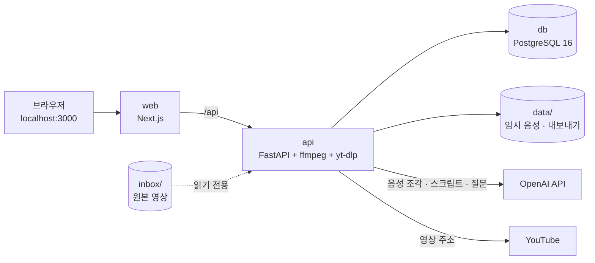

# video-agent — 영상 분석 에이전트

- YouTube 링크나 내 PC의 영상 파일을 넣으면 스크립트 · 핵심 요약 · 챕터 · 추천 질문을 만들고, 그 영상에 질문할 수 있다
- 받아쓰기 · 요약 · 답변은 OpenAI API가 하고, 결과와 대화 기록은 이 PC의 PostgreSQL에만 남는다
- `docker compose up -d` 한 번으로 web · api · db 셋이 뜬다. 필요한 것은 Docker와 OpenAI API 키

## 설치

1. `cp .env.example .env` — 키는 비워 둬도 된다. 앱을 연 뒤 설정 화면에서 넣으면 앱이 이 파일의 그 줄을 고친다
2. `docker compose up -d` — 처음에는 이미지를 만드느라 몇 분 걸린다
3. 브라우저에서 <http://localhost:3000>

로컬 영상은 `inbox/`에 넣는다 — mp4 · mkv · mov · webm · mp3 · m4a · wav, 3시간까지. 앱은 이 폴더를 읽기만 한다. 다른 폴더를 쓰려면 `.env`의 `INBOX_HOST_DIR`에 그 경로를 적는다.

키와 모델은 설정 화면에서 바꾼다. 앱이 도는 동안 `.env`를 편집기로 고쳤다면 `docker compose up -d --force-recreate api`로 다시 띄운다 — 파일 하나를 마운트한 것이라 새 파일로 바꿔 저장하는 편집기로 고치면 앱이 옛 파일을 계속 본다.

YouTube 쪽이 바뀌어 받기가 실패하면 yt-dlp를 올린다 — 저장소 뿌리에서 `(cd backend && uv lock --upgrade-package yt-dlp) && docker compose up -d --build api`.

## 밖으로 나가는 데이터

| 어디로 | 무엇이 | 언제 |
|---|---|---|
| OpenAI | 음성 조각 | 자막 없는 영상을 받아쓸 때 |
| OpenAI | 스크립트 텍스트 | 요약 · 챕터 · 추천 질문을 만들 때 |
| OpenAI | 질문, 앞선 대화, 관련 스크립트 | 질문할 때 |
| YouTube | 영상 주소 | 정보 · 자막 · 음성을 받을 때 |

원본 영상 파일, 분석 결과, API 키는 이 PC 밖으로 나가지 않습니다.

## 더 보기

- 명세: `docs/specs/` — 싱크독 프로젝트 VA. 요구사항부터 구현 계획까지 11단계
- 개발 방법과 규칙: [`AGENTS.md`](AGENTS.md)
