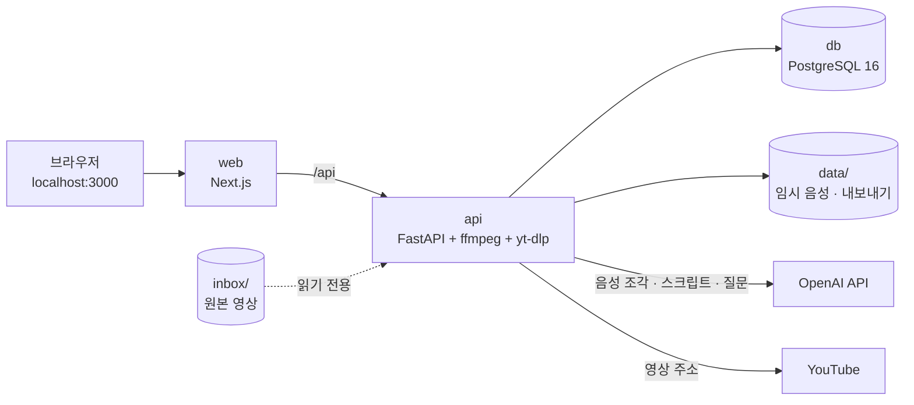

# video-agent — 영상 분석 에이전트

- YouTube 링크나 내 PC의 영상 파일을 넣으면 스크립트 · 핵심 요약 · 챕터 · 추천 질문을 만들고, 그 영상에 질문할 수 있다
- 받아쓰기 · 요약 · 답변은 OpenAI API가 하고, 결과와 대화 기록은 이 PC의 PostgreSQL에만 남는다
- `docker compose up -d` 한 번으로 web · api · db 셋이 뜬다. 필요한 것은 Docker와 OpenAI API 키

```mermaid
flowchart LR
  browser["브라우저<br/>localhost:3000"] --> web["web<br/>Next.js"]
  web -->|"/api"| api["api<br/>FastAPI + ffmpeg + yt-dlp"]
  api --> db[("db<br/>PostgreSQL 16")]
  api --> data[("data/<br/>임시 음성 · 내보내기")]
  inbox[("inbox/<br/>원본 영상")] -.->|"읽기 전용"| api
  api -->|"음성 조각 · 스크립트 · 질문"| oai["OpenAI API"]
  api -->|"영상 주소"| yt["YouTube"]
```

## 설치

1. `cp .env.example .env` — 키는 비워 둬도 된다. 앱을 연 뒤 설정 화면에서 넣으면 앱이 이 파일의 그 줄을 고친다
2. `docker compose up -d` — 처음에는 이미지를 만드느라 몇 분 걸린다(WSL2 · RAM 15GB PC에서 기반 이미지를 받은 뒤 빌드 2분 안팎, 뜨는 데 15초)
3. 브라우저에서 <http://localhost:3000>

로컬 영상은 `inbox/`에 넣는다 — mp4 · mkv · mov · webm · mp3 · m4a · wav, 3시간까지. 앱은 이 폴더를 읽기만 한다. 다른 폴더를 쓰려면 `.env`의 `INBOX_HOST_DIR`에 그 경로를 적는다.

키와 모델은 설정 화면에서 바꾼다. 앱이 도는 동안 `.env`를 편집기로 고쳤다면 `docker compose up -d --force-recreate api`로 다시 띄운다 — 파일 하나를 마운트한 것이라 새 파일로 바꿔 저장하는 편집기로 고치면 앱이 옛 파일을 계속 본다.

YouTube 쪽이 바뀌어 받기가 실패하면 yt-dlp를 올린다 — 저장소 뿌리에서 `(cd backend && uv lock --upgrade-package yt-dlp) && docker compose up -d --build api`.

## 쓰는 법

1. YouTube 링크를 붙여 넣거나 inbox 파일을 고르고 분석 버튼을 누른다. 시작 전에 걸릴 시간과 비용이 먼저 뜬다
2. 결과 화면에서 한 줄 요약 · 인사이트 · 챕터 · 스크립트를 읽는다. 시각을 누르면 그 지점으로 가고, 「질문하기」 탭에서 그 영상에 묻는다
3. [내보내기]로 파일에 저장하거나 클립보드에 복사해 노트 앱에 붙인다. 파일은 둘이다 — 요약 · 챕터를 담은 노트 `data/export/{제목}.md`와 스크립트 `data/export/{제목} 스크립트.md`. 노트의 `[[{제목} 스크립트]]`가 스크립트 파일을 가리킨다(Obsidian처럼 위키링크를 읽는 노트 앱). 복사는 노트만 담는다
4. 휴지통은 분석 결과 · 질문 기록 · 임시 음성을 지운다. inbox의 원본 파일은 그대로다

분석은 한 번에 하나씩 돈다. 도는 동안 넣은 영상은 차례를 기다렸다가 저절로 시작한다.

## 걸리는 시간과 비용

2026-09 실측 — WSL2 · RAM 15GB PC, 받아쓰기 whisper-1 · 요약 gpt-5-mini

| 영상 | 길이 | 스크립트 | 분석 시간 | 비용 |
|---|---|---|---|---|
| YouTube 강연 | 42분 | 자막 | 23초 | $0.02 |
| YouTube 강연 | 31분 | 받아쓰기 | 1분 32초 | $0.21 |
| inbox의 영상 파일 | 2시간 30분 | 받아쓰기 | 6분 41초 | $0.98 |

자막이 없으면 받아쓰기가 시간과 비용의 대부분이다 — 영상 1시간에 3분 안팎, 받아쓰기 1분에 $0.006. 질문의 답은 2~3초 걸렸다(47분 영상).

## 잘 안 될 때

| 보이는 것 | 할 일 |
|---|---|
| 배너 '키를 확인하지 못했어요 — {이유}' | 설정 화면에서 키를 다시 넣는다 |
| 배너 '연결을 확인하지 못했어요 — …' | 인터넷이 돌아오면 분석 버튼을 누를 때 다시 확인한다 |
| '영상 정보를 가져오지 못했어요 — {이유}' | 비공개 · 삭제 · 지역 제한 영상이거나 yt-dlp가 낡았다(위 yt-dlp 올리기) |
| '… — 서버에 연결할 수 없음' | `docker compose ps`로 api가 떠 있는지, `docker compose logs api`로 까닭을 본다 |
| 분석이 도중에 멈춤 | 진행 화면의 [다시 시도] — 끝난 단계와 받아쓴 조각은 다시 하지 않는다 |

## 밖으로 나가는 데이터

| 어디로 | 무엇이 | 언제 |
|---|---|---|
| OpenAI | 음성 조각 | 자막 없는 영상을 받아쓸 때 |
| OpenAI | 스크립트 텍스트 | 요약 · 챕터 · 추천 질문을 만들 때 |
| OpenAI | 질문, 앞선 대화, 관련 스크립트 | 질문할 때 |
| YouTube | 영상 주소 | 정보 · 자막 · 음성을 받을 때 |

원본 영상 파일, 분석 결과, API 키는 이 PC 밖으로 나가지 않습니다.

## 더 보기

- 명세: `docs/specs/` — 싱크독 프로젝트 VA. 요구사항부터 구현 계획까지 11단계
- 개발 방법과 규칙: [`AGENTS.md`](AGENTS.md)
