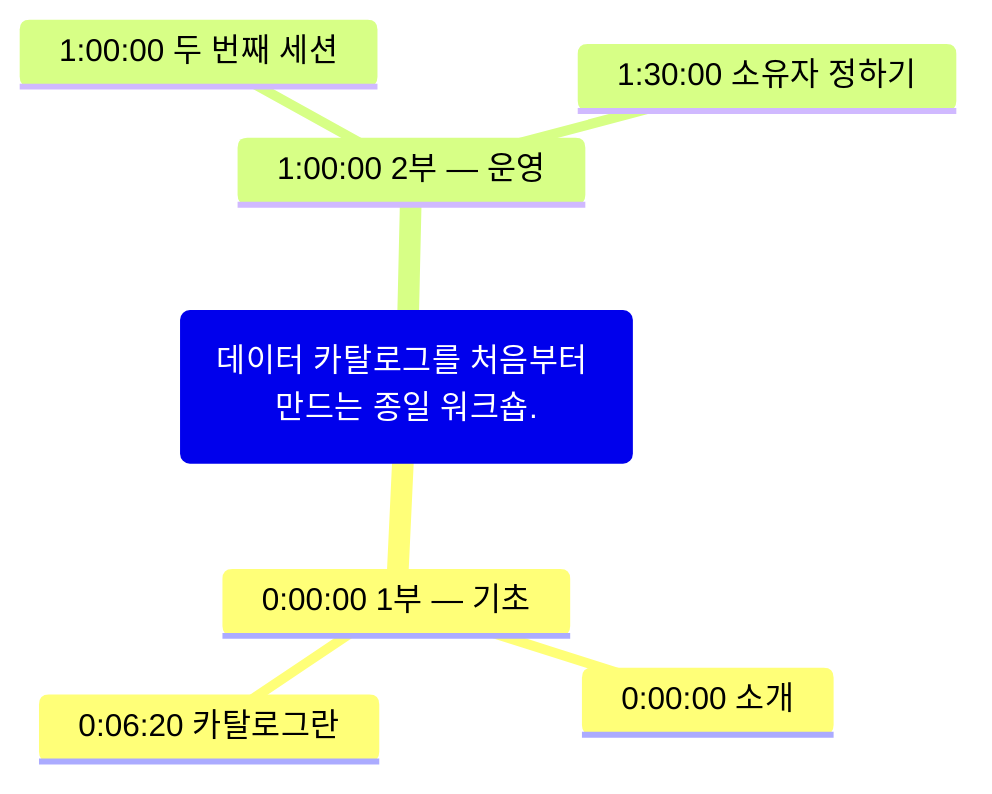

# workshop_0912.mp4
원본: workshop_0912.mp4 · 2:30:00

> 데이터 카탈로그를 처음부터 만드는 종일 워크숍.

## 한눈에 보기

```mermaid
gantt
  dateFormat HH:mm:ss
  axisFormat %-H:%M:%S
  todayMarker off
  section 1 1부 — 기초
  01 소개 : 00:00:00, 00:06:20
  02 카탈로그란 : 00:06:20, 01:00:00
  section 2 2부 — 운영
  03 두 번째 세션 : 01:00:00, 01:30:00
  04 소유자 정하기 : 01:30:00, 02:30:00
  section 인사이트
  01 : milestone, 01:30:00, 0s
```

## 핵심 인사이트
1. 카탈로그는 소유자부터 정한다. [1:30:00]

## 챕터
### 1부 — 기초 (0:00:00 – 1:00:00)
#### [0:00:00] 소개
- 목표와 일정

#### [0:06:20] 카탈로그란
- 메타데이터
- 검색

### 2부 — 운영 (1:00:00 – 2:30:00)
#### [1:00:00] 두 번째 세션
- 운영 이야기

#### [1:30:00] 소유자 정하기
- 팀마다 한 명

## 질문 기록
질문 기록이 없습니다
