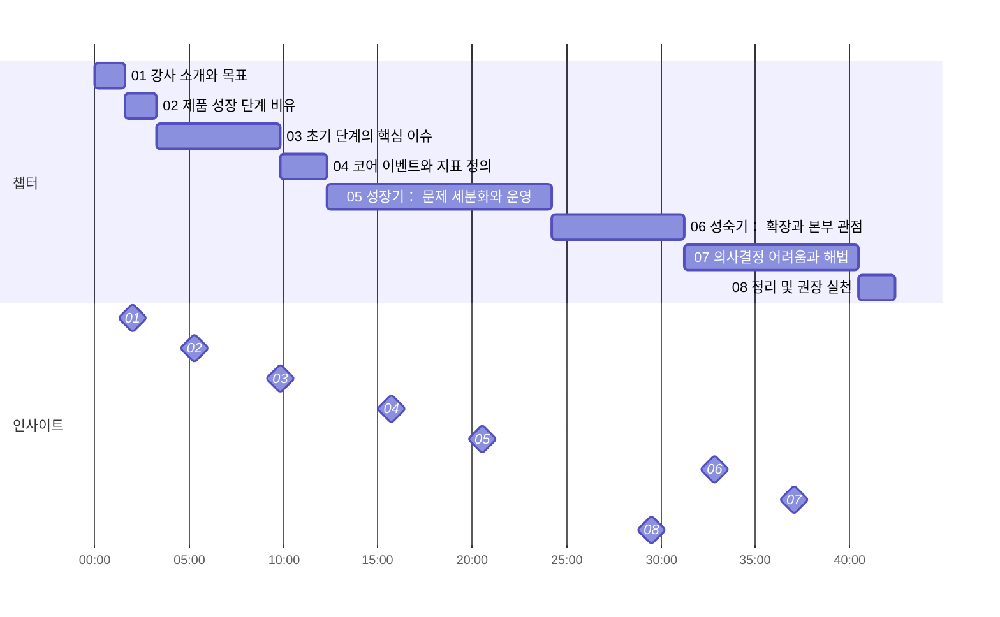

```mermaid
gantt
  dateFormat HH:mm:ss
  axisFormat %M:%S
  todayMarker off
  section 챕터
  01 강사 소개와 목표 : 00:00:00, 00:01:36
  02 제품 성장 단계 비유 : 00:01:36, 00:03:15
  03 초기 단계의 핵심 이슈 : 00:03:15, 00:09:51
  04 코어 이벤트와 지표 정의 : 00:09:51, 00:12:18
  05 성장기∶ 문제 세분화와 운영 : 00:12:18, 00:24:14
  06 성숙기∶ 확장과 본부 관점 : 00:24:14, 00:31:12
  07 의사결정 어려움과 해법 : 00:31:12, 00:40:29
  08 정리 및 권장 실천 : 00:40:29, 00:42:24
  section 인사이트
  01 : milestone, 00:02:02, 0s
  02 : milestone, 00:05:19, 0s
  03 : milestone, 00:09:51, 0s
  04 : milestone, 00:15:42, 0s
  05 : milestone, 00:20:30, 0s
  06 : milestone, 00:32:50, 0s
  07 : milestone, 00:37:03, 0s
  08 : milestone, 00:29:31, 0s
```
