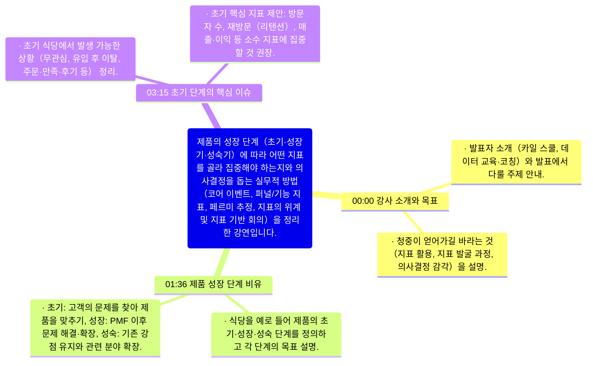

```mermaid
mindmap
  root(제품의 성장 단계（초기·성장기·성숙기）에 따라 어떤 지표를 골라 집중해야 하는지와 의사결정을 돕는 실무적 방법（코어 이벤트, 퍼널/기능 지표, 페르미 추정, 지표의 위계 및 지표 기반 회의）을 정리한 강연입니다.)
    00:00 강사 소개와 목표
      · 발표자 소개（카일 스쿨, 데이터 교육·코칭）와 발표에서 다룰 주제 안내.
      · 청중이 얻어가길 바라는 것（지표 활용, 지표 발굴 과정, 의사결정 감각）을 설명.
    01:36 제품 성장 단계 비유
      · 식당을 예로 들어 제품의 초기·성장·성숙 단계를 정의하고 각 단계의 목표 설명.
      · 초기: 고객의 문제를 찾아 제품을 맞추기, 성장: PMF 이후 문제 해결·확장, 성숙: 기존 강점 유지와 관련 분야 확장.
    03:15 초기 단계의 핵심 이슈
      · 초기 식당에서 발생 가능한 상황（무관심, 유입 후 이탈, 주문·만족·후기 등） 정리.
      · 초기 핵심 지표 제안: 방문자 수, 재방문（리텐션）, 매출·이익 등 소수 지표에 집중할 것 권장.
```
