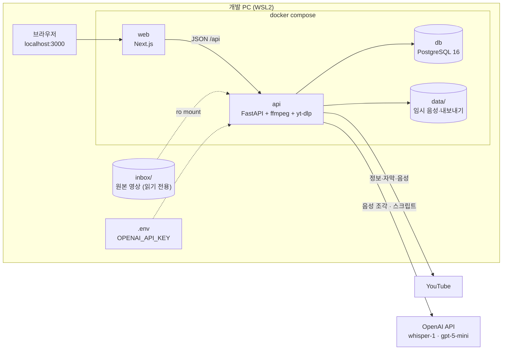

# 인프라 아키텍처

## 0. 이 문서가 다루는 것

무엇 위에서 도는가. 제약(C)은 상위 문서의 요구에서 나온 "어쩔 수 없는 것"이고, 기술 스택은 그 제약 아래에서 고른 것이다. 도메인 모델·API·화면은 다루지 않는다 — 각각 6·8·7단계.

결정은 2026-09-15 사용자와 대화로 내렸다. 원칙 둘: **직접 운영할 수 있는 스택**, **같은 문제면 구성 요소가 적은 쪽**.

## 1. 제약

#### C1 무거운 계산은 전부 OpenAI API가 한다

출처: [[VA-PRD-001#N1]], [[VA-PRD-001#N3]]

개발 PC에 GPU가 없고, 릴리스 AI 수준 속도(시간당 3분)가 목표라 받아쓰기·요약·Q&A는 모두 API 호출이다. 따라서 이 프로그램은 **I/O 대기가 대부분**이고 우리 코드의 CPU 시간은 1초 미만이다. Rust/C로 다시 짜도 빨라지지 않는다 — 검토 후 Python 유지.

#### C2 음성 파일 한 번에 25MB까지

출처: OpenAI 음성 인식 API 제한(공식 문서, 2026-09-15 확인). [[VA-UC-001#UC-S3]]

3시간 음성은 이 한계를 넘으므로 조각으로 나눠 보내고 오프셋으로 이어 붙인다. 조각 경계는 무음 근처.

#### C3 구간 타임스탬프는 whisper-1

출처: [[VA-PRD-001#R3]], [[VA-PRD-001#R4]] — 시각 클릭 이동이 핵심 기능

OpenAI 모델 중 `verbose_json`으로 segment 시작·끝 시각을 주는 것은 `whisper-1`뿐이다(`gpt-transcribe`는 타임스탬프 없음, `gpt-4o-transcribe-diarize`는 화자 구분용 `diarized_json`). 정확도가 더 높은 신모델이 나와도 타임스탬프가 없으면 못 쓴다.

#### C4 로컬 영상 파일은 컨테이너 밖에 있다

출처: [[VA-PRD-001#R1]], [[VA-PRD-001#N2]] — 로컬 파일은 시간 단위, 수 GB

앱이 Docker 안에서 돌므로 파일에 닿으려면 마운트가 필요하다. 3시간 mp4를 브라우저로 업로드하는 건 느리고 디스크를 두 배 쓰므로, 호스트 폴더(`inbox/`)를 **읽기 전용**으로 마운트하고 그 안의 파일을 고르게 한다. 원본은 절대 수정·삭제하지 않는다.

#### C5 사용자 한 명, localhost

출처: [[VA-PRD-001]] 2절 비목표(다중 사용자), [[VA-PRD-001#N3]]

로그인·권한이 없다. 서버는 `127.0.0.1`에만 바인딩한다. 외부에서 열리지 않는다.

#### C6 API 키는 파일 하나, 커밋 금지

출처: [[VA-PRD-001#N3]], [[VA-UC-001#UC-H8]]

`.env`에 `OPENAI_API_KEY`. `.gitignore`에 들어간다. **키가 사는 곳은 이 파일 하나다** — 처음엔 사용자가 직접 적고, 설정 화면에서 넣으면 앱이 같은 파일의 그 줄(과 모델 선택 `STT_MODEL` · `TEXT_MODEL`)을 고친다. 그래서 `.env`는 api 컨테이너에 읽기·쓰기로 마운트한다(8절). 시작 시·분석 버튼을 누를 때·키를 저장할 때 키를 확인하고, 없거나 무효면 분석을 막고 배너로 안내한다. 인터넷이 없어 확인을 못 한 것은 키가 틀린 것과 문구를 가른다(사용자 결정 2026-09-21).

#### C7 YouTube 접근은 yt-dlp에 의존한다

출처: [[VA-PRD-001#R2]], [[VA-UC-001#UC-S2]]

YouTube는 공식 다운로드 API가 없다. `yt-dlp`가 사실상 표준이지만 YouTube 쪽 변경에 따라 깨질 수 있어 **주기적 업데이트**가 필요하다. 자막은 같은 도구로 가져온다. YouTube의 재생 서명을 풀려면 yt-dlp가 JavaScript 실행기를 부른다 — 그래서 yt-dlp는 풀이 스크립트(yt-dlp-ejs)를 함께 까는 `yt-dlp[default]`로 설치하고, yt-dlp가 기본으로 찾는 실행기 **deno**를 API 이미지에 넣는다(2026-09-23 카드 A에서 확인).

#### C8 설치는 명령 하나

출처: [[VA-PRD-001#N4]]

`docker compose up`으로 앱·프론트·DB가 뜬다. ffmpeg·yt-dlp·deno는 API 이미지에 들어간다. 호스트에 필요한 건 Docker와 `.env`뿐.

#### C9 결과·기록은 내 PC에만

출처: [[VA-PRD-001#N3]]

DB와 파일 볼륨은 호스트 디스크. 밖으로 나가는 건 OpenAI에 음성 조각(받아쓰기) · 스크립트 텍스트(요약·챕터·추천 질문) · 질문과 앞선 대화와 관련 스크립트(Q&A) · 키 확인 요청, YouTube에 영상 ID뿐.

#### C10 화면은 디자인 산출물을 그대로 올린다

출처: 사용자 결정 2026-09-15

프론트를 Next.js로 분리한 이유. 7단계 화면 명세 때 디자인 도구로 만든 화면을 그대로 넣을 수 있어야 하므로, 백엔드가 HTML을 그리지 않고 JSON API만 낸다.

## 2. 구성도

흐름: 브라우저 → web(화면) → api(JSON) → db·data. YouTube·OpenAI는 api만 부른다. 원본 영상은 inbox에서 읽기만 한다.

## 3. 기술 스택

| 층 | 선택 | 이유 | 검토한 대안 | 안 고른 이유 |
|---|---|---|---|---|
| 언어 | **Python 3.12** | yt-dlp·OpenAI SDK·FastAPI 생태계. 병목이 API라 언어 속도 무의미 ([[#C1]]) | Rust, C | 빨라지는 부분이 1초 미만. yt-dlp를 감싸야 함 |
| 백엔드 | **FastAPI** | 비동기 I/O 대기에 맞음. JSON API만 냄 ([[#C10]]) | Django | 관리자·ORM 등 안 쓰는 게 많음 |
| 프론트 | **Next.js (App Router, TypeScript)** | 디자인 산출물을 그대로 올림 ([[#C10]]) | FastAPI+HTMX | 프로젝트 하나로 줄지만 디자인 산출물 이식이 어려움 |
| DB | **PostgreSQL 16** | 사용자 결정. 결과·챕터·Q&A 기록 조회 | SQLite | 혼자 쓰기엔 충분하지만 사용자가 PG 선택 |
| DB 접근 | **SQLAlchemy 2 (async) + Alembic** | 표준. 마이그레이션 | raw SQL | 스키마 변경 추적이 없음 |
| 실행 | **Docker Compose** — web · api · db | 명령 하나 ([[#C8]]) | venv + 로컬 PG | 환경 재현이 어려움 |
| 개발 | venv + `uv` (api), `npm` (web) | 컨테이너 밖에서 빠르게 돌려보기 | — | — |
| 영상 처리 | **ffmpeg** (음성 추출·무음 탐지·조각) | 표준. C 바이너리 | pydub | 결국 ffmpeg 호출 |
| YouTube | **yt-dlp** (정보·자막·음성) | 사실상 표준 ([[#C7]]) | pytube | 유지보수 부실 |
| 받아쓰기 | **OpenAI `whisper-1`**, `verbose_json`, segment | 타임스탬프 ([[#C3]]). $0.006/분 → 3시간 $1.08 | gpt-4o-transcribe-diarize | 화자 구분은 첫 버전 비목표. 설정으로 바꿀 수 있게 모델명은 설정값 |
| 요약·챕터·Q&A | **OpenAI `gpt-5-mini`** | $0.25/$2.00 per 1M. 영상당 수 센트 | gpt-5.4-mini, gpt-5.4 | 품질 부족이 확인되면 설정으로 상향 |
| AI 전략 | 단순 API 호출 + 긴 스크립트는 구간 분할 | 프롬프트로 충분. 벡터 DB 불필요 — 영상 하나 안에서만 검색 | RAG(임베딩) | 3시간 스크립트도 관련 구간 선별은 챕터 단위 필터로 충분 ([[VA-UC-001#UC-H4]] 3b) |
| 백그라운드 작업 | **프로세스 안 asyncio 태스크 + 프로세스 안 대기열(순차)** | 사용자 하나. 동시에 도는 분석은 하나이고 나머지는 DB의 대기 상태로 줄을 서서 워커 하나가 차례로 돌린다(사용자 결정 2026-09-21). 외부 큐 불필요 | Celery + Redis | 구성 요소 둘 추가. 비목표(일괄 처리) |
| 진행 상태 | **폴링** (1초) `GET /jobs/{id}` | 가장 단순. SSE는 프록시·재연결 처리 필요 | SSE, WebSocket | 필요해지면 교체 비용 낮음 |
| 인증 | **없음** ([[#C5]]) | 사용자 한 명, localhost | JWT | 비목표 |
| 캐시 | **없음** | 결과 자체가 DB에 저장됨 ([[VA-PRD-001#R7]]) | Redis | 불필요 |
| 배포 | **로컬 실행** | 개인용 | Railway 등 | 비목표 |

**버전 고정** (카드 A 시작, 2026-09-23 — 사용자 결정 2026-09-21대로 그날의 안정판)

| 무엇 | 버전 | 메모 |
|---|---|---|
| Python | 3.12 (최신 패치) | 위 표의 결정. 3.14도 나왔지만 바꿀 이유가 없다 |
| PostgreSQL | 16 (16.15) | 사용자 결정. 최신 메이저는 18 |
| FastAPI · uvicorn | 0.141.1 · 0.53.0 | |
| SQLAlchemy · Alembic · asyncpg | 2.0.54 · 1.20.0 · 0.31.0 | |
| pydantic · pydantic-settings | 2.13.5 · 2.15.0 | |
| openai (Python SDK) | 3.19.0 | 3.0(2026-08-12)부터 HTTP 클라이언트가 HTTPX2. 채팅 완성 · 받아쓰기 호출은 그대로 |
| yt-dlp | 2026.8.19 (`yt-dlp[default]`, 풀이 스크립트 yt-dlp-ejs 0.8.0 포함) | 파이썬 의존성으로 잠근다. YouTube 쪽 변경으로 깨지면 올려서 다시 빌드한다([[#C7]]) |
| deno | 2.9.7 | yt-dlp가 YouTube 서명을 풀 때 부르는 JavaScript 실행기. yt-dlp가 기본으로 찾는 것이라 따로 설정하지 않는다([[#C7]]) |
| uv | 0.12.18 | 파이썬 의존성 설치와 잠금 파일(`uv.lock`) |
| Node | 24 LTS | 26은 LTS가 아니다 |
| Next.js · React | 16.3.6 · 19.3.0 | |
| TypeScript | 5.9.3 | 7.0은 네이티브 컴파일러라 Next의 타입 검사와 맞는지 확인되지 않았다 |
| 테스트 | pytest 9.1 · pytest-asyncio 1.4 · Playwright 1.63 · ruff 0.16 | |

"나중에 바꿔도 싼 것": 진행 상태 방식, 텍스트 모델, 받아쓰기 모델(모델명은 설정값). "지금 정해야 하는 것": DB(PG), 프론트 분리, 로컬 파일 마운트 방식.

## 4. 내부 구조

api는 명세 작성 규약 1.9의 기본형(도메인별 폴더 + 계층 파일)을 따르고, 확정본은 클래스 명세 1장이다 — 저장소 폴더는 `backend/` · `frontend/`(compose 서비스 이름은 `api` · `web`), 에이전트용 안내는 `AGENTS.md`(`CLAUDE.md`는 그것을 가리키는 한 줄). 도메인 묶음은 넷 — **video**(입력·정보·목록·삭제), **job**(파이프라인·조각·진행), **analysis**(스크립트·요약·챕터·추천 질문·내보내기), **chat**(Q&A). 외부 호출(yt-dlp, ffmpeg, OpenAI)은 `infra/` 공용 클라이언트 + 묶음별 어댑터로 격리해 모델 교체·테스트 시 대체가 되게 한다. 프롬프트 문장은 `backend/app/prompts/*.md`에 둔다(사용자 결정 2026-09-21).

web은 화면 명세(7단계) 산출물을 그대로 두고, API 호출 층만 얇게 둔다.

## 5. 인증과 접근

| 대상 | 방식 |
|---|---|
| 사용자 → web/api | 없음. `127.0.0.1` 바인딩 ([[#C5]]). web만 호스트에 열고 api · db는 compose 안에서만 닿는다 |
| api → OpenAI | `OPENAI_API_KEY` (.env — 앱이 같은 파일에 쓴다) ([[#C6]]) |
| api → YouTube | 없음 (공개 영상만). 로그인 필요 영상은 비목표 |
| api → db | compose 내부 네트워크, DB 비밀번호는 .env |
| api → inbox | 읽기 전용 마운트 ([[#C4]]) |

## 6. 데이터가 사는 곳

| 데이터 | 어디 | 수명 |
|---|---|---|
| 영상 정보·스크립트·핵심 요약·챕터·추천 질문·Q&A 기록 | PostgreSQL (볼륨 `pgdata`) | 사용자가 삭제할 때까지 ([[VA-UC-001#UC-H6]]) |
| 원본 로컬 영상 | 호스트 `inbox/` (읽기 전용) | 사용자 관리. 앱이 건드리지 않음 |
| YouTube에서 받은 음성, 추출한 음성, 조각 | `data/tmp/{video_id}/` | 받아쓰기 성공 시 삭제. 실패 시 재개용으로 보존 ([[VA-UC-001#UC-S3]]) |
| 내보낸 마크다운 | `data/export/{파일 이름}.md`. 브라우저 다운로드는 없다. 클립보드 복사는 브라우저가 한다 | 사용자 관리 |
| API 키·모델 선택·DB 비밀번호·inbox 위치 | `.env` — 키와 모델 선택은 앱이 설정 화면에서 받아 고쳐 쓴다 | 커밋 금지 |
| 밖으로 나가는 것 | OpenAI: 음성 조각, 스크립트 텍스트, 질문과 앞선 대화와 관련 스크립트, 키 확인 요청 / YouTube: 영상 ID | 전송 후 우리 통제 밖. README와 설정 화면에 명시 ([[VA-PRD-001#N3]]) |

## 7. 외부 변경 감지

이 프로젝트는 외부에서 밀려오는 변경이 없다(webhook 없음). 감지할 것은 둘:

- **yt-dlp 깨짐** — YouTube 변경으로 다운로드가 실패하면 [[VA-UC-001#UC-S1]] 1a로 잡힌다. 오류 메시지에 "yt-dlp 업데이트" 안내를 넣는다
- **OpenAI 모델 폐기** — 모델명이 설정값이므로 바꿔 끼운다. 타임스탬프 지원 여부([[#C3]])는 바꿀 때 다시 확인

## 8. 배치와 운영

- `docker compose up -d` 한 번. 서비스 셋: `web`(3000), `api`(8000), `db`(5432, 호스트 노출 안 함)
- `.env.example`을 복사해 `.env`를 만들고 키를 넣는 것이 설치의 전부 ([[#C8]]). 키 없이 띄우고 설정 화면에서 넣어도 된다 — 그래서 compose가 `.env`를 api 컨테이너에 읽기·쓰기로 마운트한다([[#C6]])
- 로컬 파일은 `inbox/`에 넣거나, `.env`의 `INBOX_HOST_DIR`로 다른 폴더를 가리킨다. compose가 이 한 값으로 마운트하고 화면에 보일 경로도 만든다 — 둘이 어긋나지 않게
- 앱이 떠 있는 동안 `.env`를 편집기로 고쳤으면 `docker compose up -d --force-recreate api`로 다시 띄운다. 파일 하나를 마운트한 것이라 새 파일로 바꿔 저장하는 편집기(vim · `sed -i` 등)로 고치면 컨테이너는 옛 파일을 계속 본다. 키와 모델은 설정 화면에서 바꾸는 것이 기본이다([[#C6]])
- web은 api가 준비된 뒤(헬스 체크 통과) 뜬다 — 뜨자마자 연 화면이 설정을 못 받는 틈을 줄인다
- 로그는 표준 출력. 별도 모니터링 없음
- 백업: `pgdata` 볼륨. 개인용이라 자동 백업은 두지 않는다
- 개발 시 api는 `uv run uvicorn --reload`, web은 `npm run dev`로 컨테이너 밖에서 돌릴 수 있다. db만 compose로. 이때 진짜 영상을 돌리려면 호스트에도 ffmpeg와 deno가 있어야 한다(yt-dlp는 파이썬 의존성이라 함께 깔린다)

## 9. 미결사항

- [x] 조각 길이 — 결정: 10분(600초), 무음 근처에서 자른다. MINISPEC(작업 서비스) 설정 첫 값. 측정 뒤 조정
- [x] 받아쓰기 병렬 수 — 결정: 3 동시로 시작. MINISPEC 설정 첫 값. 측정 뒤 조정
- [ ] 인증이 없으므로 DNS 리바인딩(악성 페이지가 자기 도메인을 127.0.0.1로 돌려 앱에 요청하는 것)을 `127.0.0.1` 바인딩만으로는 막지 못한다. web · api가 Host 헤더를 localhost · 127.0.0.1로 제한할지 — 카드 A 코드 리뷰에서 찾음(2026-09-23), 사용자 결정
- [ ] 3시간 스크립트의 Q&A 구간 선별 방식 — 첫 버전은 질문 낱말과 챕터 제목·요점 일치로 챕터를 고른다(MINISPEC 대화 서비스). 품질 보고 임베딩으로 바꿀지
- [x] Next.js·FastAPI·PostgreSQL 정확한 버전과 텍스트 모델 단가 — 고정: 3절 「버전 고정」 표(2026-09-23). 단가는 설정 서비스 MINISPEC의 모델 목록
- [x] 음성 파일 형식 — 결정: YouTube·로컬 모두 ffmpeg로 mp3 64kbps 모노 16kHz로 통일. MINISPEC(어댑터) 설정 첫 값. whisper-1 정확도는 C 카드에서 진짜 영상으로 확인
