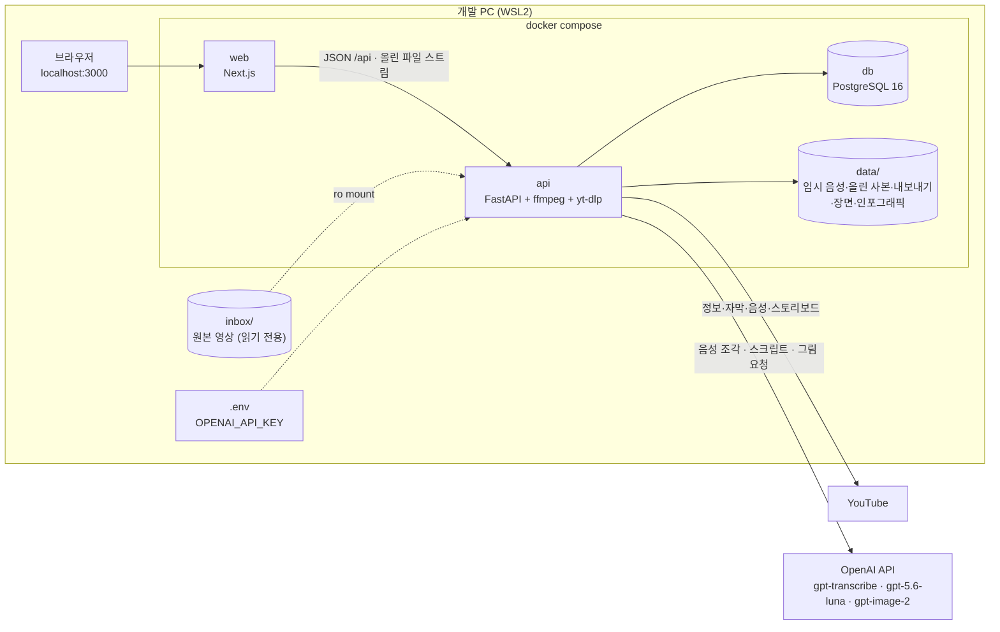

# 인프라 아키텍처

## 0. 이 문서가 다루는 것

무엇 위에서 도는가. 제약(C)은 상위 문서의 요구에서 나온 "어쩔 수 없는 것"이고, 기술 스택은 그 제약 아래에서 고른 것이다. 도메인 모델·API·화면은 다루지 않는다 — 각각 6·8·7단계.

결정은 2026-09-15 사용자와 대화로 내렸다. 원칙 둘: **직접 운영할 수 있는 스택**, **같은 문제면 구성 요소가 적은 쪽**. 2026-09-29 결과를 그림으로 보이는 요구([[VA-PRD-001#R11]] ~ [[VA-PRD-001#R13]])를 더하며 [[#C11]] · [[#C12]]와 스택 두 줄을 더했다 — 새 의존성은 없다. 같은 날 로컬 파일을 화면에 끌어 놓아 올리는 길을 더하며([[VA-PRD-001#R1]]) [[#C4]]를 다시 썼다 — 이것도 새 의존성은 없다.

## 1. 제약

#### C1 무거운 계산은 전부 OpenAI API가 한다

출처: [[VA-PRD-001#N1]], [[VA-PRD-001#N3]]

개발 PC에 GPU가 없고, 릴리스 AI 수준 속도(시간당 3분)가 목표라 받아쓰기·요약·Q&A는 모두 API 호출이다. 따라서 이 프로그램은 **I/O 대기가 대부분**이고 우리 코드의 CPU 시간은 1초 미만이다. Rust/C로 다시 짜도 빨라지지 않는다 — 검토 후 Python 유지.

#### C2 음성 파일 한 번에 25MB까지

출처: OpenAI 음성 인식 API 제한(공식 문서, 2026-09-15 확인). [[VA-UC-001#UC-S3]]

3시간 음성은 이 한계를 넘으므로 조각으로 나눠 보내고 오프셋으로 이어 붙인다. 조각 경계는 무음 근처. 받아쓰기 요청은 조각을 다시 15초 이하로 나눠 보낸다([[#C3]]) — 10분 조각은 진행 · 다시 시도의 단위로 남는다.

#### C3 구간 시각은 15초 이하 조각의 경계

출처: [[VA-PRD-001#R3]], [[VA-PRD-001#R4]] — 시각 클릭 이동이 핵심 기능

OpenAI에서 segment 시작·끝 시각을 주던 모델(`whisper-1`의 `verbose_json`, `gpt-4o-transcribe-diarize`의 `diarized_json`)이 **2027-02-26에 API에서 함께 없어진다**(2026-08-26 공지, 공식 폐기 목록). 권하는 대체 `gpt-transcribe`(분당 $0.0045)는 `json` · `text`만 준다 — `verbose_json` · `srt` · `vtt`를 청하면 400이다(2026-10-01 확인).

그래서 시각을 모델에서 받지 않고 **보내는 쪽이 만든다.** 10분 조각([[#C2]])을 무음에서 다시 15초 이하로 잘게 나눠 따로 보내고, 잘게 나눈 경계를 그 구간의 시작·끝 시각으로 쓴다. 출처 시각은 구간의 시작이므로 실제로 말한 곳과 15초 안이다([[VA-PRD-001]] 4장 출처 정확도 ±15초). 15초 안에 무음이 없으면 15초에서 자른다 — 그 경계의 낱말은 깨질 수 있다. 언어는 `languages=["ko","en"]`을 주면 응답에 감지한 코드가 온다([[VA-PRD-001#R3]] 한국어 · 영어).

실측(2026-10-01, 2:30:30 강의의 앞 20분을 같은 구간의 `whisper-1` 결과 두 벌과 비교):

| 무엇 | 값 |
|---|---|
| 같은 시간 창의 글자 차이(편집 거리 / 글자 수) | `gpt-transcribe` ↔ `whisper-1` 0.179 · `whisper-1`끼리 0.163 — 「네 · 이제 · 그」 같은 말버릇까지 적는 차이가 크다 |
| 15초에서 그냥 자른 조각 | 101개 중 8개(무음 -30dB · 0.2초). 10분 조각을 나누는 값(-35dB · 0.5초) 그대로면 96개 중 51개였고 글자 차이도 0.202였다 |
| 조각 하나 지연 | 중앙 1.15초, 가장 긴 것 2.1초, 오류 0 |
| 10분 조각 하나 | 동시 4개로 15초, 8개로 8초 — `whisper-1`은 15~57초 |
| 값 | 조각마다 초를 올려 세어 4% 더 나간다 — 20분 $0.094(`whisper-1` $0.12) |

사용자 결정(2026-10-01): 이 방식으로 바꾼다. Groq Whisper(시각을 준다, 시간당 $0.04)는 키가 하나 더 들고 음성이 OpenAI 밖으로도 나가([[VA-PRD-001#N3]]) 재지 않았다. 처음 결정(2026-09-15)은 시각을 주는 유일한 모델 `whisper-1`이었다.

#### C4 로컬 영상 파일은 컨테이너 밖에 있다

출처: [[VA-PRD-001#R1]], [[VA-PRD-001#N2]] — 로컬 파일은 시간 단위, 수 GB · [[VA-UC-001#UC-H2]]

앱이 Docker 안에서 돌므로 파일에 닿는 길이 따로 있어야 한다. 길은 둘이다.

- **inbox** — 호스트 폴더(`inbox/`)를 **읽기 전용**으로 마운트하고 그 안의 파일을 고르게 한다. 원본은 절대 수정·삭제하지 않는다. 복사가 없어 큰 파일도 바로 쓴다
- **올리기** — 브라우저가 파일을 web에 스트림으로 보내고, web이 그대로 api에 흘려보내면, api가 `data/uploads/`에 사본으로 쓰면서 SHA-256을 잰다(사용자 요청 2026-09-29). 사본은 분석이 끝나면 지우고, 실패하면 다시 시도를 위해 남기며, 영상을 지우거나 사전 안내에서 취소하면 지운다(사용자 결정 2026-09-29). 쓰다 만 것(`.part`)과 주인 없는 사본은 api가 시작할 때 지운다. 크기 상한은 따로 두지 않고 디스크 여유만 본다 — 3시간 상한([[VA-PRD-001#N2]])은 올린 뒤 길이로 본다

처음에는 inbox만 두었다 — 3시간 mp4를 브라우저로 올리면 느리고 디스크를 두 배 쓴다고 봤다. 브라우저와 앱이 같은 PC라 올리기는 디스크 복사에 가깝고(2시간 30분 워크숍이 588MB), 사본은 분석하는 동안만 있어 두 배도 잠깐이다.

**올리기 한 경로는 Next proxy를 거치지 않는다.** web의 `/api/*` 넘기기(rewrites) 앞에서 Host 확인(5절)을 하는 Next proxy가 도는데, proxy가 도는 요청은 Next가 본문을 복제해 메모리에 쌓고 `proxyClientMaxBodySize`(기본 10MB)에서 자른다(Next 16.3 `server/body-streams.js`, 카드 D 조사). 수 GB 본문은 이 길로 못 보낸다. 그래서 `/api/uploads` 하나만 proxy matcher에서 빼고 web의 API 라우트가 받는다 — proxy와 같은 Host 판정을 한 뒤 Node 요청을 그대로 api 요청에 흘려보낸다(`pipe` — 받는 쪽이 느리면 보내는 쪽을 멈춘다). App Router의 라우트 핸들러가 아니라 Pages Router의 API 라우트다(카드 D4 실측: 느린 api로 300MB를 올리면 App Router 라우트 핸들러는 web 메모리가 +344MB, 진짜 스택에서 588MB에 +650MB였다 — Next가 요청 스트림을 받는 쪽 속도와 상관없이 읽어 들인다. Pages Router API 라우트는 1GB에도 +70MB 안이다). web 메모리는 파일 크기만큼 늘지 않는다. api가 `X-Forwarded-Host`로 판정하는 길은 쓰지 않는다 — DNS 리바인딩으로 같은 출처가 된 악성 페이지는 그 헤더를 스스로 넣을 수 있다.

#### C5 사용자 한 명, localhost

출처: [[VA-PRD-001]] 2절 비목표(다중 사용자), [[VA-PRD-001#N3]]

로그인·권한이 없다. 서버는 `127.0.0.1`에만 바인딩한다. 외부에서 열리지 않는다.

#### C6 API 키는 파일 하나, 커밋 금지

출처: [[VA-PRD-001#N3]], [[VA-UC-001#UC-H8]]

`.env`에 `OPENAI_API_KEY`. `.gitignore`에 들어간다. **키가 사는 곳은 이 파일 하나다** — 처음엔 사용자가 직접 적고, 설정 화면에서 넣으면 앱이 같은 파일의 그 줄(과 모델 선택 `STT_MODEL` · `TEXT_MODEL`)을 고친다. 그래서 `.env`는 api 컨테이너에 읽기·쓰기로 마운트한다(8절). 시작 시·분석 버튼을 누를 때·키를 저장할 때 키를 확인하고, 없거나 무효면 분석을 막고 배너로 안내한다. 인터넷이 없어 확인을 못 한 것은 키가 틀린 것과 문구를 가른다(사용자 결정 2026-09-21).

#### C7 YouTube 접근은 yt-dlp에 의존한다

출처: [[VA-PRD-001#R2]], [[VA-UC-001#UC-S2]]

YouTube는 공식 다운로드 API가 없다. `yt-dlp`가 사실상 표준이지만 YouTube 쪽 변경에 따라 깨질 수 있어 **주기적 업데이트**가 필요하다. 자막은 같은 도구로 가져온다. YouTube의 재생 서명을 풀려면 yt-dlp가 JavaScript 실행기를 부른다 — 그래서 yt-dlp는 풀이 스크립트(yt-dlp-ejs)를 함께 까는 `yt-dlp[default]`로 설치하고, yt-dlp가 기본으로 찾는 실행기 **deno**를 API 이미지에 넣는다(2026-09-23 카드 A에서 확인).

#### C8 설치는 명령 하나

출처: [[VA-PRD-001#N4]]

`docker compose up`으로 앱·프론트·DB가 뜬다. ffmpeg·yt-dlp·deno는 API 이미지에 들어간다. 호스트에 필요한 건 Docker와 `.env`뿐.

#### C9 결과·기록은 내 PC에만

출처: [[VA-PRD-001#N3]]

DB와 파일 볼륨은 호스트 디스크. 밖으로 나가는 건 OpenAI에 음성 조각(받아쓰기) · 스크립트 텍스트(요약·챕터·추천 질문) · 질문과 앞선 대화와 관련 스크립트(Q&A) · 한 줄 요약과 인사이트와 챕터 제목(인포그래픽, 누를 때만 — [[#C11]]) · 키 확인 요청, YouTube에 영상 ID(정보 · 자막 · 음성 · 스토리보드 — [[#C12]])뿐.

#### C10 화면은 디자인 산출물을 그대로 올린다

출처: 사용자 결정 2026-09-15

프론트를 Next.js로 분리한 이유. 7단계 화면 명세 때 디자인 도구로 만든 화면을 그대로 넣을 수 있어야 하므로, 백엔드가 HTML을 그리지 않고 JSON API만 낸다.

#### C11 인포그래픽은 누를 때만, OpenAI 이미지 모델

출처: [[VA-PRD-001#R13]], [[VA-UC-001#UC-H9]]

그림은 OpenAI 이미지 API(`gpt-image-2`)로 만든다 — 키가 이미 있는 곳이라 새 서비스 · 새 키가 없다. 사용자가 누를 때만 부르고, 기본 품질은 `low`(한 장 약 $0.01)이며 설정에서 `medium`(약 $0.05)으로 올린다(사용자 결정 2026-09-29 — 「좀 비싸다, 싼 걸로」). 값은 입력 텍스트 토큰(1M당 $5)과 출력 이미지 토큰(1M당 $30)이라 품질 · 크기 · 보내는 글의 길이에 따라 달라진다 — 사전 안내는 품질별 한 장 값을 설정값으로 두고 보인다. 실측(카드 D3, 2026-09-30): 42분 영상의 세로 1024×1536 `low` 한 장이 입력 텍스트 962 · 출력 이미지 158토큰, $0.0096이었다. 받은 그림(PNG)은 로컬에 저장한다. 그림 속 글자 · 숫자는 모델이 틀릴 수 있다.

#### C12 대표 장면은 영상을 내려받지 않고 만든다

출처: [[VA-PRD-001#R12]], [[VA-UC-001#UC-S7]]

- **로컬 영상** — inbox 원본이나 올린 사본을 읽기만 한다([[#C4]]). 장면은 분석의 마지막 단계라 올린 사본이 아직 있다. ffmpeg가 챕터 시작 시각으로 건너뛰어(`-ss`) 프레임 한 장을 뽑는다
- **YouTube** — 영상 대신 **스토리보드**(재생 막대의 미리 보기 격자)를 쓴다(사용자 결정 2026-09-29). yt-dlp가 주는 영상 정보(`-J`)의 `formats` 중 `format_note`가 `storyboard`인 것 가운데 `sb0`이 가장 크고, 칸 크기(`width` · `height`) · 격자(`rows` · `columns`) · 간격(`fps`, 약 0.1 = 10초에 한 칸) · 격자 한 장씩의 JPEG 주소(`fragments`, `i.ytimg.com`)가 들어 있다. 시각 t의 칸 번호 = ⌊t × fps⌋, 장 = 칸 번호 ÷ (rows × columns)의 몫, 장 안의 행 · 열 = 나머지로 구한다. **ffmpeg에 그 장의 주소를 입력으로 주고 `crop`으로 그 칸만 잘라** JPEG로 쓴다 — HTTP 클라이언트 의존성을 더하지 않는다
- 실측(카드 D, 2026-09-29): 1080p 영상은 320×180(3×3 격자), 그보다 낮은 영상은 160×90(5×5) · 120×90. 한 칸 자르기 1~2초. 주소는 서명이 있어 오래 두면 만료된다 — 자를 때마다 영상 정보를 새로 받는다
- 스토리보드는 YouTube 내부 형식이라 바뀔 수 있다. 없거나 못 받으면 장면 없이 넘어간다 — 분석은 성공이다([[VA-UC-001#UC-S7]] 3a)

## 2. 구성도

```mermaid
flowchart LR
  subgraph host["개발 PC (WSL2)"]
    browser["브라우저<br/>localhost:3000"]
    inbox[("inbox/<br/>원본 영상 (읽기 전용)")]
    subgraph compose["docker compose"]
      web["web<br/>Next.js"]
      api["api<br/>FastAPI + ffmpeg + yt-dlp"]
      db[("db<br/>PostgreSQL 16")]
      data[("data/<br/>임시 음성·올린 사본·내보내기·장면·인포그래픽")]
    end
    env[".env<br/>OPENAI_API_KEY"]
  end
  yt["YouTube"]
  oai["OpenAI API<br/>gpt-transcribe · gpt-5.6-luna · gpt-image-2"]

  browser --> web
  web -->|"JSON /api · 올린 파일 스트림"| api
  api --> db
  api --> data
  inbox -.->|"ro mount"| api
  env -.-> api
  api -->|"정보·자막·음성·스토리보드"| yt
  api -->|"음성 조각 · 스크립트 · 그림 요청"| oai
```

흐름: 브라우저 → web(화면) → api(JSON) → db·data. YouTube·OpenAI는 api만 부른다. 로컬 영상은 inbox에서 읽기만 하거나, 끌어 놓은 파일을 web이 api로 흘려보내 `data/uploads`에 사본으로 둔다([[#C4]]).

## 3. 기술 스택

| 층 | 선택 | 이유 | 검토한 대안 | 안 고른 이유 |
|---|---|---|---|---|
| 언어 | **Python 3.12** | yt-dlp·OpenAI SDK·FastAPI 생태계. 병목이 API라 언어 속도 무의미 ([[#C1]]) | Rust, C | 빨라지는 부분이 1초 미만. yt-dlp를 감싸야 함 |
| 백엔드 | **FastAPI** | 비동기 I/O 대기에 맞음. JSON API만 냄 ([[#C10]]) | Django | 관리자·ORM 등 안 쓰는 게 많음 |
| 프론트 | **Next.js (App Router, TypeScript)** | 디자인 산출물을 그대로 올림 ([[#C10]]) | FastAPI+HTMX | 프로젝트 하나로 줄지만 디자인 산출물 이식이 어려움 |
| DB | **PostgreSQL 16** | 사용자 결정. 결과·챕터·Q&A 기록 조회 | SQLite | 혼자 쓰기엔 충분하지만 사용자가 PG 선택 |
| DB 접근 | **SQLAlchemy 2 (async) + Alembic** | 표준. 마이그레이션 | raw SQL | 스키마 변경 추적이 없음 |
| 실행 | **Docker Compose** — web · api · db | 명령 하나 ([[#C8]]) | venv + 로컬 PG | 환경 재현이 어려움 |
| 개발 | venv + `uv` (api), `npm` (web) | 컨테이너 밖에서 빠르게 돌려보기 | — | — |
| 영상 처리 | **ffmpeg** (음성 추출·무음 탐지·조각·장면 프레임·스토리보드 칸 자르기) | 표준. C 바이너리. 스토리보드 장은 주소를 입력으로 받아 바로 자른다 ([[#C12]]) | pydub, Pillow | 결국 ffmpeg 호출. 이미지 자르기만 위해 의존성을 더하지 않는다 |
| YouTube | **yt-dlp** (정보·자막·음성·스토리보드 목록) | 사실상 표준 ([[#C7]]) | pytube | 유지보수 부실 |
| 받아쓰기 | **OpenAI `gpt-transcribe`**, `json`, 15초 이하 조각 | 구간 시각은 조각 경계 ([[#C3]]). $0.0045/분(조각마다 초 올림 +4%) → 3시간 약 $0.84. 설정으로 바꿀 수 있게 모델명은 설정값 | `whisper-1`, Groq Whisper, gpt-4o-transcribe-diarize | `whisper-1`(처음 선택)과 diarize는 2027-02-26에 없어진다. Groq는 키가 둘이 되고 음성이 OpenAI 밖으로도 나간다(사용자 결정 2026-10-01). 화자 구분은 첫 버전 비목표 |
| 요약·챕터·Q&A | **OpenAI `gpt-5.6-luna`** | $0.20/$1.20 per 1M. 영상당 수 센트(2:30:30 강의 $0.05). 실측(2026-10-01): 처음 기본 `gpt-5-mini`보다 약 25% 싸고 긴 영상에서 빠르며(2:30:30 요약 9초 · 챕터 28초, gpt-5-mini 19 · 45초) 인사이트가 내용 중심이다. 긴 영상은 챕터를 목표보다 잘게 나눈다(목표 25에 35~38) — 그대로 둔다(사용자 결정 2026-10-01) | gpt-5-mini, gpt-5.4-mini, gpt-5.6-terra, gpt-5.4, gpt-5.6-sol, gpt-5-nano | nano 말고는 설정에서 고른다 — 선택지는 값 오름차순. nano는 영상당 절감이 1센트 안팎이라 두지 않았다(사용자 결정 2026-09-29) |
| 인포그래픽 | **OpenAI `gpt-image-2`**, 품질 `low`(기본) · `medium` | 한 장 약 $0.01 · $0.05, 한글 글자를 그린다 ([[#C11]]) | `gpt-image-1-mini`, 앱이 그리는 요약 카드 | mini는 한글 글자가 깨지기 쉽다. 요약 카드는 AI 그림이 없다(사용자 결정 2026-09-29) |
| 한눈에 보기 그리기 | **화면: 라이브러리 없이 HTML/CSS · SVG**(React 컴포넌트) · **노트: Mermaid `mindmap` · `gantt` 텍스트** | 화면은 누르면 스크립트로 가는 동작 · 디자인 토큰 · 요소 번호(`data-el`)를 그대로 지킨다. 노트는 옵시디언 1.4 이상이 그대로 그린다. 타임라인은 `timeline`이 아니라 `gantt`(시각 축, 챕터 길이 비례)다 — `timeline`은 시각 `00:00`의 쌍점을 기간과 사건의 구분자로 읽어 깨진다(캔버스 검토 2026-09-29) | 화면에서 mermaid.js, markmap | mermaid.js는 번들이 수 MB이고 노드 누르기가 어색하다. markmap은 d3에 기대 디자인 토큰을 맞추기 어렵다 |
| 파일 올리기 | **한 요청(XHR) + web의 API 라우트(Pages Router)가 `pipe`로 api에 넘김** | 진행률(`upload.onprogress`)과 멈추기가 된다. 같은 PC라 이어 올리기가 필요 없다. 받는 쪽이 느리면 보내는 쪽을 멈춰 web 메모리가 파일 크기만큼 늘지 않는다 ([[#C4]]) | 조각 나눠 올리기(tus 등), api 포트를 호스트에 열기, App Router 라우트 핸들러 | 조각은 서버에 이어 붙이기 · 상태가 는다. api를 열면 Host 확인과 CORS를 api에 한 벌 더 둔다. 라우트 핸들러는 본문을 web 메모리에 쌓는다(카드 D4 실측, [[#C4]]) |
| AI 전략 | 단순 API 호출 + 긴 스크립트는 구간 분할. 긴 영상의 Q&A 맥락은 질문과 챕터 글(제목 · 요점 · 그 챕터의 스크립트)의 **두 글자 조각 BM25**로 챕터를 고른다 | 프롬프트로 충분. 벡터 DB 불필요 — 영상 하나 안에서만 검색. 한국어 조사 · 어미는 두 글자 조각이 흡수한다. 실측(2026-10-01, 2:30:30 강의의 정답 챕터를 붙인 29문항): 상위 3챕터에 정답이 든 질문이 처음 방식(질문 낱말과 챕터 제목 · 요점의 부분 일치) 13 · 임베딩 22 · 두 글자 조각 BM25 27 | RAG(임베딩), 형태소 분석기 | 임베딩은 벡터 표 · 마이그레이션 · API 호출이 더 들고 실측에서 덜 맞혔다. 형태소 분석기는 의존성이 크다(사용자 결정 2026-10-01, [[VA-UC-001#UC-H4]] 3b) |
| 백그라운드 작업 | **프로세스 안 asyncio 태스크 + 프로세스 안 대기열(순차)** | 사용자 하나. 동시에 도는 분석은 하나이고 나머지는 DB의 대기 상태로 줄을 서서 워커 하나가 차례로 돌린다(사용자 결정 2026-09-21). 외부 큐 불필요 | Celery + Redis | 구성 요소 둘 추가. 비목표(일괄 처리) |
| 진행 상태 | **폴링** (1초) `GET /jobs/{id}` | 가장 단순. SSE는 프록시·재연결 처리 필요 | SSE, WebSocket | 필요해지면 교체 비용 낮음 |
| 인증 | **없음** ([[#C5]]) | 사용자 한 명, localhost | JWT | 비목표 |
| 캐시 | **없음** | 결과 자체가 DB에 저장됨 ([[VA-PRD-001#R7]]) | Redis | 불필요 |
| 배포 | **로컬 실행** | 개인용 | Railway 등 | 비목표 |

**버전 고정** (카드 A 시작, 2026-09-23 — 사용자 결정 2026-09-21대로 그날의 안정판)

| 무엇 | 버전 | 메모 |
|---|---|---|
| Python | 3.12 (최신 패치) | 위 표의 결정. 3.14도 나왔지만 바꿀 이유가 없다 |
| PostgreSQL | 16 (16.15) | 사용자 결정. 최신 메이저는 18 |
| FastAPI · uvicorn | 0.141.1 · 0.53.0 | |
| SQLAlchemy · Alembic · asyncpg | 2.0.54 · 1.20.0 · 0.31.0 | |
| pydantic · pydantic-settings | 2.13.5 · 2.15.0 | |
| openai (Python SDK) | 3.19.0 | 3.0(2026-08-12)부터 HTTP 클라이언트가 HTTPX2. 채팅 완성 · 받아쓰기 호출은 그대로 |
| yt-dlp | 2026.8.19 (`yt-dlp[default]`, 풀이 스크립트 yt-dlp-ejs 0.8.0 포함) | 파이썬 의존성으로 잠근다. YouTube 쪽 변경으로 깨지면 올려서 다시 빌드한다([[#C7]]) |
| deno | 2.9.7 | yt-dlp가 YouTube 서명을 풀 때 부르는 JavaScript 실행기. yt-dlp가 기본으로 찾는 것이라 따로 설정하지 않는다([[#C7]]) |
| uv | 0.12.18 | 파이썬 의존성 설치와 잠금 파일(`uv.lock`) |
| Node | 24 LTS | 26은 LTS가 아니다 |
| Next.js · React | 16.3.6 · 19.3.0 | |
| TypeScript | 5.9.3 | 7.0은 네이티브 컴파일러라 Next의 타입 검사와 맞는지 확인되지 않았다 |
| 테스트 | pytest 9.1 · pytest-asyncio 1.4 · Playwright 1.63 · ruff 0.16 | |

"나중에 바꿔도 싼 것": 진행 상태 방식, 텍스트 모델, 받아쓰기 모델(모델명은 설정값), 이미지 모델 · 품질(설정값). "지금 정해야 하는 것": DB(PG), 프론트 분리, 로컬 파일 마운트 방식.

## 4. 내부 구조

api는 명세 작성 규약 1.9의 기본형(도메인별 폴더 + 계층 파일)을 따르고, 확정본은 클래스 명세 1장이다 — 저장소 폴더는 `backend/` · `frontend/`(compose 서비스 이름은 `api` · `web`), 에이전트용 안내는 `AGENTS.md`(`CLAUDE.md`는 그것을 가리키는 한 줄). 도메인 묶음은 넷 — **video**(입력·정보·목록·삭제), **job**(파이프라인·조각·진행), **analysis**(스크립트·요약·챕터·추천 질문·내보내기), **chat**(Q&A). 외부 호출(yt-dlp, ffmpeg, OpenAI)은 `infra/` 공용 클라이언트 + 묶음별 어댑터로 격리해 모델 교체·테스트 시 대체가 되게 한다. 프롬프트 문장은 `backend/app/prompts/*.md`에 둔다(사용자 결정 2026-09-21).

web은 화면 명세(7단계) 산출물을 그대로 두고, API 호출 층만 얇게 둔다. 올리기 한 경로만 web의 API 라우트(Pages Router — `src/pages/`는 이것 하나)가 받아 api로 흘려보낸다([[#C4]]).

## 5. 인증과 접근

| 대상 | 방식 |
|---|---|
| 사용자 → web/api | 없음. `127.0.0.1` 바인딩 ([[#C5]]). web만 호스트에 열고 api · db는 compose 안에서만 닿는다 |
| Host 헤더 | web은 `/api/*`를, api는 모든 요청을 Host가 `localhost` · `127.0.0.1`(api는 compose 안 이름 `api`도)일 때만 받는다. 다르면 400. 인증이 없어, 악성 페이지가 자기 도메인을 127.0.0.1로 돌리는 DNS 리바인딩은 바인딩만으로 막지 못한다([[#C5]], 사용자 결정 2026-09-23). `/api/uploads`는 proxy 대신 web의 API 라우트가 같은 판정을 한다([[#C4]]) |
| api → OpenAI | `OPENAI_API_KEY` (.env — 앱이 같은 파일에 쓴다) ([[#C6]]) |
| api → YouTube | 없음 (공개 영상만). 로그인 필요 영상은 비목표 |
| api → db | compose 내부 네트워크, DB 비밀번호는 .env |
| api → inbox | 읽기 전용 마운트 ([[#C4]]) |
| api → `data/uploads` | 쓰기 — 올린 사본. data 볼륨 안이다 ([[#C4]]) |

## 6. 데이터가 사는 곳

| 데이터 | 어디 | 수명 |
|---|---|---|
| 영상 정보·스크립트·핵심 요약·챕터·추천 질문·Q&A 기록 | PostgreSQL (볼륨 `pgdata`) | 사용자가 삭제할 때까지 ([[VA-UC-001#UC-H6]]) |
| 원본 로컬 영상 | 호스트 `inbox/` (읽기 전용), 끌어 놓은 파일은 사용자 PC의 원래 자리 | 사용자 관리. 앱이 건드리지 않음 |
| 올린 파일 사본 | `data/uploads/` — 올리는 동안 `.part-*`, 다 올리면 `{SHA-256}.{확장자}` ([[#C4]]) | 분석이 끝나면 삭제. 실패하면 다시 시도용으로 보존. 영상을 지우거나 사전 안내에서 취소하면 삭제. 쓰다 만 것과 주인 없는 것은 api 시작 때 삭제 |
| YouTube에서 받은 음성, 추출한 음성, 조각 | `data/tmp/{video_id}/` | 받아쓰기 성공 시 삭제. 실패 시 재개용으로 보존 ([[VA-UC-001#UC-S3]]) |
| 대표 장면 | `data/frames/{video_id}/` — 챕터마다 JPEG 한 장 ([[#C12]]) | 다시 만들면 덮어쓴다. 영상을 지우면 함께 지운다 ([[VA-UC-001#UC-H6]]) |
| 인포그래픽 | `data/infographics/{video_id}.png` ([[#C11]]) | 다시 만들면 바뀐다. 영상을 지우면 함께 지운다 |
| 내보낸 마크다운 | `data/export/{파일 이름}.md`와 스크립트 파일, 파일로 저장하면 장면 · 인포그래픽 그림 파일도 노트 곁에. 브라우저 다운로드는 없다. 클립보드 복사는 브라우저가 한다 | 사용자 관리 — 영상을 지워도 남는다 |
| API 키·모델 선택·DB 비밀번호·inbox 위치 | `.env` — 키와 모델 선택은 앱이 설정 화면에서 받아 고쳐 쓴다 | 커밋 금지 |
| 밖으로 나가는 것 | OpenAI: 음성 조각, 스크립트 텍스트, 질문과 앞선 대화와 관련 스크립트, 인포그래픽 재료(한 줄 요약 · 인사이트 · 챕터 제목, 누를 때만), 키 확인 요청 / YouTube: 영상 ID(정보 · 자막 · 음성 · 스토리보드) | 전송 후 우리 통제 밖. README와 설정 화면에 명시 ([[VA-PRD-001#N3]]) |

## 7. 외부 변경 감지

이 프로젝트는 외부에서 밀려오는 변경이 없다(webhook 없음). 감지할 것은 둘:

- **yt-dlp 깨짐** — YouTube 변경으로 다운로드가 실패하면 [[VA-UC-001#UC-S1]] 1a로 잡힌다. 오류 메시지에 "yt-dlp 업데이트" 안내를 넣는다
- **OpenAI 모델 폐기** — 모델명이 설정값이므로 바꿔 끼운다. 받아쓰기는 시각을 모델에서 받지 않으므로([[#C3]]) `json` 응답을 주는 모델이면 된다. `whisper-1`은 2027-02-26에 없어져 2026-10-01에 `gpt-transcribe`로 바꿨다([[#C3]], 9장)
- **YouTube 스토리보드 형식 변화** — 장면만 빠지고 분석은 성공한다([[#C12]], [[VA-UC-001#UC-S7]] 3a). 조용히 넘어가므로, 장면이 계속 비면 yt-dlp를 올려 본다

## 8. 배치와 운영

- `docker compose up -d` 한 번. 서비스 셋: `web`(3000), `api`(8000), `db`(5432, 호스트 노출 안 함)
- `.env.example`을 복사해 `.env`를 만들고 키를 넣는 것이 설치의 전부 ([[#C8]]). 키 없이 띄우고 설정 화면에서 넣어도 된다 — 그래서 compose가 `.env`를 api 컨테이너에 읽기·쓰기로 마운트한다([[#C6]])
- 로컬 파일은 화면에 끌어 놓거나(사본이 `data/uploads`에 잠깐 생긴다), `inbox/`에 넣거나, `.env`의 `INBOX_HOST_DIR`로 다른 폴더를 가리킨다. compose가 이 한 값으로 마운트하고 화면에 보일 경로도 만든다 — 둘이 어긋나지 않게
- 앱이 떠 있는 동안 `.env`를 편집기로 고쳤으면 `docker compose up -d --force-recreate api`로 다시 띄운다. 파일 하나를 마운트한 것이라 새 파일로 바꿔 저장하는 편집기(vim · `sed -i` 등)로 고치면 컨테이너는 옛 파일을 계속 본다. 키와 모델은 설정 화면에서 바꾸는 것이 기본이다([[#C6]])
- web은 api가 준비된 뒤(헬스 체크 통과) 뜬다 — 뜨자마자 연 화면이 설정을 못 받는 틈을 줄인다
- 로그는 표준 출력. 별도 모니터링 없음
- 백업: `pgdata` 볼륨. 개인용이라 자동 백업은 두지 않는다
- 개발 시 api는 `uv run uvicorn --reload`, web은 `npm run dev`로 컨테이너 밖에서 돌릴 수 있다. db만 compose로. 이때 진짜 영상을 돌리려면 호스트에도 ffmpeg와 deno가 있어야 한다(yt-dlp는 파이썬 의존성이라 함께 깔린다)

## 9. 미결사항

- [x] 조각 길이 — 결정: 10분(600초), 무음 근처에서 자른다. MINISPEC(작업 서비스) 설정 첫 값. 측정 뒤 조정
- [x] 받아쓰기 병렬 수 — 결정: 3 동시로 시작. MINISPEC 설정 첫 값. 측정 뒤 조정
- [x] DNS 리바인딩(악성 페이지가 자기 도메인을 127.0.0.1로 돌려 앱에 요청하는 것) — 결정: Host 헤더를 localhost · 127.0.0.1로 제한한다(5절). 카드 A 코드 리뷰에서 찾아 카드 A에 넣었다(사용자 결정 2026-09-23)
- [x] 로컬 파일 올리기 — 결정: 더한다. 사본은 분석이 끝나면 지우고 실패면 남긴다(사용자 요청 · 결정 2026-09-29). 크기 상한 없이 디스크 여유만 본다([[#C4]])
- [x] 3시간 스크립트의 Q&A 구간 선별 방식 — 첫 버전은 질문 낱말과 챕터 제목·요점 일치로 챕터를 고른다(MINISPEC 대화 서비스). 품질 보고 임베딩으로 바꿀지 — 결정: 두 글자 조각 BM25(챕터 제목 · 요점 + 그 챕터 스크립트)로 바꾼다. 임베딩은 두지 않는다(사용자 결정 2026-10-01, 3절 AI 전략 줄의 실측)
- [x] Next.js·FastAPI·PostgreSQL 정확한 버전과 텍스트 모델 단가 — 고정: 3절 「버전 고정」 표(2026-09-23). 단가는 설정 서비스 MINISPEC의 모델 목록
- [x] 음성 파일 형식 — 결정: YouTube·로컬 모두 ffmpeg로 mp3 64kbps 모노 16kHz로 통일. MINISPEC(어댑터) 설정 첫 값. whisper-1 정확도는 C 카드에서 진짜 영상으로 확인
- [x] `whisper-1` 폐기(2027-02-26) 뒤의 받아쓰기 — 구간 시각을 주는 OpenAI 모델이 없어진다([[#C3]]). 후보와 사용자 결정은 [[VA-PRD-001]] 6장 미결과 같은 항목 — 결정: `gpt-transcribe`에 15초 이하 조각(사용자 결정 2026-10-01, [[#C3]])
- [x] 잘게 나누는 값 — 결정: 15초 이하, 무음 -30dB · 0.2초의 가운데에서 자른다(10분 조각의 -35dB · 0.5초보다 민감하게 — 그대로면 절반을 15초에서 그냥 잘랐다). 조각 하나 안에서 동시 3 — 조각 동시 3과 곱해 9개(분당 요청 약 470회). 실측은 동시 12까지 오류가 없었지만, 분당 요청 한도가 낮은 계정을 생각해 작게 잡았다([[#C3]])
- [x] 인포그래픽 `low` 한 장 값 — 결정: $0.01. 실측(카드 D3, 2026-09-30): 42분 영상의 세로 1024×1536 `low` 한 장이 입력 텍스트 962 · 출력 이미지 158토큰 — 1M당 $5 · $30으로 $0.0096이었다. 외부 가격 정리의 첫 값 $0.006은 입력 텍스트 몫을 빼고 있었다([[#C11]])
- [ ] 인포그래픽 `medium` 한 장 값 — 재지 않았다. 첫 값 $0.05(외부 가격 정리, 1024×1024) 그대로다. 처음 `medium`으로 만들 때 로그의 토큰(입력 · 출력)으로 고친다([[#C11]])
