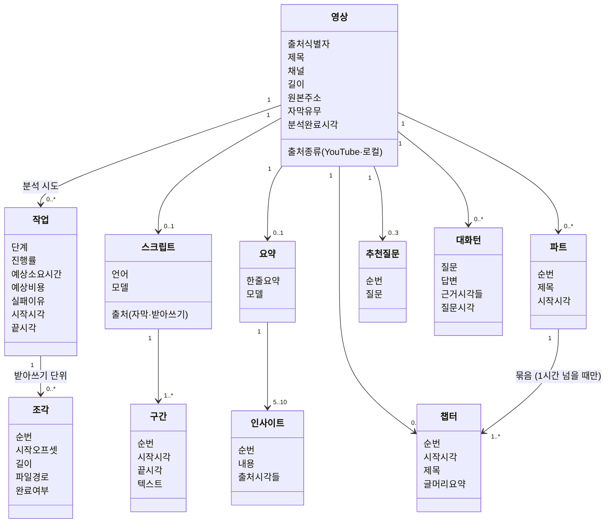

# 도메인 모델

## 0. 이 문서가 다루는 것

시스템 안에 어떤 **개념**이 있고, 각각 무엇을 **가지며**, 서로 어떻게 **이어지는지**를 정한다. 클래스·폴더 구조와 테이블(ERD·DD)은 뒤 문서에서 다룬다.

| 단계 | 하는 일 | 절 |
|---|---|---|
| 개념 식별 | 유스케이스 문장의 명사를 뽑아 개념인지 속성인지 가른다 | 1장 |
| 개념 모델 | 개념에 속성을 붙이고 관계를 잇는다 | 2·3장 |
| 경계 | 개념을 몇 덩어리로 묶는다 | 4장 |

**판별 기준은 "소프트웨어가 없어도 존재하는가"다.** 사람이 손으로 영상을 받아쓰고 요약을 써도 영상·스크립트·챕터·질문은 존재한다. 반면 HTTP 요청·폴링·세션은 소프트웨어라서 생긴 것이므로 도메인이 아니다.

여기서 정하지 않는 것: 클래스 메서드, 테이블 컬럼·타입, API 응답 형태, 코드 폴더. 뒤 문서에서 채운다.

---

## 1. 개념 식별

[[VA-UC-001]] 2·3장의 기본 흐름·확장 문장에서 센 명사 빈도:

| 후보 | 빈도 | 판정 |
|---|---:|---|
| 시스템 / 사용자 | 79 / 69 | 액터. 개념 아님 (사용자 한 명, 계정 없음) |
| 영상 | 71 | **개념** |
| 결과 | 40 | 여러 개념의 총칭(스크립트·요약·챕터·추천 질문). 개념 아님 |
| 저장 | 38 | 행위 |
| 파일 | 34 | 영상의 출처 속성 (로컬 파일) 또는 조각의 속성 |
| 질문 / 답변 | 31 / 7 | **개념** — 한 쌍이 대화의 한 턴 |
| 시각 | 29 | 구간·인사이트·챕터·답변의 속성. 개념 아님 |
| 스크립트 | 29 | **개념** |
| 음성 | 23 | 임시 파일. 조각의 속성 |
| 챕터 | 20 | **개념** |
| 단계 / 진행 / 예상 / 비용 / 재시도 | 17 / 5 / 8 / 7 / 5 | 작업의 속성 → 작업은 **개념** |
| 조각 | 16 | **개념** — 재개하려면 조각마다 완료 여부를 기억해야 한다 |
| 자막 | 16 | 스크립트의 출처 속성 (자막 vs 받아쓰기) |
| 길이 / 제목 / 채널 / URL / 출처 / 식별자 | 16 / 9 / 3 / 11 / 12 / 9 | 영상의 속성 |
| 목록 | 13 | 영상의 집합. 개념 아님 |
| 화면 | 12 | 소프트웨어. 개념 아님 |
| 추천 질문 | 10 | **개념** |
| 기록 | 10 | 질문·답변의 집합 |
| 인사이트 / 핵심 요약 / 한 줄 요약 | 9 / 7 / 6 | **개념** 둘 — 요약(한 줄 요약을 가짐)과 그 아래 인사이트 |
| 설정 / API 키 | 6 / 6 | 인프라([[VA-INFRA-001#C6]]). `.env`에 살고 DB에 없다 |
| 파트 | 4 | **개념** — 챕터 묶음. 제목을 가지며 1시간 넘는 영상에만 있다 |
| 구간 | (스크립트 안) | **개념** — 시각 클릭 이동의 대상. 스크립트의 원자 |
| 마크다운 / 임시 / 원본 | 3 / 4 / 5 | 산출물·파일. 개념 아님 |

**빈도만으로 판정하지 않는다.** "파트"는 4번뿐이지만 챕터를 묶어 접는 UI가 요구하므로 제목을 가진 개체다. "결과"는 40번이지만 총칭이다.

개념 11개: **영상, 작업, 조각, 스크립트, 구간, 요약, 인사이트, 파트, 챕터, 추천 질문, 대화 턴**.

---

## 2. 개념 모델

읽는 법: 영상이 중심이다. 왼쪽(작업·조각)은 **분석 중에만 움직이는 것**, 오른쪽(스크립트·요약·챕터·추천 질문)은 **분석이 끝나면 고정되는 결과**, 아래(대화 턴)는 **결과 위에 쌓이는 것**이다.

---

## 3. 개념별 정리

항목 ID는 영문 개념명이다. 클래스 명세의 클래스명, ERD의 테이블명과 맞춘다 — `Video` ↔ `Video` ↔ `videos`.

#### Video 영상

**영상**은 분석 대상 하나다. YouTube 영상 또는 로컬 파일. **출처 식별자**(YouTube 영상 ID 또는 파일 내용 해시)로 같은 영상인지 판정한다([[VA-UC-001#UC-S5]]). 제목·채널·길이·원본 주소(URL 또는 파일 경로)는 [[VA-UC-001#UC-S1]]에서 채운다.

> **출처를 하위 개념으로 나누지 않는 이유** — YouTube 영상과 로컬 파일은 속성이 조금 다르다(채널 유무, URL vs 경로). 하지만 다르게 행동하는 곳은 정보 확인·음성 확보 두 곳뿐이고 나머지 전 흐름이 같다. 개념 하나에 `출처종류`로 가르는 것이 두 개념보다 단순하다. 코드에서는 어댑터가 갈라진다(클래스 명세에서).

`분석완료시각`이 비어 있으면 아직 결과가 없는 영상이다(작업 진행 중 또는 실패). 목록([[VA-UC-001#UC-H5]])은 완료된 것과 진행 중인 것을 구분해 보여준다.

#### AnalysisJob 작업

**작업**은 영상 하나에 대한 분석 시도 한 번이다. 단계(다운로드 → 음성 추출 → 받아쓰기 → 핵심 요약 → 챕터 → 추천 질문), 진행률, 실패 이유를 갖는다([[VA-UC-001#UC-S6]]). 시작 전에 계산한 예상 소요 시간·비용도 여기 둔다([[VA-UC-001#UC-S1]] 5번).

> **영상과 작업을 나눈 이유** — 실패 후 재시도하면 작업이 둘이 된다([[VA-UC-001#UC-H0]] 4a). 영상에 단계·실패 이유를 두면 두 번째 시도가 첫 번째를 덮어 "왜 처음에 실패했나"가 사라진다. 또 작업은 분석이 끝나면 더 안 바뀌지만 영상은 그 뒤에도 대화가 쌓인다 — 생명주기가 다르다.

#### AudioChunk 조각

**조각**은 받아쓰기 API의 25MB 제한([[VA-INFRA-001#C2]]) 때문에 음성을 나눈 한 토막이다. 순번, 전체 음성에서의 시작 오프셋, 임시 파일 경로, 완료 여부를 갖는다. 오프셋이 있어야 조각별 시각을 전체 시각으로 되돌린다([[VA-UC-001#UC-S3]] 4번).

> **개념으로 두는 이유** — 재개([[VA-UC-001#UC-S3]] 3a3)가 "n+1번째부터"를 요구한다. 어느 조각이 끝났는지 기억해야 하므로 메모리가 아니라 저장돼야 한다. 받아쓰기가 성공하면 임시 파일은 지우지만 조각 행은 작업 이력으로 남긴다. 자막으로 처리한 영상은 조각이 없다.

#### Transcript 스크립트

**스크립트**는 영상 하나의 시각 붙은 전문이다. 출처가 둘 — YouTube 자막 또는 받아쓰기([[VA-UC-001#UC-S2]]). 언어와, 받아쓰기라면 쓴 모델을 갖는다. 영상과 1:1이다.

> **영상에 합치지 않는 이유** — 출처·언어·모델은 스크립트의 것이고, 나중에 "다른 모델로 다시 받아쓰기"가 생기면 영상은 그대로고 스크립트만 바뀐다. 구간들의 부모로도 필요하다.

#### Segment 구간

**구간**은 스크립트의 원자다. 시작·끝 시각과 텍스트. 화면에서 시각을 누르면 도착하는 곳이고([[VA-UC-001#UC-H3]] 5번), 인사이트·답변의 출처 시각이 가리키는 대상이다. 자막이면 자막 한 줄, 받아쓰기면 API가 준 segment 하나.

#### Summary 요약

**요약**은 한 줄 요약(TL;DR)과 인사이트들의 묶음이다([[VA-PRD-001#R4]]). 영상과 1:1. 만든 모델을 기록한다 — 모델을 바꿔 다시 만들었을 때 구분하기 위해.

#### Insight 인사이트

**인사이트**는 핵심 요약의 글머리 하나다. 내용과 **출처 시각들**(하나 이상)을 갖는다. 출처 시각은 구간을 가리킨다 — 정확히는 "그 시각을 포함하는 구간"으로 화면이 찾아간다.

> **출처 시각을 구간 참조가 아니라 시각(초)으로 두는 이유** — LLM이 돌려주는 것은 시각이다. 이를 구간 ID로 바꿔 저장하면 스크립트를 다시 만들었을 때 전부 깨진다. 시각으로 두면 스크립트가 바뀌어도 "그 시각의 구간"을 다시 찾을 수 있다. 챕터·대화 턴도 같다.

#### Part 파트

**파트**는 1시간 넘는 영상에서 챕터를 묶는 상위 단위다([[VA-PRD-001#R5]]). 순번·제목·시작 시각. 1시간 이하 영상은 파트가 없고 챕터가 바로 영상에 붙는다.

#### Chapter 챕터

**챕터**는 주제 단위 구간 요약이다. 시작 시각·제목·글머리 2~3줄. 영상에 속하고, 파트가 있으면 파트에도 속한다. 챕터의 끝은 다음 챕터의 시작이므로 따로 두지 않는다.

#### SuggestedQuestion 추천 질문

**추천 질문**은 분석 직후 제안하는 질문 3개다([[VA-PRD-001#R9]]). 순번과 질문 문장. 누르면 대화 턴이 된다 — 그때 추천 질문 자체는 바뀌지 않는다.

#### ChatTurn 대화 턴

**대화 턴**은 질문 하나와 그 답변, 근거 시각들의 묶음이다([[VA-UC-001#UC-H4]]). 영상에 속하고 시간순으로 쌓인다. 앞선 턴들이 다음 질문의 맥락이 된다.

> **질문과 답변을 한 개체로 두는 이유** — 이 도구의 대화는 항상 "사용자 질문 → 시스템 답변" 한 쌍이다. 시스템이 먼저 말하거나 사용자가 연속으로 두 번 묻는 일이 없다. 메시지 단위로 나누면 role 컬럼과 짝 맞추기가 생기는데, 여기선 얻는 게 없다.

---

## 4. 경계

개념 11개를 세 질문으로 묶는다 — **얘 없이 다른 게 말이 되나**, **같이 바뀌나**, **어디에도 못 들어가나**.

| 묶음 | 개념 | 묶은 근거 |
|---|---|---|
| 영상 (video) | 영상 | 모든 것의 부모. 입력·정보 확인·목록·삭제가 여기 |
| 작업 (job) | 작업, 조각 | **분석 중에만 움직인다.** 끝나면 이력으로 굳는다. 임시 파일을 만지는 유일한 묶음 |
| 결과 (analysis) | 스크립트, 구간, 요약, 인사이트, 파트, 챕터, 추천 질문 | **작업이 끝날 때 한 번에 생기고 그 뒤 안 바뀐다.** 내보내기도 이것만 읽는다 |
| 대화 (chat) | 대화 턴 | 결과 위에 **나중에 계속 쌓인다.** 결과를 읽기만 하고 바꾸지 않는다 |

[[VA-INFRA-001]] 4절은 셋(video · analysis · chat)을 예상했다. **작업을 결과에서 뺀 이유**: 파이프라인이 도는 동안 갱신되는 것(단계·조각 완료)과 끝난 뒤 고정되는 것(스크립트·챕터)을 한 묶음에 두면, 진행 상태 폴링 코드와 결과 조회 코드가 같은 자리에 섞인다. 생명주기가 다르면 묶음도 다르다.

**묶음 안에서는 자유롭게 참조하되, 묶음끼리는 ID로만 주고받는다.** 대화 묶음은 스크립트 객체를 들고 있지 않고 영상 ID로 결과 묶음에 "이 영상의 구간들"을 요청한다. 폴더는 이 경계를 따르되 확정은 클래스 명세에서.

---

## 5. 판단이 필요한 지점

**1. 출처 시각을 구간 FK로 둘지 초 단위 값으로 둘지** — **결정: 초 단위 값.** 3장 Insight에 적은 대로 LLM 출력이 시각이고, 스크립트 재생성에 강하다. 화면은 "시각 ≤ 구간.끝"인 첫 구간으로 이동한다.

**2. 작업이 끝난 뒤 조각을 지울지** — **결정: 파일은 지우고 행은 남긴다.** 파일은 디스크를 먹지만 행은 "이 영상은 30조각으로 받아썼다"는 이력이다. 삭제([[VA-UC-001#UC-H6]])하면 행도 지운다.

**3. 파트를 개념으로 둘지 챕터의 속성(`파트제목`)으로 둘지** — **결정: 개념.** 챕터 25개가 파트 4개에 속할 때 파트 제목이 25번 반복되는 것은 정규화 위반이고, 파트를 접었다 펴는 화면이 파트를 하나의 것으로 다룬다.

---

## 6. 미결사항

- [ ] 재분석 — 같은 영상을 다른 모델로 다시 분석하면 스크립트·요약을 덮어쓸지, 버전으로 쌓을지. 첫 버전은 **덮어쓴다**(1:1 유지). 비목표에 가깝지만 모델명을 기록해 두는 이유가 이것
- [ ] 대화 턴의 근거 시각이 없는 경우("영상에서 다루지 않습니다") — 빈 목록으로 두면 충분한지, 별도 표시가 필요한지. ERD에서 null 허용으로
