# 클래스 명세

## 0. 이 문서가 다루는 것

[[VA-DOM-001]]의 개념을 **코드 구조**로 옮긴다. 폴더 배치, 엔티티 클래스, 서비스의 책임과 메서드 이름. 테이블·컬럼은 [[VA-DOM-003]]이 맡는다.

| 종류 | 역할 | 우리 구조 | 정의하는 곳 |
|---|---|---|---|
| Entity | 데이터를 갖는 것 | `domains/*/models.py` | 이 문서 2장 + ERD·DD |
| Control | 유스케이스 흐름을 조율하는 것 | `domains/*/service.py`, `job/pipeline.py` | 이 문서 3장(의존)·4장(책임) |
| Boundary | 바깥과 만나는 것 | `domains/*/router.py`(안쪽 입구), `domains/*/adapters/`(바깥 출구), `web/` | API 명세·화면 명세. 3장에서 연결만 |

**이 버전(v1)의 범위** — 엔티티(2장)는 확정, 서비스 메서드(4장)는 **이름과 책임까지**. 인자·반환 타입은 API 명세([[VA-API-001]])와 시퀀스([[VA-SEQ-001]])에서 확정하고 되먹인다. 지금 확정하면 두 번 고친다.

**전제 (앞 단계에서 결정)**
- ORM 모델 = 도메인 객체. 분리하지 않는다. 규칙은 서비스에 둔다
- 폴더는 도메인 묶음 4개 기준([[VA-DOM-001]] 4장). 그 안에 계층
- 기본키는 대리키. 출처 식별자는 unique 제약
- 묶음끼리는 ID로만 참조. 객체를 직접 들지 않는다
- 외부 연동(YouTube·ffmpeg·OpenAI)이 **실제로 있는 묶음에만** ports/adapters. 단순 DB CRUD에는 만들지 않는다
- 사용처 1곳짜리 추상화(베이스 클래스·팩토리) 금지

---

## 1. 폴더 구조

저장소 하나에 백엔드(`api/`)와 프론트(`web/`)를 나눠 둔다([[VA-INFRA-001#C10]]).

```
video-agent/                    저장소 = 프로젝트
├── api/                        Python 3.12 · FastAPI
│   ├── app/
│   │   ├── main.py             앱 생성, 라우터 등록, 시작 시 API 키 검사
│   │   ├── core/               묶음에 속하지 않는 것
│   │   │   ├── config.py       .env → Settings (모델명·경로·DB URL)
│   │   │   ├── db.py           async 세션
│   │   │   └── errors.py       도메인 예외 → HTTP 상태 매핑
│   │   └── domains/
│   │       ├── video/          영상 — 입력·정보·목록·삭제
│   │       │   ├── router.py · schemas.py · service.py · crud.py · models.py
│   │       │   ├── ports.py            YouTubePort · MediaProbePort
│   │       │   └── adapters/           youtube_ytdlp.py · media_ffprobe.py
│   │       ├── job/            작업 — 파이프라인·조각·진행 상태
│   │       │   ├── router.py · schemas.py · service.py · crud.py · models.py
│   │       │   ├── pipeline.py         단계 순서와 재개. 다른 묶음 서비스를 조합
│   │       │   ├── ports.py            AudioSourcePort · AudioSplitPort · SttPort
│   │       │   └── adapters/           audio_ytdlp.py · audio_ffmpeg.py · stt_openai.py
│   │       ├── analysis/       결과 — 스크립트·요약·챕터·추천 질문·내보내기
│   │       │   ├── router.py · schemas.py · service.py · crud.py · models.py
│   │       │   ├── ports.py            SummarizerPort
│   │       │   ├── adapters/           summarizer_openai.py (프롬프트도 여기)
│   │       │   └── export.py           마크다운 생성 (순수 함수)
│   │       └── chat/           대화 — 질문·답변
│   │           ├── router.py · schemas.py · service.py · crud.py · models.py
│   │           ├── ports.py            AnswererPort
│   │           └── adapters/           answerer_openai.py
│   ├── tests/                  app/ 구조를 그대로 따른다
│   ├── alembic/ · alembic.ini
│   ├── pyproject.toml · uv.lock
│   └── Dockerfile              python + ffmpeg + yt-dlp
│
├── web/                        Next.js (App Router · TS). 화면 명세(7단계) 산출물
│   ├── app/                    페이지
│   ├── lib/api.ts              api 호출 층 — 얇게
│   └── Dockerfile
│
├── docs/specs/                 명세 원본
├── inbox/                      로컬 영상 (읽기 전용 마운트, .gitignore)
├── data/                       tmp/ · export/ (.gitignore)
├── docker-compose.yml          web · api · db
├── .env.example
└── CLAUDE.md · README.md
```

**계층 규칙** — `router → service → crud` 방향으로만. router는 HTTP 입출력만, crud는 DB만, 비즈니스 판단은 service. 어댑터는 service만 부른다. 묶음 밖의 것이 필요하면 그 묶음의 service를 ID로 부른다.

**`pipeline.py`를 job 안에 둔 이유** — 파이프라인은 video·job·analysis 세 묶음의 서비스를 순서대로 조합한다. 어디에도 못 들어가는 것 같지만, "지금 어느 단계인가"를 갱신하는 주체가 작업이므로 작업 묶음이 갖는다. analysis 서비스는 파이프라인을 모른다.

**OpenAI를 부르는 어댑터가 셋인 이유** (`stt_openai` · `summarizer_openai` · `answerer_openai`) — 하는 일이 다르다(음성 → 텍스트 / 스크립트 → 구조화 요약 / 질문 → 근거 답변). 하나로 합치면 세 묶음이 같은 모듈에 의존해 경계가 무너진다. SDK 클라이언트 생성만 `core/config.py`의 설정을 공유한다.

---

## 2. 엔티티

묶음별. **클래스마다 항목 헤딩 + 그 클래스의 다이어그램.** 테이블은 ERD·DD의 해당 항목을 참조한다.

### 2.1 video

#### Video 영상

테이블: [[VA-DOM-003#videos]] · 도메인: [[VA-DOM-001#Video]]

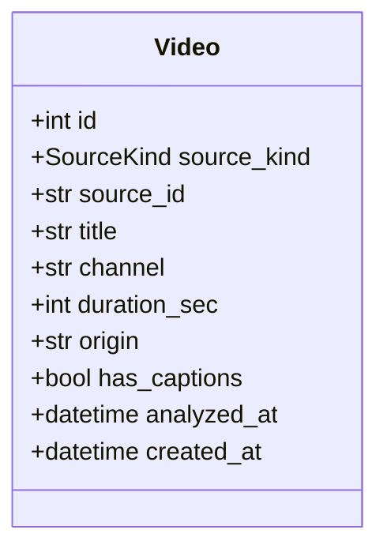

관계
- `Video` 1 — 0..* `AnalysisJob`
- `Video` 1 — 0..1 `Transcript` · 0..1 `Summary` · 0..* `Part` · 0..* `Chapter` · 0..3 `SuggestedQuestion` · 0..* `ChatTurn`

`source_id`는 YouTube면 영상 ID(11자), 로컬이면 파일 내용 SHA-256. `origin`은 URL 또는 inbox 상대 경로. `channel`은 로컬이면 null.

### 2.2 job

#### AnalysisJob 작업

테이블: [[VA-DOM-003#analysis_jobs]] · 도메인: [[VA-DOM-001#AnalysisJob]]

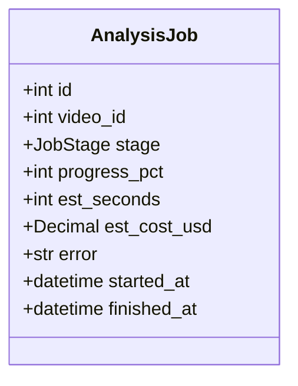

관계
- `AnalysisJob` * — 1 `Video` (video_id)
- `AnalysisJob` 1 — 0..* `AudioChunk`

`stage`가 `failed`면 `error`에 "단계: 이유". 재시도는 **같은 작업**을 이어간다 — 새 작업을 만들지 않는다. 사용자가 처음부터 다시 시작하면 새 작업.

#### AudioChunk 조각

테이블: [[VA-DOM-003#audio_chunks]] · 도메인: [[VA-DOM-001#AudioChunk]]

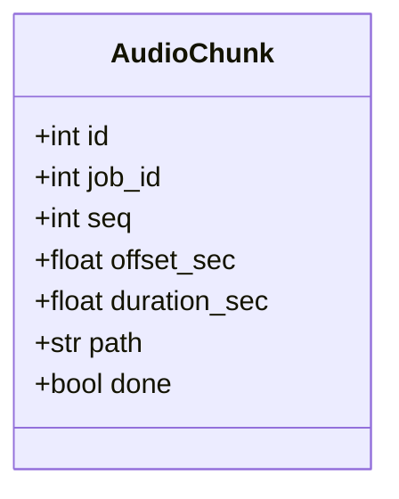

관계
- `AudioChunk` * — 1 `AnalysisJob` (job_id)

`path`는 `data/tmp/{video_id}/{seq}.mp3`. 받아쓰기 성공 시 파일은 지우고 `path`는 null로.

### 2.3 analysis

#### Transcript 스크립트

테이블: [[VA-DOM-003#transcripts]] · 도메인: [[VA-DOM-001#Transcript]]

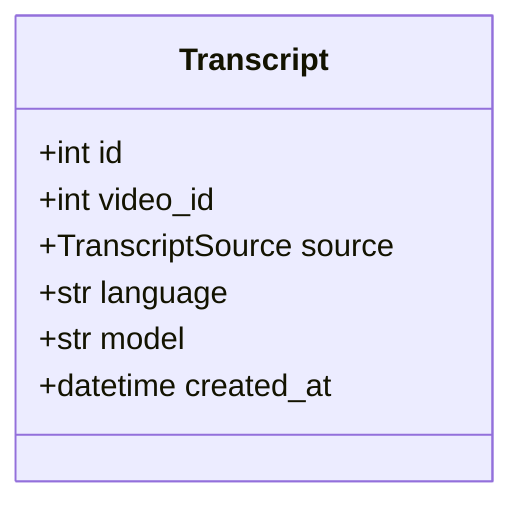

관계
- `Transcript` 1 — 1 `Video`
- `Transcript` 1 — 1..* `Segment`

#### Segment 구간

테이블: [[VA-DOM-003#segments]] · 도메인: [[VA-DOM-001#Segment]]

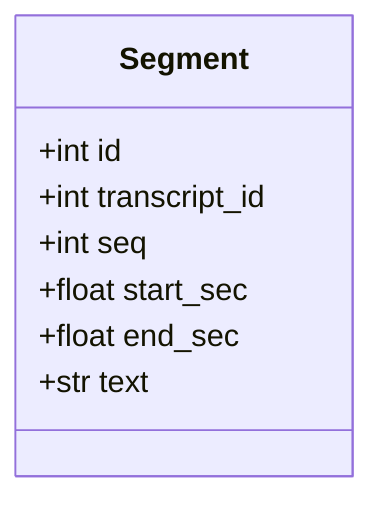

관계
- `Segment` * — 1 `Transcript`

3시간 영상은 구간이 수천 개다. 화면은 한 번에 다 받되([[VA-PRD-001#N2]]), API는 `video_id`로 정렬된 목록 하나를 준다.

#### Summary 요약

테이블: [[VA-DOM-003#summaries]] · 도메인: [[VA-DOM-001#Summary]]

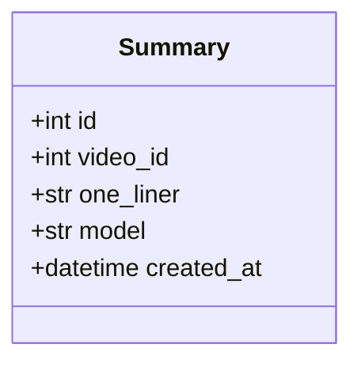

관계
- `Summary` 1 — 1 `Video`
- `Summary` 1 — 5..10 `Insight`

#### Insight 인사이트

테이블: [[VA-DOM-003#insights]] · 도메인: [[VA-DOM-001#Insight]]

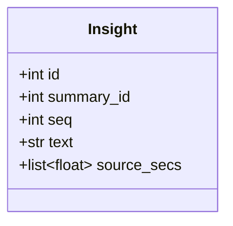

관계
- `Insight` * — 1 `Summary`

`source_secs`는 초 단위 시각 목록. 구간 FK가 아닌 이유는 [[VA-DOM-001]] 5장 1번.

#### Part 파트

테이블: [[VA-DOM-003#parts]] · 도메인: [[VA-DOM-001#Part]]

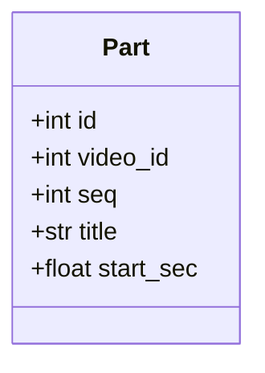

관계
- `Part` * — 1 `Video`
- `Part` 1 — 1..* `Chapter`

#### Chapter 챕터

테이블: [[VA-DOM-003#chapters]] · 도메인: [[VA-DOM-001#Chapter]]

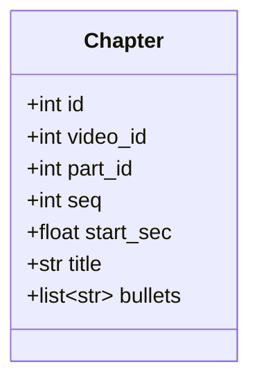

관계
- `Chapter` * — 1 `Video`
- `Chapter` * — 0..1 `Part` (1시간 이하 영상은 null)

#### SuggestedQuestion 추천 질문

테이블: [[VA-DOM-003#suggested_questions]] · 도메인: [[VA-DOM-001#SuggestedQuestion]]

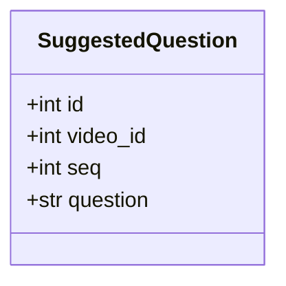

관계
- `SuggestedQuestion` * — 1 `Video`

### 2.4 chat

#### ChatTurn 대화 턴

테이블: [[VA-DOM-003#chat_turns]] · 도메인: [[VA-DOM-001#ChatTurn]]

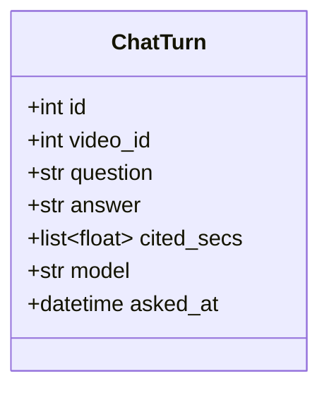

관계
- `ChatTurn` * — 1 `Video`

`cited_secs`가 빈 목록이면 "영상에서 다루지 않습니다" 답변이다.

### 2.5 열거형

| 이름 | 값 | 쓰는 곳 |
|---|---|---|
| `SourceKind` | `youtube` · `local` | Video |
| `JobStage` | `pending` · `download` · `extract` · `transcribe` · `summarize` · `chapter` · `suggest` · `done` · `failed` | AnalysisJob. 순서가 곧 파이프라인 순서 |
| `TranscriptSource` | `caption` · `stt` | Transcript |

DB에는 enum 타입이 아니라 varchar로 두고 앱이 검증한다 — 값 추가 때 마이그레이션을 피한다.

### 2.6 내부 타입 (DTO) — 초안

서비스·어댑터가 주고받는 것. API 응답 스키마는 [[VA-API-001]]에서 정하고 같은 이름이면 그것을 쓴다. 여기는 API에 안 나가는 것만.

| 타입 | 필드 | 쓰는 곳 |
|---|---|---|
| `SourceInfo` | `source_kind` · `source_id` · `title` · `channel` · `duration_sec` · `origin` · `has_captions` | YouTubePort · MediaProbePort → VideoService.register |
| `Estimate` | `seconds` · `cost_usd` · `needs_stt: bool` | JobService.estimate → 화면 사전 안내 |
| `CaptionLine` | `start_sec` · `end_sec` · `text` | AudioSourcePort.captions → AnalysisService.save_transcript |
| `ChunkPlan` | `seq` · `offset_sec` · `duration_sec` · `path` | AudioSplitPort.split → JobService |
| `SttSegment` | `start_sec` · `end_sec` · `text` · `language` | SttPort.transcribe → 오프셋 더해 Segment로 |
| `SummaryDraft` | `one_liner` · `insights: list[(text, source_secs)]` | SummarizerPort → AnalysisService |
| `ChapterDraft` | `parts: list[(title, start_sec)]` · `chapters: list[(part_seq, start_sec, title, bullets)]` | SummarizerPort → AnalysisService |
| `AnswerDraft` | `answer` · `cited_secs` | AnswererPort → ChatService |

---

## 3. 의존 관계

누가 누굴 부르는지. 여기 없는 방향은 부르면 안 된다.

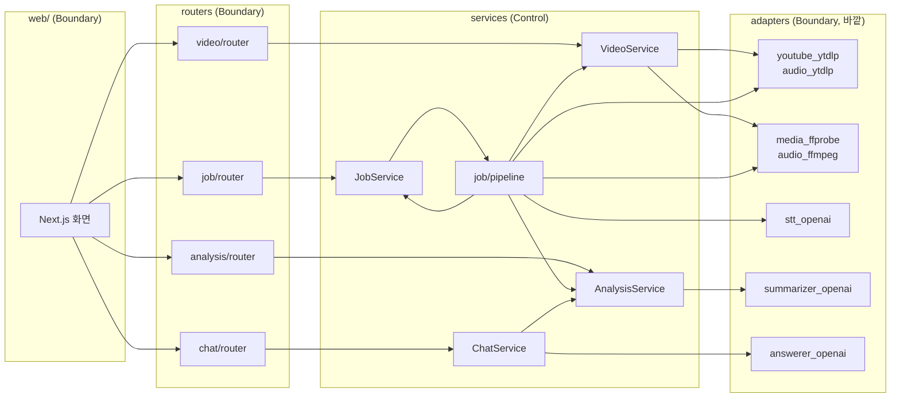

서비스끼리 허용되는 호출은 셋뿐:

| 부르는 쪽 | 불리는 쪽 | 무엇을 | 왜 |
|---|---|---|---|
| `pipeline` | `VideoService` | `get(video_id)`, `mark_analyzed(video_id)` | 파이프라인이 영상 정보를 읽고 완료 표시 |
| `pipeline` | `AnalysisService` | `save_transcript`, `generate_summary`, `generate_chapters`, `generate_questions` | 단계 실행 |
| `ChatService` | `AnalysisService` | `segments_of(video_id)`, `chapters_of(video_id)` | 답변 맥락. 스크립트 객체가 아니라 ID로 요청 |

`AnalysisService`는 `JobService`를 모른다. `VideoService`는 아무 서비스도 부르지 않는다. 삭제([[VA-UC-001#UC-H6]])는 FK cascade로 처리하므로 VideoService가 다른 묶음을 부를 필요가 없다.

---

## 4. 설계 클래스 — 서비스 책임 (v1)

메서드 시그니처는 API·SEQ 단계에서 확정하고 v2에서 설계 클래스 다이어그램으로 그린다. 여기는 **무엇을 책임지는지**와 **규칙이 사는 곳**.

### 4.1 서비스

#### VideoService 영상 서비스

| 메서드 | 책임 | 유스케이스 |
|---|---|---|
| `register_youtube(url)` | URL → 영상 ID 추출, YouTubePort로 정보 조회, 중복 판정, Video 생성 또는 기존 반환 | [[VA-UC-001#UC-H1]], [[VA-UC-001#UC-S1]], [[VA-UC-001#UC-S5]] |
| `register_local(path)` | inbox 안 경로 검증, MediaProbePort로 길이·음성 트랙 확인, 내용 해시, 중복 판정 | [[VA-UC-001#UC-H2]], [[VA-UC-001#UC-S1]] |
| `get(video_id)` · `list()` | 조회. 목록은 완료·진행 중 구분 | [[VA-UC-001#UC-H5]] |
| `delete(video_id)` | 삭제. 딸린 것은 cascade, `data/tmp/{video_id}`도 | [[VA-UC-001#UC-H6]] |
| `mark_analyzed(video_id)` | `analyzed_at` 기록 | pipeline |

규칙: URL 형식은 watch·youtu.be·shorts 셋. 3시간 초과는 여기서 거부(`video-too-long`). inbox 밖 경로는 거부(`path-outside-inbox`). 확장자는 mp4·mkv·mov·webm·mp3·m4a·wav.

#### JobService 작업 서비스

| 메서드 | 책임 | 유스케이스 |
|---|---|---|
| `estimate(video_id)` | 자막 유무·길이로 예상 시간·비용 (`Estimate`) | [[VA-UC-001#UC-S1]] 5번 |
| `start(video_id)` | AnalysisJob 생성(`pending`), 백그라운드로 `pipeline.run` | [[VA-UC-001#UC-H0]] 3번 |
| `progress(job_id)` | 단계·진행률·조각 n/m·남은 예상 시간 | [[VA-UC-001#UC-S6]] |
| `retry(job_id)` | `failed` 작업을 실패한 단계부터 재개 | [[VA-UC-001#UC-S3]] 3a3 |
| `plan_chunks` · `mark_chunk_done` | 조각 계획 저장, 완료 표시 | [[VA-UC-001#UC-S3]] |

규칙: 영상 하나에 진행 중 작업은 하나(`job-already-running`). 비용 = 받아쓰기 분 × 단가(설정값). 남은 시간 = 미완료 조각 수 × 지금까지 조각당 평균.

**파이프라인 (`job/pipeline.py`)** — 함수 하나 `run(job_id)`가 `JobStage` 순서대로 단계를 실행한다. 각 단계 앞에서 `stage` 갱신, 단계 실패 시 `failed`+`error` 기록 후 중단. 재개는 `stage`를 보고 그 단계부터. 받아쓰기 단계는 `done=false` 조각만 골라 병렬(설정값 3)로 보낸다. 성공 시 `data/tmp/{video_id}` 삭제, `VideoService.mark_analyzed`. 클래스가 아니라 함수 모듈이므로 항목으로 두지 않고 JobService 아래에 적는다.

#### AnalysisService 결과 서비스

| 메서드 | 책임 | 유스케이스 |
|---|---|---|
| `save_transcript(video_id, source, language, model, segments)` | Transcript + Segment 일괄 저장. 기존 것은 교체 | [[VA-UC-001#UC-S2]], [[VA-UC-001#UC-S3]] |
| `generate_summary(video_id)` | SummarizerPort → Summary + Insight 저장. 시각 범위 검증 | [[VA-UC-001#UC-S4]] 3·5번 |
| `generate_chapters(video_id)` | 길이에 따라 구간 분할 → 챕터, 1시간 넘으면 파트 묶기 | [[VA-UC-001#UC-S4]] 1a·2a |
| `generate_questions(video_id)` | 추천 질문 3개 | [[VA-UC-001#UC-S4]] 4번 |
| `result_of(video_id)` | 결과 화면용 — 요약·인사이트·파트·챕터·추천 질문·구간 전부 | [[VA-UC-001#UC-H3]] |
| `segments_of` · `chapters_of` | ChatService용 읽기 | [[VA-UC-001#UC-H4]] |
| `export_markdown(video_id, with_chat)` | `export.py` 순수 함수 호출 | [[VA-UC-001#UC-H7]] |

규칙: 인사이트 수 = 길이 ≤ 60분이면 5~8, 초과면 ≤ 10. 챕터 수 목표 = 길이(분) ÷ 6 (10분 → 5개 안팎, 3시간 → 30개). 파트는 60분 초과에만. 시각이 `[0, duration]` 밖이면 가장 가까운 구간 시각으로 보정. 요약 언어는 한국어.

#### ChatService 대화 서비스

| 메서드 | 책임 | 유스케이스 |
|---|---|---|
| `ask(video_id, question)` | 맥락 구성(구간 + 앞선 턴) → AnswererPort → ChatTurn 저장 | [[VA-UC-001#UC-H4]] |
| `history(video_id)` | 턴 목록 시간순 | [[VA-UC-001#UC-H5]] 3번 |

규칙: 맥락에 넣는 앞선 턴은 최근 10개. 스크립트가 설정된 토큰 상한을 넘으면 챕터 제목으로 관련 챕터를 고르고 그 구간만 넣는다([[VA-UC-001#UC-H4]] 3b). 근거 없는 답이면 `cited_secs=[]`.

### 4.2 포트 (외부 연동 인터페이스)

| 포트 | 메서드 | 어댑터 | 묶음 |
|---|---|---|---|
| `YouTubePort` | `info(video_id) → SourceInfo` | yt-dlp | video |
| `MediaProbePort` | `probe(path) → (duration_sec, has_audio)` | ffprobe | video |
| `AudioSourcePort` | `captions(video_id) → list[CaptionLine] \| None` · `download_audio(video_id, dest)` · `extract_audio(src, dest)` | yt-dlp · ffmpeg | job |
| `AudioSplitPort` | `split(path, dest_dir) → list[ChunkPlan]` (무음 근처 경계) | ffmpeg | job |
| `SttPort` | `transcribe(path) → list[SttSegment]` | OpenAI whisper-1 | job |
| `SummarizerPort` | `summary(segments, duration) → SummaryDraft` · `chapters(segments, duration) → ChapterDraft` · `questions(segments) → list[str]` | OpenAI gpt-5-mini | analysis |
| `AnswererPort` | `answer(question, context_segments, history) → AnswerDraft` | OpenAI gpt-5-mini | chat |

어댑터는 Protocol을 구현하는 클래스 하나씩. 테스트는 가짜 어댑터로 바꿔 끼운다. 두 번째 구현체(예: 로컬 whisper)는 생길 때 만든다. 포트·어댑터는 항목으로 두지 않는다 — 시그니처가 MINISPEC에서 함수 단위로 정의된다.

---

## 5. 미결사항

- [x] `Insight.source_secs`·`Chapter.bullets`·`ChatTurn.cited_secs`를 JSONB로 둘지 자식 테이블로 뺄지 — [[VA-DOM-003]]에서 **JSONB**로 결정. 단독 조회가 없다
- [ ] 백그라운드 태스크가 서버 재시작으로 죽었을 때 — `stage`가 중간인 채 남는다. 시작 시 그런 작업을 `failed`로 돌리고 재시도 가능하게. MINISPEC에서
- [ ] 서비스 메서드 시그니처 확정 — API·SEQ 뒤 v2에서
