# 클래스 명세

---

## 0. 이 문서가 다루는 것

[[VA-DOM-001]]의 개념을 **코드 구조**로 옮긴다. 폴더 배치, 엔티티 클래스, 서비스의 메서드 시그니처와 규칙이 사는 곳. 테이블·컬럼은 다음 문서(ERD·DD)가 맡는다.

| 종류 | 역할 | 우리 구조 | 정의하는 곳 |
|---|---|---|---|
| Entity | 데이터를 갖는 것 | `domains/*/models.py` | 이 문서 2장 + ERD·DD |
| Control | 유스케이스 흐름을 조율하는 것 | `domains/*/service.py` · `domains/job/pipeline.py` · `core/settings.py` | 이 문서 3장(의존) · 4장(시그니처) |
| Boundary | 바깥과 만나는 것 | `domains/*/router.py`(안쪽 입구) · `domains/*/adapters/` + `infra/`(바깥 출구) · `frontend/` | [[VA-API-001]] · [[VA-UI-002]]. 3장에서 연결만 |

메서드 시그니처는 [[VA-API-001]]이 정한 요청·응답으로 확정했다. 반환 타입 중 `Video` · `Job` · `Result` 같은 응답 형태는 API 스키마와 같은 이름이다. 시퀀스(9단계)와 MINISPEC(10단계)이 되먹이는 것은 그때 고친다.

**전제 (앞 단계에서 결정)**
- ORM 모델 = 도메인 객체. 분리하지 않는다. 규칙은 서비스에 둔다
- 폴더는 도메인 묶음 4개 기준([[VA-DOM-001]] 4장). 그 안에 계층
- 기본키는 대리키. 출처 식별자는 unique 제약
- 묶음끼리는 ID나 응답 DTO로만 주고받는다. 다른 묶음의 ORM 객체를 들지 않는다
- 외부 연동(YouTube · ffmpeg · OpenAI)이 **실제로 있는 묶음에만** ports/adapters([[VA-INFRA-001]] 4절). 단순 DB CRUD에는 만들지 않는다
- 사용처 1곳짜리 추상화(베이스 클래스 · 팩토리) 금지

**본문은 언어 중립으로 쓴다.** FastAPI · SQLAlchemy로 어떻게 옮기는지는 6장 부록에 둔다.

---

## 1. 폴더 구조

저장소 하나에 **백엔드와 프런트엔드를 나눠 둔다.** 명세 · 배치 파일 · 데이터 폴더는 둘 다 쓰므로 루트에 둔다. 구조는 명세 작성 규약 1.9의 기본형(도메인별 폴더 + 계층 파일)을 따르고, 다른 점은 이 절에 이유와 함께 적었다.

```
video-agent/                    저장소 = 프로젝트
├── backend/                    Python 3.12 · FastAPI. 아래 app/ 기본형
│   ├── app/                    임포트 패키지 — `from app.domains…`
│   ├── tests/                  app/ 구조를 그대로 따른다 (거울)
│   ├── alembic/ · alembic.ini  마이그레이션
│   └── pyproject.toml · uv.lock
│
├── frontend/                   Next.js (App Router · TypeScript). 승인된 디자인 보드를 옮긴 화면
│                               빌드 결과는 web 컨테이너 안(standalone). 백엔드 이미지에 넣지 않는다
│
├── docs/specs/                 명세 원본. 양쪽이 같이 본다
├── inbox/                      로컬 영상. 읽기 전용 마운트, 커밋하지 않는다 (INFRA C4)
├── data/                       tmp/{video_id}/ · export/. 커밋하지 않는다 (INFRA 6절)
├── Dockerfile                  backend 이미지 — python + ffmpeg + yt-dlp (INFRA C8)
├── Dockerfile.web              frontend 이미지. 같은 종류가 둘이라 뒤에 용도를 붙였다
├── docker-compose.yml          web · api · db 셋 (INFRA 8절)
├── .env.example                필요한 환경 변수의 이름만. 값은 비운다. `.env`는 커밋하지 않는다 (INFRA C6)
├── .gitignore · .dockerignore
└── README.md · AGENTS.md       사람용 · 에이전트용. CLAUDE.md는 AGENTS.md를 가리키는 한 줄
```

[[VA-INFRA-001]] 4절은 이 파일을 `CLAUDE.md`라고 불렀고 백엔드 · 프런트 폴더를 `api/` · `web/`으로 예상했다. 이름은 규약 1.9의 것을 따르고(`backend/` · `frontend/` · `AGENTS.md`), compose 서비스 이름은 인프라 문서대로 `api` · `web` · `db`다. 폴더 이름과 서비스 이름은 다른 것이다.

**backend/app/ 안**

```
app/
├── main.py                 앱 조립. 라우터 등록, 시작 때 저장된 키 확인(SettingsService.check_stored_key),
│                           서버가 죽어 running인 채 남은 작업을 failed로 되돌림(JobService.fail_orphans)
├── core/                   도메인에 속하지 않는 것
│   ├── config.py           .env → Config (DB URL · OPENAI_API_KEY · 모델명 · inbox/data 경로 · 조각 길이 · 동시 수 · 단가)
│   ├── db.py               async 엔진 · 세션
│   ├── errors.py           problem+json 종류마다 예외 클래스 하나 ([[VA-API-001]] 2장의 18종)
│   ├── settings.py         SettingsService — 키 상태 · 모델 선택 (4.5). 키 확인은 infra/openai를 부른다
│   └── settings_router.py  /api/settings 셋. core에 라우터가 있는 유일한 곳 (아래 「기본형과 다른 점」)
│
├── domains/
│   ├── video/              영상 — inbox · 등록 · 목록 · 삭제
│   │   ├── router.py       /api/inbox · /api/videos · /api/videos/{id} (GET · DELETE)
│   │   ├── schemas.py      Video · VideoSummary · VideoDetail · RegisterRequest · RegisterResponse · InboxListing
│   │   ├── service.py      VideoService
│   │   ├── crud.py
│   │   ├── models.py       Video
│   │   ├── ports.py        YouTubeInfoPort · MediaProbePort
│   │   └── adapters/       youtube_info.py (infra/ytdlp) · media_probe.py (infra/ffmpeg)
│   ├── job/                작업 — 시작 · 진행 · 재시도 · 조각
│   │   ├── router.py       /api/videos/{id}/job · …/job/retry
│   │   ├── schemas.py      Job · JobSummary · Chunks · Chunk · JobError · Estimate
│   │   ├── service.py      JobService
│   │   ├── pipeline.py     단계 순서와 재개. 함수 모듈 (4.2)
│   │   ├── crud.py
│   │   ├── models.py       AnalysisJob · AudioChunk
│   │   ├── ports.py        AudioSourcePort · AudioSplitPort · SttPort
│   │   └── adapters/       audio_source.py (infra/ytdlp + infra/ffmpeg) · audio_split.py (infra/ffmpeg) · stt_openai.py (infra/openai)
│   ├── analysis/           결과 — 스크립트 · 요약 · 챕터 · 추천 질문 · 내보내기
│   │   ├── router.py       /api/videos/{id}/result · …/export (GET · POST)
│   │   ├── schemas.py      Result · Transcript · Segment · Summary · Insight · Part · Chapter · SuggestedQuestion · ExportRequest · ExportPreview · ExportResult
│   │   ├── service.py      AnalysisService
│   │   ├── crud.py
│   │   ├── models.py       Transcript · Segment · Summary · Insight · Part · Chapter · SuggestedQuestion
│   │   ├── ports.py        SummarizerPort
│   │   ├── adapters/       summarizer_openai.py (infra/openai. 프롬프트도 여기)
│   │   └── export.py       마크다운 생성. 순수 함수 — 시각 표기 · 링크 · 절 순서
│   └── chat/               대화 — 질문 · 답변
│       ├── router.py       /api/videos/{id}/chat (GET · POST)
│       ├── schemas.py      ChatTurn · AskRequest
│       ├── service.py      ChatService
│       ├── crud.py
│       ├── models.py       ChatTurn
│       ├── ports.py        AnswererPort
│       └── adapters/       answerer_openai.py (infra/openai)
│
└── infra/                  외부 시스템 공용 클라이언트. 도메인별 해석은 각 묶음의 adapters/에
    ├── ytdlp.py            영상 정보 · 자막 목록 · 자막 내려받기 · 음성 내려받기
    ├── ffmpeg.py           ffprobe(길이 · 음성 트랙) · 음성 추출 · 무음 탐지 · 자르기
    └── openai.py           클라이언트 생성 · 키 확인(모델 목록 조회) · 받아쓰기 호출 · 채팅 호출
```

`shared/`는 없다 — 두 묶음 이상이 쓰는 순수 유틸이 아직 없다. 시각 표기(`mm:ss`)는 내보내기(`analysis/export.py`)만 쓴다. 생기면 그때 만든다.

**이 문서에서 파일 경로를 적을 때**는 패키지 안 상대 경로로 쓴다 — `domains/job/pipeline.py`는 `backend/app/domains/job/pipeline.py`를 가리킨다.

**기본형과 다른 점, 그리고 왜.**

- **`core/`에 설정 라우터가 있다.** API 키와 모델 선택은 도메인 개념이 아니라 인프라 값이다([[VA-DOM-001]] 1장 — 설정 · API 키는 `.env`에 살고 DB에 없다, [[VA-INFRA-001#C6]]). 그런데 화면 UI-5가 읽고 쓰므로([[VA-API-001#GET/api/settings]] · [[VA-API-001#POST/api/settings/key]] · [[VA-API-001#PUT/api/settings/models]]) 입구가 필요하다. 도메인 폴더 `domains/settings/`를 만들면 도메인 모델에 없는 묶음이 생긴다(규약 1.9 — 도메인 경계는 도메인 모델이 정한다). 그래서 `core/settings.py`(서비스)와 `core/settings_router.py`(입구) 둘로 둔다. `models.py` · `crud.py`가 없는 것은 DB가 없기 때문이다. 키 저장 위치가 DB로 정해지면(7장) 그때 도메인 모델부터 고친다.
- **파이프라인이 `job/` 안에 있다.** 단계를 순서대로 돌리는 조율자는 video · job · analysis 세 묶음을 부르지만, "지금 어느 단계인가"를 갱신하는 주체가 작업이다([[VA-DOM-001#AnalysisJob]]). 묶음 밖에 두면 작업 상태를 바꾸는 코드가 작업 묶음 밖에 생긴다. 클래스가 아니라 함수 모듈이고 `JobService`만 부른다.
- **외부 클라이언트는 `infra/`, 해석은 `adapters/`.** yt-dlp는 video(정보)와 job(자막 · 음성)이, ffmpeg는 video(길이)와 job(추출 · 자르기)이, OpenAI는 job · analysis · chat · core/settings 넷이 쓴다. 두 묶음 이상이 쓰는 클라이언트는 `infra/`에 한 번 두고(규약 1.9), 묶음마다 다른 해석(음성 → 구간 / 스크립트 → 요약 / 질문 → 근거 답)만 `adapters/`에 남긴다. OpenAI 어댑터가 셋인 것은 하는 일이 셋이기 때문이지 클라이언트가 셋인 것이 아니다.
- 나머지는 기본형 그대로다. 라우터는 도메인 안에 있다 — 입구가 웹 REST 하나뿐이다([[VA-INFRA-001#C10]]).

**묶음 안 규칙**
- 호출 방향은 `router → service → crud` 한 방향. router는 HTTP 입출력만, crud는 DB만, 판단은 service
- 어댑터는 service만 부른다. 어댑터는 `infra/` 클라이언트를 부르고 결과를 그 묶음의 DTO로 바꾼다
- 묶음 A가 묶음 B의 것이 필요하면 `B.service`를 부르고 **ID나 응답 DTO**만 받는다. 허용된 방향은 3.2에 그린 것뿐이다
- **라우터가 서비스 둘을 차례로 부르는 곳이 있다.** 영상 응답(`Video` · `VideoSummary`)이 작업 요약과 대화 수를 품고, 결과 · 내보내기가 영상 DTO를 인자로 받는다. 판단 없이 「A의 결과를 B에 넘긴다」뿐이라 조율 모듈(queries)을 두지 않는다 — 두 번째 조합이 판단을 갖게 되면 그때 만든다(과설계 금지). 어느 라우터가 무엇을 잇는지는 3.1에 적었다

**frontend/ 안**

```
frontend/
├── package.json · tsconfig.json · next.config.ts   화면만 설정하므로 여기
├── public/                    그대로 서빙 — favicon
└── src/
    ├── app/                   Next.js App Router — 라우팅. 기본형의 main.tsx · App.tsx 몫
    │   ├── layout.tsx         공통 헤더 · 키 없음 배너 (와이어프레임 1.1 · 1.4)
    │   ├── page.tsx           /                      → screens/Home
    │   ├── videos/[id]/page.tsx            /videos/{id}          → screens/Result
    │   ├── videos/[id]/progress/page.tsx   /videos/{id}/progress → screens/Progress
    │   └── settings/page.tsx  /settings              → screens/Settings
    ├── screens/               화면 하나 = 파일 하나. 와이어프레임 항목과 1:1 —
    │                          Home(UI-1) · Estimate(UI-2) · Progress(UI-3) · Result(UI-4) · Settings(UI-5) · DeleteDialog(UI-6) · ExportDialog(UI-7)
    ├── components/            두 화면 이상이 쓰는 조각만. 와이어프레임 1장 공통 컴포넌트와 1:1 —
    │                          Header · Dialog · TimeChip · KeyBanner · Toast · FailureAlert · EmptyBox · buttons
    ├── api/client.ts          서버 호출 한곳. 화면이 직접 fetch 하지 않는다. 형태는 [[VA-API-001]] 4장 스키마 그대로
    ├── assets/                글꼴 파일 — Hahmlet · IBM Plex Sans KR · IBM Plex Mono (next/font 로컬, 앱 밖으로 요청 없음)
    └── styles.css             [[VA-UI-001]] 3장 토큰의 전사. 값을 컴포넌트에 직접 쓰지 않는다
```

**기본형과 다른 점, 그리고 왜.**

- **Vite가 아니라 Next.js다.** 사용자 결정이고 인프라 문서에 적혀 있다([[VA-INFRA-001#C10]] — 디자인 산출물을 그대로 올린다). 기본형의 `index.html` · `main.tsx` · `App.tsx`는 Next.js에서 `src/app/`(App Router)이 맡는다. `page.tsx`는 화면 파일을 불러 그리는 한 줄이고 화면은 `screens/`에 있다.
- **`pages/`가 아니라 `screens/`다.** Next.js가 `src/pages/`를 옛 Pages Router로 예약하고 있어 그 이름을 쓰면 라우터가 둘이 된다. 역할은 기본형의 `pages/`와 같다 — 규약이 보는 것은 폴더의 역할이지 이름이 아니다.
- 다이얼로그 셋(UI-2 · UI-6 · UI-7)은 주소가 없어 `app/`에 경로가 없고, 여는 화면이 `screens/`의 파일을 부른다.
- 빌드 결과는 web 컨테이너에 남는다(standalone 출력). 백엔드는 JSON만 내고 정적 파일을 서빙하지 않는다([[VA-INFRA-001#C10]]).

---
## 2. 엔티티

묶음별. **클래스마다 항목 헤딩 + 그 클래스의 다이어그램.** 테이블 · 컬럼은 [[VA-DOM-003]]이 정한다. 다이어그램의 속성은 4장 설계 클래스 그림에 그대로 다시 그린다 — 어긋나면 2장이 진실이다.

### 2.1 video

#### Video 영상

테이블: [[VA-DOM-003#videos]] · 도메인: [[VA-DOM-001#Video]]

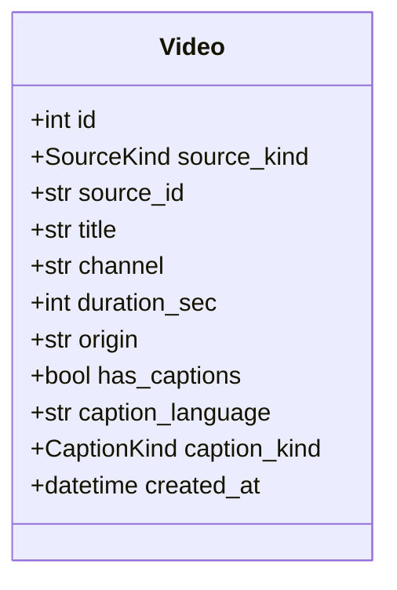

관계
- `Video` 1 — 0..* `AnalysisJob`
- `Video` 1 — 0..1 `Transcript` · 0..1 `Summary` · 0..* `Part` · 0..* `Chapter` · 0..3 `SuggestedQuestion` · 0..* `ChatTurn`

`source_id`는 YouTube면 영상 ID(11자), 로컬이면 파일 내용 SHA-256. unique. `origin`은 URL 또는 inbox 파일 이름. `channel` · `caption_language` · `caption_kind`는 로컬이면 null.

**`status`와 `analyzed_at`은 컬럼이 아니다.** [[VA-API-001]]의 `Video.status`(registered · in_progress · failed · analyzed)와 `analyzed_at`은 가장 최근 `AnalysisJob`에서 계산한다 — 작업이 없으면 `registered`, `running`이면 `in_progress`, `failed`면 `failed`, `done`이면 `analyzed`이고 `analyzed_at = finished_at`. [[VA-DOM-001#Video]]의 「분석완료시각」이 이 계산값이다(5장 5). `chat_turn_count`도 대화 묶음에서 센 값이다.

### 2.2 job

#### AnalysisJob 작업

테이블: [[VA-DOM-003#analysis_jobs]] · 도메인: [[VA-DOM-001#AnalysisJob]]

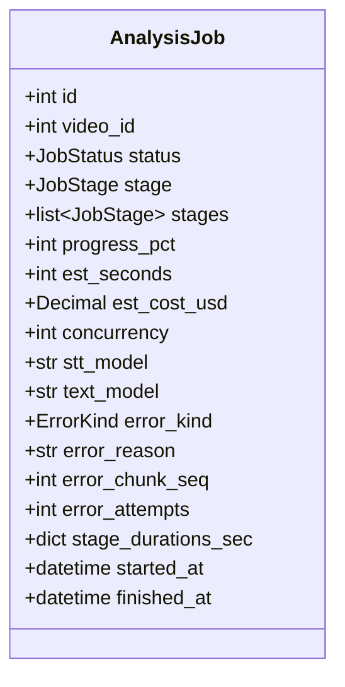

관계
- `AnalysisJob` * — 1 `Video` (video_id)
- `AnalysisJob` 1 — 0..* `AudioChunk`

`status`와 `stage`는 따로다 — 실패한 단계를 알려면 둘 다 있어야 한다([[VA-API-001]] 5장 2). `stages`는 시작할 때 출처로 정한 단계 목록이고 순서가 곧 파이프라인 순서다. `error_*` 넷은 `status = failed`일 때만 값이 있고, 재시도가 `running`으로 돌리면 비운다. `stage_durations_sec`는 완료한 단계마다 걸린 시간(초)이고 키는 `JobStage` 값이다. `stt_model` · `text_model`은 시작 때 설정에서 복사한다 — 돌고 있는 작업은 설정을 바꿔도 끝까지 같은 모델을 쓴다([[VA-API-001#PUT/api/settings/models]]).

재시도는 **같은 작업**을 이어간다 — 새 작업을 만들지 않는다([[VA-UC-001#UC-S3]] 3a3). 영상 하나에 `running`인 작업은 하나이고, 프로세스 전체에서도 하나다([[VA-INFRA-001]] 3절).

#### AudioChunk 조각

테이블: [[VA-DOM-003#audio_chunks]] · 도메인: [[VA-DOM-001#AudioChunk]]

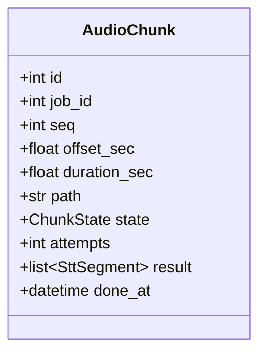

관계
- `AudioChunk` * — 1 `AnalysisJob` (job_id)

`seq`는 1부터. `path`는 `data/tmp/{video_id}/{seq}.mp3`이고 받아쓰기가 끝나 파일을 지우면 null. `state`는 waiting · in_flight · done · failed 넷([[VA-UI-002#UI-3]] 조각 격자). `attempts`는 그 조각을 보낸 횟수 — 자동 재시도 상한(설정값, 첫 값 3)에 닿으면 `failed`. `done_at`으로 조각당 평균 시간을 재서 남은 시간을 계산한다([[VA-UC-001#UC-S6]] 2번). **`result`는 그 조각의 받아쓰기 결과**(`SttSegment` 목록, 오프셋을 더하기 전)다. 조각이 `done`이 될 때 저장하고, 스크립트를 만든 뒤에도 남긴다 — 실패 뒤 재시도가 `done` 조각을 다시 보내지 않으려면 결과가 행에 있어야 한다([[VA-UC-001#UC-H0]] 최소 보장 「이미 받아쓴 조각은 버려지지 않는다」, 시퀀스 되먹임). 작업이 끝나도 행은 남긴다([[VA-DOM-001]] 5장 2).

### 2.3 analysis

#### Transcript 스크립트

테이블: [[VA-DOM-003#transcripts]] · 도메인: [[VA-DOM-001#Transcript]]

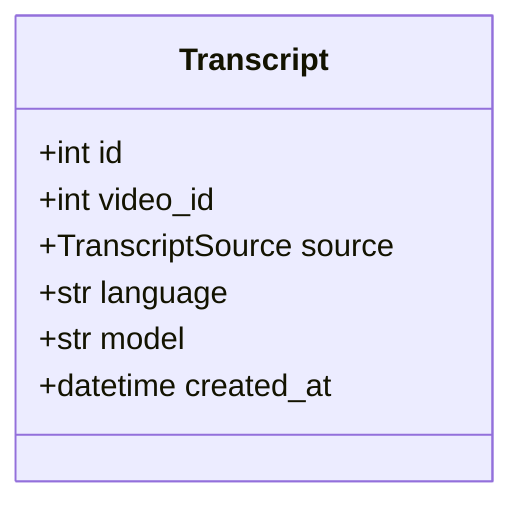

관계
- `Transcript` 1 — 1 `Video`
- `Transcript` 1 — 1..* `Segment`

`source`는 caption_manual · caption_auto · stt 셋 — 화면이 수동 자막과 자동 자막을 구분해 보인다([[VA-UI-002#UI-4]] 8.1). `model`은 stt일 때만.

#### Segment 구간

테이블: [[VA-DOM-003#segments]] · 도메인: [[VA-DOM-001#Segment]]

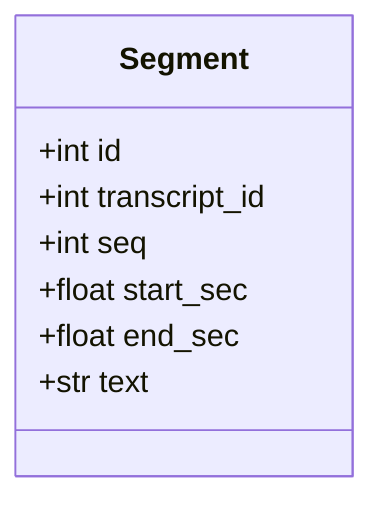

관계
- `Segment` * — 1 `Transcript`

3시간 영상은 구간이 수천 개다. [[VA-API-001#GET/api/videos/{id}/result]]가 한 번에 준다.

#### Summary 요약

테이블: [[VA-DOM-003#summaries]] · 도메인: [[VA-DOM-001#Summary]]

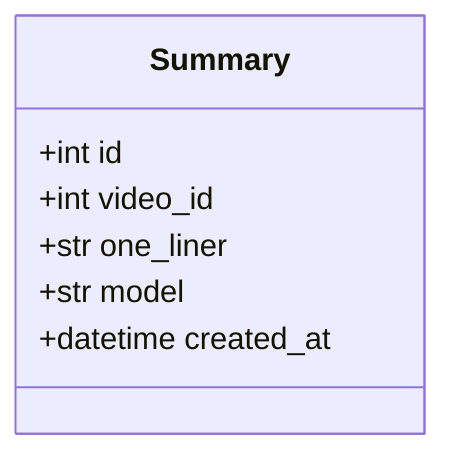

관계
- `Summary` 1 — 1 `Video`
- `Summary` 1 — 5..10 `Insight`

#### Insight 인사이트

테이블: [[VA-DOM-003#insights]] · 도메인: [[VA-DOM-001#Insight]]

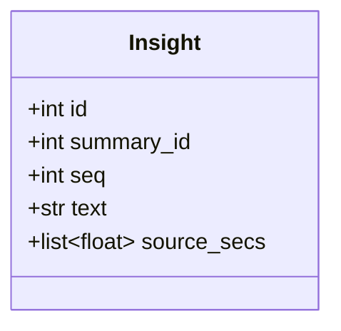

관계
- `Insight` * — 1 `Summary`

`source_secs`는 초 단위 시각 목록(하나 이상). 구간 FK가 아닌 이유는 [[VA-DOM-001]] 5장 1.

#### Part 파트

테이블: [[VA-DOM-003#parts]] · 도메인: [[VA-DOM-001#Part]]

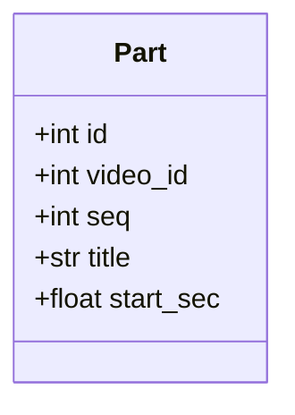

관계
- `Part` * — 1 `Video`
- `Part` 1 — 1..* `Chapter`

60분을 넘는 영상에만 있다. 응답의 `end_sec`(다음 파트 시작 또는 영상 길이)와 `chapter_count`는 읽을 때 계산한다.

#### Chapter 챕터

테이블: [[VA-DOM-003#chapters]] · 도메인: [[VA-DOM-001#Chapter]]

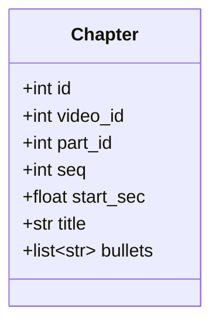

관계
- `Chapter` * — 1 `Video`
- `Chapter` * — 0..1 `Part` (파트가 없으면 null)

#### SuggestedQuestion 추천 질문

테이블: [[VA-DOM-003#suggested_questions]] · 도메인: [[VA-DOM-001#SuggestedQuestion]]

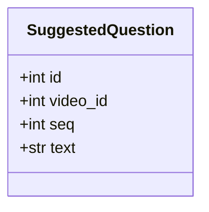

관계
- `SuggestedQuestion` * — 1 `Video`

영상마다 3개. 누르면 대화 턴이 되고 추천 질문 자체는 바뀌지 않는다([[VA-DOM-001#SuggestedQuestion]]).

### 2.4 chat

#### ChatTurn 대화 턴

테이블: [[VA-DOM-003#chat_turns]] · 도메인: [[VA-DOM-001#ChatTurn]]

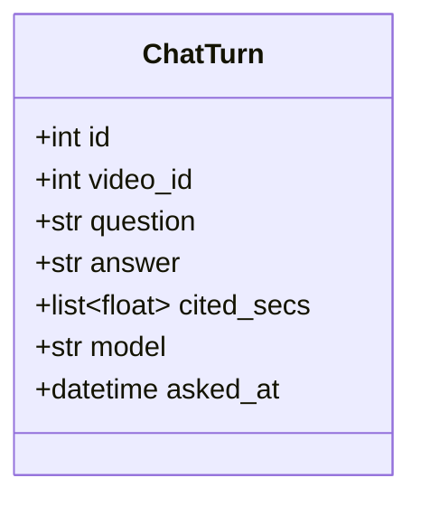

관계
- `ChatTurn` * — 1 `Video`

`cited_secs`가 빈 목록이면 근거 없는 답("이 영상에서는 다루지 않습니다")이다. 답을 받지 못한 질문은 저장하지 않는다([[VA-API-001#POST/api/videos/{id}/chat]]).

### 2.5 열거형

| 이름 | 값 | 쓰는 곳 |
|---|---|---|
| `SourceKind` | `youtube` · `local` | Video |
| `CaptionKind` | `manual` · `auto` | Video |
| `JobStatus` | `running` · `failed` · `done` | AnalysisJob |
| `JobStage` | `pending` · `download` · `extract` · `transcribe` · `summarize` · `chapter` · `suggest` | AnalysisJob. `download`는 자막이 있으면 자막 가져오기, 없으면 음성 내려받기([[VA-UI-002#UI-3]] 규칙) |
| `ChunkState` | `waiting` · `in_flight` · `done` · `failed` | AudioChunk |
| `ErrorKind` | `network` · `openai` · `youtube` · `ffmpeg` · `disk` · `unknown` | AnalysisJob.error_kind |
| `TranscriptSource` | `caption_manual` · `caption_auto` · `stt` | Transcript |
| `KeyState` | `ok` · `missing` · `invalid` | SettingsService (DB 없음) |
| `ReasonKind` | `format` · `auth` · `quota` · `network` | SettingsService |

값은 [[VA-API-001]] 4장의 enum 스키마와 같다. DB에는 enum 타입이 아니라 varchar로 두고 앱이 검증한다 — 값을 더할 때 마이그레이션을 피한다.

### 2.6 응답·내부 타입 (DTO)

**API 응답 스키마([[VA-API-001]] 4장)와 같은 이름은 그것을 그대로 쓴다** — `Video` `VideoSummary` `VideoDetail` `RegisterRequest` `RegisterResponse` `Estimate` `InboxListing` `InboxFile` `Job` `JobSummary` `Chunks` `Chunk` `JobError` `Models` `Result` `Transcript` `Segment` `Summary` `Insight` `Part` `Chapter` `SuggestedQuestion` `ChatTurn` `AskRequest` `ExportRequest` `ExportPreview` `ExportResult` `Settings` `KeyStatus` `ModelOption` `KeyRequest` `ModelsRequest`. DTO와 ORM 이름이 같을 때 ORM은 코드에서 `*Row`로 부른다(`VideoRow` · `TranscriptRow`). 서비스가 밖으로 내는 것은 DTO다.

여기는 API에 나가지 않는 것만.

| 타입 | 필드 | 쓰는 곳 |
|---|---|---|
| `SourceInfo` | `source_kind` · `source_id` · `title` · `channel` · `duration_sec` · `origin` · `has_captions` · `caption_language` · `caption_kind` | YouTubeInfoPort · MediaProbePort → VideoService.register |
| `CaptionLine` | `start_sec` · `end_sec` · `text` | AudioSourcePort.captions → AnalysisService.save_transcript |
| `ChunkPlan` | `seq` · `offset_sec` · `duration_sec` · `path` | AudioSplitPort.split → JobService.plan_chunks |
| `SttSegment` | `start_sec` · `end_sec` · `text` · `language` | SttPort.transcribe → `AudioChunk.result`에 저장 → 이어 붙일 때 오프셋을 더해 CaptionLine과 같은 모양으로 |
| `SummaryDraft` | `one_liner` · `insights: list[(text, source_secs)]` | SummarizerPort.summary → AnalysisService |
| `ChapterDraft` | `parts: list[(title, start_sec)]` · `chapters: list[(part_seq, start_sec, title, bullets)]` | SummarizerPort.chapters → AnalysisService |
| `AnswerDraft` | `answer` · `cited_secs` | AnswererPort.answer → ChatService |
| `KeyCheck` | `state: KeyState` · `reason_kind: ReasonKind \| None` · `reason: str \| None` · `checked_at` | infra/openai.verify_key → SettingsService |
| `Progress` | `stage: JobStage` · `progress_pct` · `chunks_done` | pipeline → JobService.mark_stage. 화면에 나가는 `Job`은 JobService.progress가 만든다 |

타입은 여기 한 곳에만 정의한다. 엔티티는 2.1~2.4, 열거형은 2.5.

---

## 3. 의존 관계

누가 누굴 부르는지. 클래스 다이어그램이 아니라 지도다. 3.1은 입구(Boundary)에서 서비스(Control)로, 3.2는 서비스끼리와 바깥으로. 여기 없는 방향은 부르면 안 된다.

### 3.1 Boundary → Control

라우터는 클래스가 아니라 함수가 든 파일이므로 박스만 그린다. 프런트는 `api/client.ts` 한곳에서 라우터 넷을 부른다.

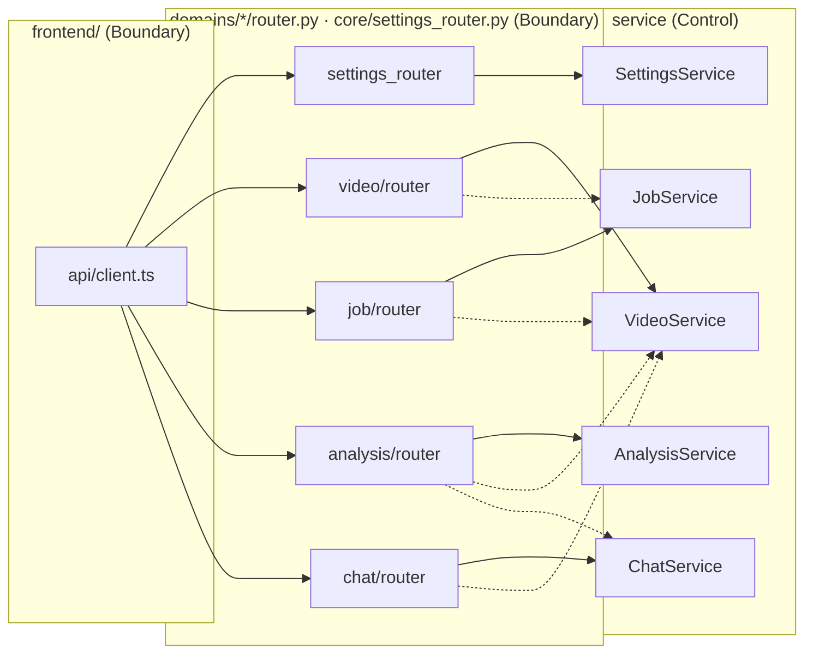

실선은 그 라우터의 묶음, 점선은 **인자를 넘기려고 한 번 더 부르는 것**이다. 판단은 없다.

| 라우터 | 점선으로 부르는 것 | 왜 |
|---|---|---|
| `video/router` | `JobService.estimate(video)` | [[VA-API-001#POST/api/videos]] 응답이 영상 + 예상치. 작업이 있으면 null을 돌려주므로 라우터에 분기가 없다 |
| `video/router` | `JobService.cancel(video_id)` | [[VA-API-001#DELETE/api/videos/{id}]] — 진행 중이면 먼저 멈춘다. 없으면 아무것도 안 한다 |
| `job/router` | `VideoService.get(video_id)` | 시작 · 재시도가 `Video` DTO를 받는다. 작업 묶음은 영상 테이블을 모른다 |
| `analysis/router` | `VideoService.get(video_id)` · `ChatService.history(video_id)` | 결과 · 내보내기가 `Video`를 받고, `with_chat`이면 대화 턴을 받는다 |
| `chat/router` | `VideoService.get(video_id)` | 질문이 `Video`를 받는다(결과 유무 · 길이). 기록 조회도 영상이 없으면 404를 내야 하므로 먼저 부른다 |

### 3.2 Control 사이와 바깥

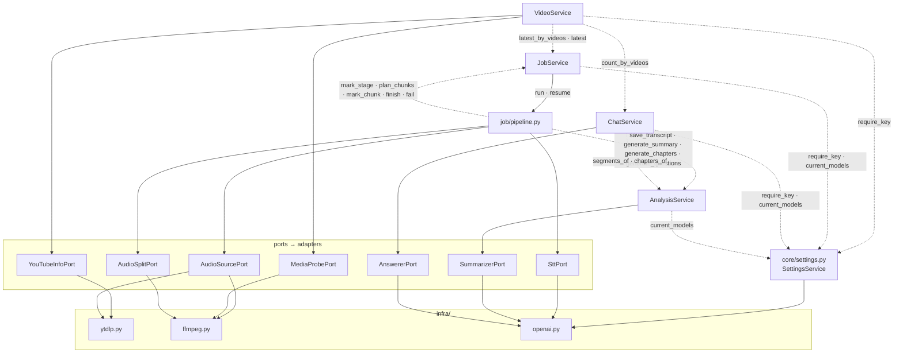

**규칙**
- 서비스끼리 직접 부르는 것은 넷이다 — `VideoService → JobService`(작업 요약 · 예상치는 라우터가), `VideoService → ChatService`(대화 수), `pipeline → AnalysisService`(단계 실행), `ChatService → AnalysisService`(답변 맥락). `AnalysisService`와 `JobService`는 다른 묶음의 서비스를 부르지 않는다. `JobService`는 영상 테이블을 모른다 — 필요한 것은 `Video` DTO로 받는다
- 순환이 없다. video → job · chat, chat → analysis, job → analysis. 반대 방향은 없다
- `SettingsService`는 `core/`라 어느 묶음이든 부를 수 있다. 하는 일은 키 확인 · 모델 이름 넷뿐이다
- 어댑터는 `infra/` 클라이언트만 부른다. 서비스는 `infra/`를 직접 부르지 않는다 — `SettingsService`만 예외로 `infra/openai.verify_key`를 부른다(포트를 둘 도메인이 없다)
- `pipeline`은 `JobService`가 백그라운드 태스크로 띄운다. `JobService`가 태스크 핸들을 들고 있어 삭제 때 취소한다(4.2)

---
## 4. 설계 클래스

3장이 지도라면 여기는 각 노드를 확대한 것이다. 묶음마다 `«service»` 컨트롤의 **메서드 시그니처**와 그 서비스가 만지는 엔티티를 한 그림에 둔다. 코딩할 때 보는 그림이다.

**읽는 법** — 시그니처는 [[VA-API-001]]의 요청·응답으로 확정했다. 반환 타입 중 `Video` · `Job` · `Result` 같은 응답 형태는 API 스키마와 같은 이름이다. `-`로 시작하는 메서드는 서비스 안에서만 쓴다. 그림 아래 표에 메서드마다 부르는 곳 · 유스케이스 · 던지는 에러를 붙였다. 에러 이름은 [[VA-API-001]] 2장의 `urn:va:` 뒤 부분이다. 그림 안 엔티티는 2장의 속성을 그대로 다시 그린 것이고 어긋나면 2장이 진실이다.

### 4.1 video

#### VideoService 영상 서비스

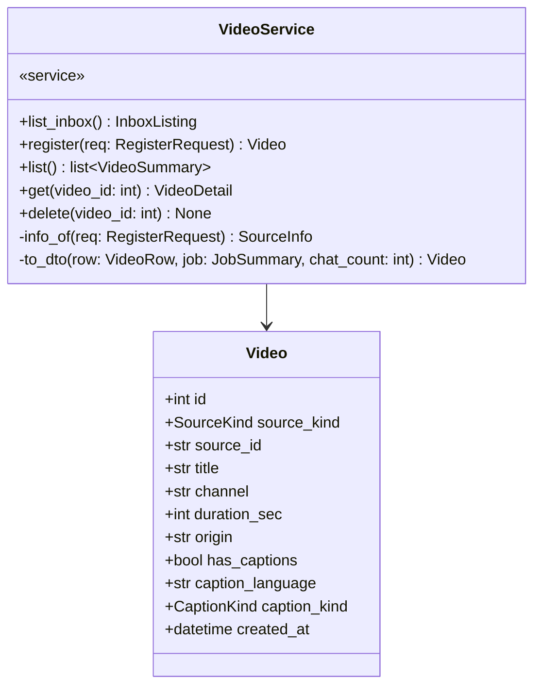

| 메서드 | 부르는 곳 | 유스케이스 | 던지는 에러 |
|---|---|---|---|
| `list_inbox` | [[VA-API-001#GET/api/inbox]] | [[VA-UC-001#UC-H2]] 1 | |
| `register` | [[VA-API-001#POST/api/videos]] | [[VA-UC-001#UC-H1]] 1~2 · [[VA-UC-001#UC-H2]] 1~2 · [[VA-UC-001#UC-S1]] · [[VA-UC-001#UC-S5]] 1 | key-missing · key-invalid · url-invalid · path-outside-inbox · unsupported-file · source-unavailable · no-audio-track · video-too-long |
| `list` | [[VA-API-001#GET/api/videos]] | [[VA-UC-001#UC-H5]] 1 | |
| `get` | [[VA-API-001#GET/api/videos/{id}]] · job · analysis · chat 라우터(인자용) | [[VA-UC-001#UC-H5]] 2~3 · [[VA-UC-001#UC-H6]] 2 | not-found |
| `delete` | [[VA-API-001#DELETE/api/videos/{id}]] | [[VA-UC-001#UC-H6]] 4 | not-found |

**규칙이 사는 곳**
- `register`: 순서는 [[VA-API-001#POST/api/videos]] 1~7번 그대로 — 키 확인(`SettingsService.require_key`) → 형식 → 정보 조회(포트) → 3시간 상한 → 중복 판정(`source_id` unique) → 생성 또는 덮어쓰기. URL 형식은 watch · youtu.be · shorts 셋. 받는 확장자는 mp4 · mkv · mov · webm · mp3 · m4a · wav. inbox 밖 경로(`..` · 절대 경로 · 하위 폴더)는 거부. 작업이 없는 기존 영상은 `SourceInfo`로 덮어쓴다
- `list`: 작업이 있는 영상만. `JobService.latest_by_videos`로 작업 요약을, `ChatService.count_by_videos`로 대화 수를 한 번에 받아(N+1 금지) `to_dto`로 합친다. 순서는 작업 시작 최근 순
- `to_dto`: `status`와 `analyzed_at`을 최근 작업에서 계산한다(2.1). 이 계산이 이 서비스에만 있다 — 라우터 · 다른 묶음은 `Video.status`를 읽기만 한다
- `delete`: 딸린 것은 FK cascade. `data/tmp/{video_id}`를 지운다. inbox 원본은 건드리지 않는다([[VA-INFRA-001#C4]]). 작업 멈춤은 라우터가 먼저 `JobService.cancel`을 불러서 한다(3.1)
- `list_inbox`: 받는 확장자만, 하위 폴더 없음, 수정 시각 최근 순. 길이는 `MediaProbePort.probe`로 파일마다 잰다 — 캐시는 7장

### 4.2 job

#### JobService 작업 서비스

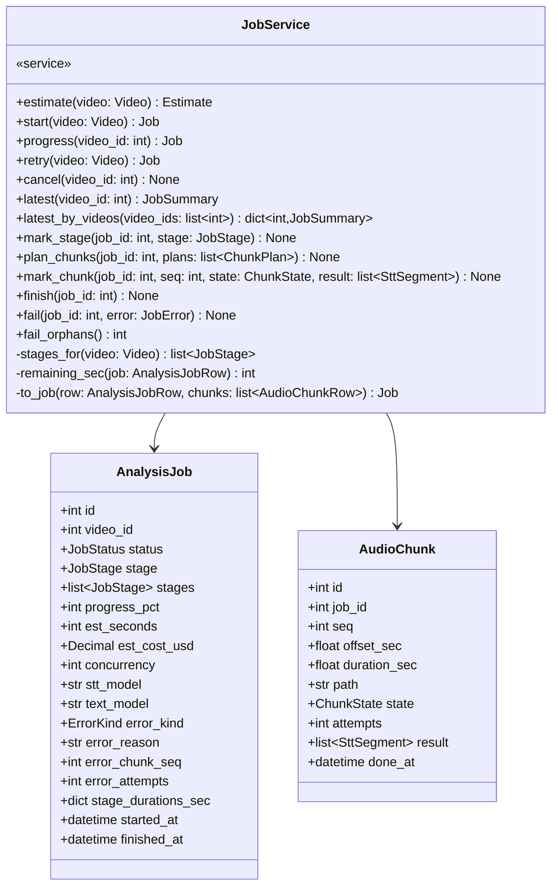

| 메서드 | 부르는 곳 | 유스케이스 | 던지는 에러 |
|---|---|---|---|
| `estimate` | video/router ([[VA-API-001#POST/api/videos]] 7번) | [[VA-UC-001#UC-S1]] 5 | |
| `start` | [[VA-API-001#POST/api/videos/{id}/job]] | [[VA-UC-001#UC-H0]] 3 | key-missing · key-invalid · job-exists · another-job-running |
| `progress` | [[VA-API-001#GET/api/videos/{id}/job]] | [[VA-UC-001#UC-S6]] | not-found(job) |
| `retry` | [[VA-API-001#POST/api/videos/{id}/job/retry]] | [[VA-UC-001#UC-S3]] 3a3 · [[VA-UC-001#UC-S6]] 1a | key-missing · key-invalid · not-found(job) · job-not-failed |
| `cancel` | video/router ([[VA-API-001#DELETE/api/videos/{id}]]) | [[VA-UC-001#UC-H6]] 4 | |
| `latest` · `latest_by_videos` | VideoService | [[VA-UC-001#UC-H5]] 1 | |
| `mark_stage` · `plan_chunks` · `mark_chunk` · `finish` · `fail` | pipeline | [[VA-UC-001#UC-S6]] 1~3 · [[VA-UC-001#UC-S3]] 2~3 | |
| `fail_orphans` | `main.py` 시작 절차 | — (5장 8) | |

**규칙이 사는 곳**
- `estimate`: 작업이 있으면 null. 자막 있음이면 `needs_stt = false` · 약 60초 · 받아쓰기 비용 0. 받아쓰기 필요면 조각 수 = 길이 ÷ 조각 길이(설정값), 동시 수 = 설정값, 받아쓰기 비용 = 분 × 단가(설정값 — `SettingsService.current_models`의 모델 단가), 예상 시간 = 조각 수 ÷ 동시 수 × 조각당 예상 시간. 텍스트 모델 비용 추정식은 7장. 화면은 이 숫자를 그대로 보인다([[VA-UI-002#UI-2]] 규칙)
- `start`: `SettingsService.require_key` → 이 영상에 작업이 있으면 `job-exists` → 프로세스 안에 `running`이 있으면 `another-job-running` → `stages_for(video)`로 단계 목록, 설정에서 모델 · 동시 수를 복사해 행 생성(`running` · `pending`) → `pipeline.run`을 백그라운드 태스크로 띄우고 핸들을 `video_id`로 보관
- `stages_for`: 자막 있는 YouTube [download, summarize, chapter, suggest] · 자막 없는 YouTube [download, transcribe, summarize, chapter, suggest] · 로컬 영상 [extract, transcribe, summarize, chapter, suggest] · 로컬 음성 [transcribe, summarize, chapter, suggest]([[VA-UC-001#UC-S2]], [[VA-UC-001#UC-H2]] 2b)
- `retry`: `status`가 `failed`가 아니면 `job-not-failed`. `error_*`를 비우고 `running`으로 되돌린 뒤 `pipeline.resume`을 띄운다 — 같은 행, 같은 `id`
- `cancel`: 태스크 핸들이 있으면 취소하고 기다린다. 행은 지우지 않는다(cascade가 지운다). 없으면 아무것도 안 한다
- `progress` · `to_job`: `remaining_sec` = 받아쓰기 단계면 미완료 조각 수 × 지금까지 조각당 평균(`done_at` 차이), 다른 단계는 null(7장). `chunks.next_seq`는 `done`이 아닌 첫 조각. `Chunks`의 집계(done · in_flight · failed · waiting)는 조각 행에서 센다. `progress_pct`는 파이프라인이 단계 가중치로 갱신한 값을 그대로
- `mark_chunk`: `in_flight`로 바꿀 때 `attempts`를 1 올린다. `done`으로 바꿀 때 `done_at` · `result`를 저장하고 `progress_pct`를 완료 조각 비율로 갱신한다. `waiting`(재시도 대기) · `failed`는 상태만 바꾼다
- `fail_orphans`: 시작 때 `running`인 작업을 `failed`(kind `unknown`, reason '서버가 다시 시작됨')로, 그 작업의 `in_flight` 조각을 `waiting`으로 돌린다. 핸들이 없는 작업은 돌지 않는데 화면에는 도는 것처럼 보이기 때문이다(5장 8)
- 영상 하나에 `running` 하나, 프로세스 전체에도 하나 — 동시 분석 하나([[VA-INFRA-001]] 3절). 대기열은 7장

**파이프라인 (`job/pipeline.py`)** — 클래스가 아니라 함수 모듈이다. 항목으로 두지 않고 여기 적는다.

```
run(job_id: int, video: Video) -> None          start가 띄운다. stages 첫 단계부터
resume(job_id: int, video: Video) -> None       retry가 띄운다. 행의 stage부터. transcribe면 done이 아닌 조각만 보내고 done 조각은 result를 쓴다

단계마다:
  mark_stage(job_id, stage)                     시작 시각 기록 → 끝나면 stage_durations_sec에 걸린 시간
  download   자막 있음: AudioSourcePort.captions → AnalysisService.save_transcript(caption_manual|caption_auto)
             자막 없음: AudioSourcePort.download_audio → data/tmp/{video_id}/audio
  extract    AudioSourcePort.extract_audio (로컬 영상 → mp3 64kbps 모노). 로컬 음성은 그대로
  transcribe AudioSplitPort.split → plan_chunks · done이 아닌 조각을 동시 수만큼 병렬로 SttPort.transcribe
             성공하면 mark_chunk(done, result) · 조각 파일 삭제
             조각마다 attempts ≤ 상한(3)까지 자동 재시도(waiting으로 되돌려 다시), 넘으면 mark_chunk(failed)
             → 돌고 있던 다른 조각이 끝나기를 기다린 뒤 fail (완료 수와 다음 조각 번호가 화면 규칙과 맞도록)
             전부 done이면 조각 행의 result를 순서대로 오프셋을 더해 이어 붙여 AnalysisService.save_transcript(stt)
  summarize  AnalysisService.generate_summary(video)
  chapter    AnalysisService.generate_chapters(video)
  suggest    AnalysisService.generate_questions(video) → finish(job_id) → data/tmp/{video_id} 삭제

실패:  어느 단계든 예외 → fail(job_id, JobError(kind, reason, chunk_seq, attempts)). 완료한 조각 · 저장된 스크립트는 그대로
취소:  CancelledError → 조각 파일은 두고 즉시 끝난다. 행 삭제는 cascade
```

단계 실패는 HTTP 에러가 아니다 — `Job.error`로 나간다([[VA-API-001]] 2장). `ErrorKind`는 예외 종류로 정한다: 네트워크 예외 → `network`, OpenAI SDK 예외 → `openai`, yt-dlp 실패 → `youtube`, ffmpeg 종료 코드 → `ffmpeg`, 디스크 부족 → `disk`, 그 밖 → `unknown`. 병렬 수 · 조각 길이 · 재시도 상한은 `core/config.py` 설정값이고 첫 값은 MINISPEC에서 정한다([[VA-INFRA-001]] 9절).

### 4.3 analysis

#### AnalysisService 결과 서비스

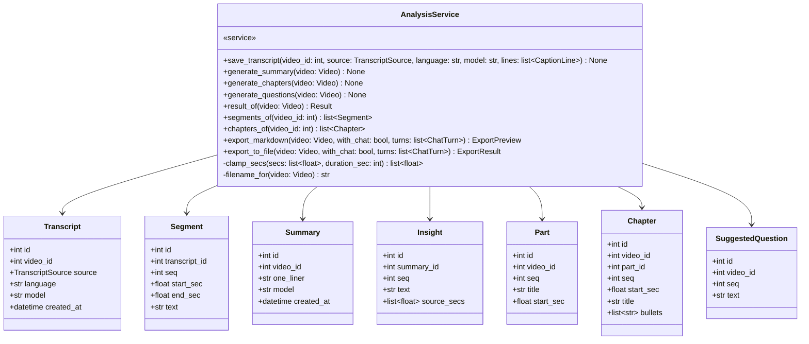

| 메서드 | 부르는 곳 | 유스케이스 | 던지는 에러 |
|---|---|---|---|
| `save_transcript` | pipeline (download · transcribe) | [[VA-UC-001#UC-S2]] 2 · [[VA-UC-001#UC-S3]] 4~5 | |
| `generate_summary` · `generate_chapters` · `generate_questions` | pipeline | [[VA-UC-001#UC-S4]] | (예외는 pipeline이 `fail`로 접는다) |
| `result_of` | [[VA-API-001#GET/api/videos/{id}/result]] | [[VA-UC-001#UC-H3]] · [[VA-UC-001#UC-H5]] 3 | result-not-ready |
| `segments_of` · `chapters_of` | ChatService | [[VA-UC-001#UC-H4]] 2, 3b | |
| `export_markdown` | [[VA-API-001#GET/api/videos/{id}/export]] | [[VA-UC-001#UC-H7]] 1~2, 2a, 2b | result-not-ready |
| `export_to_file` | [[VA-API-001#POST/api/videos/{id}/export]] | [[VA-UC-001#UC-H7]] 3 | result-not-ready · export-failed |

**규칙이 사는 곳**
- `save_transcript`: Transcript + Segment 일괄 저장. 기존 것은 교체(1:1 유지, [[VA-DOM-001]] 6장 첫 항목). `seq`는 1부터 시각순
- `generate_summary`가 먼저, `generate_chapters`가 다음이다 — 단계 순서(핵심 요약 → 챕터 → 추천 질문)는 [[VA-PRD-001#R8]] · [[VA-DOM-001#AnalysisJob]] · [[VA-UI-002#UI-3]]이 같고 실행 순서도 그대로다. [[VA-UC-001#UC-S4]] 2~3번의 「챕터를 먼저」와 다르다(5장 10)
- `generate_chapters`: 챕터 수 목표 = 길이(분) ÷ 6. 스크립트가 토큰 상한(설정값)을 넘으면 시간 구간으로 나눠 구간별로 만든 뒤 합친다([[VA-UC-001#UC-S4]] 1a). 60분을 넘으면 `ChapterDraft.parts`로 파트를 만들고 챕터에 `part_id`를 붙인다(2a)
- `generate_summary`: 인사이트 수 = 60분 이하 5~8, 초과 10까지([[VA-PRD-001#R4]]). 스크립트가 토큰 상한을 넘으면 시간 구간별 중간 요약을 먼저 만들고 그것을 재료로 한 줄 요약과 인사이트를 만든다 — 챕터에 기대지 않는다. `clamp_secs`로 시각이 `[0, duration]` 밖이면 가장 가까운 구간 시각으로 보정([[VA-UC-001#UC-S4]] 5a). 언어는 한국어
- `generate_questions`: 3개. 스크립트로 답할 수 있는 것만 — 프롬프트가 정한다([[VA-PRD-001#R9]])
- `result_of`: Transcript가 없으면 `result-not-ready`(`video_status` = `video.status`). `Part.end_sec` = 다음 파트 시작 또는 `duration_sec`, `chapter_count`는 세서 넣는다. `models`는 Transcript.model과 Summary.model
- `export_markdown` · `export_to_file`: `export.py`의 순수 함수가 [[VA-API-001#GET/api/videos/{id}/export]]의 순서로 만든다. 시각은 영상 길이로 표기가 정해진다(60분 미만 `mm:ss`, 이상 `h:mm:ss`, [[VA-UI-001#UI-4]]). YouTube면 `https://youtu.be/{source_id}?t={초}` 링크, 로컬은 시각만. 파일은 `data/export/{filename}.md`에 덮어쓴다. 파일 이름 규칙은 7장
- 이 서비스는 작업 묶음을 모른다. 파이프라인이 부르는 순서는 파이프라인의 것이다

### 4.4 chat

#### ChatService 대화 서비스

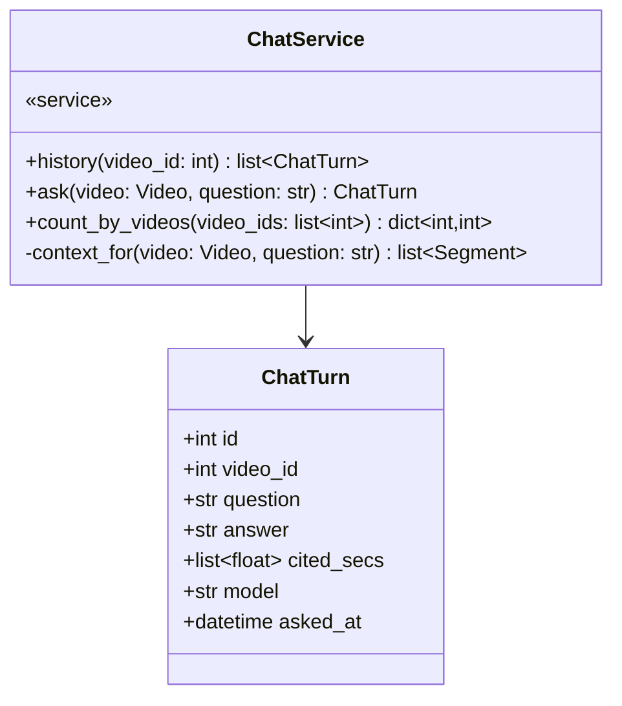

| 메서드 | 부르는 곳 | 유스케이스 | 던지는 에러 |
|---|---|---|---|
| `history` | [[VA-API-001#GET/api/videos/{id}/chat]] · analysis/router(내보내기 `with_chat`) | [[VA-UC-001#UC-H5]] 3 · [[VA-UC-001#UC-H7]] 2b | |
| `ask` | [[VA-API-001#POST/api/videos/{id}/chat]] | [[VA-UC-001#UC-H4]] | result-not-ready · key-missing · key-invalid · validation · llm-unavailable |
| `count_by_videos` | VideoService | [[VA-UC-001#UC-H5]] 1 | |

**규칙이 사는 곳**
- `ask`: 순서는 [[VA-API-001#POST/api/videos/{id}/chat]] 1~5번 — `video.status`가 `analyzed`가 아니면 `result-not-ready` → `require_key` → 빈 질문 `validation` → `context_for` → `AnswererPort.answer` → 저장. 실패하면 **저장하지 않는다**
- `context_for`: `AnalysisService.segments_of` 전부 + 최근 턴 10개. 구간 텍스트가 토큰 상한(설정값)을 넘으면 `chapters_of`로 질문과 관련된 챕터를 고르고 그 시각 범위의 구간만 넣는다([[VA-UC-001#UC-H4]] 3b). 챕터를 고르는 방법은 MINISPEC
- 근거 없는 답이면 `cited_secs = []`([[VA-UC-001#UC-H4]] 3a). `model`은 `SettingsService.current_models().text`
- 결과를 읽기만 한다. 스크립트 · 챕터를 바꾸지 않는다([[VA-DOM-001]] 4장)

### 4.5 core — 설정

#### SettingsService 설정 서비스

DB가 없는 서비스다. 키는 `.env`(또는 7장에서 정할 곳), 모델 선택은 같은 곳에서 읽고 쓴다.

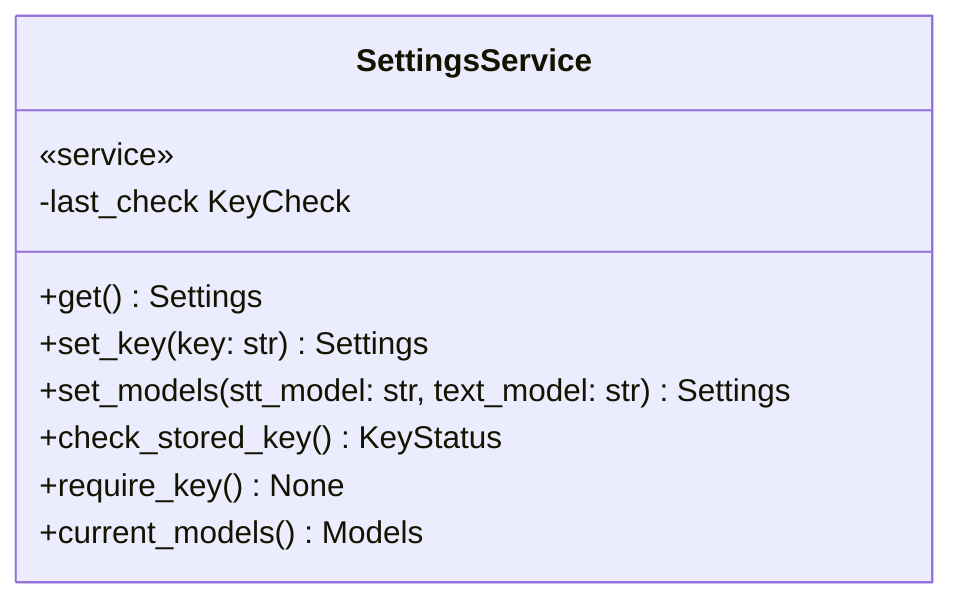

| 메서드 | 부르는 곳 | 유스케이스 | 던지는 에러 |
|---|---|---|---|
| `get` | [[VA-API-001#GET/api/settings]] | [[VA-UC-001#UC-H8]] 1 | |
| `set_key` | [[VA-API-001#POST/api/settings/key]] | [[VA-UC-001#UC-H8]] 2~4, 3a | validation · key-rejected · llm-unavailable |
| `set_models` | [[VA-API-001#PUT/api/settings/models]] | [[VA-UC-001#UC-H8]] 트리거 | validation |
| `check_stored_key` | main(시작) · VideoService.register(분석 버튼) | [[VA-UC-001#UC-H8]] 1a | |
| `require_key` | VideoService.register · JobService.start · retry · ChatService.ask | [[VA-UC-001#UC-H0]] 사전조건 | key-missing · key-invalid |
| `current_models` | JobService · AnalysisService · ChatService | — | |

**규칙이 사는 곳**
- `check_stored_key`: `infra/openai.verify_key`로 가벼운 요청(모델 목록)을 보내고 `last_check`에 결과와 시각을 둔다. 부르는 때는 셋뿐 — 서버 시작, 분석 버튼, 키 저장([[VA-UI-002#UI-5]] 규칙). `get`은 `last_check`를 돌려줄 뿐 다시 확인하지 않는다
- `require_key`: `last_check.state`가 `missing`이면 `key-missing`, `invalid`면 `key-invalid`(reason_kind · reason · checked_at). 읽기 요청은 부르지 않는다 — 키 없이도 읽기는 전부 된다([[VA-API-001]] 1장)
- `set_key`: 확인이 통과해야 저장한다. 실패(`format` · `auth` · `quota`)는 `key-rejected`, 네트워크는 `llm-unavailable`. 둘 다 저장하지 않고 `last_check`도 바꾸지 않는다. 통과하면 저장하고 `last_check`를 `ok`로
- `set_models`: 값은 `model_options`(설정값)에 있는 id만. 받아쓰기 목록은 구간 시각을 주는 모델만([[VA-INFRA-001#C3]])
- 키 전체는 어떤 응답에도 없다. `masked`는 앞 3자 · 끝 4자

### 4.6 포트 — 외부 연동 인터페이스

포트는 항목으로 두지 않는다 — 시그니처가 MINISPEC에서 함수 단위로 정의된다. 어댑터는 Protocol을 구현하는 클래스 하나씩이고 테스트는 가짜 어댑터로 바꿔 끼운다. 두 번째 구현체(예: 로컬 whisper)는 실제로 생길 때 만든다.

```
video/ports.py
  YouTubeInfoPort.info(url: str) -> SourceInfo                 youtube_info.py → infra/ytdlp. 비공개·삭제·네트워크 → source-unavailable
  MediaProbePort.probe(path: str) -> tuple[int, bool]          media_probe.py → infra/ffmpeg. (duration_sec, has_audio). 못 열면 unsupported-file

job/ports.py
  AudioSourcePort.captions(video_id: str) -> tuple[list[CaptionLine], str, CaptionKind] | None
                                                               audio_source.py → infra/ytdlp. 수동 자막 우선, 없으면 자동, 둘 다 없으면 None
  AudioSourcePort.download_audio(video_id: str, dest: str) -> str
  AudioSourcePort.extract_audio(src: str, dest: str) -> str    → infra/ffmpeg. mp3 64kbps 모노
  AudioSplitPort.split(path: str, dest_dir: str) -> list[ChunkPlan]
                                                               audio_split.py → infra/ffmpeg. 무음 근처에서 자른다. 조각 길이는 설정값
  SttPort.transcribe(path: str, model: str) -> list[SttSegment]
                                                               stt_openai.py → infra/openai. verbose_json · segment 시각 (INFRA C3)

analysis/ports.py
  SummarizerPort.chapters(segments: list[Segment], duration_sec: int, model: str) -> ChapterDraft
  SummarizerPort.summary(segments: list[Segment], duration_sec: int, model: str) -> SummaryDraft
  SummarizerPort.questions(segments: list[Segment], model: str) -> list[str]
                                                               summarizer_openai.py → infra/openai. 프롬프트는 어댑터 안

chat/ports.py
  AnswererPort.answer(question: str, context: list[Segment], history: list[ChatTurn], model: str) -> AnswerDraft
                                                               answerer_openai.py → infra/openai
```

### 4.7 infra — 공용 클라이언트

묶음 밖. 외부 프로그램 · API를 감싸는 얇은 층이고 도메인 타입을 모른다. 어댑터만 부른다. 시그니처는 MINISPEC에서 확정.

```
ytdlp.info(url) -> dict                 제목·채널·길이·자막 목록. 영상 ID 추출도 여기
ytdlp.captions(video_id, lang, kind) -> str          자막 원문(vtt)
ytdlp.download_audio(video_id, dest) -> str
ffmpeg.probe(path) -> dict              길이·스트림
ffmpeg.extract_audio(src, dest) -> str
ffmpeg.silences(path) -> list[float]    무음 구간 시각
ffmpeg.cut(path, start, end, dest) -> str
openai.client(key) -> Client
openai.verify_key(key) -> KeyCheck      모델 목록 조회 한 번
openai.transcribe(client, path, model) -> dict
openai.chat(client, model, messages) -> str
```

**규칙** — 키는 `SettingsService`가 준다. 어댑터는 키를 읽지 않는다. 밖으로 나가는 것은 이 파일 셋을 지나는 것뿐이다([[VA-INFRA-001#C9]]) — yt-dlp에 영상 ID, OpenAI에 음성 조각 · 스크립트 텍스트 · 질문과 앞선 대화 · 키 확인.

---

## 5. 판단이 필요한 지점

**1. 설정을 어디에 두나 — 결정: `core/settings.py` + `core/settings_router.py`. 도메인 묶음을 만들지 않는다.**
[[VA-DOM-001]] 1장이 설정 · API 키를 개념이 아니라 인프라로 판정했고 DB가 없다. 묶음을 만들면 `models.py` · `crud.py`가 빈 다섯째 폴더가 생기고 도메인 모델의 경계 표에 개념 없는 묶음을 넣어야 한다. 라우터가 `core/`에 있는 것이 더 작은 벗어남이다. 키 저장 위치가 DB로 정해지면(7장) 도메인 모델부터 고친다.

**2. 파이프라인 위치 — 결정: `job/pipeline.py`. 묶음 밖 조율 모듈을 두지 않는다.**
세 묶음을 부르지만 상태를 바꾸는 주체는 작업 하나다. 함수 모듈 하나이고 `JobService`만 띄운다. 조율 모듈(pipeline · queries)을 묶음 밖에 두는 것은 입구가 둘이거나 조율이 여럿일 때다 — 여기는 하나다.

**3. 라우터가 서비스 둘을 잇는다 — 결정: 인자 전달만이면 허용. 판단이 생기면 그때 조율 모듈.**
영상 응답이 작업 요약과 대화 수를 품는다는 것은 API가 정한 모양이다([[VA-API-001]] 5장 10). 이것을 서비스 안에서 풀면 `VideoService → JobService`, `JobService → VideoService`가 서로를 불러 순환이 생긴다. 라우터가 `VideoService.get`의 결과를 `JobService.start`에 넘기는 것은 판단이 아니라 순서다. 3.1 표에 다섯 곳을 전부 적었고, 여기 없는 조합은 만들지 않는다.

**4. `Video.status`는 컬럼이 아니라 계산값 — 결정: 가장 최근 작업에서 `VideoService.to_dto`가 만든다.**
컬럼으로 두면 파이프라인이 끝날 때 작업 묶음이 영상 행을 고쳐야 한다(job → video 쓰기). 계산하면 상태가 한 곳(작업)에만 있고 어긋날 수 없다. `analyzed_at`도 같다 — `AnalysisJob.finished_at`이다.

**5. 도메인 모델과 다른 곳 — [[VA-DOM-001#Video]]의 「분석완료시각」이 컬럼이 아니고, 「작업」의 단계가 상태와 단계 둘로 나뉜다.** 둘 다 [[VA-API-001]] 5장 1 · 2에서 온 결정이다. 도메인 모델 갱신 요청을 7장에 둔다.

**6. 조각의 완료 여부는 bool이 아니라 상태 넷 — 결정: `ChunkState`.**
화면이 조각 격자에 완료 · 받아쓰는 중 · 실패 · 대기를 그린다([[VA-UI-002#UI-3]]). `done` 하나로는 받아쓰는 중과 대기를 못 가른다. `attempts`도 같은 이유로 행에 둔다 — 실패 알림이 「몇 번 다시 보냈는지」를 말한다. `result`도 행에 둔다 — 메모리에만 있으면 실패 뒤 재시도가 이어지지 않는다(시퀀스 되먹임).

**7. 화면 폴더 이름 — 결정: `screens/`.** Next.js가 `pages/`를 예약한다(1장). 역할은 기본형의 `pages/`와 같다.

**8. 백그라운드 태스크는 프로세스 안 asyncio — 결정: `JobService`가 핸들을 들고, 삭제 때 취소한다.**
[[VA-INFRA-001]] 3절(큐 없음). 서버가 죽으면 핸들이 사라지므로 시작 때 `running`인 행을 `failed`(kind `unknown`, reason '서버가 다시 시작됨')로 되돌려 다시 시도할 수 있게 한다 — `main.py`가 한다.

**9. Part의 끝 시각은 저장하지 않는다 — 결정: 읽을 때 다음 파트 시작으로 계산.** 챕터의 끝을 두지 않는 것과 같은 이유다([[VA-DOM-001#Chapter]]).

**10. 요약과 챕터의 실행 순서 — 결정: 핵심 요약 → 챕터 → 추천 질문. 단계 표시와 같다.**
[[VA-UC-001#UC-S4]]는 챕터를 먼저 만들고 긴 영상의 요약을 챕터 요약으로 만든다고 했지만, [[VA-PRD-001#R8]]의 단계 순서와 화면([[VA-UI-002#UI-3]])은 핵심 요약이 먼저다. 표시 순서와 실행 순서가 다르면 진행률과 「지금 하는 일」이 어긋난다. 긴 영상의 요약은 챕터 대신 시간 구간별 중간 요약을 재료로 쓴다 — 결과는 같고 단계 의존이 없다. 유스케이스 갱신 요청을 7장에 둔다.

---

## 6. 부록: FastAPI·SQLAlchemy 구현 형태

본문은 언어 중립이다. 이 절만 스택에 묶인다.

**모델**: SQLAlchemy 2.x declarative, async. 열거형은 `str` 컬럼 + 파이썬 `Enum`으로 검증. 목록 · dict 속성(`source_secs` · `bullets` · `cited_secs` · `stages` · `stage_durations_sec`)은 JSONB — ERD·DD에서 확정.

```python
# domains/video/models.py
class VideoRow(Base):
    __tablename__ = "videos"
    id: Mapped[int] = mapped_column(primary_key=True)
    source_id: Mapped[str] = mapped_column(String(64), unique=True)
    ...
```

**세션**: 요청마다 하나(`core/db.py`). 파이프라인 태스크는 단계마다 짧은 세션을 열고 닫는다 — 십여 분 도는 태스크가 세션 하나를 잡고 있지 않게. 트랜잭션 경계는 서비스 메서드 하나다.

**에러**: `core/errors.py`에 problem+json 종류마다 예외 클래스 하나. 라우터는 잡지 않고 앱 수준 핸들러가 `application/problem+json`으로 바꾼다. 포괄 핸들러가 나머지를 `urn:va:internal`로.

**백그라운드**: `asyncio.create_task(pipeline.run(...))`. 핸들은 `JobService`의 `dict[int, Task]`(video_id → Task). 프로세스 하나 전제.

**외부 프로그램**: yt-dlp · ffmpeg는 `asyncio.create_subprocess_exec`. OpenAI는 공식 SDK의 async 클라이언트.

**마이그레이션**: Alembic, 리비전 하나 = ERD 변경 하나. 열거형 값 추가는 마이그레이션 없이 앱 상수만 바꾼다.

**프런트**: Next.js App Router, `output: 'standalone'`. `api/client.ts`는 fetch를 감싸고 problem+json을 예외로 바꾼다. 화면 상태는 서버 값을 그대로 쓴다 — 계산하지 않는다([[VA-API-001]] 1장).

---

## 7. 미결사항

- [ ] 웹에서 받은 키의 저장 위치 — `.env` 쓰기 마운트 · DB · `data/settings.json`. DB면 도메인 모델부터 고치고 설정이 묶음이 된다(5장 1). [[VA-INFRA-001#C6]] 갱신 요청, [[VA-UI-001]] 8장 · [[VA-API-001]] 6장과 같은 항목
- [ ] 유스케이스 갱신 요청 — [[VA-UC-001#UC-S4]] 2~3번과 1a2의 「챕터 먼저」를 「핵심 요약 → 챕터」로, 긴 영상의 요약 재료를 「구간별 중간 요약」으로(5장 10)
- [ ] 도메인 모델 갱신 요청 — [[VA-DOM-001#Video]]에 작업 없는 영상(`registered`)과 실패 구분, 「분석완료시각」이 계산값이라는 것 · [[VA-DOM-001#AnalysisJob]]에 상태와 단계 분리(5장 4 · 5)
- [x] ERD·DD가 생기면 2장 각 항목에 테이블 참조를 더한다 — 반영. JSONB 속성 다섯은 [[VA-DOM-003]] 3장에서 확정
- [ ] 텍스트 모델 비용 추정식(`JobService.estimate`) — MINISPEC. [[VA-API-001]] 6장과 같은 항목
- [ ] 조각이 없는 단계의 남은 시간 — 지금 null. 사전 안내 예상 시간 − 지난 시간으로 할지 MINISPEC
- [ ] `progress_pct`의 단계 가중치 — 받아쓰기가 대부분이라 조각 비율을 그대로 쓸지, 단계마다 고정 몫을 둘지 MINISPEC
- [ ] inbox 길이 캐시 — 파일마다 ffprobe. 수정 시각 기준으로 메모리에 둘지 MINISPEC
- [ ] 내보내기 파일 이름 규칙(`AnalysisService.filename_for`) — MINISPEC
- [ ] 동시 분석 대기열 — 지금은 `another-job-running`으로 막는다. 사용자 결정([[VA-UI-001]] 8장)
- [ ] 관련 챕터 고르기(`ChatService.context_for`) — 챕터 제목 매칭 vs 간단 임베딩. 첫 버전은 제목 매칭([[VA-INFRA-001]] 9절)
- [ ] `shared/`가 없다 — 시각 표기 함수를 화면 쪽 채팅 · 목록도 쓰게 되면 그때 옮긴다(프런트는 `components/TimeChip`이 따로 가진다)
