# 클래스 명세

---

## 0. 이 문서가 다루는 것

[[VA-DOM-001]]의 개념을 **코드 구조**로 옮긴다. 폴더 배치, 엔티티 클래스, 서비스의 메서드 시그니처와 규칙이 사는 곳. 테이블·컬럼은 다음 문서(ERD·DD)가 맡는다.

| 종류 | 역할 | 우리 구조 | 정의하는 곳 |
|---|---|---|---|
| Entity | 데이터를 갖는 것 | `domains/*/models.py` | 이 문서 2장 + ERD·DD |
| Control | 유스케이스 흐름을 조율하는 것 | `domains/*/service.py` · `domains/job/pipeline.py` · `core/settings.py` | 이 문서 3장(의존) · 4장(시그니처) |
| Boundary | 바깥과 만나는 것 | `domains/*/router.py`(안쪽 입구) · `domains/*/adapters/` + `infra/`(바깥 출구) · `frontend/` | [[VA-API-001]] · [[VA-UI-002]]. 3장에서 연결만 |

메서드 시그니처는 [[VA-API-001]]이 정한 요청·응답으로 확정했다. 반환 타입 중 `Video` · `Job` · `Result` 같은 응답 형태는 API 스키마와 같은 이름이다. 시퀀스(9단계)와 MINISPEC(10단계)이 되먹이는 것은 그때 고친다.

**전제 (앞 단계에서 결정)**
- ORM 모델 = 도메인 객체. 분리하지 않는다. 규칙은 서비스에 둔다
- 폴더는 도메인 묶음 4개 기준([[VA-DOM-001]] 4장). 그 안에 계층
- 기본키는 대리키. 출처 식별자는 unique 제약
- 묶음끼리는 ID나 응답 DTO로만 주고받는다. 다른 묶음의 ORM 객체를 들지 않는다
- 외부 연동(YouTube · ffmpeg · OpenAI)이 **실제로 있는 묶음에만** ports/adapters([[VA-INFRA-001]] 4절). 단순 DB CRUD에는 만들지 않는다
- 사용처 1곳짜리 추상화(베이스 클래스 · 팩토리) 금지

**본문은 언어 중립으로 쓴다.** FastAPI · SQLAlchemy로 어떻게 옮기는지는 6장 부록에 둔다.

---

## 1. 폴더 구조

저장소 하나에 **백엔드와 프런트엔드를 나눠 둔다.** 명세 · 배치 파일 · 데이터 폴더는 둘 다 쓰므로 루트에 둔다. 구조는 명세 작성 규약 1.9의 기본형(도메인별 폴더 + 계층 파일)을 따르고, 다른 점은 이 절에 이유와 함께 적었다.

```
video-agent/                    저장소 = 프로젝트
├── backend/                    Python 3.12 · FastAPI. 아래 app/ 기본형
│   ├── app/                    임포트 패키지 — `from app.domains…`
│   ├── tests/                  app/ 구조를 그대로 따른다 (거울)
│   ├── alembic/ · alembic.ini  마이그레이션
│   └── pyproject.toml · uv.lock
│
├── frontend/                   Next.js (App Router · TypeScript). 승인된 디자인 보드를 옮긴 화면
│                               빌드 결과는 web 컨테이너 안(standalone). 백엔드 이미지에 넣지 않는다
│
├── docs/specs/                 명세 원본. 양쪽이 같이 본다
├── inbox/                      로컬 영상. 읽기 전용 마운트, 커밋하지 않는다 (INFRA C4). 끌어 놓은 파일은 여기가 아니라 data/uploads/로
├── data/                       tmp/{video_id}/ · uploads/ · frames/{video_id}/ · infographics/ · export/. 커밋하지 않는다 (INFRA 6절)
├── Dockerfile                  backend 이미지 — python + ffmpeg + yt-dlp + deno(yt-dlp의 YouTube 풀이용) (INFRA C8)
├── Dockerfile.web              frontend 이미지. 같은 종류가 둘이라 뒤에 용도를 붙였다
├── docker-compose.yml          web · api · db 셋 (INFRA 8절)
├── docker-compose.dev.yml      개발용 덧씌우기 — db를 127.0.0.1:5433에 연다(5432는 다른 PostgreSQL이 흔히 쓴다). 호스트에서 도는 api와 테스트가 붙는다 (INFRA 8절)
├── .env.example                필요한 환경 변수의 이름만. 값은 비운다. `.env`는 커밋하지 않는다 (INFRA C6)
│                               compose가 `.env`를 api 컨테이너에 읽기·쓰기로 마운트한다 — 앱이 키·모델 줄을 고친다 (4.5)
├── .gitignore · .dockerignore
└── README.md · AGENTS.md       사람용 · 에이전트용. CLAUDE.md는 AGENTS.md를 가리키는 한 줄
```

[[VA-INFRA-001]] 4절은 이 파일을 `CLAUDE.md`라고 불렀고 백엔드 · 프런트 폴더를 `api/` · `web/`으로 예상했다. 이름은 규약 1.9의 것을 따르고(`backend/` · `frontend/` · `AGENTS.md`), compose 서비스 이름은 인프라 문서대로 `api` · `web` · `db`다. 폴더 이름과 서비스 이름은 다른 것이다.

**backend/app/ 안**

```
app/
├── main.py                 앱 조립. 라우터 등록, 시작 때(lifespan) 저장된 키 확인(SettingsService.check_stored_key),
│                           서버가 죽어 running인 채 남은 작업을 failed로 되돌림(JobService.fail_orphans),
│                           그리던 인포그래픽을 failed로 되돌림(AnalysisService.fail_orphans),
│                           올리다 만 파일 · 주인 없는 사본 · 끝난 작업의 사본을 지움(VideoService.sweep_uploads — 작업을 되돌린 뒤에),
│                           대기열 워커 하나를 띄움(pipeline.worker(load_video, release_upload) — VideoService.get · release_upload를 감싸 넘긴다)
│                           — 끌 때 취소한다.
│                           어댑터를 한 번 만들어 라우터(app.state)와 파이프라인(모듈 속성)에 건넨다 — 테스트는 여기서 가짜로 바꿔 끼운다.
│                           OpenAI 어댑터에는 client_for(부를 때마다 SettingsService.api_key로 openai.client)를 넘긴다
│                           Host가 localhost · 127.0.0.1 · api가 아닌 요청은 입구 앞에서 400(TrustedHost — INFRA 5절)
├── core/                   도메인에 속하지 않는 것
│   ├── config.py           환경 변수 → Config (DB URL · inbox/data 경로 · .env 경로 · 조각 길이 · 동시 수 · 재시도 상한 · 모델 목록과 단가 ·
│   │                       올리기 디스크 여유분 · 장면 폭 · 이미지 모델 목록 · 품질마다 한 장 값 · 인포그래픽 크기)
│   │                       키와 고른 모델은 여기 없다 — 돌면서 바뀌므로 SettingsService가 .env 파일에서 읽는다
│   ├── db.py               async 엔진 · 세션
│   ├── errors.py           problem+json 종류마다 예외 클래스 하나 ([[VA-API-001]] 2장의 21종)
│   ├── settings.py         SettingsService — 키 상태 · 모델 선택(받아쓰기 · 텍스트 · 인포그래픽 모델과 품질) (4.5). .env 파일을 읽고 쓴다. 키 확인은 infra/openai를 부른다
│   └── settings_router.py  /api/settings 셋. core에 라우터가 있는 유일한 곳 (아래 「기본형과 다른 점」)
│
├── domains/
│   ├── video/              영상 — inbox · 올리기 · 등록 · 목록 · 삭제. 올린 사본의 수명도 여기
│   │   ├── router.py       /api/inbox · /api/videos · /api/uploads(본문 스트림) · /api/videos/{id} (GET · DELETE)
│   │   ├── schemas.py      Video · VideoSummary · VideoDetail · RegisterRequest · RegisterResponse · InboxListing
│   │   ├── service.py      VideoService
│   │   ├── crud.py
│   │   ├── models.py       Video
│   │   ├── ports.py        YouTubeInfoPort · MediaProbePort
│   │   └── adapters/       youtube_info.py (infra/ytdlp) · media_probe.py (infra/ffmpeg)
│   ├── job/                작업 — 시작 · 진행 · 재시도 · 조각
│   │   ├── router.py       /api/videos/{id}/job · …/job/retry
│   │   ├── schemas.py      Job · JobSummary · Chunks · Chunk · JobError · Estimate
│   │   ├── service.py      JobService
│   │   ├── pipeline.py     단계 순서와 재개, 대기열 워커. 함수 모듈 (4.2)
│   │   ├── crud.py
│   │   ├── models.py       AnalysisJob · AudioChunk
│   │   ├── ports.py        AudioSourcePort · AudioSplitPort · SttPort
│   │   └── adapters/       audio_source.py (infra/ytdlp + infra/ffmpeg) · audio_split.py (infra/ffmpeg) · stt_openai.py (infra/openai)
│   ├── analysis/           결과 — 스크립트 · 요약 · 챕터 · 추천 질문 · 대표 장면 · 인포그래픽 · 내보내기
│   │   ├── router.py       /api/videos/{id}/result · …/frames (GET · POST) · …/frames/{seq} · …/infographic (GET · POST) ·
│   │   │                   …/infographic/image · …/export (GET · POST)
│   │   ├── schemas.py      Result · Transcript · Segment · Summary · Insight · Part · Chapter · SuggestedQuestion ·
│   │   │                   Frame · FrameSet · FrameProgress · FrameProgressItem · Infographic · InfographicImage ·
│   │   │                   ExportRequest · ExportPreview · ExportResult · ExportFile
│   │   ├── service.py      AnalysisService. 뒤 일(장면 채우기 · 인포그래픽 그리기) 태스크의 핸들도 여기 (4.3)
│   │   ├── crud.py
│   │   ├── models.py       Transcript · Segment · Summary · Insight · Part · Chapter · SuggestedQuestion · ChapterFrame · Infographic
│   │   ├── ports.py        SummarizerPort · FrameSourcePort · ImageMakerPort
│   │   ├── adapters/       summarizer_openai.py (infra/openai. 프롬프트는 prompts/에서 읽는다)
│   │   │                   frames_storyboard.py (infra/ytdlp + infra/ffmpeg — YouTube 스토리보드 칸 자르기)
│   │   │                   frames_local.py (infra/ffmpeg — 로컬 원본에서 프레임 한 장)
│   │   │                   image_openai.py (infra/openai 이미지. 프롬프트는 prompts/infographic.md)
│   │   └── export.py       마크다운 생성. 순수 함수 — 시각 표기 · 링크 · 절 순서 · Mermaid gantt · mindmap · 그림 줄 · 스크립트 파일
│   └── chat/               대화 — 질문 · 답변
│       ├── router.py       /api/videos/{id}/chat (GET · POST)
│       ├── schemas.py      ChatTurn · AskRequest
│       ├── service.py      ChatService
│       ├── crud.py
│       ├── models.py       ChatTurn
│       ├── ports.py        AnswererPort
│       └── adapters/       answerer_openai.py (infra/openai. 프롬프트는 prompts/에서 읽는다)
│
├── prompts/                모델에 보내는 지시문. 마크다운 파일, `{{이름}}` 자리 표시를 어댑터가 채운다 (아래 「기본형과 다른 점」)
│   ├── __init__.py         render(name, **values) — 파일을 읽어 자리 표시를 채운다. 부를 때마다 읽는다(MINISPEC 어댑터 `prompts.render`)
│   ├── summary.md          핵심 요약 — 한 줄 요약 · 인사이트와 근거 시각
│   ├── chapters.md         파트 · 챕터 · 챕터별 요점
│   ├── questions.md        추천 질문 3개
│   ├── answer.md           질문 답변 — 스크립트 근거만, 근거 시각
│   └── infographic.md      인포그래픽 그림 요청 — 한 줄 요약 · 인사이트 · 챕터 제목을 세로 한 장으로. 스크립트는 없다
│
├── shared/                 두 묶음 이상이 쓰는 순수 유틸(규약 1.9)
│   ├── captions.py         yt-dlp 정보 → 자막 트랙(키 · 언어 · 종류). YouTube 정보(video)와 자막 가져오기(job) 두 어댑터가 같은 규칙을 쓴다(MINISPEC 어댑터 `captions.pick`)
│   ├── sources.py          로컬 영상의 원본 경로 — inbox 파일이면 inbox/{이름}, 올린 사본이면 data/uploads/{SHA-256}.{확장자}.
│   │                       올리기 · 지우기(video) · 음성 추출(job) · 장면(analysis)이 같은 규칙을 쓴다(MINISPEC 어댑터 `sources.local_path`)
│   ├── timecode.py         초 ↔ `mm:ss` · `h:mm:ss`. 내보내기(analysis)와 OpenAI 어댑터 둘(analysis · chat)이 쓴다(MINISPEC 어댑터 `timecode.label` · MINISPEC 어댑터 `timecode.parse`)
│   └── tokens.py           스크립트 → 토큰 어림. 요약 상한(analysis)과 대화 상한(chat)이 같은 식을 쓴다(MINISPEC 어댑터 `tokens.estimate`)
│
└── infra/                  외부 시스템 공용 클라이언트. 도메인별 해석은 각 묶음의 adapters/에
    ├── errors.py           밖이 실패했을 때의 예외 셋 — YtdlpError · FfmpegError · OpenAIOutputError(모델 출력이 형식에 맞지 않음, 어댑터가 던진다).
    │                       파이프라인이 이것으로 ErrorKind를 가른다(MINISPEC infra 0장 · 작업 서비스 `pipeline.error_kind`)
    ├── ytdlp.py            영상 정보(자막 목록 · 스토리보드 목록이 여기 든다) · 자막 내려받기 · 음성 내려받기
    ├── ffmpeg.py           ffprobe(길이 · 음성 트랙) · 음성 추출 · 무음 탐지 · 자르기 · 프레임 한 장 · 그림에서 칸 자르기
    └── openai.py           클라이언트 생성 · 키 확인(모델 목록 조회) · 받아쓰기 호출 · 채팅 호출 · 이미지 생성 호출
```

`shared/`에는 넷이 있다. 시각 표기는 내보내기(analysis)와 OpenAI 어댑터 둘(analysis의 요약 · chat의 답변)이 쓰고, 자막 고르기는 영상 등록(video의 `youtube_info`)과 파이프라인의 자막 가져오기(job의 `audio_source`)가 쓴다 — 두 곳이 같은 규칙이어야 등록 때 알린 자막과 분석 때 받는 자막이 같다. 토큰 어림은 요약(analysis)과 대화(chat)가 스크립트가 상한을 넘는지 볼 때 쓴다 — 두 곳이 같은 식이어야 한다(카드 C). 원본 경로는 영상(올리기 · 청소) · 작업(음성 추출) · 결과(장면) 셋이 쓴다 — 올린 사본을 쓰는 곳과 읽는 곳이 같은 자리를 가리켜야 한다(카드 D4, 5장 12). 묶음끼리는 서로의 모듈을 부르지 않으므로 묶음 밖에 둔다. 다른 순수 유틸은 두 묶음이 실제로 같이 쓸 때 옮긴다.

**이 문서에서 파일 경로를 적을 때**는 패키지 안 상대 경로로 쓴다 — `domains/job/pipeline.py`는 `backend/app/domains/job/pipeline.py`를 가리킨다.

**기본형과 다른 점, 그리고 왜.**

- **`core/`에 설정 라우터가 있다.** API 키와 모델 선택은 도메인 개념이 아니라 인프라 값이다([[VA-DOM-001]] 1장 — 설정 · API 키는 `.env`에 살고 DB에 없다, [[VA-INFRA-001#C6]]). 그런데 화면 UI-5가 읽고 쓰므로([[VA-API-001#GET/api/settings]] · [[VA-API-001#POST/api/settings/key]] · [[VA-API-001#PUT/api/settings/models]]) 입구가 필요하다. 도메인 폴더 `domains/settings/`를 만들면 도메인 모델에 없는 묶음이 생긴다(규약 1.9 — 도메인 경계는 도메인 모델이 정한다). 그래서 `core/settings.py`(서비스)와 `core/settings_router.py`(입구) 둘로 둔다. `models.py` · `crud.py`가 없는 것은 DB가 없기 때문이다 — 키와 모델 선택은 `.env` 파일 하나에 산다(사용자 결정 2026-09-21).
- **`prompts/` 폴더가 있다.** 규약 1.9 기본형에 없는 폴더다. 프롬프트는 코드가 아니라 글이고, 결과 품질을 고칠 때 가장 자주 손대는 곳이다. 어댑터 안 문자열로 두면 고칠 때마다 파이썬 파일을 열어야 하고 diff가 코드 변경과 섞인다. 그래서 `.md` 파일로 빼고(사용자 결정 2026-09-21 — 처음 넷, 카드 D3에서 인포그래픽 하나를 더했다), 어댑터는 읽어서 `{자리 표시}`만 채운다. 두 묶음(analysis · chat)의 어댑터가 읽으므로 묶음 안이 아니라 `app/` 바로 아래에 둔다. 읽는 것은 어댑터뿐이다 — 서비스는 프롬프트를 모른다.
- **파이프라인이 `job/` 안에 있다.** 단계를 순서대로 돌리는 조율자는 video · job · analysis 세 묶음을 부르지만, "지금 어느 단계인가"를 갱신하는 주체가 작업이다([[VA-DOM-001#AnalysisJob]]). 묶음 밖에 두면 작업 상태를 바꾸는 코드가 작업 묶음 밖에 생긴다. 클래스가 아니라 함수 모듈이고 `JobService`만 부른다.
- **외부 클라이언트는 `infra/`, 해석은 `adapters/`.** yt-dlp는 video(정보)와 job(자막 · 음성)과 analysis(스토리보드)가, ffmpeg는 video(길이)와 job(추출 · 자르기)과 analysis(장면)가, OpenAI는 job · analysis · chat · core/settings 넷이 쓴다. 두 묶음 이상이 쓰는 클라이언트는 `infra/`에 한 번 두고(규약 1.9), 묶음마다 다른 해석(음성 → 구간 / 스크립트 → 요약 / 질문 → 근거 답 / 요약 → 그림)만 `adapters/`에 남긴다. OpenAI 어댑터가 넷인 것은 하는 일이 넷이기 때문이지 클라이언트가 넷인 것이 아니다.
- 나머지는 기본형 그대로다. 라우터는 도메인 안에 있다 — 입구가 웹 REST 하나뿐이다([[VA-INFRA-001#C10]]).

**묶음 안 규칙**
- 호출 방향은 `router → service → crud` 한 방향. router는 HTTP 입출력만, crud는 DB만, 판단은 service
- 어댑터는 service만 부른다. 어댑터는 `infra/` 클라이언트를 부르고 결과를 그 묶음의 DTO로 바꾼다
- 묶음 A가 묶음 B의 것이 필요하면 `B.service`를 부르고 **ID나 응답 DTO**만 받는다. 허용된 방향은 3.2에 그린 것뿐이다
- **라우터가 서비스 둘을 차례로 부르는 곳이 있다.** 영상 응답(`Video` · `VideoSummary`)이 작업 요약과 대화 수를, 진행 응답(`Job`)이 장면 진행을 품고, 결과 · 장면 · 인포그래픽 · 내보내기가 영상 DTO를 인자로 받는다. 판단 없이 「A의 결과를 B에 넘긴다」뿐이라 조율 모듈(queries)을 두지 않는다 — 두 번째 조합이 판단을 갖게 되면 그때 만든다(과설계 금지). 어느 라우터가 무엇을 잇는지는 3.1에 적었다

**frontend/ 안**

```
frontend/
├── package.json · tsconfig.json · next.config.ts   화면만 설정하므로 여기. next.config.ts가 `/api/*`를 api로 넘긴다 — 브라우저는 web 하나만 본다
├── playwright.config.ts · e2e/   E2E. 와이어프레임 요소 번호(data-el)로 누르고, 가짜 OpenAI 서버(e2e/fake-openai.mjs — 받아쓰기 · 채팅 · 이미지)를 함께 띄운다.
│                              yt-dlp도 가짜(e2e/fake-ytdlp.mjs — 정해 둔 정보 · 자막 · 스토리보드 목록)라 YouTube에 닿지 않는다. 시작 때 테스트 DB를 비운다.
│                              ffmpeg · ffprobe도 가짜(e2e/fake-ffmpeg.mjs — 파일 이름으로 길이 · 음성 유무, 추출 · 자르기는 길이만 담은 작은 파일,
│                              프레임 · 칸 자르기는 작은 JPEG)이고
│                              inbox는 시작 때 만드는 임시 폴더다
├── public/                    그대로 서빙 — favicon
└── src/
    ├── app/                   Next.js App Router — 라우팅. 기본형의 main.tsx · App.tsx 몫
    │   ├── layout.tsx         공통 헤더 · 키 없음 배너 (와이어프레임 1.1 · 1.4)
    │   ├── page.tsx           /                      → screens/Home
    │   ├── videos/[id]/page.tsx            /videos/{id}          → screens/Result
    │   ├── videos/[id]/progress/page.tsx   /videos/{id}/progress → screens/Progress
    │   ├── settings/page.tsx  /settings              → screens/Settings
    │   └── api/uploads/route.ts   POST /api/uploads — 화면이 아니다. Host를 확인하고(host.ts) 본문을 스트림 그대로 api에 넘긴다
    │                          (아래 「기본형과 다른 점」)
    ├── screens/               화면 하나 = 파일 하나. 와이어프레임 항목과 1:1 —
    │   │                      Home(UI-1) · Estimate(UI-2) · Progress(UI-3) · Result(UI-4) · Settings(UI-5) · Delete(UI-6) · Export(UI-7) ·
    │   │                      Infographic(UI-8) · InfographicView(UI-9)
    │   └── result/            UI-4만 쓰는 부분 — Glance(12 ~ 14 한눈에 보기: 막대 · 파트 띠 · 점 · 마인드맵) · InfographicCard(15)
    ├── components/            두 화면 이상이 쓰는 조각만. 와이어프레임 1장 공통 컴포넌트와 1:1 —
    │                          Header · Dialog · TimeChip · KeyBanner · Toast · FailureAlert · EmptyBox · buttons
    ├── api/client.ts          서버 호출 한곳. 화면이 직접 fetch 하지 않는다. 형태는 [[VA-API-001]] 4장 스키마 그대로.
    │                          올리기만 XHR이다 — upload.onprogress로 진행, abort()로 멈추기(fetch는 올리는 쪽 진행을 주지 않는다).
    │                          그림(장면 · 인포그래픽)은 응답의 url을 가 그대로 부른다
    ├── labels.ts              코드값 → 화면 글자. 두 화면 이상이 쓰는 표기만 — 단계 이름([[VA-UI-002#UI-3]] 규칙) · 언어 이름 · 분석한 때('오늘 14:08')
    ├── assets/                글꼴 파일 — Hahmlet · IBM Plex Sans KR · IBM Plex Mono (next/font 로컬, 앱 밖으로 요청 없음)
    ├── host.ts                Host 판정 한곳 — localhost · 127.0.0.1 · [::1]만. proxy.ts와 app/api/uploads/route.ts가 같이 쓴다
    ├── proxy.ts               요청이 라우트에 닿기 전에 — `/api/*`의 Host가 허용 목록이 아니면 400(INFRA 5절, DNS 리바인딩). Next 16에서 middleware의 새 이름.
    │                          matcher에서 `/api/uploads`만 뺀다 — proxy가 도는 요청은 Next가 본문을 메모리에 복제하고 10MB에서 자른다(INFRA C4)
    └── styles.css             [[VA-UI-001]] 3장 토큰의 전사. 값을 컴포넌트에 직접 쓰지 않는다
```

**기본형과 다른 점, 그리고 왜.**

- **Vite가 아니라 Next.js다.** 사용자 결정이고 인프라 문서에 적혀 있다([[VA-INFRA-001#C10]] — 디자인 산출물을 그대로 올린다). 기본형의 `index.html` · `main.tsx` · `App.tsx`는 Next.js에서 `src/app/`(App Router)이 맡는다. `page.tsx`는 화면 파일을 불러 그리는 한 줄이고 화면은 `screens/`에 있다.
- **`pages/`가 아니라 `screens/`다.** Next.js가 `src/pages/`를 옛 Pages Router로 예약하고 있어 그 이름을 쓰면 라우터가 둘이 된다. 역할은 기본형의 `pages/`와 같다 — 규약이 보는 것은 폴더의 역할이지 이름이 아니다.
- 다이얼로그 다섯(UI-2 · UI-6 · UI-7 · UI-8 · UI-9)은 주소가 없어 `app/`에 경로가 없고, 여는 화면이 `screens/`의 파일을 부른다.
- **`screens/result/`가 있다.** 화면 하나 = 파일 하나인데, UI-4는 한눈에 보기(막대 · 파트 띠 · 점 · 마인드맵)와 인포그래픽 카드를 더하면 한 파일이 1,300줄을 넘는다(지금 약 780줄). 화면은 여전히 `Result.tsx` 하나이고 고른 시각 · 강조한 챕터 같은 상태도 거기 있다. `result/`는 그것을 받아 그리기만 하는 UI-4 전용 부분이다 — 두 화면이 쓰게 되면 `components/`로 간다.
- **화면이 아닌 라우트가 하나 있다 — `app/api/uploads/route.ts`.** 다른 `/api/*`는 넘기기(rewrites)가 api로 보내는데, 그 앞의 Host 확인(proxy)이 도는 요청은 Next가 본문을 메모리에 쌓고 10MB에서 자른다. 그래서 올리기 한 경로만 proxy에서 빼고 이 라우트 핸들러가 받는다 — 같은 Host 판정(`host.ts`)을 한 뒤 본문을 스트림 그대로 넘기고 응답을 그대로 돌려준다([[VA-INFRA-001#C4]]). 판단은 없다. Next는 파일 경로의 라우트를 넘기기보다 먼저 찾으므로 이 경로만 여기로 온다.
- 빌드 결과는 web 컨테이너에 남는다(standalone 출력). 백엔드는 JSON과 장면 · 인포그래픽 그림만 내고 화면의 정적 파일을 서빙하지 않는다([[VA-INFRA-001#C10]]).

---
## 2. 엔티티

묶음별. **클래스마다 항목 헤딩 + 그 클래스의 다이어그램.** 테이블 · 컬럼은 [[VA-DOM-003]]이 정한다. 다이어그램의 속성은 4장 설계 클래스 그림에 그대로 다시 그린다 — 어긋나면 2장이 진실이다.

### 2.1 video

#### Video 영상

테이블: [[VA-DOM-003#videos]] · 도메인: [[VA-DOM-001#Video]]

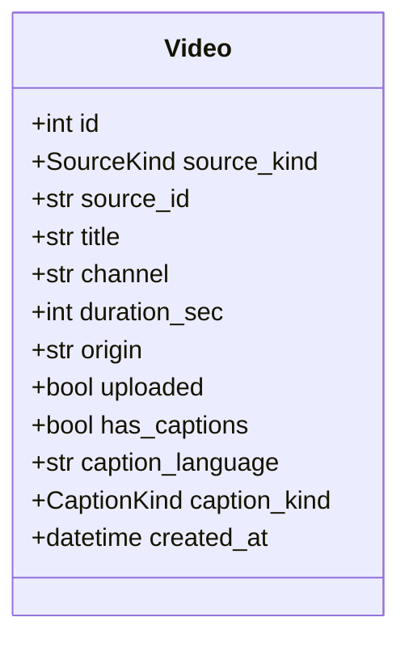
```mermaid
classDiagram
    class Video {
        +int id
        +SourceKind source_kind
        +str source_id
        +str title
        +str channel
        +int duration_sec
        +str origin
        +bool uploaded
        +bool has_captions
        +str caption_language
        +CaptionKind caption_kind
        +datetime created_at
    }
```

관계
- `Video` 1 — 0..* `AnalysisJob`
- `Video` 1 — 0..1 `Transcript` · 0..1 `Summary` · 0..* `Part` · 0..* `Chapter` · 0..3 `SuggestedQuestion` · 0..* `ChatTurn` · 0..1 `Infographic`

`source_id`는 YouTube면 영상 ID(11자), 로컬이면 파일 내용 SHA-256. unique. `origin`은 URL, inbox 파일 이름 또는 올린 파일의 원래 이름. `channel` · `caption_language` · `caption_kind`는 로컬이면 null.

**`uploaded`는 로컬 영상의 원본 자리다**([[VA-DOM-001#Video]]) — false면 inbox 파일(앱은 읽기만 한다), true면 올린 사본 `data/uploads/{source_id}.{origin의 확장자}`(앱이 관리한다). 경로는 `shared/sources.py` 한곳이 푼다(5장 12). 사본은 분석하는 동안만 있다 — 작업이 `done`이 되면 지우고, 실패하면 남기며, 영상을 지우면 지운다(4.1). 사본을 지운 뒤에도 `uploaded`는 그대로다 — 다시 시도할 때 어디서 읽을지 정하는 값이다([[VA-DOM-001]] 5장 6). 응답의 `upload_bytes`는 컬럼이 아니라 사본 파일이 있으면 그 크기다.

**`status`와 `analyzed_at`은 컬럼이 아니다.** [[VA-API-001]]의 `Video.status`(registered · in_progress · failed · analyzed)와 `analyzed_at`은 가장 최근 `AnalysisJob`에서 계산한다 — 작업이 없으면 `registered`, `queued` · `running`이면 `in_progress`, `failed`면 `failed`, `done`이면 `analyzed`이고 `analyzed_at = finished_at`. [[VA-DOM-001#Video]]의 「분석완료시각」이 이 계산값이다(5장 5). `chat_turn_count`도 대화 묶음에서 센 값이다.

### 2.2 job

#### AnalysisJob 작업

테이블: [[VA-DOM-003#analysis_jobs]] · 도메인: [[VA-DOM-001#AnalysisJob]]

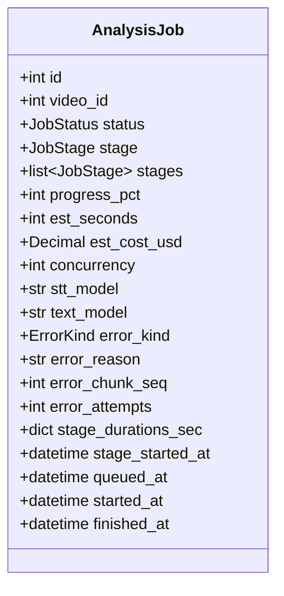
```mermaid
classDiagram
    class AnalysisJob {
        +int id
        +int video_id
        +JobStatus status
        +JobStage stage
        +list~JobStage~ stages
        +int progress_pct
        +int est_seconds
        +Decimal est_cost_usd
        +int concurrency
        +str stt_model
        +str text_model
        +ErrorKind error_kind
        +str error_reason
        +int error_chunk_seq
        +int error_attempts
        +dict stage_durations_sec
        +datetime stage_started_at
        +datetime queued_at
        +datetime started_at
        +datetime finished_at
    }
```

관계
- `AnalysisJob` * — 1 `Video` (video_id)
- `AnalysisJob` 1 — 0..* `AudioChunk`

`status`와 `stage`는 따로다 — 실패한 단계를 알려면 둘 다 있어야 한다([[VA-API-001]] 5장 2). `stages`는 시작할 때 출처로 정한 단계 목록이고 순서가 곧 파이프라인 순서다. 장면 단계(`frames`)는 맨 끝이고 실패해도 작업을 실패로 만들지 않는다(4.2). `error_*` 넷은 `status = failed`일 때만 값이 있고, 재시도하면 비운다. `queued_at`은 대기열에 들어간 때다 — 시작할 때와 다시 시도할 때 지금으로 적고, 대기열 순서는 이것의 오름차순이다. `started_at`은 다시 시도해도 그대로라 순서 기준이 못 된다([[VA-API-001]] 6장 되먹임). 대기열에서의 차례(`Job.queue_position`)는 컬럼이 아니라 `queued`인 행을 `queued_at`으로 세어 계산한다. `stage_durations_sec`는 완료한 단계마다 걸린 시간(초)이고 키는 `JobStage` 값이다. `stage_started_at`은 지금 단계가 시작된 때다 — 단계가 바뀔 때마다 갱신하고, 걸린 시간(단계 전환 때)과 남은 시간(폴링 때)을 여기서 잰다. `started_at`으로는 재시도 뒤에 잴 수 없다(MINISPEC 되먹임). `stt_model` · `text_model`은 시작 때 설정에서 복사한다 — 돌고 있는 작업은 설정을 바꿔도 끝까지 같은 모델을 쓴다([[VA-API-001#PUT/api/settings/models]]).

재시도는 **같은 작업**을 이어간다 — 새 작업을 만들지 않는다([[VA-UC-001#UC-S3]] 3a3). `running`인 작업은 프로세스 전체에서 하나이고, 나머지는 `queued`로 차례를 기다린다([[VA-INFRA-001]] 3절, [[VA-API-001]] 5장 8). 앞 작업이 끝나면(완료 · 실패 · 삭제) 워커가 가장 오래 기다린 것을 `running`으로 바꿔 돌린다.

#### AudioChunk 조각

테이블: [[VA-DOM-003#audio_chunks]] · 도메인: [[VA-DOM-001#AudioChunk]]

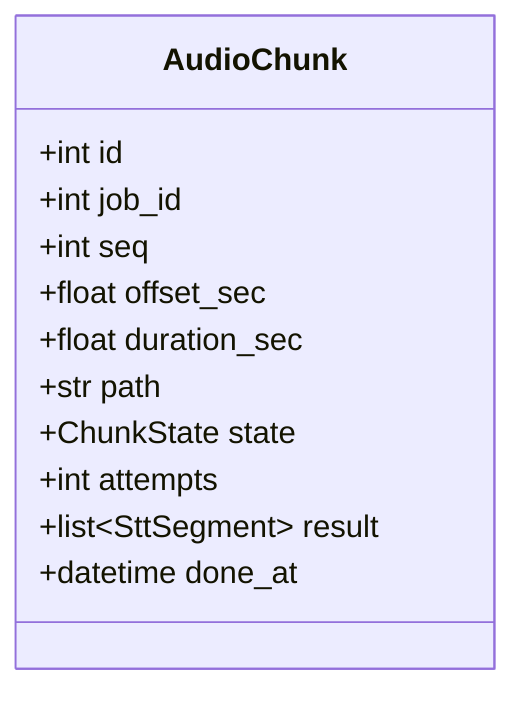
```mermaid
classDiagram
    class AudioChunk {
        +int id
        +int job_id
        +int seq
        +float offset_sec
        +float duration_sec
        +str path
        +ChunkState state
        +int attempts
        +list~SttSegment~ result
        +datetime done_at
    }
```

관계
- `AudioChunk` * — 1 `AnalysisJob` (job_id)

`seq`는 1부터. `path`는 `data/tmp/{video_id}/{seq}.mp3`이고 받아쓰기가 끝나 파일을 지우면 null. `state`는 waiting · in_flight · done · failed 넷([[VA-UI-002#UI-3]] 조각 격자). `attempts`는 그 조각을 보낸 누적 횟수다. 한 번 도는 동안 자동 재시도 상한(설정값, 첫 값 3)만큼 보내고도 실패하면 `failed` — 다시 시도하면 상한을 새로 센다. `done_at`으로 조각당 평균 시간을 재서 남은 시간을 계산한다([[VA-UC-001#UC-S6]] 2번). **`result`는 그 조각의 받아쓰기 결과**(`SttSegment` 목록, 오프셋을 더하기 전)다. 조각이 `done`이 될 때 저장하고, 스크립트를 만든 뒤에도 남긴다 — 실패 뒤 재시도가 `done` 조각을 다시 보내지 않으려면 결과가 행에 있어야 한다([[VA-UC-001#UC-H0]] 최소 보장 「이미 받아쓴 조각은 버려지지 않는다」, 시퀀스 되먹임). 작업이 끝나도 행은 남긴다([[VA-DOM-001]] 5장 2).

### 2.3 analysis

#### Transcript 스크립트

테이블: [[VA-DOM-003#transcripts]] · 도메인: [[VA-DOM-001#Transcript]]

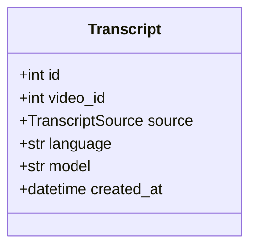
```mermaid
classDiagram
    class Transcript {
        +int id
        +int video_id
        +TranscriptSource source
        +str language
        +str model
        +datetime created_at
    }
```

관계
- `Transcript` 1 — 1 `Video`
- `Transcript` 1 — 1..* `Segment`

`source`는 caption_manual · caption_auto · stt 셋 — 화면이 수동 자막과 자동 자막을 구분해 보인다([[VA-UI-002#UI-4]] 8.1). `model`은 stt일 때만.

#### Segment 구간

테이블: [[VA-DOM-003#segments]] · 도메인: [[VA-DOM-001#Segment]]

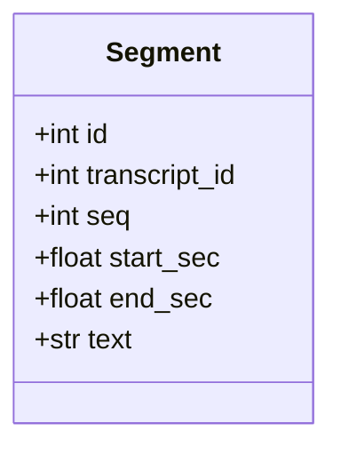
```mermaid
classDiagram
    class Segment {
        +int id
        +int transcript_id
        +int seq
        +float start_sec
        +float end_sec
        +str text
    }
```

관계
- `Segment` * — 1 `Transcript`

3시간 영상은 구간이 수천 개다. [[VA-API-001#GET/api/videos/{id}/result]]가 한 번에 준다.

#### Summary 요약

테이블: [[VA-DOM-003#summaries]] · 도메인: [[VA-DOM-001#Summary]]

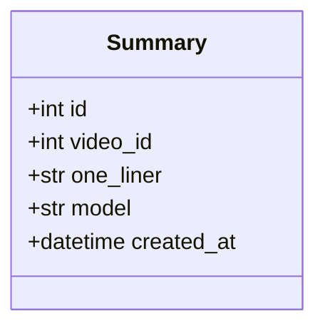
```mermaid
classDiagram
    class Summary {
        +int id
        +int video_id
        +str one_liner
        +str model
        +datetime created_at
    }
```

관계
- `Summary` 1 — 1 `Video`
- `Summary` 1 — 5..10 `Insight`

#### Insight 인사이트

테이블: [[VA-DOM-003#insights]] · 도메인: [[VA-DOM-001#Insight]]

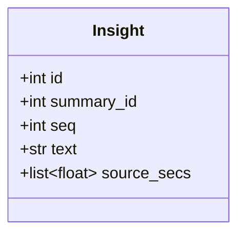
```mermaid
classDiagram
    class Insight {
        +int id
        +int summary_id
        +int seq
        +str text
        +list~float~ source_secs
    }
```

관계
- `Insight` * — 1 `Summary`

`source_secs`는 초 단위 시각 목록(하나 이상). 구간 FK가 아닌 이유는 [[VA-DOM-001]] 5장 1.

#### Part 파트

테이블: [[VA-DOM-003#parts]] · 도메인: [[VA-DOM-001#Part]]

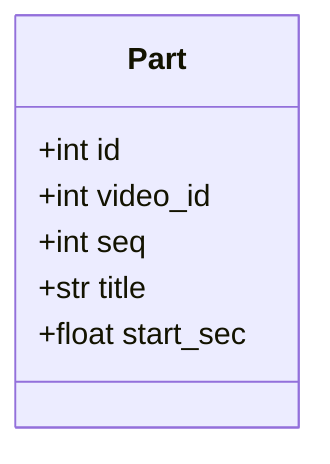
```mermaid
classDiagram
    class Part {
        +int id
        +int video_id
        +int seq
        +str title
        +float start_sec
    }
```

관계
- `Part` * — 1 `Video`
- `Part` 1 — 1..* `Chapter`

60분을 넘는 영상에만 있다. 응답의 `end_sec`(다음 파트 시작 또는 영상 길이)와 `chapter_count`는 읽을 때 계산한다.

#### Chapter 챕터

테이블: [[VA-DOM-003#chapters]] · 도메인: [[VA-DOM-001#Chapter]]

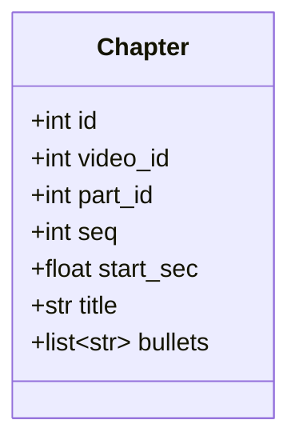
```mermaid
classDiagram
    class Chapter {
        +int id
        +int video_id
        +int part_id
        +int seq
        +float start_sec
        +str title
        +list~str~ bullets
    }
```

관계
- `Chapter` * — 1 `Video`
- `Chapter` * — 0..1 `Part` (파트가 없으면 null)
- `Chapter` 1 — 0..1 `ChapterFrame`

#### SuggestedQuestion 추천 질문

테이블: [[VA-DOM-003#suggested_questions]] · 도메인: [[VA-DOM-001#SuggestedQuestion]]

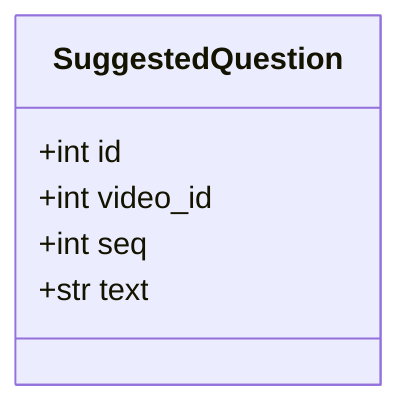
```mermaid
classDiagram
    class SuggestedQuestion {
        +int id
        +int video_id
        +int seq
        +str text
    }
```

관계
- `SuggestedQuestion` * — 1 `Video`

영상마다 3개. 누르면 대화 턴이 되고 추천 질문 자체는 바뀌지 않는다([[VA-DOM-001#SuggestedQuestion]]).

#### ChapterFrame 대표 장면

테이블: [[VA-DOM-003]]의 `chapter_frames`(다음 판에서 더한다) · 도메인: [[VA-DOM-001#ChapterFrame]]

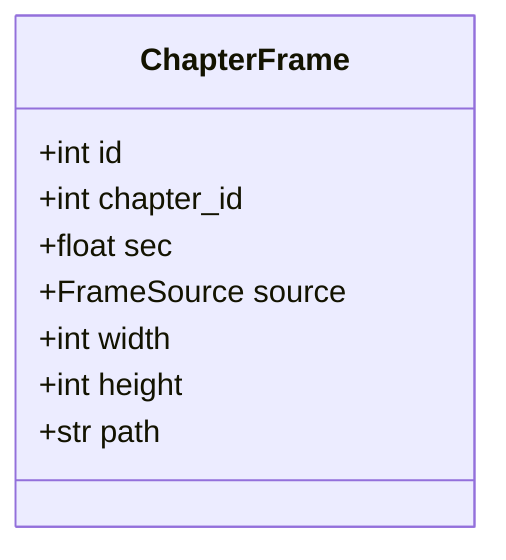
```mermaid
classDiagram
    class ChapterFrame {
        +int id
        +int chapter_id
        +float sec
        +FrameSource source
        +int width
        +int height
        +str path
    }
```

관계
- `ChapterFrame` 0..1 — 1 `Chapter` (chapter_id, unique)

`sec`는 실제로 잘라 온 장면의 시각이다 — 스토리보드는 약 10초 간격이라 챕터 시작과 몇 초 다를 수 있다([[VA-UC-001#UC-S7]] 3b). 크기는 얻은 그대로다(스토리보드 320×180 · 160×90 · 120×90, 로컬 폭 640 — [[VA-INFRA-001#C12]]). `path`는 `data/frames/{video_id}/{chapter_seq}.jpg`.

**얻지 못한 챕터도 행을 남긴다** — `sec` · `source` · 크기 · `path`가 모두 null인 행이다. 행이 있다는 것은 「그 챕터는 해 봤다」는 뜻이라, 옛 결과의 장면 채우기가 끝났는지를 여기서 안다(5장 11). 도메인 모델의 「장면이 없다」는 `path`가 있는 행이 없다는 것이다. 챕터가 지워지면 함께 지운다(cascade).

#### Infographic 인포그래픽

테이블: [[VA-DOM-003]]의 `infographics`(다음 판에서 더한다) · 도메인: [[VA-DOM-001#Infographic]]

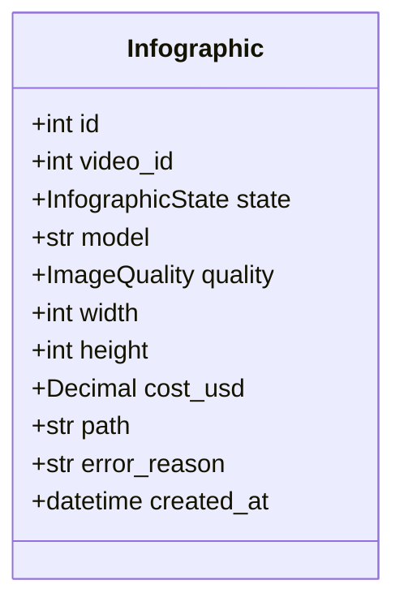
```mermaid
classDiagram
    class Infographic {
        +int id
        +int video_id
        +InfographicState state
        +str model
        +ImageQuality quality
        +int width
        +int height
        +Decimal cost_usd
        +str path
        +str error_reason
        +datetime created_at
    }
```

관계
- `Infographic` 0..1 — 1 `Video` (video_id, unique)

영상마다 하나이고 다시 만들면 바뀐다([[VA-DOM-001]] 5장 5). 행은 처음 [만들기]를 누를 때 생긴다 — 행이 없으면 응답의 `state`는 `none`이다. 저장하는 `state`는 `making` · `done` · `failed` 셋이다. **그림 속성(`model` · `quality` · 크기 · `cost_usd` · `path` · `created_at`)은 지금 쓰는 그림의 것이다** — 다시 그리는 중이거나 다시 그리기가 실패해도 이전 그림의 값이 그대로 있고([[VA-UC-001#UC-H9]] 4a), 처음 그리는 중이면 모두 null이다. `created_at`은 그 그림을 다 그린 때(UI-4 '{시각} 만듦'), `cost_usd`는 그 그림을 맡긴 때의 한 장 값(설정값)이다. `error_reason`은 `failed`일 때만 있다. `path`는 `data/infographics/{video_id}.png`.

### 2.4 chat

#### ChatTurn 대화 턴

테이블: [[VA-DOM-003#chat_turns]] · 도메인: [[VA-DOM-001#ChatTurn]]

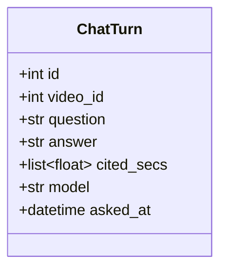
```mermaid
classDiagram
    class ChatTurn {
        +int id
        +int video_id
        +str question
        +str answer
        +list~float~ cited_secs
        +str model
        +datetime asked_at
    }
```

관계
- `ChatTurn` * — 1 `Video`

`cited_secs`가 빈 목록이면 근거 없는 답("이 영상에서는 다루지 않습니다")이다. 답을 받지 못한 질문은 저장하지 않는다([[VA-API-001#POST/api/videos/{id}/chat]]).

### 2.5 열거형

| 이름 | 값 | 쓰는 곳 |
|---|---|---|
| `SourceKind` | `youtube` · `local` | Video |
| `CaptionKind` | `manual` · `auto` | Video |
| `JobStatus` | `queued` · `running` · `failed` · `done` | AnalysisJob |
| `JobStage` | `pending` · `download` · `extract` · `transcribe` · `summarize` · `chapter` · `suggest` · `frames` | AnalysisJob. `download`는 자막이 있으면 자막 가져오기, 없으면 음성 내려받기([[VA-UI-002#UI-3]] 규칙). `frames`(장면)는 맨 끝이고 실패해도 작업을 실패로 만들지 않는다([[VA-UC-001#UC-S6]] 1b) |
| `ChunkState` | `waiting` · `in_flight` · `done` · `failed` | AudioChunk |
| `ErrorKind` | `network` · `openai` · `youtube` · `ffmpeg` · `disk` · `unknown` | AnalysisJob.error_kind |
| `TranscriptSource` | `caption_manual` · `caption_auto` · `stt` | Transcript |
| `KeyState` | `ok` · `missing` · `invalid` | SettingsService (DB 없음) |
| `ReasonKind` | `format` · `auth` · `quota` · `network` | SettingsService |
| `FrameSource` | `storyboard` · `local_frame` | ChapterFrame |
| `FramesState` | `absent` · `making` · `done` · `unavailable` | 결과의 장면 상태. 저장하지 않고 `AnalysisService`가 장면 행 · 도는 중 · 원본 자리로 정한다(4.3) |
| `FrameItemState` | `waiting` · `in_flight` · `done` · `missing` | 장면 진행의 챕터 하나(`FrameProgressItem.state`). 저장하지 않는다 |
| `InfographicState` | `none` · `making` · `done` · `failed` | Infographic. `none`은 저장하지 않는다 — 행이 없을 때의 응답값 |
| `ImageQuality` | `low` · `medium` | Infographic · SettingsService(`.env`의 `IMAGE_QUALITY`) |
| `ExportMethod` | `file` · `clipboard` | 내보내기 미리 보기의 쿼리 `method` |

값은 [[VA-API-001]] 4장의 enum 스키마(필드 안에 바로 적힌 것 포함)와 같다. DB에는 enum 타입이 아니라 varchar로 두고 앱이 검증한다 — 값을 더할 때 마이그레이션을 피한다.

### 2.6 응답·내부 타입 (DTO)

**API 응답 스키마([[VA-API-001]] 4장)와 같은 이름은 그것을 그대로 쓴다** — `Video` `VideoSummary` `VideoDetail` `RegisterRequest` `RegisterResponse` `Estimate` `InboxListing` `InboxFile` `Job` `JobSummary` `Chunks` `Chunk` `JobError` `Models` `Result` `Transcript` `Segment` `Summary` `Insight` `Part` `Chapter` `SuggestedQuestion` `ChatTurn` `AskRequest` `ExportRequest` `ExportPreview` `ExportResult` `Settings` `KeyStatus` `ModelOption` `KeyRequest` `ModelsRequest` `Frame` `FrameSet` `FrameProgress` `FrameProgressItem` `Infographic` `InfographicImage` `ImageSettings` `ImageQualityOption` `ExportFile`. DTO와 ORM 이름이 같을 때 ORM은 코드에서 `*Row`로 부른다(`VideoRow` · `TranscriptRow` · `InfographicRow`). 서비스가 밖으로 내는 것은 DTO다.

여기는 API에 나가지 않는 것만.

| 타입 | 필드 | 쓰는 곳 |
|---|---|---|
| `SourceInfo` | `source_kind` · `source_id` · `title` · `channel` · `duration_sec` · `origin` · `uploaded` · `has_captions` · `caption_language` · `caption_kind` | YouTubeInfoPort · MediaProbePort → VideoService.register · upload |
| `CaptionLine` | `start_sec` · `end_sec` · `text` | AudioSourcePort.captions → AnalysisService.save_transcript |
| `ChunkPlan` | `seq` · `offset_sec` · `duration_sec` · `path` | AudioSplitPort.split → JobService.plan_chunks |
| `SttSegment` | `start_sec` · `end_sec` · `text` · `language` | SttPort.transcribe → `AudioChunk.result`에 저장 → 이어 붙일 때 오프셋을 더해 CaptionLine과 같은 모양으로 |
| `SummaryDraft` | `one_liner` · `insights: list[(text, source_secs)]` | SummarizerPort.summary → AnalysisService |
| `ChapterDraft` | `parts: list[(title, start_sec)]` · `chapters: list[(part_seq, start_sec, title, bullets)]` | SummarizerPort.chapters → AnalysisService |
| `AnswerDraft` | `answer` · `cited_secs` | AnswererPort.answer → ChatService |
| `FrameShot` | `sec` · `source: FrameSource` · `width` · `height` · `path` | FrameSourcePort.frames → AnalysisService.make_frames(ChapterFrame 행으로) |
| `InfographicBrief` | `title` · `one_liner` · `insights: list[str]` · `chapter_titles: list[str]` | AnalysisService → ImageMakerPort.infographic. 스크립트는 없다 — 보내는 것이 이것뿐이다([[VA-UC-001#UC-H9]] 4번) |
| `ImageShot` | `width` · `height` · `path` | ImageMakerPort.infographic → AnalysisService |
| `KeyCheck` | `state: KeyState` · `reason_kind: ReasonKind \| None` · `reason: str \| None` · `checked_at` | infra/openai.verify_key → SettingsService |
| `ChosenModels` | `stt: ModelOption` · `text: ModelOption` · `image_model: str` · `image_quality: ImageQualityOption` — 지금 고른 모델의 id와 단가, 인포그래픽 품질과 한 장 값 | SettingsService.current_models → JobService.estimate · start · AnalysisService(요약 · 인포그래픽) · ChatService. 응답의 `Models`(id 둘)는 `SettingsService.get`이 여기서 만든다 |
| `Progress` | `stage: JobStage` · `progress_pct` · `chunks_done` | pipeline → JobService.mark_stage. 화면에 나가는 `Job`은 JobService.progress가 만든다 |

타입은 여기 한 곳에만 정의한다. 엔티티는 2.1~2.4, 열거형은 2.5.

---

## 3. 의존 관계

누가 누굴 부르는지. 클래스 다이어그램이 아니라 지도다. 3.1은 입구(Boundary)에서 서비스(Control)로, 3.2는 서비스끼리와 바깥으로. 여기 없는 방향은 부르면 안 된다.

### 3.1 Boundary → Control

라우터는 클래스가 아니라 함수가 든 파일이므로 박스만 그린다. 프런트는 `api/client.ts` 한곳에서 부른다 — 올리기만 web의 라우트 핸들러(`app/api/uploads/route.ts`)를 거쳐 video/router에 닿는다(1장).

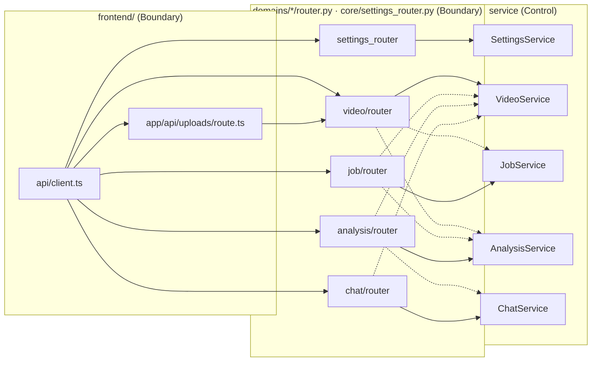
```mermaid
flowchart LR
    subgraph fe["frontend/ (Boundary)"]
        FC[api/client.ts]
        UR[app/api/uploads/route.ts]
    end
    subgraph routers["domains/*/router.py · core/settings_router.py (Boundary)"]
        rs[settings_router]
        rv[video/router]
        rj[job/router]
        ra[analysis/router]
        rc[chat/router]
    end
    subgraph services["service (Control)"]
        SS[SettingsService]
        VS[VideoService]
        JS[JobService]
        AS[AnalysisService]
        CS[ChatService]
    end
    FC --> rs & rv & rj & ra & rc
    FC --> UR --> rv
    rs --> SS
    rv --> VS
    rv -.-> JS
    rv -.-> AS
    rj --> JS
    rj -.-> VS
    rj -.-> AS
    ra --> AS
    ra -.-> VS
    ra -.-> CS
    rc --> CS
    rc -.-> VS
```

실선은 그 라우터의 묶음, 점선은 **인자를 넘기려고 한 번 더 부르는 것**이다. 판단은 없다.

| 라우터 | 점선으로 부르는 것 | 왜 |
|---|---|---|
| `video/router` | `JobService.estimate(video)` | [[VA-API-001#POST/api/videos]] · [[VA-API-001#POST/api/uploads]] 응답이 영상 + 예상치. 작업이 있으면 null을 돌려주므로 라우터에 분기가 없다 |
| `video/router` | `JobService.cancel(video_id)` | [[VA-API-001#DELETE/api/videos/{id}]] — 진행 중이면 먼저 멈춘다. 없으면 아무것도 안 한다 |
| `video/router` | `JobService.wake()` | 같은 삭제에서 `VideoService.delete` **뒤에** 부른다 — 지운 것이 도는 작업이었으면 다음 대기 작업이 시작된다. 지우기 전에 깨우면 워커가 곧 지워질 행을 꺼낼 수 있다(시퀀스 SEQ-11) |
| `video/router` | `AnalysisService.cancel_tasks(video_id)` | 같은 삭제에서 `VideoService.delete` **전에** — 채우는 중인 장면 · 그리는 중인 인포그래픽을 멈춘다([[VA-API-001#DELETE/api/videos/{id}]]). 없으면 아무것도 안 한다 |
| `job/router` | `VideoService.get(video_id)` | 시작 · 재시도가 `Video` DTO를 받는다. 작업 묶음은 영상 테이블을 모른다 |
| `job/router` | `AnalysisService.frame_progress(video_id)` | 진행 조회의 `Job.frames`(UI-3 장면 칸)가 장면 행에서 온다. 받아서 `JobService.progress`에 넘긴다 — 작업 묶음은 장면 테이블도 모른다(5장 14) |
| `analysis/router` | `VideoService.get(video_id)` · `ChatService.history(video_id)` | 결과 · 장면 · 인포그래픽 · 내보내기가 `Video`를 받고, `with_chat`이면 대화 턴을 받는다 |
| `chat/router` | `VideoService.get(video_id)` | 질문이 `Video`를 받는다(결과 유무 · 길이). 기록 조회도 영상이 없으면 404를 내야 하므로 먼저 부른다 |

### 3.2 Control 사이와 바깥

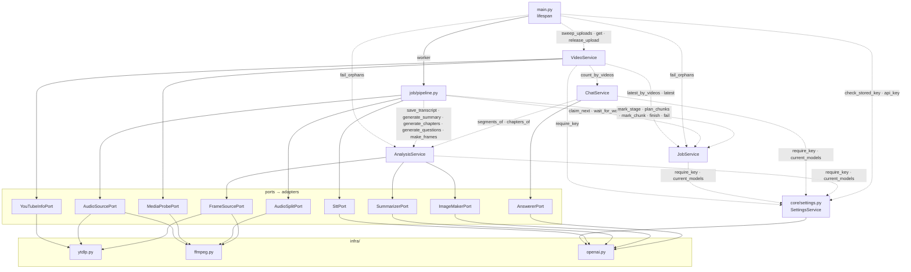
```mermaid
flowchart TB
    SS[core/settings.py<br/>SettingsService]
    VS[VideoService]
    JS[JobService]
    PL[job/pipeline.py]
    AS[AnalysisService]
    CS[ChatService]
    subgraph ports["ports → adapters"]
        YI[YouTubeInfoPort]
        MP[MediaProbePort]
        AU[AudioSourcePort]
        SP[AudioSplitPort]
        ST[SttPort]
        SM[SummarizerPort]
        FS[FrameSourcePort]
        IM[ImageMakerPort]
        AN[AnswererPort]
    end
    subgraph infra["infra/"]
        YT[ytdlp.py]
        FF[ffmpeg.py]
        OA[openai.py]
    end

    VS -.->|latest_by_videos · latest| JS
    VS -.->|count_by_videos| CS
    VS -.->|require_key| SS
    JS -.->|require_key · current_models| SS
    CS -.->|require_key · current_models| SS
    AS -.->|require_key · current_models| SS
    MAIN[main.py<br/>lifespan]
    MAIN -->|worker| PL
    MAIN -.->|check_stored_key · api_key| SS
    MAIN -.->|fail_orphans| JS
    MAIN -.->|fail_orphans| AS
    MAIN -.->|sweep_uploads · get · release_upload| VS
    PL -.->|claim_next · wait_for_work| JS
    PL -.->|mark_stage · plan_chunks · mark_chunk · finish · fail| JS
    PL -.->|save_transcript · generate_summary · generate_chapters · generate_questions · make_frames| AS
    CS -.->|segments_of · chapters_of| AS
    VS --> YI & MP
    PL --> AU & SP & ST
    AS --> SM & FS & IM
    CS --> AN
    SS --> OA
    YI --> YT
    AU --> YT & FF
    MP --> FF
    SP --> FF
    FS --> YT & FF
    ST --> OA
    SM --> OA
    IM --> OA
    AN --> OA
```

**규칙**
- 서비스끼리 직접 부르는 것은 넷이다 — `VideoService → JobService`(작업 요약 · 예상치는 라우터가), `VideoService → ChatService`(대화 수), `pipeline → AnalysisService`(단계 실행), `ChatService → AnalysisService`(답변 맥락). `AnalysisService`와 `JobService`는 다른 묶음의 서비스를 부르지 않는다. `JobService`는 영상 테이블을 모른다 — 필요한 것은 `Video` DTO로 받는다
- 순환이 없다. video → job · chat, chat → analysis, job → analysis. 반대 방향은 없다
- `SettingsService`는 `core/`라 어느 묶음이든 부를 수 있다. 하는 일은 키 확인 · 모델 이름 넷과, 조립 지점(`main.py`)에 지금 키를 주는 것(`api_key`)이다
- 어댑터는 `infra/` 클라이언트만 부른다. 서비스는 `infra/`를 직접 부르지 않는다 — `SettingsService`만 예외로 `infra/openai.verify_key`를 부른다(포트를 둘 도메인이 없다)
- `pipeline.worker(load_video, release_upload)`는 `main.py`가 시작 때 하나 띄운다. `load_video` · `release_upload`는 `main.py`가 `VideoService.get` · `VideoService.release_upload`를 감싸 넘기는 함수다 — 작업 묶음은 영상 묶음을 import하지 않고, 둘을 아는 곳은 조립 지점뿐이다. 올린 사본을 읽는 길은 `shared/sources.py`이고 지우는 것은 영상 묶음이다(5장 12). 워커가 `JobService.claim_next`로 다음 작업을 받아 `run` 또는 `resume`을 태스크로 돌리고 끝나기를 기다린다. 도는 태스크의 핸들은 `JobService`가 들고 있어 삭제 때 취소한다(4.2). `JobService`는 파이프라인을 직접 띄우지 않는다 — 대기열에 넣고 워커를 깨울 뿐이다
- `AnalysisService`는 뒤 일(장면 채우기 · 인포그래픽 그리기)을 태스크로 띄우고 핸들을 든다 — 워커 · 대기열을 거치지 않는다(5장 13). 삭제 때는 video/router가 `cancel_tasks`로 멈춘다 — 작업의 `cancel`과 같은 자리다

---
## 4. 설계 클래스

3장이 지도라면 여기는 각 노드를 확대한 것이다. 묶음마다 `«service»` 컨트롤의 **메서드 시그니처**와 그 서비스가 만지는 엔티티를 한 그림에 둔다. 코딩할 때 보는 그림이다.

**읽는 법** — 시그니처는 [[VA-API-001]]의 요청·응답으로 확정했다. 반환 타입 중 `Video` · `Job` · `Result` 같은 응답 형태는 API 스키마와 같은 이름이다. `-`로 시작하는 메서드는 서비스 안에서만 쓴다. 그림 아래 표에 메서드마다 부르는 곳 · 유스케이스 · 던지는 에러를 붙였다. 에러 이름은 [[VA-API-001]] 2장의 `urn:va:` 뒤 부분이다. 그림 안 엔티티는 2장의 속성을 그대로 다시 그린 것이고 어긋나면 2장이 진실이다.

### 4.1 video

#### VideoService 영상 서비스

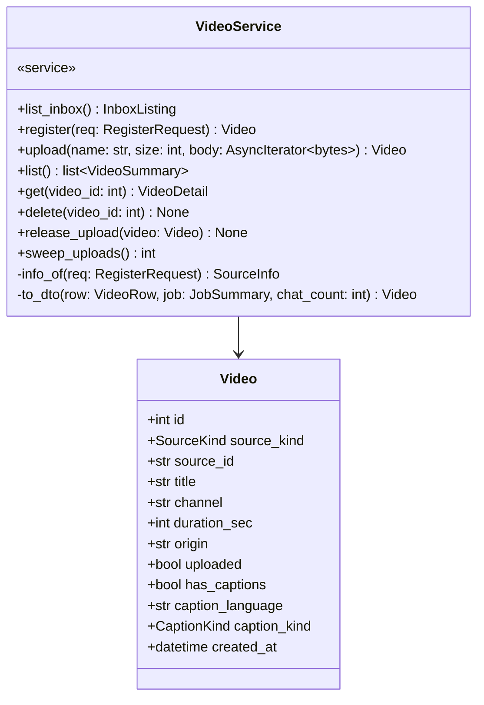
```mermaid
classDiagram
    class VideoService {
        «service»
        +list_inbox() InboxListing
        +register(req: RegisterRequest) Video
        +upload(name: str, size: int, body: AsyncIterator~bytes~) Video
        +list() list~VideoSummary~
        +get(video_id: int) VideoDetail
        +delete(video_id: int) None
        +release_upload(video: Video) None
        +sweep_uploads() int
        -info_of(req: RegisterRequest) SourceInfo
        -to_dto(row: VideoRow, job: JobSummary, chat_count: int) Video
    }
    class Video {
        +int id
        +SourceKind source_kind
        +str source_id
        +str title
        +str channel
        +int duration_sec
        +str origin
        +bool uploaded
        +bool has_captions
        +str caption_language
        +CaptionKind caption_kind
        +datetime created_at
    }
    VideoService --> Video
```

| 메서드 | 부르는 곳 | 유스케이스 | 던지는 에러 |
|---|---|---|---|
| `list_inbox` | [[VA-API-001#GET/api/inbox]] | [[VA-UC-001#UC-H2]] 1 | |
| `register` | [[VA-API-001#POST/api/videos]] | [[VA-UC-001#UC-H1]] 1~2 · [[VA-UC-001#UC-H2]] 1~2 · [[VA-UC-001#UC-S1]] · [[VA-UC-001#UC-S5]] 1 | key-missing · key-invalid · url-invalid · path-outside-inbox · unsupported-file · source-unavailable · no-audio-track · video-too-long |
| `upload` | [[VA-API-001#POST/api/uploads]] | [[VA-UC-001#UC-H2]] 1~2, 1a · 1c · 1d · 2a · 2c · [[VA-UC-001#UC-S5]] 1b | key-missing · key-invalid · validation · unsupported-file · no-space · upload-incomplete · no-audio-track · video-too-long |
| `list` | [[VA-API-001#GET/api/videos]] | [[VA-UC-001#UC-H5]] 1 | |
| `get` | [[VA-API-001#GET/api/videos/{id}]] · job · analysis · chat 라우터(인자용) | [[VA-UC-001#UC-H5]] 2~3 · [[VA-UC-001#UC-H6]] 2 | not-found |
| `delete` | [[VA-API-001#DELETE/api/videos/{id}]] | [[VA-UC-001#UC-H6]] 4 · [[VA-UC-001#UC-H2]] 3a | not-found |
| `release_upload` | pipeline(작업이 `done`이 된 뒤 — `main.py`가 감싸 넘긴 것) · `delete` · `sweep_uploads` | [[VA-UC-001#UC-H2]] 4 | |
| `sweep_uploads` | `main.py` 시작 절차(`JobService.fail_orphans` 뒤) | [[VA-UC-001#UC-H2]] 최소 보장 | |

**규칙이 사는 곳**
- `register`: 순서는 [[VA-API-001#POST/api/videos]] 1~7번 그대로 — 키 확인(`SettingsService.require_key`) → 형식 → 정보 조회(포트) → 3시간 상한 → 중복 판정(`source_id` unique) → 생성 또는 덮어쓰기. URL 형식은 watch · youtu.be · shorts 셋. 받는 확장자는 mp4 · mkv · mov · webm · mp3 · m4a · wav. inbox 밖 경로(`..` · 절대 경로 · 하위 폴더)는 거부. 작업이 없는 기존 영상은 `SourceInfo`로 덮어쓴다
- `upload`: 순서는 [[VA-API-001#POST/api/uploads]] 1~7번 그대로 — 키 확인(`register`와 같다, 본문을 읽기 전) → 이름 · 크기(`X-File-Name` · `Content-Length`, 받는 확장자는 `register`와 같은 목록) → 디스크 여유(`Content-Length` + 여유분, 설정값) → `data/uploads/.part-{무작위}`에 1MB씩 쓰며 SHA-256(inbox 등록과 같은 해시 — 내용이 같으면 `source_id`가 같다) → `MediaProbePort.probe`로 길이 · 음성 → 중복 판정 → 없으면 `.part`를 `{SHA-256}.{확장자}`로 옮기고 `uploaded = true`로 만든다. `title` · `origin`은 원래 파일 이름이다. 받은 크기가 `Content-Length`와 다르거나 연결이 끊기면 `upload-incomplete`이고, 어느 판정에서 멈추든 `.part`는 남지 않는다([[VA-UC-001#UC-H2]] 최소 보장)
- 중복 판정(`register` · `upload`): 작업이 있는 영상이면 그것을 돌려준다 — 올리기면 `.part`를 지운다. 작업이 없는(등록만 된) 영상이면 새 정보로 덮어쓴다 — 올리기면 사본을 옮겨 두고 `uploaded = true`가 된다(7장 되먹임). 작업이 있는 로컬 영상의 이름(`origin`)만 지금 것으로 고치는 규칙은 inbox 영상에만 쓴다 — 올린 영상의 사본 이름은 원래 이름의 확장자를 따르므로 이름을 바꾸지 않는다
- `list`: 작업이 있는 영상만. `JobService.latest_by_videos`로 작업 요약을, `ChatService.count_by_videos`로 대화 수를 한 번에 받아(N+1 금지) `to_dto`로 합친다. 순서는 작업 시작 최근 순
- `to_dto`: `status`와 `analyzed_at`을 최근 작업에서 계산한다(2.1). 이 계산이 이 서비스에만 있다 — 라우터 · 다른 묶음은 `Video.status`를 읽기만 한다. `upload_bytes`는 올린 사본 파일이 있으면 그 크기다(파일을 본다)
- `delete`: 딸린 행은 FK cascade(장면 · 인포그래픽 행도). 커밋 뒤 영상에 딸린 파일을 지운다 — `data/tmp/{video_id}` · `data/frames/{video_id}` · `data/infographics/{video_id}.png` · 올린 사본(`release_upload`). inbox 원본과 올린 파일의 원래 파일, 내보낸 노트 · 그림은 건드리지 않는다([[VA-INFRA-001#C4]]). 작업 · 뒤 일 멈춤은 라우터가 먼저 `JobService.cancel` · `AnalysisService.cancel_tasks`를 불러서 한다(3.1). 사전 안내에서 취소한 올린 영상도 이 길로 지운다([[VA-UC-001#UC-H2]] 3a)
- `release_upload`: `video.uploaded`면 `sources.local_path`가 가리키는 사본을 지운다. 없으면 아무것도 안 한다. 행은 건드리지 않는다 — `uploaded`는 그대로다([[VA-DOM-001]] 5장 6)
- `sweep_uploads`: `data/uploads`의 `.part-*`는 지운다. `{SHA-256}.{확장자}`는 그 해시의 영상이 없거나 올린 영상이 아니거나, 최근 작업이 없거나 `done`이면 지운다(`JobService.latest_by_videos`). `failed` · `queued`는 남긴다 — 다시 시도 · 대기열이 읽는다. `JobService.fail_orphans` 뒤에 부른다 — 서버가 죽어 남은 `running`이 `failed`가 된 뒤라야 그 사본이 남는다. 지운 수를 돌려준다
- `list_inbox`: 받는 확장자만, 하위 폴더 없음, 수정 시각 최근 순. 길이는 `MediaProbePort.probe`로 파일마다 잰다 — 캐시는 7장

### 4.2 job

#### JobService 작업 서비스

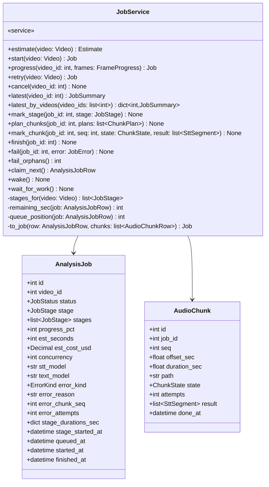
```mermaid
classDiagram
    class JobService {
        «service»
        +estimate(video: Video) Estimate
        +start(video: Video) Job
        +progress(video_id: int, frames: FrameProgress) Job
        +retry(video: Video) Job
        +cancel(video_id: int) None
        +latest(video_id: int) JobSummary
        +latest_by_videos(video_ids: list~int~) dict~int,JobSummary~
        +mark_stage(job_id: int, stage: JobStage) None
        +plan_chunks(job_id: int, plans: list~ChunkPlan~) None
        +mark_chunk(job_id: int, seq: int, state: ChunkState, result: list~SttSegment~) None
        +finish(job_id: int) None
        +fail(job_id: int, error: JobError) None
        +fail_orphans() int
        +claim_next() AnalysisJobRow
        +wake() None
        +wait_for_work() None
        -stages_for(video: Video) list~JobStage~
        -remaining_sec(job: AnalysisJobRow) int
        -queue_position(job: AnalysisJobRow) int
        -to_job(row: AnalysisJobRow, chunks: list~AudioChunkRow~) Job
    }
    class AnalysisJob {
        +int id
        +int video_id
        +JobStatus status
        +JobStage stage
        +list~JobStage~ stages
        +int progress_pct
        +int est_seconds
        +Decimal est_cost_usd
        +int concurrency
        +str stt_model
        +str text_model
        +ErrorKind error_kind
        +str error_reason
        +int error_chunk_seq
        +int error_attempts
        +dict stage_durations_sec
        +datetime stage_started_at
        +datetime queued_at
        +datetime started_at
        +datetime finished_at
    }
    class AudioChunk {
        +int id
        +int job_id
        +int seq
        +float offset_sec
        +float duration_sec
        +str path
        +ChunkState state
        +int attempts
        +list~SttSegment~ result
        +datetime done_at
    }
    JobService --> AnalysisJob
    JobService --> AudioChunk
```

| 메서드 | 부르는 곳 | 유스케이스 | 던지는 에러 |
|---|---|---|---|
| `estimate` | video/router ([[VA-API-001#POST/api/videos]] 7번) | [[VA-UC-001#UC-S1]] 5 | |
| `start` | [[VA-API-001#POST/api/videos/{id}/job]] | [[VA-UC-001#UC-H0]] 3 | key-missing · key-invalid · job-exists |
| `progress` | [[VA-API-001#GET/api/videos/{id}/job]] | [[VA-UC-001#UC-S6]] | not-found(job) |
| `retry` | [[VA-API-001#POST/api/videos/{id}/job/retry]] | [[VA-UC-001#UC-S3]] 3a3 · [[VA-UC-001#UC-S6]] 1a | key-missing · key-invalid · not-found(job) · job-not-failed |
| `cancel` | video/router ([[VA-API-001#DELETE/api/videos/{id}]]) | [[VA-UC-001#UC-H6]] 4 | |
| `latest` · `latest_by_videos` | VideoService | [[VA-UC-001#UC-H5]] 1 | |
| `mark_stage` · `plan_chunks` · `mark_chunk` · `finish` · `fail` | pipeline | [[VA-UC-001#UC-S6]] 1~3 · [[VA-UC-001#UC-S3]] 2~3 | |
| `fail_orphans` | `main.py` 시작 절차 | — (5장 8) | |
| `claim_next` · `wait_for_work` | pipeline.worker | [[VA-UC-001#UC-H0]] 3b | |
| `wake` | `start` · `retry` · video/router(삭제 뒤) | [[VA-UC-001#UC-H0]] 3b · [[VA-UC-001#UC-H6]] 4 | |

**규칙이 사는 곳**
- `estimate`: 작업이 있으면 null. 자막 있음이면 `needs_stt = false` · 약 60초 · 받아쓰기 비용 0. 받아쓰기 필요면 조각 수 = 길이 ÷ 조각 길이(설정값), 동시 수 = 설정값, 받아쓰기 비용 = 분 × 단가(설정값 — `SettingsService.current_models`의 모델 단가), 예상 시간 = 조각 수 ÷ 동시 수 × 조각당 예상 시간(+ 내려받기 · 추출 · 로컬 음성 변환 · 장면 몫). 텍스트 모델 비용 추정식은 7장. 화면은 이 숫자를 그대로 보인다([[VA-UI-002#UI-2]] 규칙)
- `start`: `SettingsService.require_key` → 이 영상에 작업이 있으면 `job-exists` → `stages_for(video)`로 단계 목록, 설정에서 모델 · 동시 수를 복사해 행 생성(`queued` · `pending` · `queued_at = 지금`) → 워커를 깨운다. **늘 `queued`로 넣는다** — 도는 작업이 없으면 워커가 곧바로 `running`으로 바꾸므로 시작하는 길이 하나다. 응답의 `status`는 그 순간의 값이라 `queued`일 수도 `running`일 수도 있다([[VA-API-001#POST/api/videos/{id}/job]] 3번)
- `stages_for`: 자막 있는 YouTube [download, summarize, chapter, suggest, frames] · 자막 없는 YouTube [download, transcribe, summarize, chapter, suggest, frames] · 로컬 영상(inbox · 올린 사본) [extract, transcribe, summarize, chapter, suggest, frames] · 로컬 음성 [transcribe, summarize, chapter, suggest]([[VA-UC-001#UC-S2]], [[VA-UC-001#UC-H2]] 2b, [[VA-UC-001#UC-S7]] 1a)
- `retry`: `status`가 `failed`가 아니면 `job-not-failed`. `error_*`를 비우고 `queued`로 되돌리고 `queued_at`을 지금으로 적은 뒤 워커를 깨운다 — 같은 행, 같은 `id`, `stage`는 실패한 단계 그대로. 도는 작업이 있으면 대기열 끝에서 기다린다
- `claim_next`: `running`인 행이 없을 때만, `queued` 중 `queued_at`이 가장 이른 행을 `running`으로 바꿔 돌려준다. 없으면 None. 한 트랜잭션으로 하고 DB의 부분 unique(`running` 하나, [[VA-DOM-003#analysis_jobs]])가 마지막 방어선이다
- `wait_for_work`: 워커가 할 일이 없을 때 기다리는 곳이다. 프로세스 안 `asyncio.Event` 하나이고, 신호가 없어도 몇 초마다 한 번은 대기열을 본다(MINISPEC 작업 서비스 `JobService.wait_for_work`)
- `wake`: 그 신호를 켠다. 부르는 곳은 셋 — `start` · `retry`(커밋 뒤)와 삭제 라우터(`VideoService.delete` 뒤). `finish` · `fail` · `cancel`은 깨우지 않는다 — 워커가 도는 태스크를 직접 기다리므로 끝나면 스스로 다음으로 간다
- `queue_position`: `queued`인 행 중 `queued_at`이 자기보다 이른 것의 수 + 1. `queued`가 아니면 None. 도는 작업이 하나 있고 자기가 대기열 맨 앞이면 1이고, 그때 화면의 '앞 영상 1개'와 '1번째'가 같은 수다([[VA-API-001]] 5장 8)
- `cancel`: 태스크 핸들이 있으면 취소하고 기다린다. 행은 지우지 않는다(cascade가 지운다). 없으면(대기 중 · 실패 · 완료) 아무것도 안 한다 — 대기 중인 작업은 행이 지워지면 대기열에서 빠진 것이다. 워커는 깨우지 않는다 — 삭제 라우터가 행을 지운 뒤에 `wake`를 부른다
- `progress` · `to_job`: `remaining_sec` = 작업 전체가 끝날 때까지 — 받아쓰기 단계면 미완료 조각 수 × 이번 실행에서 끝난 조각의 조각당 평균(`done_at`이 단계 시작 뒤인 것만 — 다시 시도 뒤 이전 실행의 조각은 세지 않는다. 조각 행이 아직 없으면 앞 단계처럼)에 뒤 단계(요약 세 단계 · 장면)의 예상 몫을 더하고, 그 뒤 단계면 그 몫 − 거기 쓴 시간, 그 앞 단계는 예상 전체 시간 − 지난 시간(끝난 단계의 오차는 뒤로 넘기지 않는다. 0 아래로 내려가지 않는다), `running`이 아니면 null. `queue_position`은 위 규칙대로. `chunks.next_seq`는 `done`이 아닌 첫 조각. `Chunks`의 집계(done · in_flight · failed · waiting)는 조각 행에서 센다. `progress_pct`는 파이프라인이 단계 가중치로 갱신한 값을 그대로. `frames`는 장면 단계가 있는 작업에만 싣는다 — 라우터가 넘긴 `FrameProgress`(`AnalysisService.frame_progress`) 그대로, 없는 작업은 null(3.1)
- `mark_stage`: 끝난 단계의 걸린 시간을 적고(다시 시도로 같은 단계를 또 돌면 더한다) 새 단계의 시작 시각과 진행률(앞선 단계 가중치 합)을 적는다. 받아쓰기로 다시 들어가면 이미 끝난 조각 몫까지 넣는다 — 진행률이 뒤로 가지 않게
- `mark_chunk`: `in_flight`로 바꿀 때 `attempts`를 1 올린다. `done`으로 바꿀 때 `done_at` · `result`를 저장하고 `progress_pct`를 완료 조각 비율로 갱신한다. `waiting`(재시도 대기) · `failed`는 상태만 바꾼다
- `fail_orphans`: 시작 때 `running`인 작업을 `failed`(kind `unknown`, reason '서버가 다시 시작됨')로, `queued`는 그대로 둔다(워커가 뜨면 이어서 돈다). 되돌린 작업의 `in_flight` 조각을 `waiting`으로 돌린다. 핸들이 없는 작업은 돌지 않는데 화면에는 도는 것처럼 보이기 때문이다(5장 8)
- `running`은 프로세스 전체에 하나 — 동시 분석 하나([[VA-INFRA-001]] 3절). 나머지는 `queued`이고 순서는 `queued_at`이다

**파이프라인 (`job/pipeline.py`)** — 클래스가 아니라 함수 모듈이다. 항목으로 두지 않고 여기 적는다.

```
worker(load_video, release_upload) -> None      main.py가 시작 때 하나 띄운다. load_video: 영상 id → Video | None (VideoService.get을 감싼 것),
                                                release_upload: Video → None (VideoService.release_upload를 감싼 것). 끝없이 돈다:
                                                  row = JobService.claim_next() · 없으면 JobService.wait_for_work() 뒤 다시
                                                  video = load_video(row.video_id) · None이면(그 사이 지워짐) 건너뛴다
                                                  row.stage가 pending이면 run, 아니면 resume을 태스크로 띄우고(핸들은 JobService가 보관) 끝나기를 기다린다
                                                  태스크가 어떻게 끝나든(완료 · 실패 · 취소) 다음 작업으로. 워커 자신은 죽지 않는다
run(job_id: int, video: Video) -> None          worker가 띄운다. stages 첫 단계부터
resume(job_id: int, video: Video) -> None       worker가 띄운다(다시 시도한 작업). 행의 stage부터. transcribe면 done이 아닌 조각만 보내고 done 조각은 result를 쓴다

단계마다:
  mark_stage(job_id, stage)                     시작 시각 기록 → 끝나면 stage_durations_sec에 걸린 시간
  download   자막 있음: AudioSourcePort.captions → AnalysisService.save_transcript(caption_manual|caption_auto)
             자막 없음: AudioSourcePort.download_audio → data/tmp/{video_id}/audio
  extract    AudioSourcePort.extract_audio (로컬 영상 → mp3 64kbps 모노). 원본은 sources.local_path(video) — inbox 파일 또는 올린 사본.
             로컬 음성은 이 단계가 없고, transcribe가 조각을 나누기 전에
             같은 함수로 mp3로 바꾼다 — cut은 다시 인코딩하지 않아 wav · m4a를 그대로 못 자르고, 원본은 읽기만 한다
  transcribe AudioSplitPort.split → plan_chunks · done이 아닌 조각을 동시 수만큼 병렬로 SttPort.transcribe
             성공하면 mark_chunk(done, result) · 조각 파일 삭제
             조각마다 이번 실행에서 상한(3)번까지 자동 재시도(waiting으로 되돌려 다시), 다 보내고도 실패하면 mark_chunk(failed)
             → 돌고 있던 다른 조각이 끝나기를 기다린 뒤 fail (완료 수와 다음 조각 번호가 화면 규칙과 맞도록)
             전부 done이면 조각 행의 result를 순서대로 오프셋을 더해 이어 붙여 AnalysisService.save_transcript(stt)
  summarize  AnalysisService.generate_summary(video)
  chapter    AnalysisService.generate_chapters(video)
  suggest    AnalysisService.generate_questions(video)
  frames     AnalysisService.make_frames(video) — 챕터마다 장면 한 장(YouTube 스토리보드 칸 · 로컬 원본 프레임)
             예외는 삼킨다 — 얻지 못한 챕터는 장면 없이 끝나고 작업은 done이다(UC-S6 1b). 취소만 올려 보낸다
  (끝)       finish(job_id) → release_upload(video) (올린 사본이면 지움) → data/tmp/{video_id} 삭제

실패:  어느 단계든(frames 빼고) 예외 → fail(job_id, JobError(error_kind(e), reason_of(e), chunk_seq, attempts)).
       완료한 조각 · 저장된 스크립트 · 올린 사본은 그대로 — 다시 시도가 이어 쓴다
취소:  CancelledError → 조각 파일은 두고 즉시 끝난다. 행 삭제는 cascade, 파일(조각 · 장면 · 올린 사본)은 VideoService.delete가 지운다
```

단계 실패는 HTTP 에러가 아니다 — `Job.error`로 나간다([[VA-API-001]] 2장). `ErrorKind`는 예외 종류로 정한다: 네트워크 예외 → `network`, OpenAI SDK 예외 → `openai`, yt-dlp 실패 → `youtube`, ffmpeg 종료 코드 → `ffmpeg`, 디스크 부족 → `disk`, 그 밖 → `unknown`. 이유(`reason`)는 한국어 한 줄이고 `reason_of`가 만든다 — 앱이 만든 한국어 문장이면 그대로, 아니면 종류별 표(MINISPEC 작업 서비스 `pipeline.reason_of`). 화면 실패 알림의 '왜'다. 병렬 수 · 조각 길이 · 재시도 상한은 `core/config.py` 설정값이고 첫 값은 MINISPEC에서 정한다([[VA-INFRA-001]] 9절).

### 4.3 analysis

#### AnalysisService 결과 서비스

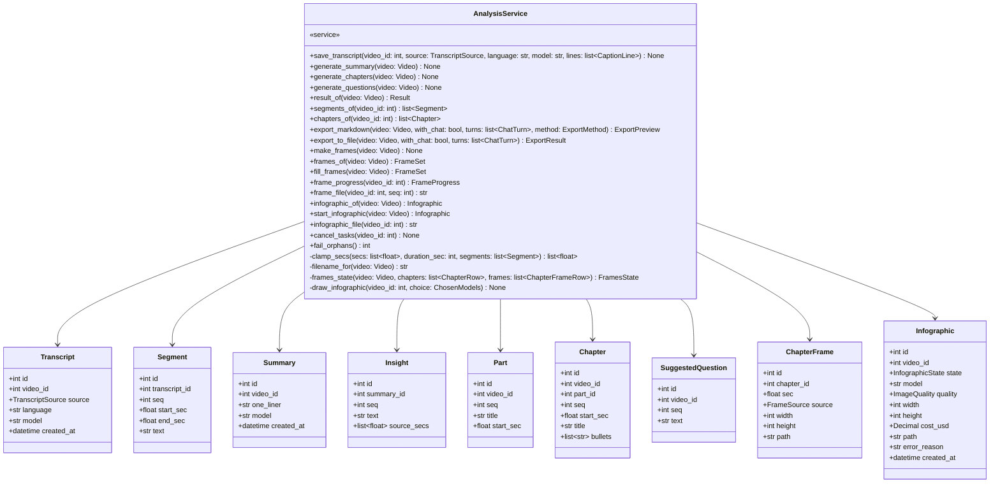
```mermaid
classDiagram
    class AnalysisService {
        «service»
        +save_transcript(video_id: int, source: TranscriptSource, language: str, model: str, lines: list~CaptionLine~) None
        +generate_summary(video: Video) None
        +generate_chapters(video: Video) None
        +generate_questions(video: Video) None
        +result_of(video: Video) Result
        +segments_of(video_id: int) list~Segment~
        +chapters_of(video_id: int) list~Chapter~
        +export_markdown(video: Video, with_chat: bool, turns: list~ChatTurn~, method: ExportMethod) ExportPreview
        +export_to_file(video: Video, with_chat: bool, turns: list~ChatTurn~) ExportResult
        +make_frames(video: Video) None
        +frames_of(video: Video) FrameSet
        +fill_frames(video: Video) FrameSet
        +frame_progress(video_id: int) FrameProgress
        +frame_file(video_id: int, seq: int) str
        +infographic_of(video: Video) Infographic
        +start_infographic(video: Video) Infographic
        +infographic_file(video_id: int) str
        +cancel_tasks(video_id: int) None
        +fail_orphans() int
        -clamp_secs(secs: list~float~, duration_sec: int, segments: list~Segment~) list~float~
        -filename_for(video: Video) str
        -frames_state(video: Video, chapters: list~ChapterRow~, frames: list~ChapterFrameRow~) FramesState
        -draw_infographic(video_id: int, choice: ChosenModels) None
    }
    class Transcript {
        +int id
        +int video_id
        +TranscriptSource source
        +str language
        +str model
        +datetime created_at
    }
    class Segment {
        +int id
        +int transcript_id
        +int seq
        +float start_sec
        +float end_sec
        +str text
    }
    class Summary {
        +int id
        +int video_id
        +str one_liner
        +str model
        +datetime created_at
    }
    class Insight {
        +int id
        +int summary_id
        +int seq
        +str text
        +list~float~ source_secs
    }
    class Part {
        +int id
        +int video_id
        +int seq
        +str title
        +float start_sec
    }
    class Chapter {
        +int id
        +int video_id
        +int part_id
        +int seq
        +float start_sec
        +str title
        +list~str~ bullets
    }
    class SuggestedQuestion {
        +int id
        +int video_id
        +int seq
        +str text
    }
    class ChapterFrame {
        +int id
        +int chapter_id
        +float sec
        +FrameSource source
        +int width
        +int height
        +str path
    }
    class Infographic {
        +int id
        +int video_id
        +InfographicState state
        +str model
        +ImageQuality quality
        +int width
        +int height
        +Decimal cost_usd
        +str path
        +str error_reason
        +datetime created_at
    }
    AnalysisService --> Transcript
    AnalysisService --> Segment
    AnalysisService --> Summary
    AnalysisService --> Insight
    AnalysisService --> Part
    AnalysisService --> Chapter
    AnalysisService --> SuggestedQuestion
    AnalysisService --> ChapterFrame
    AnalysisService --> Infographic
```

| 메서드 | 부르는 곳 | 유스케이스 | 던지는 에러 |
|---|---|---|---|
| `save_transcript` | pipeline (download · transcribe) | [[VA-UC-001#UC-S2]] 2 · [[VA-UC-001#UC-S3]] 4~5 | |
| `generate_summary` · `generate_chapters` · `generate_questions` | pipeline | [[VA-UC-001#UC-S4]] | (예외는 pipeline이 `fail`로 접는다) |
| `result_of` | [[VA-API-001#GET/api/videos/{id}/result]] | [[VA-UC-001#UC-H3]] · [[VA-UC-001#UC-H5]] 3 | result-not-ready |
| `segments_of` · `chapters_of` | ChatService | [[VA-UC-001#UC-H4]] 2, 3b | |
| `export_markdown` | [[VA-API-001#GET/api/videos/{id}/export]] | [[VA-UC-001#UC-H7]] 1~2, 2a, 2b | result-not-ready |
| `export_to_file` | [[VA-API-001#POST/api/videos/{id}/export]] | [[VA-UC-001#UC-H7]] 3, 2c · 2d | result-not-ready · export-failed |
| `make_frames` | pipeline(frames) · `fill_frames`가 띄운 태스크 | [[VA-UC-001#UC-S7]] | (부르는 쪽이 삼킨다 — 장면은 작업을 실패로 만들지 않는다) |
| `frames_of` | [[VA-API-001#GET/api/videos/{id}/frames]] | [[VA-UC-001#UC-H3]] 1a · 1b | result-not-ready |
| `fill_frames` | [[VA-API-001#POST/api/videos/{id}/frames]] | [[VA-UC-001#UC-H3]] 1a · [[VA-UC-001#UC-S7]] | result-not-ready · frames-unavailable |
| `frame_progress` | job/router([[VA-API-001#GET/api/videos/{id}/job]]의 `frames`) | [[VA-UC-001#UC-S6]] · [[VA-UC-001#UC-S7]] | |
| `frame_file` | [[VA-API-001#GET/api/videos/{id}/frames/{seq}]] | [[VA-UC-001#UC-H3]] | not-found(frame) |
| `infographic_of` | [[VA-API-001#GET/api/videos/{id}/infographic]] | [[VA-UC-001#UC-H9]] 5 | result-not-ready |
| `start_infographic` | [[VA-API-001#POST/api/videos/{id}/infographic]] | [[VA-UC-001#UC-H9]] 1~5, 2a · 4a · 5a | result-not-ready · infographic-busy · key-missing · key-invalid |
| `infographic_file` | [[VA-API-001#GET/api/videos/{id}/infographic/image]] | [[VA-UC-001#UC-H9]] 5 | not-found(infographic) |
| `cancel_tasks` | video/router([[VA-API-001#DELETE/api/videos/{id}]]) | [[VA-UC-001#UC-H6]] 4 | |
| `fail_orphans` | `main.py` 시작 절차 | — (5장 13) | |

**규칙이 사는 곳**
- `save_transcript`: Transcript + Segment 일괄 저장. 기존 것은 교체(1:1 유지, [[VA-DOM-001]] 6장 첫 항목). `seq`는 1부터 시각순
- `generate_summary`가 먼저, `generate_chapters`가 다음이다 — 단계 순서(핵심 요약 → 챕터 → 추천 질문)는 [[VA-PRD-001#R8]] · [[VA-DOM-001#AnalysisJob]] · [[VA-UI-002#UI-3]]이 같고 실행 순서도 그대로다. [[VA-UC-001#UC-S4]] 2~3번의 「챕터를 먼저」와 다르다(5장 10)
- `generate_chapters`: 챕터 수 목표 = 길이(분) ÷ 6. 스크립트가 토큰 상한(설정값)을 넘으면 시간 구간으로 나눠 구간별로 만든 뒤 합친다([[VA-UC-001#UC-S4]] 1a). 60분을 넘으면 `ChapterDraft.parts`로 파트를 만들고 챕터에 `part_id`를 붙인다(2a)
- `generate_summary`: 인사이트 수 = 60분 이하 5~8, 초과 10까지([[VA-PRD-001#R4]]). 스크립트가 토큰 상한을 넘으면 시간 구간별 중간 요약을 먼저 만들고 그것을 재료로 한 줄 요약과 인사이트를 만든다 — 챕터에 기대지 않는다. `clamp_secs`로 시각이 `[0, duration]` 밖이면 가장 가까운 구간 시각으로 보정([[VA-UC-001#UC-S4]] 5a) — 그래서 구간 목록을 인자로 받는다(MINISPEC 되먹임). 언어는 한국어
- `generate_questions`: 3개. 스크립트로 답할 수 있는 것만 — 프롬프트(`prompts/questions.md`)가 정한다([[VA-PRD-001#R9]])
- `result_of`: Transcript가 없으면 `result-not-ready`(`video_status` = `video.status`). `Part.end_sec` = 다음 파트 시작 또는 `duration_sec`, `chapter_count`는 세서 넣는다. `models`는 Transcript.model과 Summary.model. `chapters[].frame`은 `path`가 있는 장면 행에서, `frames_state`는 아래 규칙으로, `infographic`은 `infographic_of`와 같게 채운다. 읽기만 한다 — 장면 채우기를 시작하지 않는다([[VA-API-001]] 5장 14)
- `export_markdown` · `export_to_file`: `export.py`의 순수 함수가 [[VA-API-001#GET/api/videos/{id}/export]]의 순서로 만든다. 시각은 영상 길이로 표기가 정해진다(60분 미만 `mm:ss`, 이상 `h:mm:ss`, [[VA-UI-001#UI-4]]). YouTube면 `https://youtu.be/{source_id}?t={초}` 링크, 로컬은 시각만. 파일은 `data/export/{filename}.md`에 덮어쓴다. 파일 이름 규칙은 7장. `method`가 `file`이면 그림 줄(한눈에 보기의 인포그래픽 · 챕터마다 장면)과 `## 스크립트` 절이 들어가고 `files`에 함께 쓸 파일이 온다. `clipboard`면 둘 다 없다([[VA-UI-002#UI-7]] 규칙). 한눈에 보기는 Mermaid `gantt`(챕터 길이 비례)와 `mindmap`(뿌리 = 한 줄 요약)이다 — 쓰는 법(글자 바꾸기 · 눈금)은 MINISPEC 결과 서비스. `export_to_file`은 노트 · 스크립트에 더해 `path`가 있는 장면을 `{filename} {시각}.jpg`(쌍점은 하이픈)로, 인포그래픽을 `{filename} 인포그래픽.png`로 같은 폴더에 복사한다 — 있는 것만, 같은 이름은 덮어쓴다([[VA-UC-001#UC-H7]] 2c · 2d)
- `make_frames`: 챕터 순서대로, 행이 없는 챕터만 한다(다시 시도 · 이어 채우기). YouTube는 `storyboard`, 로컬 영상은 `local_frames` 포트이고 로컬 원본은 `sources.local_path`다. 한 장 받을 때마다 행을 쓴다 — 못 얻은 챕터는 null 행(2.3). 그래서 진행(UI-3 장면 칸 · UI-4 6.8)이 한 장씩 보인다. 포트가 통째로 실패하면(스토리보드 없음 · 원본 없음) 남은 챕터에 null 행을 쓰고 끝난다. 하는 동안 영상 id를 「도는 중」(클래스 속성)에 둔다. OpenAI를 부르지 않고 키도 보지 않는다([[VA-UC-001#UC-S7]])
- `frames_state`: 도는 중이면 `making` → 챕터마다 행이 있으면 `done` → 음성 파일이거나(확장자) 로컬 원본이 없으면 `unavailable` → 그 밖은 `absent`(장면 단계 전의 결과). 올린 사본은 분석이 끝나면 지우지만, 장면 단계를 거친 올린 영상은 이미 `done`이다
- `fill_frames`: `unavailable`이면 `frames-unavailable`(`reason`). `absent`면 도는 중에 넣고 `make_frames`를 태스크로 띄운다 — 태스크는 자기 세션을 연다. `making` · `done`이면 아무것도 하지 않는다. 202에 지금 `FrameSet` — 두 번 불러도 같다([[VA-API-001]] 5장 14)
- `frame_progress`: 챕터마다 `path`가 있는 행이면 `done`(`url` 있음), null 행이면 `missing`, 행이 없으면 도는 중일 때 첫 챕터가 `in_flight`이고 나머지는 `waiting`. `done` 수는 `path`가 있는 행, `total`은 챕터 수
- `frames_of` · `frame_file`: `frames`는 `path`가 있는 행만, 챕터 순서. `url`은 `/api/videos/{id}/frames/{seq}`. 행이 없거나 `path`가 null이면 `not-found`(`frame`)
- `start_infographic`: 순서는 [[VA-API-001#POST/api/videos/{id}/infographic]] 1~4번 — `result-not-ready` → 행이 `making`이면 `infographic-busy` → 키 확인(`register`와 같다) → 행을 `making`으로(없으면 만든다, 이전 그림 속성은 그대로) → `current_models`의 이미지 모델 · 품질로 `draw_infographic`을 태스크로 띄우고 202. 다 그릴 때까지 기다리지 않는다
- `draw_infographic`: 자기 세션으로 요약 · 인사이트 · 챕터 제목을 읽어 `InfographicBrief`를 만들고 `ImageMakerPort.infographic`을 부른다. 그림은 임시 이름에 쓰고 성공하면 `data/infographics/{video_id}.png`로 바꿔 놓는다 — 실패해도 이전 그림이 그대로다. 성공은 `done` · 그림 속성 · `created_at` = 지금 · `cost_usd` = 그 품질의 한 장 값 · `error_reason` null, 실패는 `failed` · `error_reason`(어댑터가 한국어 한 줄로 바꿔 던진 것 — 서비스는 infra를 부르지 않는다)이고 그림 속성은 그대로다([[VA-UC-001#UC-H9]] 4a · 5a)
- `infographic_of` · `infographic_file`: 행이 없으면 `state = none` · `image = null`. `image.url`은 `/api/videos/{id}/infographic/image?v={created_at}` — 그림이 바뀌면 주소가 바뀐다. 그림 파일이 없으면 `not-found`(`infographic`)
- `cancel_tasks`: 그 영상의 장면 채우기 · 인포그래픽 태스크를 취소하고 기다린다. 없으면 아무것도 안 한다. 파이프라인의 장면 단계는 작업 태스크의 일부라 `JobService.cancel`이 멈춘다
- `fail_orphans`: 시작 때 `making`인 인포그래픽 행을 `failed`('서버가 다시 시작됨')로 — 핸들이 없어 영영 그리는 중으로 보이기 때문이다. 장면의 「도는 중」은 메모리에만 있어 되돌릴 것이 없다 — 다 못 채운 옛 결과는 `absent`로 보여 화면이 다시 시키고, 해 본 챕터는 건너뛴다(5장 11)
- 이 서비스는 작업 묶음을 모른다. 파이프라인이 부르는 순서는 파이프라인의 것이다. 뒤 일 태스크의 핸들은 클래스 속성 `dict[int, Task]` 둘(장면 · 인포그래픽)이다(5장 13)

### 4.4 chat

#### ChatService 대화 서비스

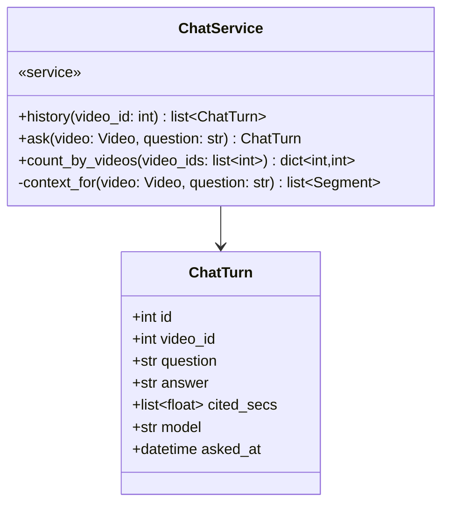
```mermaid
classDiagram
    class ChatService {
        «service»
        +history(video_id: int) list~ChatTurn~
        +ask(video: Video, question: str) ChatTurn
        +count_by_videos(video_ids: list~int~) dict~int,int~
        -context_for(video: Video, question: str) list~Segment~
    }
    class ChatTurn {
        +int id
        +int video_id
        +str question
        +str answer
        +list~float~ cited_secs
        +str model
        +datetime asked_at
    }
    ChatService --> ChatTurn
```

| 메서드 | 부르는 곳 | 유스케이스 | 던지는 에러 |
|---|---|---|---|
| `history` | [[VA-API-001#GET/api/videos/{id}/chat]] · analysis/router(내보내기 `with_chat`) | [[VA-UC-001#UC-H5]] 3 · [[VA-UC-001#UC-H7]] 2b | |
| `ask` | [[VA-API-001#POST/api/videos/{id}/chat]] | [[VA-UC-001#UC-H4]] | result-not-ready · key-missing · key-invalid · validation · llm-unavailable |
| `count_by_videos` | VideoService | [[VA-UC-001#UC-H5]] 1 | |

**규칙이 사는 곳**
- `ask`: 순서는 [[VA-API-001#POST/api/videos/{id}/chat]] 1~5번 — `video.status`가 `analyzed`가 아니면 `result-not-ready` → `require_key` → 빈 질문 `validation` → `context_for` → `AnswererPort.answer` → 저장. 실패하면 **저장하지 않는다**
- `context_for`: `AnalysisService.segments_of` 전부 + 최근 턴 10개. 구간 텍스트가 토큰 상한(설정값)을 넘으면 `chapters_of`로 질문과 관련된 챕터를 고르고 그 시각 범위의 구간만 넣는다([[VA-UC-001#UC-H4]] 3b). 챕터를 고르는 방법은 MINISPEC
- 근거 없는 답이면 `cited_secs = []`([[VA-UC-001#UC-H4]] 3a). `model`은 `SettingsService.current_models().text.id`
- 결과를 읽기만 한다. 스크립트 · 챕터를 바꾸지 않는다([[VA-DOM-001]] 4장)

### 4.5 core — 설정

#### SettingsService 설정 서비스

DB가 없는 서비스다. 키와 모델 선택은 `.env` 파일 하나에 살고, 이 서비스가 그 파일을 읽고 쓴다([[VA-INFRA-001#C6]], 사용자 결정 2026-09-21). 처음 설치 때 사용자가 직접 적은 키도, 화면에서 넣은 키도 같은 줄이다.

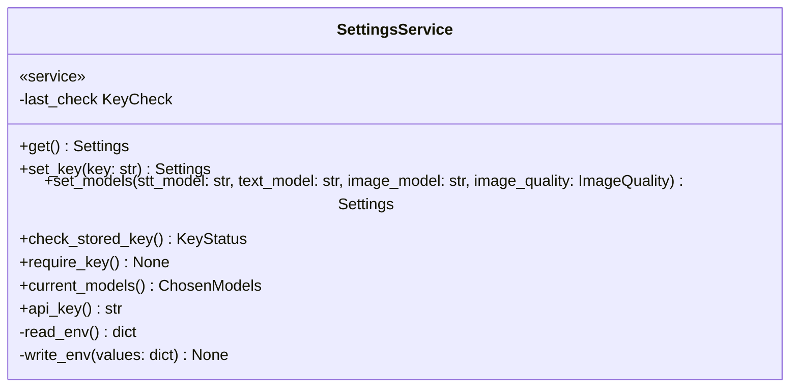
```mermaid
classDiagram
    class SettingsService {
        «service»
        +get() Settings
        +set_key(key: str) Settings
        +set_models(stt_model: str, text_model: str, image_model: str, image_quality: ImageQuality) Settings
        +check_stored_key() KeyStatus
        +require_key() None
        +current_models() ChosenModels
        +api_key() str
        -read_env() dict
        -write_env(values: dict) None
        -last_check KeyCheck
    }
```

| 메서드 | 부르는 곳 | 유스케이스 | 던지는 에러 |
|---|---|---|---|
| `get` | [[VA-API-001#GET/api/settings]] | [[VA-UC-001#UC-H8]] 1 | |
| `set_key` | [[VA-API-001#POST/api/settings/key]] | [[VA-UC-001#UC-H8]] 2~4, 3a | validation · key-rejected · llm-unavailable |
| `set_models` | [[VA-API-001#PUT/api/settings/models]] | [[VA-UC-001#UC-H8]] 5 | validation |
| `check_stored_key` | main(시작) · VideoService.register(분석 버튼) · VideoService.upload(올리기) · AnalysisService.start_infographic(인포그래픽) · require_key(마지막이 연결 실패일 때) | [[VA-UC-001#UC-H8]] 1a | |
| `require_key` | VideoService.register · upload · JobService.start · retry · ChatService.ask · AnalysisService.start_infographic | [[VA-UC-001#UC-H0]] 사전조건 · [[VA-UC-001#UC-H9]] 2a | key-missing · key-invalid |
| `current_models` | JobService · AnalysisService · ChatService | — | |
| `api_key` | `main.py`가 조립한 `client_for` | — | |

**규칙이 사는 곳**
- `check_stored_key`: `infra/openai.verify_key`로 가벼운 요청(모델 목록)을 보내고 `last_check`에 결과와 시각을 둔다. 부르는 때는 서버 시작, 분석 버튼, 파일 올리기, 인포그래픽 만들기, 키 저장, 그리고 마지막 확인이 연결 실패였을 때의 `require_key`다([[VA-UI-002#UI-5]] 규칙, [[VA-API-001]] 5장 11). `get`은 `last_check`를 돌려줄 뿐 다시 확인하지 않는다
- `require_key`: 비동기다 — 연결 실패였으면 OpenAI를 한 번 부를 수 있다. 부르는 곳은 모두 `await`한다. `last_check.state`가 `missing`이면 `key-missing`, `invalid`면 `key-invalid`(reason_kind · reason · checked_at). **다만 `invalid`의 이유가 `network`면 그 자리에서 `check_stored_key`를 한 번 부르고 새 결과로 판정한다** — 키가 틀린 것이 아니라 인터넷이 없었던 것이라 화면이 버튼을 막지 않는다([[VA-UI-002]] 1.4, [[VA-API-001]] 5장 11). 다른 이유는 다시 확인해도 같으므로 OpenAI에 보내지 않는다. 읽기 요청은 부르지 않는다 — 키 없이도 읽기는 전부 된다([[VA-API-001]] 1장)
- `set_key`: 확인이 통과해야 저장한다. 실패(`format` · `auth` · `quota`)는 `key-rejected`, 네트워크는 `llm-unavailable`. 둘 다 저장하지 않고 `last_check`도 바꾸지 않는다. 통과하면 `.env`의 `OPENAI_API_KEY` 줄을 고치고 `last_check`를 `ok`로
- `.env` 쓰기: `OPENAI_API_KEY` · `STT_MODEL` · `TEXT_MODEL` · `IMAGE_MODEL` · `IMAGE_QUALITY` 다섯 줄만 바꾸고 다른 줄 · 주석 · 순서는 그대로 둔다. 줄이 없으면 끝에 더한다. **제자리에서 쓴다** — 새 내용을 메모리에서 다 만든 뒤 같은 파일을 열어 한 번에 쓰고 자른다(`truncate` · `fsync`). 파일 하나를 바인드 마운트하면 그 파일이 마운트 지점이라 rename으로 바꿔치기할 수 없다(`EBUSY`, 컨테이너로 확인). 쓰기는 프로세스 안 잠금 하나로 줄 세운다(MINISPEC 설정 서비스 `SettingsService.write_env`). 서버를 다시 띄우지 않아도 다음 요청부터 새 값을 쓴다 — 읽을 때마다 파일에서 읽기 때문이다(`config.py`에 두지 않는 이유)
- `get`: `key.stored_in`은 키가 있으면 늘 '.env에 저장됨', 없으면 None. `image`는 고른 이미지 모델 · 품질(`.env`에 줄이 없으면 설정 첫 값 — gpt-image-2 · low)과 품질마다 한 장 값(설정값)
- `api_key`: `.env`의 `OPENAI_API_KEY`를 그대로 준다. 없거나 비었으면 None. 부르는 곳은 `main.py`가 조립해 어댑터에 넘기는 `client_for` 하나다 — 어댑터가 모델을 부를 때마다 이것으로 클라이언트를 받으므로, 화면이나 `.env`에서 키를 바꾸면 다음 호출부터 새 키를 쓴다. 키 전체가 밖으로 나가는 유일한 길이라 응답 · 로그에는 쓰지 않는다
- `set_models`: 값은 `model_options`(설정값)에 있는 id만. `.env`의 `STT_MODEL` · `TEXT_MODEL` 줄에 쓴다. 받아쓰기 목록은 구간 시각을 주는 모델만([[VA-INFRA-001#C3]]). 이미지 모델 · 품질도 설정값 목록에 있는 것만 받고, 보내지 않으면 그 줄을 그대로 둔다 — `IMAGE_MODEL` · `IMAGE_QUALITY`. 바꾼 품질은 다음 인포그래픽부터 쓴다
- 키 전체는 어떤 응답에도 없다. `masked`는 앞 3자 · 끝 4자

### 4.6 포트 — 외부 연동 인터페이스

포트는 항목으로 두지 않는다 — 시그니처가 MINISPEC에서 함수 단위로 정의된다. 어댑터는 Protocol을 구현하는 클래스 하나씩이고 테스트는 가짜 어댑터로 바꿔 끼운다. 두 번째 구현체(예: 로컬 whisper)는 실제로 생길 때 만든다. `FrameSourcePort`는 처음부터 구현이 둘이다 — YouTube는 영상을 내려받지 않고 스토리보드를, 로컬은 원본 프레임을 쓴다([[VA-INFRA-001#C12]]). 서비스가 영상의 출처 종류로 고른다.

```
video/ports.py
  YouTubeInfoPort.info(url: str) -> SourceInfo                 youtube_info.py → infra/ytdlp. 비공개·삭제·네트워크 → source-unavailable
  MediaProbePort.probe(path: str) -> tuple[int, bool]          media_probe.py → infra/ffmpeg. (duration_sec, has_audio). 못 열면 unsupported-file

job/ports.py
  AudioSourcePort.captions(video_id: str) -> tuple[list[CaptionLine], str, CaptionKind] | None
                                                               audio_source.py → infra/ytdlp. 수동 자막 우선, 없으면 자동, 둘 다 없으면 None
  AudioSourcePort.download_audio(video_id: str, dest: str) -> str
  AudioSourcePort.extract_audio(src: str, dest: str) -> str    → infra/ffmpeg. mp3 64kbps 모노
  AudioSplitPort.split(path: str, dest_dir: str) -> list[ChunkPlan]
                                                               audio_split.py → infra/ffmpeg. 무음 근처에서 자른다. 조각 길이는 설정값
  SttPort.transcribe(path: str, model: str) -> list[SttSegment]
                                                               stt_openai.py → infra/openai. verbose_json · segment 시각 (INFRA C3)

analysis/ports.py
  SummarizerPort.chapters(segments: list[Segment], duration_sec: int, model: str) -> ChapterDraft
  SummarizerPort.summary(segments: list[Segment], duration_sec: int, model: str) -> SummaryDraft
  SummarizerPort.questions(segments: list[Segment], model: str) -> list[str]
                                                               summarizer_openai.py → infra/openai. 프롬프트는 prompts/summary.md · chapters.md · questions.md
  FrameSourcePort.frames(source: str, secs: list[float], dest_dir: str) -> AsyncIterator[FrameShot | None]
                                                               시각 순서대로 하나씩 낸다. 못 얻은 시각은 None, 통째로 못 하면 예외
                                                               frames_storyboard.py → infra/ytdlp + infra/ffmpeg. source = YouTube 영상 ID.
                                                                 영상 정보를 한 번 받아 sb0 격자에서 시각마다 가장 가까운 칸을 자른다(INFRA C12)
                                                               frames_local.py → infra/ffmpeg. source = 원본 경로(sources.local_path). 폭 640
  ImageMakerPort.infographic(brief: InfographicBrief, model: str, quality: ImageQuality, dest: str) -> ImageShot
                                                               image_openai.py → infra/openai. 프롬프트는 prompts/infographic.md. 세로 한 장 PNG를 dest에 쓴다.
                                                                 실패는 openai.reason_of로 만든 한국어 한 줄을 담아 던진다

chat/ports.py
  AnswererPort.answer(question: str, context: list[Segment], history: list[ChatTurn], model: str) -> AnswerDraft
                                                               answerer_openai.py → infra/openai. 프롬프트는 prompts/answer.md
```

### 4.7 infra — 공용 클라이언트

묶음 밖. 외부 프로그램 · API를 감싸는 얇은 층이고 도메인 타입을 모른다. 어댑터만 부른다 — `openai.reason_of`는 예외를 글로 바꾸는 순수 함수라 파이프라인의 실패 이유 한 줄(`pipeline.reason_of`)도 부른다. 같은 표가 두 벌이 되지 않게. 시그니처는 MINISPEC에서 확정.

```
ytdlp.info(url) -> dict                 제목·채널·길이·자막 목록·스토리보드 목록(formats). 영상 ID 추출도 여기
ytdlp.captions(video_id, lang, kind) -> str          자막 원문(vtt)
ytdlp.download_audio(video_id, dest) -> str
ffmpeg.probe(path) -> dict              길이·스트림
ffmpeg.extract_audio(src, dest) -> str
ffmpeg.silences(path) -> list[float]    무음 구간 시각
ffmpeg.cut(path, start, end, dest) -> str
ffmpeg.frame(src, sec, width, dest) -> str       그 시각으로 건너뛰어(-ss) 프레임 한 장, 폭에 맞춘 JPEG
ffmpeg.crop(src, x, y, w, h, dest) -> str        그림(스토리보드 장의 주소도 된다)에서 칸 하나를 잘라 JPEG
openai.client(key) -> Client
openai.verify_key(key) -> KeyCheck      모델 목록 조회 한 번
openai.transcribe(client, path, model) -> dict
openai.chat(client, model, messages) -> str
openai.chat_json(client, model, messages, parse) -> T   JSON 모드. 형식이 틀리면 설정값만큼 다시 부르고, 그래도 틀리면 OpenAIOutputError
openai.image(client, model, prompt, size, quality) -> bytes   이미지 생성 한 번. PNG 바이트
openai.reason_of(e) -> str              OpenAI 호출 예외 → 한국어 한 줄(실패 알림 · 답변 실패의 '왜')
```

**규칙** — 키는 `SettingsService`가 준다. 어댑터는 키를 읽지 않고, 생성자에서 `client_for`(클라이언트를 주는 함수)를 받아 모델을 부를 때마다 부른다. `openai.client`는 키마다 클라이언트 하나를 캐시한다 — 키가 같으면 같은 것을 준다(MINISPEC infra `openai.client`). 밖으로 나가는 것은 이 파일 셋을 지나는 것뿐이다([[VA-INFRA-001#C9]]) — yt-dlp에 영상 ID, ffmpeg가 YouTube 스토리보드 장 주소(i.ytimg.com), OpenAI에 음성 조각 · 스크립트 텍스트 · 질문과 앞선 대화 · 인포그래픽 재료(한 줄 요약 · 인사이트 · 챕터 제목) · 키 확인.

---

## 5. 판단이 필요한 지점

**1. 설정을 어디에 두나 — 결정: `core/settings.py` + `core/settings_router.py`. 도메인 묶음을 만들지 않는다.**
[[VA-DOM-001]] 1장이 설정 · API 키를 개념이 아니라 인프라로 판정했고 DB가 없다. 묶음을 만들면 `models.py` · `crud.py`가 빈 다섯째 폴더가 생기고 도메인 모델의 경계 표에 개념 없는 묶음을 넣어야 한다. 라우터가 `core/`에 있는 것이 더 작은 벗어남이다. 키 저장 위치가 DB로 정해지면(7장) 도메인 모델부터 고친다.

**2. 파이프라인 위치 — 결정: `job/pipeline.py`. 묶음 밖 조율 모듈을 두지 않는다.**
세 묶음을 부르지만 상태를 바꾸는 주체는 작업 하나다. 함수 모듈 하나이고 `JobService`만 띄운다. 조율 모듈(pipeline · queries)을 묶음 밖에 두는 것은 입구가 둘이거나 조율이 여럿일 때다 — 여기는 하나다.

**3. 라우터가 서비스 둘을 잇는다 — 결정: 인자 전달만이면 허용. 판단이 생기면 그때 조율 모듈.**
영상 응답이 작업 요약과 대화 수를 품는다는 것은 API가 정한 모양이다([[VA-API-001]] 5장 10). 이것을 서비스 안에서 풀면 `VideoService → JobService`, `JobService → VideoService`가 서로를 불러 순환이 생긴다. 라우터가 `VideoService.get`의 결과를 `JobService.start`에 넘기는 것은 판단이 아니라 순서다. 3.1 표에 다섯 곳을 전부 적었고, 여기 없는 조합은 만들지 않는다.

**4. `Video.status`는 컬럼이 아니라 계산값 — 결정: 가장 최근 작업에서 `VideoService.to_dto`가 만든다.**
컬럼으로 두면 파이프라인이 끝날 때 작업 묶음이 영상 행을 고쳐야 한다(job → video 쓰기). 계산하면 상태가 한 곳(작업)에만 있고 어긋날 수 없다. `analyzed_at`도 같다 — `AnalysisJob.finished_at`이다.

**5. 도메인 모델과 다른 곳 — [[VA-DOM-001#Video]]의 「분석완료시각」이 컬럼이 아니고, 「작업」의 단계가 상태와 단계 둘로 나뉜다.** 둘 다 [[VA-API-001]] 5장 1 · 2에서 온 결정이다. 도메인 모델 갱신 요청을 7장에 둔다.

**6. 조각의 완료 여부는 bool이 아니라 상태 넷 — 결정: `ChunkState`.**
화면이 조각 격자에 완료 · 받아쓰는 중 · 실패 · 대기를 그린다([[VA-UI-002#UI-3]]). `done` 하나로는 받아쓰는 중과 대기를 못 가른다. `attempts`도 같은 이유로 행에 둔다 — 실패 알림이 「몇 번 다시 보냈는지」를 말한다. `result`도 행에 둔다 — 메모리에만 있으면 실패 뒤 재시도가 이어지지 않는다(시퀀스 되먹임).

**7. 화면 폴더 이름 — 결정: `screens/`.** Next.js가 `pages/`를 예약한다(1장). 역할은 기본형의 `pages/`와 같다.

**8. 백그라운드 태스크는 프로세스 안 asyncio, 대기열은 DB — 결정: 워커 하나가 `queued` 행을 차례로 돌리고, `JobService`가 도는 태스크의 핸들을 들고 삭제 때 취소한다.**
[[VA-INFRA-001]] 3절(프로세스 안 대기열, 워커 하나). 대기열을 메모리 큐가 아니라 `analysis_jobs.status = queued` 행으로 둔 것은 서버가 다시 떠도 기다리던 작업이 남아 있어야 하기 때문이다 — 메모리에는 「깨우는 신호」(`asyncio.Event`)만 있다. 시작하는 길을 하나로 하려고 `start`도 늘 `queued`로 넣는다. 서버가 죽으면 핸들이 사라지므로 시작 때 `running`인 행을 `failed`(kind `unknown`, reason '서버가 다시 시작됨')로 되돌려 다시 시도할 수 있게 한다 — `main.py`가 한다.

**9. Part의 끝 시각은 저장하지 않는다 — 결정: 읽을 때 다음 파트 시작으로 계산.** 챕터의 끝을 두지 않는 것과 같은 이유다([[VA-DOM-001#Chapter]]).

**10. 요약과 챕터의 실행 순서 — 결정: 핵심 요약 → 챕터 → 추천 질문. 단계 표시와 같다.**
[[VA-UC-001#UC-S4]]는 챕터를 먼저 만들고 긴 영상의 요약을 챕터 요약으로 만든다고 했지만, [[VA-PRD-001#R8]]의 단계 순서와 화면([[VA-UI-002#UI-3]])은 핵심 요약이 먼저다. 표시 순서와 실행 순서가 다르면 진행률과 「지금 하는 일」이 어긋난다. 긴 영상의 요약은 챕터 대신 시간 구간별 중간 요약을 재료로 쓴다 — 결과는 같고 단계 의존이 없다. 유스케이스 갱신 요청을 7장에 둔다.

**11. 얻지 못한 장면도 행을 남긴다 — 결정: `ChapterFrame`의 그림 속성이 모두 null인 행.**
옛 결과의 장면 채우기가 끝났는지 기억해야 다시 채우지 않는다([[VA-API-001#POST/api/videos/{id}/frames]] — 얻지 못한 챕터는 다시 채우지 않는다). 「채움 끝」을 영상이나 요약에 두면 영상 묶음이나 뜻이 다른 개체에 결과의 사정이 붙는다. 챕터마다 한 행이면 진행의 `missing`(UI-3 장면 칸)도 그대로 나오고, 서버가 채우다 죽어도 해 본 챕터를 건너뛰고 이어 채운다. 도메인 모델의 「장면 0..1」은 `path`가 있는 행이다 — 개념은 그대로다.

**12. 원본 경로는 `shared/sources.py` 하나 — 결정: 순수 함수 `local_path`. 사본 지우기는 영상 묶음.**
원본을 읽는 곳이 셋이다 — 영상(올리기 · 청소), 작업(음성 추출), 결과(장면). 서비스 메서드로 두면 작업 · 결과 묶음이 영상 묶음을 불러야 하는데 3.2에 없는 방향이다. 규칙이 `uploaded` · `source_id` · `origin`과 설정의 폴더뿐이라 순수 함수로 충분하다(`captions.pick`과 같은 까닭). 사본의 수명은 영상 묶음이 쥔다([[VA-DOM-001]] 4장) — 파이프라인은 끝났다는 것만 알리고(`main.py`가 넘긴 `release_upload`), 지우는 것은 `VideoService`다.

**13. 뒤 일은 대기열을 거치지 않는다 — 결정: 장면 채우기 · 인포그래픽 그리기는 `AnalysisService`가 띄우는 태스크.**
분석 작업은 하나씩 돈다(5장 8). 이 둘은 짧고(ffmpeg 몇 번 · 그림 한 장) 사용자가 결과를 읽는 동안 돌아야 한다([[VA-API-001]] 5장 13 · 14) — 대기열에 넣으면 다른 영상의 긴 받아쓰기 뒤에서 기다린다. 영상마다 하나씩이고 핸들은 클래스 속성이다. 인포그래픽의 「그리는 중」은 행에 두어 화면을 떠났다 와도 이어 보이고, 서버가 다시 뜨면 `failed`로 되돌린다. 장면의 「채우는 중」은 메모리에만 둔다 — 다 못 채운 옛 결과는 `absent`로 보여 화면이 다시 시키고, 11번 덕에 이어 채운다.

**14. 진행의 장면 칸은 라우터가 잇는다 — 결정: job/router가 `AnalysisService.frame_progress`를 받아 `JobService.progress`에 넘긴다.**
5장 3과 같다 — 인자를 넘길 뿐 판단이 없다. `JobService`가 결과 묶음을 부르면 3.2에 없는 방향(작업 서비스 → 결과 서비스)이 생긴다. 싣는지는 `JobService`가 단계 목록을 보고 정한다.

**15. 올리기 본문은 서비스가 받아 쓴다 — 결정: `VideoService.upload(name, size, body)`가 본문 조각의 비동기 반복자를 받는다.**
라우터는 헤더를 읽어 넘길 뿐이다. 쓰면서 SHA-256을 재야 수 GB를 다시 읽지 않고, 판정(키 · 형식 · 디스크)을 본문 전에 할 수 있다([[VA-API-001]] 5장 12). multipart는 프레임워크가 임시 파일에 다 쓴 뒤에야 넘겨 두 번 쓴다(6장).

---

## 6. 부록: FastAPI·SQLAlchemy 구현 형태

본문은 언어 중립이다. 이 절만 스택에 묶인다.

**모델**: SQLAlchemy 2.x declarative, async. 열거형은 `str` 컬럼 + 파이썬 `Enum`으로 검증. 목록 · dict 속성(`source_secs` · `bullets` · `cited_secs` · `stages` · `stage_durations_sec`)은 JSONB — ERD·DD에서 확정.

```python
# domains/video/models.py
class VideoRow(Base):
    __tablename__ = "videos"
    id: Mapped[int] = mapped_column(primary_key=True)
    source_id: Mapped[str] = mapped_column(String(64), unique=True)
    ...
```

**세션**: 요청마다 하나(`core/db.py`). 파이프라인 태스크는 단계마다 짧은 세션을 열고 닫는다 — 십여 분 도는 태스크가 세션 하나를 잡고 있지 않게. 트랜잭션 경계는 서비스 메서드 하나다.

**서비스 조립**: 서비스는 클래스이고 생성자가 세션과 그 묶음의 포트를 받는다(`VideoService(session, youtube_info, media_probe)` · `AnalysisService(session, summarizer, storyboard, local_frames, image_maker)`). 라우터는 요청 세션과 `app.state`의 어댑터로 만들고, 파이프라인은 부를 때마다 짧은 세션으로 만든다. 포트는 그 메서드가 쓸 때만 필요하다 — 읽기만 하는 곳은 포트 없이 만든다(영상 목록의 대화 수 `ChatService(session)`, 대화 맥락의 구간 · 챕터와 진행의 장면 칸 `AnalysisService(session)`). 포트 없이 포트가 필요한 메서드를 부르면 코드 실수라 `internal`(500)이다. `JobService`가 들고 있는 태스크 핸들과 워커를 깨우는 신호는 프로세스에 하나라 클래스 속성이다. 작업 묶음은 `Video` 타입을 타입 검사 때만 import한다 — 영상 묶음을 부르지 않는다(3.2).

**에러**: `core/errors.py`에 problem+json 종류마다 예외 클래스 하나. 라우터는 잡지 않고 앱 수준 핸들러가 `application/problem+json`으로 바꾼다. 포괄 핸들러가 나머지를 `urn:va:internal`로.

**백그라운드**: `asyncio.create_task(pipeline.run(...))`. 핸들은 `JobService`의 `dict[int, Task]`(video_id → Task). 프로세스 하나 전제. 장면 채우기 · 인포그래픽 그리기도 같은 모양이고 핸들은 `AnalysisService`의 `dict[int, Task]` 둘이다. 이 태스크는 요청이 끝난 뒤에도 돌므로 요청 세션을 쓰지 않고 스스로 짧은 세션을 연다(`core/db.py`).

**올리기 받기**: 라우터가 `request.stream()`(본문 조각의 비동기 반복자)과 `X-File-Name`(퍼센트 인코딩을 푼 것) · `Content-Length`를 `VideoService.upload`에 넘긴다. multipart(`UploadFile`)는 쓰지 않는다 — 임시 파일에 다 쓴 뒤에야 넘겨받아 수 GB를 두 번 쓰고, 디스크 판정도 늦다(5장 15).

**그림 응답**: 장면 · 인포그래픽은 `FileResponse`(`image/jpeg` · `image/png`). 장면은 `Cache-Control: no-cache` — 다시 채우면 같은 주소의 그림이 바뀐다. 인포그래픽은 주소의 `?v=`가 바뀌므로 캐시해도 된다([[VA-API-001]] 5장 15).

**외부 프로그램**: yt-dlp · ffmpeg는 `asyncio.create_subprocess_exec`. OpenAI는 공식 SDK의 async 클라이언트.

**마이그레이션**: Alembic, 리비전 하나 = ERD 변경 하나. 열거형 값 추가는 마이그레이션 없이 앱 상수만 바꾼다.

**프런트**: Next.js App Router, `output: 'standalone'`. `api/client.ts`는 fetch를 감싸고 problem+json을 예외로 바꾼다. 화면 상태는 서버 값을 그대로 쓴다 — 계산하지 않는다([[VA-API-001]] 1장). `next.config.ts`가 `/api/*`를 api로 넘길 때 시간 제한은 60초다(`experimental.proxyTimeout`, 기본 30초). 가장 긴 요청은 질문이다 — 마지막 키 확인이 연결 실패였으면 다시 확인(최대 10초)과 답(최대 20초)이 이어져 기본값에 닿는다. 넘기면 화면은 실패인데 서버는 답을 저장해, 다시 시도하면 같은 질문이 두 번 남는다. 인포그래픽은 이 제한에 걸리지 않게 맡기고 바로 돌려받는다(5장 13). **올리기는 넘기기가 아니라 라우트 핸들러가 받는다** — `app/api/uploads/route.ts`가 `fetch(API_URL + '/api/uploads', { method: 'POST', headers, body: request.body, duplex: 'half' })`로 본문을 스트림 그대로 넘기고 응답도 그대로 돌려준다. 넘기기의 60초 제한을 받지 않는다. proxy의 matcher에서 이 경로만 뺀다(1장). 화면은 올리기만 XHR로 보낸다 — fetch는 올리는 쪽 진행을 주지 않는다.

---

## 7. 미결사항

- [x] 웹에서 받은 키의 저장 위치 — 결정: `.env` 파일 하나, `SettingsService`가 그 줄을 고친다(4.5). `data/settings.json`은 쓰지 않는다(사용자 결정 2026-09-21)
- [x] (반영: 유스케이스 v2) 유스케이스 갱신 요청 — [[VA-UC-001#UC-S4]] 2~3번과 1a2의 「챕터 먼저」를 「핵심 요약 → 챕터」로, 긴 영상의 요약 재료를 「구간별 중간 요약」으로(5장 10)
- [x] (반영: 도메인 모델 v3) 도메인 모델 갱신 요청 — [[VA-DOM-001#Video]]에 작업 없는 영상(`registered`)과 실패 구분, 「분석완료시각」이 계산값이라는 것 · [[VA-DOM-001#AnalysisJob]]에 상태와 단계 분리(5장 4 · 5)
- [x] ERD·DD가 생기면 2장 각 항목에 테이블 참조를 더한다 — 반영. JSONB 속성 다섯은 [[VA-DOM-003]] 3장에서 확정
- [x] 텍스트 모델 비용 추정식(`JobService.estimate`) — 반영: MINISPEC 작업 서비스 `JobService.estimate` 5번(분당 토큰 추정 × 단가)
- [x] 조각이 없는 단계의 남은 시간 — 결정: 예상 전체 시간 − 지난 시간, 0 아래로 내려가지 않는다(4.2 `progress`). 바꿈(사용자 결정, 2026-09-23): 작업 전체가 끝날 때까지, 끝난 단계의 오차는 넘기지 않는다(같은 줄, [[VA-UI-001]] 8장)
- [x] `progress_pct`의 단계 가중치 — 반영: MINISPEC 작업 서비스 0장(받아쓰기가 있으면 70, 나머지 단계가 30을 나눈다)
- [x] inbox 길이 캐시 — 첫 버전은 캐시 없이 동시 4개로 잰다(MINISPEC 영상 서비스 `VideoService.list_inbox`). 느리면 그 문서 3장에서 다시 정한다
- [x] 내보내기 파일 이름 규칙 — 반영: MINISPEC 결과 서비스 `AnalysisService.filename_for`
- [x] 동시 분석 대기열 — 결정: 대기열(`queued` · `queued_at` · `pipeline.worker` · `claim_next`). `another-job-running`은 없앴다(사용자 결정 2026-09-21, 5장 8)
- [x] (반영: ERD v4) **되먹임** `analysis_jobs.queued_at timestamptz`와 대기열용 인덱스 — [[VA-DOM-003#analysis_jobs]]
- [x] 프롬프트 파일의 자리 표시 이름과 출력 형식 — 반영: MINISPEC 어댑터 0장 「프롬프트 파일」
- [ ] 관련 챕터 고르기(`ChatService.context_for`) — 첫 버전은 제목 · 요점 낱말 일치(MINISPEC 대화 서비스 `ChatService.context_for`). 품질이 모자라면 간단 임베딩으로 — 사용자가 결과를 보고 정한다([[VA-INFRA-001]] 9절)
- [x] `shared/` — 결정: 시각 표기가 두 묶음에서 쓰여 `shared/timecode.py`를 만들었다(1장, MINISPEC 어댑터 되먹임). 프런트는 `components/TimeChip`이 따로 가진다. 카드 B1에서 자막 고르기(`shared/captions.py`)를 더했다 — 실제 yt-dlp 목록에 기계 번역 자막이 섞여 규칙이 길어졌고, video와 job이 같은 규칙을 써야 한다. 카드 C에서 토큰 어림(`shared/tokens.py`)을 더했다 — analysis와 chat이 따로 가졌던 「글자 ÷ 2」가 실제의 절반 이하였다. 카드 D4 명세에서 원본 경로(`shared/sources.py`)를 더했다 — 영상 · 작업 · 결과 셋이 같은 규칙으로 inbox 파일과 올린 사본을 가른다(5장 12)
- [ ] 2장 `ChapterFrame` · `Infographic`의 테이블 참조 — ERD에 `chapter_frames` · `infographics`가 생기면 항목 링크로 바꾼다(다음 판)
- [ ] **되먹임** 올리기의 중복 판정 — 작업이 없는(등록만 된) 영상과 내용이 같으면 사본을 지우지 않고 그 영상을 올린 정보로 덮어쓴다(4.1). [[VA-API-001#POST/api/uploads]] 6번과 [[VA-UC-001#UC-H2]] 2c1의 「사본을 지운다」는 작업이 있는 영상일 때만 맞다 — 사전 안내에서 취소한 올린 영상을 다시 올리면 읽을 원본이 없어진다
