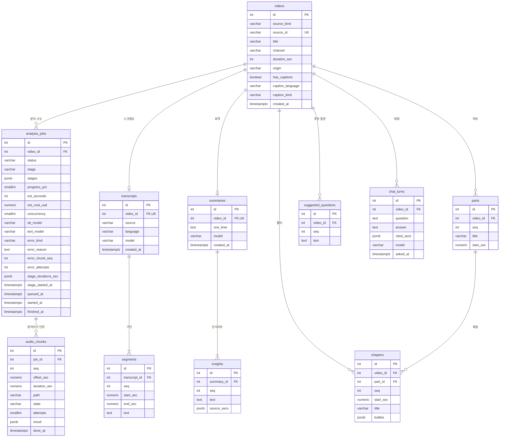

# ERD·DD

---

## 0. 이 문서가 다루는 것

클래스 명세의 엔티티 클래스를 **테이블**로 옮긴다. ERD는 그림, DD는 컬럼마다 타입·제약·의미를 적은 설명서다. 둘은 한 세트다.

ORM 모델 = 도메인 객체로 정했으므로([[VA-DOM-002]] 0장) 이 문서의 테이블 11개는 [[VA-DOM-002]] 2장의 엔티티 클래스 11개와 1:1이다. 클래스가 바뀌면 이 문서에 `확인 필요`가 붙어야 한다. 테이블 이름은 클래스 이름의 snake_case 복수형이다 — `Video` ↔ `videos`, `AnalysisJob` ↔ `analysis_jobs`.

**전제 (앞 단계에서 결정)**
- PostgreSQL 16, SQLAlchemy 2 async, Alembic([[VA-INFRA-001]] 3절). 첫 리비전 하나가 11개 테이블 전부다
- 기본키는 대리키(int 자동 증가). 사람이 부르는 값(출처 식별자)은 unique 제약
- 열거형은 DB enum이 아니라 `varchar` + 앱 검증. 값을 더할 때 마이그레이션을 피한다([[VA-DOM-002]] 2.5)
- 사용자 · 계정 테이블이 없다. 사용자 한 명, 인증 없음([[VA-INFRA-001#C5]])
- 설정(키 · 모델)은 테이블이 없다. `.env` 파일 하나에 살고 앱이 그 파일을 고친다([[VA-INFRA-001#C6]], [[VA-DOM-002#SettingsService]])
- 대기열도 테이블이 없다. `analysis_jobs`의 `status = 'queued'` 행이 대기열이고 순서는 `queued_at`이다([[VA-DOM-002]] 5장 8)
- 삭제는 하드 삭제다. `videos` 행을 지우면 딸린 것이 전부 cascade로 지워진다([[VA-UC-001#UC-H6]]). 소프트 삭제 컬럼은 없다 — 되살리기가 요구에 없다

---

## 1. ERD

**설계 규칙**
- 모든 테이블 PK는 `int` 자동 증가(`generated always as identity`). 출처 식별자 `videos.source_id`는 UK — 중복 판정의 근거다([[VA-UC-001#UC-S5]])
- 때는 전부 `timestamptz`. 영상 속 시각 · 길이는 초 단위 — 길이는 `int`, 구간 · 조각 · 챕터 · 파트의 시각은 `numeric(9,3)`(밀리초까지, 최대 999,999초). `float`를 쓰지 않는다 — 같은 시각을 두 곳(인사이트 `source_secs`와 구간 `start_sec`)에서 비교하므로 표현이 같아야 한다
- 열거형은 `varchar` + 앱 검증. 값 목록은 [[VA-DOM-002]] 2.5
- FK는 전부 `on delete cascade`. 영상을 지우면 작업 · 조각 · 스크립트 · 구간 · 요약 · 인사이트 · 파트 · 챕터 · 추천 질문 · 대화가 한 번에 사라진다([[VA-UC-001#UC-H6]] 성공 보장). `chapters.part_id`는 `on delete set null`이 아니라 cascade다 — 파트는 영상과 함께만 지워진다
- 1:1 관계(`transcripts` · `summaries`)는 `video_id`에 UK를 걸어 강제한다. 재분석은 행을 교체한다([[VA-DOM-001]] 6장, [[VA-DOM-002#AnalysisService]] `save_transcript`)
- 목록 속성(`stages` · `stage_durations_sec` · `result` · `source_secs` · `bullets` · `cited_secs`)은 `jsonb`다. 단독으로 조회 · 조인하는 일이 없어 자식 테이블을 만들지 않는다(3장 정규화)
- **`videos`에 `status` · `analyzed_at`이 없다.** 가장 최근 `analysis_jobs` 행에서 계산한다([[VA-DOM-002#Video]]). 상태가 두 곳에 있으면 어긋난다
- **`running`인 작업은 프로세스 전체에 하나다.** 나머지는 `queued`로 기다린다. 앱은 `running`이 없을 때만 다음 작업을 꺼내고([[VA-DOM-002#JobService]] `claim_next`), DB도 부분 unique 인덱스로 막는다(3장)
- **영상 하나에 기다리는 · 도는 작업은 하나다.** 앱이 작업이 있는지 먼저 보고([[VA-DOM-002#JobService]] `start`), 같은 영상에 [분석 시작]이 동시에 두 번 오면 DB가 부분 unique 인덱스로 둘째를 막는다(3장 · 4장 6)

---

## 2. DD (데이터 사전)

주요 컬럼만. 이름으로 뜻이 드러나는 것(`id`, `created_at`)은 뺐다. 타입은 PostgreSQL 이름이다.

### videos

클래스: [[VA-DOM-002#Video]] · 도메인: [[VA-DOM-001#Video]]

| 컬럼 | 타입 | 제약 | 의미 | 예시 |
|---|---|---|---|---|
| source_kind | varchar(10) | not null, SourceKind | 출처 종류 | `youtube` |
| source_id | varchar(64) | UK not null | YouTube 영상 ID(11자) 또는 파일 내용 SHA-256(64자). 같은 영상 판정의 근거 | `dQw4w9WgXcQ` |
| title | varchar(300) | not null | YouTube 제목 또는 파일 이름 | `RAG 서비스 1년 운영기` |
| channel | varchar(200) | null 허용 | YouTube 채널. 로컬이면 null | |
| duration_sec | int | not null, > 0, ≤ 10800 | 길이(초). 3시간 상한은 앱이 등록 때 거부하지만 CHECK로도 막는다([[VA-PRD-001#N2]]) | `3012` |
| origin | varchar(500) | not null | YouTube URL 또는 inbox 파일 이름. 결과 화면 '원본 영상 열기'와 내보내기 링크의 재료 | `https://www.youtube.com/watch?v=…` |
| has_captions | boolean | not null | 자막 유무. 사전 안내 판과 단계 목록을 가른다 | `true` |
| caption_language | varchar(10) | null 허용 | 자막 언어 코드. 자막이 없거나 로컬이면 null | `ko` |
| caption_kind | varchar(10) | null 허용, CaptionKind | 수동 · 자동 | `manual` |

### analysis_jobs

클래스: [[VA-DOM-002#AnalysisJob]] · 도메인: [[VA-DOM-001#AnalysisJob]]

| 컬럼 | 타입 | 제약 | 의미 | 예시 |
|---|---|---|---|---|
| video_id | int | FK videos cascade, not null | 어느 영상의 시도인가 | |
| status | varchar(10) | not null, JobStatus | queued · running · failed · done. `queued`는 앞 작업이 끝나기를 기다리는 것. 실패한 단계는 `stage`가 말한다 | `failed` |
| stage | varchar(12) | not null, JobStage | 지금 도는 단계, 실패했으면 실패한 단계. 시작 직후와 처음 대기하는 동안은 `pending`. 다시 시도해 대기하는 동안은 실패한 단계 그대로 | `transcribe` |
| stages | jsonb | not null | 이 출처에 필요한 단계 목록, 순서대로. 시작할 때 정해 바뀌지 않는다 | `["extract","transcribe","summarize","chapter","suggest"]` |
| progress_pct | smallint | not null, 0~100 | 진행률. 파이프라인이 갱신 | `38` |
| est_seconds | int | not null | 시작 전 예상 소요(초). 사전 안내 값의 사본 | `480` |
| est_cost_usd | numeric(8,4) | not null | 시작 전 예상 비용. 센트 아래 넷째 자리까지 — 분당 단가 $0.006을 곱한 값이 소수 셋째 자리를 넘는다 | `0.9200` |
| concurrency | smallint | not null | 동시에 보내는 조각 수. 시작 때 설정에서 복사 | `3` |
| stt_model | varchar(50) | null 허용 | 받아쓰기 모델. 자막이면 null | `whisper-1` |
| text_model | varchar(50) | not null | 요약 · 챕터 · 추천 질문 모델 | `gpt-5-mini` |
| error_kind | varchar(10) | null 허용, ErrorKind | 실패 종류. `status = failed`일 때만 | `network` |
| error_reason | text | null 허용 | 왜 실패했는지 한 줄(한국어). 화면 실패 알림 본문 | `네트워크 시간 초과` |
| error_chunk_seq | int | null 허용 | 실패한 조각 번호(k). 받아쓰기 밖 단계면 null | `16` |
| error_attempts | int | null 허용 | 그 조각 · 단계를 보낸 횟수(자동 재시도 포함) | `3` |
| stage_durations_sec | jsonb | not null, default `{}` | 완료한 단계마다 걸린 시간(초). 키는 JobStage | `{"extract": 41, "transcribe": 512}` |
| stage_started_at | timestamptz | not null | 지금 단계가 시작된 때. 단계가 바뀔 때마다 갱신. 걸린 시간·남은 시간의 기준 — 재시도 뒤에는 `started_at`으로 잴 수 없다(MINISPEC 되먹임). 대기 중에는 뜻이 없고, 워커가 `running`으로 바꿀 때 지금으로 적는다 | |
| queued_at | timestamptz | not null | 대기열에 들어간 때. [분석 시작]과 다시 시도 때 지금으로 적는다. 대기열 순서의 기준 — 다시 시도한 작업이 대기열 끝으로 가야 하는데 `started_at`은 다시 시도해도 그대로다 | |
| started_at | timestamptz | not null | [분석 시작]을 누른 때(대기열에 처음 들어간 때). 다시 시도해도 바뀌지 않는다. 목록의 최근 순 기준 | |
| finished_at | timestamptz | null 허용 | `done`이 된 때 = 영상의 분석 완료 시각 | |

CHECK: `status = 'failed'`이면 `error_kind` · `error_reason`이 not null, 아니면 둘 다 null. 재시도가 `queued`로 돌릴 때 넷을 비운다.

### audio_chunks

클래스: [[VA-DOM-002#AudioChunk]] · 도메인: [[VA-DOM-001#AudioChunk]]

| 컬럼 | 타입 | 제약 | 의미 | 예시 |
|---|---|---|---|---|
| job_id | int | FK analysis_jobs cascade, not null | 어느 작업의 조각인가 | |
| seq | int | (job_id, seq) UK, ≥ 1 | 조각 번호. 1부터. 화면의 '{k}번째 조각' | `16` |
| offset_sec | numeric(9,3) | not null | 전체 음성에서의 시작 오프셋. 구간 시각 복원의 근거([[VA-UC-001#UC-S3]] 4번) | `4500.000` |
| duration_sec | numeric(9,3) | not null | 조각 길이 | `300.000` |
| path | varchar(500) | null 허용 | 임시 파일 경로. 받아쓰기가 끝나 파일을 지우면 null | `data/tmp/12/16.mp3` |
| state | varchar(10) | not null, ChunkState | waiting · in_flight · done · failed | `done` |
| attempts | smallint | not null, default 0 | 보낸 횟수. 상한(설정값 3)에 닿으면 failed | `3` |
| result | jsonb | null 허용 | 그 조각의 받아쓰기 결과 — `{start_sec, end_sec, text, language}` 배열, 오프셋을 더하기 전. `done`이 될 때 저장. 실패 뒤 재시도가 `done` 조각을 다시 보내지 않는 근거([[VA-DOM-002#AudioChunk]], 시퀀스 되먹임). 스크립트를 만든 뒤에도 남긴다 | `[{"start_sec": 0.0, "end_sec": 4.2, "text": "…", "language": "ko"}]` |
| done_at | timestamptz | null 허용 | `done`이 된 때. 조각당 평균 시간 → 남은 시간 계산([[VA-UC-001#UC-S6]] 2번) | |

작업이 끝나도 행은 남긴다 — "30조각으로 받아썼다"는 이력이고 `result`가 그 증거다([[VA-DOM-001]] 5장 2). 영상을 지우면 cascade로 사라진다.

### transcripts

클래스: [[VA-DOM-002#Transcript]] · 도메인: [[VA-DOM-001#Transcript]]

| 컬럼 | 타입 | 제약 | 의미 | 예시 |
|---|---|---|---|---|
| video_id | int | FK videos cascade, UK not null | 영상과 1:1 | |
| source | varchar(15) | not null, TranscriptSource | caption_manual · caption_auto · stt. 화면이 '자막(수동)' · '자막(자동)' · '받아쓰기'로 | `caption_auto` |
| language | varchar(10) | not null | 언어 코드. 자막은 자막의 것, 받아쓰기는 모델이 감지한 것 | `ko` |
| model | varchar(50) | null 허용 | stt일 때 받아쓰기 모델. 자막이면 null | `whisper-1` |

### segments

클래스: [[VA-DOM-002#Segment]] · 도메인: [[VA-DOM-001#Segment]]

| 컬럼 | 타입 | 제약 | 의미 | 예시 |
|---|---|---|---|---|
| transcript_id | int | FK transcripts cascade, not null | | |
| seq | int | (transcript_id, seq) UK, ≥ 1 | 시각순 순번 | `412` |
| start_sec | numeric(9,3) | not null, ≥ 0 | 시작 시각. 화면 · 인사이트 · 답변이 "그 시각을 포함하는 구간"을 찾는 키 | `760.120` |
| end_sec | numeric(9,3) | not null, ≥ start_sec | 끝 시각 | `764.900` |
| text | text | not null | 문장. 자막 한 줄 또는 API가 준 segment 하나 | |

3시간 영상은 3,000행 안팎. 한 영상의 구간을 한 번에 읽는다([[VA-API-001#GET/api/videos/{id}/result]]).

### summaries

클래스: [[VA-DOM-002#Summary]] · 도메인: [[VA-DOM-001#Summary]]

| 컬럼 | 타입 | 제약 | 의미 | 예시 |
|---|---|---|---|---|
| video_id | int | FK videos cascade, UK not null | 영상과 1:1 | |
| one_liner | text | not null | 한 줄 요약(TL;DR) | |
| model | varchar(50) | not null | 만든 모델. 모델을 바꿔 다시 만들었을 때 구분 | `gpt-5-mini` |

### insights

클래스: [[VA-DOM-002#Insight]] · 도메인: [[VA-DOM-001#Insight]]

| 컬럼 | 타입 | 제약 | 의미 | 예시 |
|---|---|---|---|---|
| summary_id | int | FK summaries cascade, not null | | |
| seq | int | (summary_id, seq) UK, ≥ 1 | 화면의 두 자리 번호(01, 02 …) | `3` |
| text | text | not null | 인사이트 문장 | |
| source_secs | jsonb | not null | 출처 시각들(초, 하나 이상). 구간 FK가 아닌 이유는 [[VA-DOM-001]] 5장 1 | `[760.12, 1523.0]` |

### parts

클래스: [[VA-DOM-002#Part]] · 도메인: [[VA-DOM-001#Part]]

| 컬럼 | 타입 | 제약 | 의미 | 예시 |
|---|---|---|---|---|
| video_id | int | FK videos cascade, not null | 60분 넘는 영상에만 행이 있다 | |
| seq | int | (video_id, seq) UK, ≥ 1 | 파트 순번 | `2` |
| title | varchar(200) | not null | 파트 제목 | |
| start_sec | numeric(9,3) | not null, ≥ 0 | 시작 시각. 끝 시각은 다음 파트의 시작 또는 영상 길이로 읽을 때 계산한다([[VA-DOM-002]] 5장 9) | `3600.000` |

### chapters

클래스: [[VA-DOM-002#Chapter]] · 도메인: [[VA-DOM-001#Chapter]]

| 컬럼 | 타입 | 제약 | 의미 | 예시 |
|---|---|---|---|---|
| video_id | int | FK videos cascade, not null | | |
| part_id | int | FK parts cascade, null 허용 | 속한 파트. 60분 이하 영상은 null | |
| seq | int | (video_id, seq) UK, ≥ 1 | 영상 안 순번(파트를 가로질러 이어진다) | `14` |
| start_sec | numeric(9,3) | not null, ≥ 0 | 시작 시각. 챕터의 끝은 다음 챕터의 시작이라 두지 않는다([[VA-DOM-001#Chapter]]) | `760.000` |
| title | varchar(200) | not null | 챕터 제목 | |
| bullets | jsonb | not null | 요점 2~3줄(문자열 배열) | `["…", "…"]` |

CHECK: `part_id`가 있으면 그 파트의 `video_id`와 같은 영상이어야 한다 — 복합 FK `(part_id, video_id) → parts(id, video_id)`로 강제한다. `parts(id, video_id)`에 UK를 둔다.

### suggested_questions

클래스: [[VA-DOM-002#SuggestedQuestion]] · 도메인: [[VA-DOM-001#SuggestedQuestion]]

| 컬럼 | 타입 | 제약 | 의미 | 예시 |
|---|---|---|---|---|
| video_id | int | FK videos cascade, not null | 영상마다 3행 | |
| seq | int | (video_id, seq) UK, 1~3 | 순번 | `1` |
| text | text | not null | 질문 문장. 스크립트로 답할 수 있는 것만([[VA-PRD-001#R9]]) | |

### chat_turns

클래스: [[VA-DOM-002#ChatTurn]] · 도메인: [[VA-DOM-001#ChatTurn]]

| 컬럼 | 타입 | 제약 | 의미 | 예시 |
|---|---|---|---|---|
| video_id | int | FK videos cascade, not null | 영상별 기록([[VA-PRD-001#R7]]) | |
| question | text | not null | 질문 | |
| answer | text | not null | 답변. 근거가 없으면 "이 영상에서는 다루지 않습니다" 계열 | |
| cited_secs | jsonb | not null | 근거 시각들(초). 빈 배열이면 근거 없음 — null이 아니다 | `[]` |
| model | varchar(50) | not null | 답한 모델 | `gpt-5-mini` |
| asked_at | timestamptz | not null | 물은 때. 시간순 정렬과 최근 10턴 맥락의 기준 | |

답을 받지 못한 질문은 행이 없다([[VA-API-001#POST/api/videos/{id}/chat]]). 저장은 답을 받은 뒤 한 번이다.

---

## 3. 인덱스와 정규화

인덱스는 여기 적힌 것만. FK와 UK는 전부 인덱스(생략). 아래는 조회 패턴에서 온 추가 인덱스다.

| 테이블 | 인덱스 | 이유 (어느 쿼리) |
|---|---|---|
| analysis_jobs | `(video_id, started_at desc)` | 영상의 최근 작업 · `JobService.latest` · `latest_by_videos`. 목록의 최근 순 정렬도 이 컬럼 |
| analysis_jobs | `(status) where status = 'running'` **부분 unique** | 프로세스 전체에 `running` 하나. `claim_next`의 뒷받침 — 두 워커가 동시에 꺼내려 해도 하나만 성공한다. 서버가 두 번 떠도 둘이 동시에 돌 수 없다 |
| analysis_jobs | `(video_id) where status in ('queued', 'running')` **부분 unique** | 영상 하나에 기다리는 · 도는 작업은 하나. `start`의 뒷받침 — 같은 영상에 [분석 시작]이 동시에 두 번 와도(탭 둘) 하나만 들어간다. 끝난 · 실패한 작업은 막지 않는다 |
| analysis_jobs | `(queued_at) where status = 'queued'` 부분 | 대기열. `claim_next`(가장 이른 것 하나) · `queue_position`(자기보다 이른 것의 수). 대기 행은 많아야 몇 개라 부분 인덱스로 작게 둔다 |
| audio_chunks | `(job_id, state)` | 조각 집계(done · in_flight · failed · waiting) · `next_seq` · 재개 때 `done`이 아닌 조각 |
| segments | `(transcript_id, start_sec)` | 시각으로 구간 찾기(답변 맥락의 시각 범위, 시각 보정 `clamp_secs`). 순번 UK `(transcript_id, seq)`가 목록 조회를 맡는다 |
| chat_turns | `(video_id, asked_at)` | 시간순 기록 · 최근 10턴 · 영상별 개수 |
| parts | `(id, video_id)` unique | `chapters`의 복합 FK 대상 |

없는 것 — `videos.source_kind` · `analysis_jobs.stage` · `chapters.part_id` 단독 인덱스. 값 종류가 적거나 FK 인덱스로 충분하다. 사용자 한 명이 분석한 영상 수십 개 규모라 대부분의 조회는 `video_id` FK 인덱스 하나로 끝난다.

**정규화** — 전 테이블 3NF. 1NF에서 벗어난 `jsonb` 배열이 여섯이고 이유는 같다 — **단독으로 조회 · 조인하지 않는다.** `insights.source_secs` · `chapters.bullets` · `chat_turns.cited_secs`는 부모 행과 함께만 읽고 쓰며([[VA-DOM-002]] 7장 이전 결정), `analysis_jobs.stages` · `stage_durations_sec`는 작업 행의 부속 값이다. `audio_chunks.result`는 스크립트를 만들기 전까지만 읽고 그 뒤는 이력이다 — 구간 하나를 조각에서 찾는 일이 없다. 자식 테이블로 빼면 조회마다 조인이 늘고 얻는 것이 없다. 일곱째가 생기면 여기 이유를 적는다.

비정규화(중복 저장)는 없다. `videos`의 상태 · 분석 완료 시각을 컬럼으로 두지 않은 것이 그 결정이다(1장 설계 규칙). `analysis_jobs.est_*`는 사전 안내 값의 사본처럼 보이지만 설정(단가 · 조각 길이)이 바뀌면 다시 계산되는 값이라 그때의 예상치를 남기는 이력이다.

**마이그레이션** — Alembic 리비전 하나 = ERD 변경 하나. 첫 리비전 `0001_initial`이 11개 테이블과 인덱스 전부였고, `0002_job_active_per_video`가 영상 하나에 기다리는 · 도는 작업 하나를 막는 부분 unique를 더한다(4장 6). 열거형 값 추가는 마이그레이션 없이 앱 상수만 바꾼다. `downgrade`를 반드시 쓴다.

---

## 4. 판단이 필요한 지점

**1. 시각 컬럼의 타입 — 결정: `numeric(9,3)`.** `float`는 `760.12`가 `760.1199…`로 저장되어 인사이트의 출처 시각과 구간의 시작 시각을 같은 값으로 비교할 수 없다. `int`(초)는 자막 한 줄이 1초 안에 여럿일 때 순서를 잃는다. 밀리초 셋째 자리면 whisper-1의 segment 시각(소수 둘째 자리)을 그대로 담는다.

**2. `running` 하나를 DB가 막는다 — 결정: `status = 'running'` 부분 unique 인덱스.** 값이 하나뿐인 컬럼에 unique를 걸면 그 값의 행이 하나만 존재할 수 있다. 앱이 먼저 검사하지만, 서버 재시작 직후나 두 요청이 겹칠 때 DB가 마지막 방어선이다. 대기열이 생겨도 이 인덱스는 그대로다 — 기다리는 행은 `queued`이고 도는 것은 여전히 하나다(사용자 결정 2026-09-21).

**3. 조각 상태를 `boolean done`이 아니라 넷으로 — 결정: `varchar state` + `attempts`.** 화면이 조각 격자에 네 상태를 그리고 실패 알림이 「몇 번 다시 보냈는지」를 말한다([[VA-DOM-002]] 5장 6). 두 컬럼을 앱 메모리에 두면 서버가 죽었을 때 재개 지점을 잃는다.

**4. 챕터가 다른 영상의 파트를 가리키는 것을 막는다 — 결정: 복합 FK.** `chapters.part_id → parts.id` 하나로는 파트가 같은 영상 것인지 보장하지 못한다. `(part_id, video_id) → parts(id, video_id)`로 걸면 DB가 막는다. 앱 버그를 데이터로 굳히지 않기 위해서다.

**5. 삭제는 cascade 하나로 — 결정: 앱은 `videos` 행만 지운다.** 딸린 것 열 종류를 앱이 순서대로 지우면 빠뜨린다. FK cascade가 전부 지운다. 임시 파일(`data/tmp/{video_id}`)만 DB 밖이라 서비스가 따로 지운다([[VA-DOM-002#VideoService]] `delete`).

**6. 같은 영상에 작업이 둘 생기지 않게 DB가 막는다 — 결정: `(video_id) where status in ('queued', 'running')` 부분 unique 인덱스.** `start`는 작업이 있는지 먼저 보지만, 보는 것과 넣는 것 사이에 같은 영상의 [분석 시작]이 하나 더 오면(탭 둘) 둘 다 들어간다 — 파이프라인이 두 번 돌아 비용이 두 배가 되고 뒤 것이 결과를 갈아 끼운다. 영상과 작업은 1:N(분석 시도)이라 `video_id` 전체에 unique를 걸지 않고 기다리거나 도는 작업만 막는다. 다시 시도는 같은 행을 쓰므로 걸리지 않는다. 카드 B1 코드 리뷰에서 찾았다(2026-09-23).

---

## 5. 미결사항

- [x] 설정(키 · 모델) 저장 위치 — 결정: `.env` 파일 하나. `settings` 테이블은 만들지 않는다(사용자 결정 2026-09-21)
- [x] 대기열 — 결정: `status`에 `queued` 값, `queued_at` 컬럼, 부분 인덱스 `(queued_at) where status = 'queued'`([[VA-DOM-002]] 7장 되먹임 반영)
- [ ] `segments.text` 검색 — 첫 버전은 스크립트 검색이 요구에 없어 인덱스가 없다. 질문 맥락 선별을 임베딩으로 바꾸면(`ChatService.context_for`) 그때 `pgvector` 컬럼과 인덱스를 여기 더한다([[VA-INFRA-001]] 9절)
- [ ] `audio_chunks` 행의 보존 기간 — 지금은 영상과 함께 영구. 조각 이력이 쓸모없다고 판단되면 작업 완료 때 지우는 것으로 바꿀 수 있다([[VA-DOM-001]] 5장 2의 결정을 뒤집는 것이라 도메인 모델부터)
- [x] (반영: 클래스 명세 v7) 클래스 명세 2장 각 항목에 `테이블: [[VA-DOM-003#…]]` 참조를 더한다 — [[VA-DOM-002]] 7장에 적힌 일. 이 문서가 생겼으므로 다음 클래스 명세 수정 때
