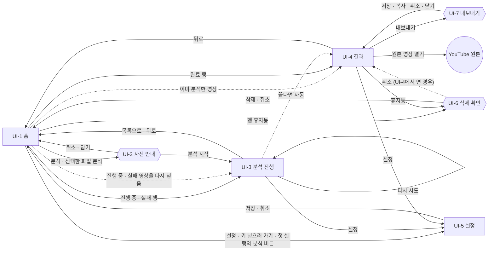

# 화면 설계

## 0. 이 문서가 다루는 것

웹에 **어떤 화면이 있고, 어디서 어디로 가는지**, 그리고 **어느 화면에서든 같아야 하는 값**(디자인 토큰·공통 틀)을 정한다. 화면마다 요소가 어디에 어떻게 놓이는지는 다음에 쓰는 와이어프레임 문서가 정한다.

| 이 문서가 정하는 것 | 와이어프레임 문서가 정하는 것 |
|---|---|
| 화면 7개와 각 화면의 종류·목적·주 유스케이스 | 화면마다 요소 배치와 요소 번호 |
| 화면 사이의 이동(진입·이탈·주소) | 요소 하나하나의 규칙과 문구 |
| 색·글꼴·간격·모서리·움직임 토큰 | 화면별 시나리오 |
| 헤더·버튼·칩·다이얼로그 같은 공통 틀 | |

**모양의 원본은 승인된 디자인 캔버스다.** 2026-09-17에 사용자가 승인했다 — https://claude.ai/artifact/5vRnv2qFrhTBDjYaNZC1XR (보드 13개). **토큰 값의 원본은 이 문서다.** 프런트엔드 `styles.css`는 3장을 그대로 옮겨 적은 것이고, 컴포넌트에 값을 직접 쓰지 않는다(명세 작성 규약 1.9). 디자인을 바꾸면 이 문서를 먼저 고치고, 코드는 그 뒤에 따라간다.

대상은 한 사람이 자기 PC에서 쓰는 로컬 웹이다([[VA-INFRA-001#C5]]). 디자인은 폭 1440px 데스크톱 한 가지만 그렸다.

**보드와 화면 대응** — .dc.html 보드는 원형이다. Next.js로 옮길 때 이 표로 찾는다([[VA-INFRA-001#C10]]).

| 보드 파일 | 캔버스 제목 | 화면 · 상태 |
|---|---|---|
| Main.dc.html | UI-1 홈 | UI-1 기본 상태 |
| FirstRun.dc.html | UI-1 홈 · 첫 실행 | UI-1 첫 실행 상태 (Main을 firstRun으로 불러옴) |
| Estimate.dc.html | UI-2 사전 안내 · 자막 있음 | UI-2 자막 있음 판 (뒤에 Main) |
| EstimateLocal.dc.html | UI-2 사전 안내 · 받아쓰기 필요 | UI-2 받아쓰기 필요 판 |
| Progress.dc.html | UI-3 분석 진행 · 요약 중 | UI-3 요약 중 |
| ProgressLocal.dc.html | UI-3 분석 진행 · 받아쓰기 12/30 | UI-3 받아쓰기 중 |
| ProgressFailed.dc.html | UI-3 분석 진행 · 실패 | UI-3 실패 |
| Result.dc.html | UI-4 결과 · 스크립트 | UI-4 스크립트 탭, 파트 없음 |
| ResultLong.dc.html | UI-4 결과 · 긴 영상 파트 | UI-4 파트로 묶은 챕터 |
| ResultChat.dc.html | UI-4 결과 · 질문하기 | UI-4 질문하기 탭 |
| Settings.dc.html | UI-5 설정 | UI-5 |
| Delete.dc.html | UI-6 삭제 확인 | UI-6 (뒤에 Main) |
| Export.dc.html | UI-7 내보내기 | UI-7 (뒤에 Result) |

보드 안의 예시 내용(RAG 발표, 데이터 카탈로그 워크숍, [채널명], 파일 이름)은 제품 문구가 아니다. 이 문서에서 `{ }`로 쓴 자리가 실제 값이 들어갈 곳이다.

**도출 방법** — 사용자가 주 액터인 유스케이스([[VA-UC-001#UC-H1]]~[[VA-UC-001#UC-H8]])와 화면에 드러나는 시스템 유스케이스를 화면으로 옮겼다. 유스케이스 하나가 화면 하나는 아니다. 같은 맥락에서 이어지는 일은 한 화면에 모으고(결과 읽기 + 질문), 흐름이 끊기는 일은 나눴다(넣기 → 사전 안내 → 진행 → 결과).

---

## 1. 유스케이스 대응

| 유스케이스 | 화면 | 화면 안 위치 |
|---|---|---|
| [[VA-UC-001#UC-H0]] 영상을 분석한다 (추상) | UI-1 → UI-2 → UI-3 → UI-4 | 흐름 전체. 구체적인 모습은 H1·H2 |
| [[VA-UC-001#UC-H1]] YouTube URL로 분석 | UI-1 → UI-2 → UI-3 → UI-4 | UI-1 「YouTube 링크」 카드 → UI-2 자막 있음 판 → UI-3 요약 중 |
| [[VA-UC-001#UC-H2]] 로컬 파일로 분석 | UI-1 → UI-2 → UI-3 → UI-4 | UI-1 「내 파일」 카드의 inbox 목록 → UI-2 받아쓰기 필요 판 → UI-3 받아쓰기 중 |
| [[VA-UC-001#UC-H3]] 결과를 읽는다 | UI-4 | 왼쪽 본문(한 줄 요약·핵심 인사이트·챕터) + 오른쪽 패널 [스크립트] 탭 |
| [[VA-UC-001#UC-H4]] 영상에 질문한다 | UI-4 | 오른쪽 패널 [질문하기] 탭. 추천 질문은 본문 「이런 걸 물어볼 수 있어요」와 입력칸 위 |
| [[VA-UC-001#UC-H5]] 분석한 영상을 다시 연다 | UI-1 → UI-4 (진행 중·실패는 UI-3) | UI-1 「분석한 영상」 목록 |
| [[VA-UC-001#UC-H6]] 분석 결과를 삭제한다 | UI-6 | UI-1 목록 행 휴지통, UI-4 머리 휴지통에서 여는 다이얼로그 |
| [[VA-UC-001#UC-H7]] 마크다운으로 내보낸다 | UI-7 | UI-4 머리 [내보내기]에서 여는 다이얼로그 |
| [[VA-UC-001#UC-H8]] API 키를 설정한다 | UI-1 → UI-5 | UI-1 첫 실행 배너, UI-5 「OpenAI API 키」 카드와 「밖으로 나가는 데이터」 표 |
| [[VA-UC-001#UC-S1]] 사전 안내를 만든다 | UI-2 | 전체 |
| [[VA-UC-001#UC-S2]] 자막 또는 음성을 확보한다 | UI-3, UI-4 | UI-3 단계 목록 첫 줄(자막 가져오기·음성 추출), UI-4 스크립트 머리줄의 출처 |
| [[VA-UC-001#UC-S3]] 받아쓰기한다 | UI-3 | 받아쓰기 단계와 조각 격자, 실패 알림 |
| [[VA-UC-001#UC-S4]] 요약·챕터·추천 질문을 만든다 | UI-3 → UI-4 | UI-3 단계 핵심 요약·챕터·추천 질문 → UI-4 본문 |
| [[VA-UC-001#UC-S5]] 결과를 저장하고 중복을 판정한다 | UI-1 | 목록 행. 중복이면 UI-2 대신 완료는 UI-4, 진행 중·실패는 UI-3 |
| [[VA-UC-001#UC-S6]] 진행 상태를 알린다 | UI-3, UI-1 | UI-3 진행 카드 전체, UI-1 목록 행의 상태 글자와 막대 |

**한 화면에 여러 유스케이스가 모인 곳**
- **UI-4 결과** — H3·H4가 주이고, H6·H7을 여기서 연다. 요약을 읽다가 시각을 눌러 스크립트를 보고, 궁금한 것을 묻고, 다 읽으면 내보내는 것은 한 맥락이다.
- **UI-1 홈** — H1·H2·H5가 주이고, H6(행 휴지통)과 H8(첫 실행 배너)의 입구가 있다. 사용자가 하는 일이 「넣기」 아니면 「다시 열기」라 첫 화면에 둘 다 보여야 한다.
- **UI-3 분석 진행** — S2·S3·S4·S6이 한 화면의 단계 목록으로 이어진다. 사용자에게는 「분석 중」 하나다.

**유스케이스 하나가 여러 화면에 걸친 곳**
- **H1·H2** — 넣기(UI-1) → 시작 확인(UI-2) → 진행(UI-3) → 결과(UI-4). 확인과 대기에서 흐름이 끊기므로 화면을 나눴다.
- **H8** — 키가 없다는 사실은 UI-1 배너가 알리고, 키 입력은 UI-5에서 한다.
- **S6** — 진행 상태는 UI-3에 자세히, UI-1 목록 행에 짧게 보인다. 화면을 닫아도 분석이 계속되므로 돌아갈 입구가 목록에 있어야 한다.

**스펙 용어와 화면 이름표** — 뜻은 같고 화면에서 부르는 이름만 다르다.

| 스펙 용어 | 화면 이름표 |
|---|---|
| 핵심 요약 ([[VA-PRD-001#R4]]) | 「한 줄 요약」 + 「핵심 인사이트」. 진행 단계 이름은 '핵심 요약' |
| 챕터 요약 ([[VA-PRD-001#R5]]) | 「챕터」 |
| Q&A · 채팅 · 질문창 ([[VA-PRD-001#R6]]) | [질문하기] 탭 |
| 추천 질문 ([[VA-PRD-001#R9]]) | 「이런 걸 물어볼 수 있어요」. 진행 단계·비용 줄에서는 '추천 질문' |
| 분석 결과 목록 ([[VA-PRD-001#R7]]) | 「분석한 영상」 |
| 사전 안내 ([[VA-PRD-001#R8]]) | '분석을 시작할까요?' 다이얼로그 |

---

## 2. 화면 목록

페이지 4개(UI-1·UI-3·UI-4·UI-5), 다이얼로그 3개(UI-2·UI-6·UI-7). 첫 실행은 화면이 아니라 UI-1의 상태다.

#### UI-1 홈

- **종류** 페이지. 주소 `/`
- **목적** YouTube 링크나 inbox 폴더의 파일을 골라 분석을 시작하고, 지금까지 분석한 영상을 보고 여는 첫 화면.
- **주 유스케이스** [[VA-UC-001#UC-H1]] · [[VA-UC-001#UC-H2]] · [[VA-UC-001#UC-H5]]. 여는 곳: [[VA-UC-001#UC-H6]](행 휴지통) · [[VA-UC-001#UC-H8]](첫 실행 배너). 보여 주는 곳: [[VA-UC-001#UC-S5]] · [[VA-UC-001#UC-S6]](목록 행 상태)
- **진입** 앱 시작 · 모든 페이지의 로고와 주 메뉴 '분석한 영상' · UI-3·UI-4의 '← 분석한 영상' · UI-3 실패 알림 [목록으로] · UI-2 [취소]·닫기 · UI-5 [취소]·[저장] · UI-6 [삭제]
- **이탈** [분석] → UI-2 자막 있음 판 · [선택한 파일 분석] → UI-2 받아쓰기 필요 판 · 목록 행: 완료 → UI-4, 진행 중·실패 → UI-3 · 행 휴지통 → UI-6 · 설정 아이콘·[키 넣으러 가기] → UI-5. 첫 실행 상태에서는 두 분석 버튼도 UI-5로 간다.
- **영역** 위에서 아래로: (첫 실행 배너) · 헤더 · 제목 '어떤 영상을 읽어 볼까요?'와 안내 · 입력 카드 둘(왼쪽 「YouTube 링크」, 오른쪽 「내 파일」) · 「분석한 영상」 목록 또는 빈 상태 상자.

| 상태 | 보드 | 모습 |
|---|---|---|
| 기본 (분석한 영상 있음) | Main | 배너 없음. 두 분석 버튼이 켜져 있다. 목록에 행이 있고 머리에 '{n}개' |
| 첫 실행 (API 키 없음, 분석한 영상 0개) | FirstRun | 맨 위 빨간 톤 배너와 [키 넣으러 가기]. 두 분석 버튼이 회색·aria-disabled이고 누르면 UI-5. 목록 대신 점선 빈 상태 상자, 개수 '0개'. inbox 목록은 그대로 보이고 고를 수 있다 |
| 키 없음 + 분석한 영상 있음 | 없음 | 배너와 막힌 분석 버튼은 첫 실행과 같다. 목록은 기본 상태처럼 행과 '{n}개'를 보이고, 행을 눌러 결과를 읽을 수 있다 |
| 목록 행 · 완료 | Main | 상태 글자 회색 보통 굵기 '{날짜 또는 오늘 HH:MM} 분석' |
| 목록 행 · 진행 중 | Main | 상태 글자 청록 굵게 '받아쓰기 중 · {n} / {m}' + 아래 작은 진행 막대 |
| 목록 행 · 대기 중 | 없음 | 상태 글자 캡션색 굵게 '대기 중 · {n}번째'. 작은 막대 없음. 앞 영상이 끝나면 진행 중 행으로 바뀐다 |
| 목록 행 · 실패 | Main | 상태 글자 빨강 굵게 '받아쓰기 {k} / {m}에서 멈춤' |
| inbox 파일 선택 | Main | 고른 행은 청록 테두리·연한 청록 바탕·채운 점. 한 번에 하나 |

- **규칙**
  - 키가 없으면 배너를 띄우고 두 분석 버튼을 막는다. 목록은 키와 따로 정한다: 분석한 영상이 있으면 그대로 보이고, 없을 때만 빈 상태 상자를 보인다(키 없음 + 목록 0개가 첫 실행 상태). 이미 분석한 영상은 키 없이 읽을 수 있다(배너 문구). 두 분석 버튼은 막히지만 초점을 받고, 누르면 UI-5로 간다.
  - 키가 있어도 확인에 실패하면(형식 오류·인증 실패·잔액 없음) 키 없음과 같이 다룬다. 같은 배너에 '키를 확인하지 못했어요 — {이유}'를 띄우고, 분석 버튼과 UI-4 질문 입력을 막고, [키 넣으러 가기]로 UI-5에 보낸다. **인터넷이 없어 확인하지 못한 것은 문구를 가른다** — '연결을 확인하지 못했어요 — 인터넷이 되면 분석 버튼을 누를 때 다시 확인합니다'이고 [키 넣으러 가기]는 보이지 않는다. 키가 틀린 것이 아니기 때문이다(사용자 결정 2026-09-21). 키는 앱이 시작할 때와 분석 버튼을 누를 때 확인한다([[VA-PRD-001#N3]], [[VA-INFRA-001#C6]]). 이 배너 문구들은 보드에 없다(8장).
  - YouTube 주소는 watch · youtu.be · shorts 세 형태를 받는다([[VA-PRD-001#R2]]). 형식이 틀리면 입력칸 아래에 바로 알리고 화면을 바꾸지 않는다([[VA-UC-001#UC-H1]] 1a, 4.5).
  - 로컬 파일은 inbox 폴더(`{inbox 경로}`) 목록에서만 고른다. 경로 입력·업로드·브라우저 파일 선택은 없다([[VA-INFRA-001#C4]]). 받는 형식 mp4 · mkv · mov · webm · mp3 · m4a · wav를 카드 안 맨 아래 줄, [선택한 파일 분석] 왼쪽에 적는다([[VA-PRD-001#R1]]).
  - inbox 행은 파일 이름(한 줄, 넘치면 말줄임)·길이·크기를 보인다. 목록을 주는 서버가 파일마다 길이도 알려 줘야 한다. 파일은 한 번에 하나만 고른다(aria-pressed).
  - 분석 버튼을 누르면 서버가 영상 정보를 확인하는 동안 그 버튼에 대기 표시를 하고, 끝나면 UI-2를 연다. 시작할 수 없는 영상이면 UI-2 자리에 이유를 보인다(4.5).
  - 이미 분석한 영상을 다시 넣으면 UI-2를 열지 않는다. 완료된 영상이면 UI-4를 열고 '이미 분석한 영상입니다'를 짧게 알린다. 진행 중이거나 실패한 영상이면 UI-3을 연다([[VA-PRD-001#R7]], [[VA-UC-001#UC-S5]]). 사전 안내(UI-2)에서 취소해 작업이 없는 영상은 목록에 보이지 않고, 다시 넣으면 처음 넣은 영상처럼 UI-2를 연다(8장).
  - 목록은 최근 순이다. 머리에 '{n}개'와 고정 글자 '최근 순'. 정렬 바꾸기와 검색은 없다.
  - 행 구성: 출처 아이콘(링크 = YouTube, 필름 = 로컬 파일) · 제목(한 줄 말줄임) · 부제('YouTube · {채널}' 또는 '로컬 파일') · 길이 · 상태 글자 · 휴지통.
  - 행 상태는 넷이고 누르면 가는 곳이 다르다([[VA-DOM-001#Video]]). 완료 → UI-4, 진행 중 → UI-3, 대기 중 → UI-3 대기 상태, 실패 → UI-3 실패 상태. 진행 중·실패 글자의 숫자는 UI-3 숫자 규칙을 따른다. 받아쓰기가 아닌 단계에서는 그 단계 이름을 쓴다.
  - 분석을 시작하면 영상이 바로 목록에 올라간다. 진행 중·실패 행에도 휴지통이 있다.
  - 진행 중 행의 작은 막대와 UI-3의 퍼센트는 같은 값을 쓴다. 보드의 40%와 38% 차이는 예시 값이다.
  - 키는 있는데 분석한 영상이 없으면 같은 빈 상태 상자를 쓰고, 설명에서 키 문장을 빼고 링크를 붙여 넣거나 inbox에 파일을 넣으라는 안내만 둔다([[VA-UC-001#UC-H5]] 1b).
  - 제목 아래 '분석 결과는 이 PC에만 저장됩니다.'([[VA-INFRA-001#C9]]), YouTube 카드 아래 '자막이 있는 영상은 받아쓰기 없이 1분 안에 끝나요.'([[VA-PRD-001#N1]])를 둔다.
  - 헤더의 '분석한 영상' 메뉴가 현재 위치로 표시된다.

#### UI-2 사전 안내

- **종류** 다이얼로그. UI-1 위에 뜬다. 주소가 없다.
- **목적** 분석을 시작하기 전에 고른 영상의 정보, 예상 시간, 예상 비용, OpenAI로 보내는 내용을 보여 주고 시작할지 묻는다.
- **주 유스케이스** [[VA-UC-001#UC-S1]] · [[VA-UC-001#UC-H0]] 2~3번. 근거 [[VA-PRD-001#R8]]
- **진입** UI-1 [분석] → 자막 있음 판 · UI-1 [선택한 파일 분석] → 받아쓰기 필요 판. 첫 실행 상태와 이미 분석한 영상일 때는 열리지 않는다.
- **이탈** [분석 시작] → UI-3 · [취소]·닫기(X)·Esc → UI-1. 취소하면 아무것도 전송하지 않는다.
- **영역** 머리(제목 '분석을 시작할까요?', 부제 '걸릴 시간과 비용을 먼저 확인하세요.', 닫기) · 영상 카드(썸네일 자리 아이콘, 제목, 출처 줄, 칩) · 두 칸 카드(「예상 시간」 「예상 비용」) · 전송 안내 상자 · 버튼 줄([취소] [분석 시작]).

| 상태 | 보드 | 모습 |
|---|---|---|
| 자막 있음 | Estimate | YouTube 영상. 재생 삼각형 아이콘, 출처 줄 'YouTube · {채널}'. 칩 '길이 {길이}'(회색) + '자막 있음 · {언어}'(청록). 예상 시간 '약 1분'. 비용 '받아쓰기 (자막 사용) $0.00' + '요약 · 챕터 · 추천 질문 ${금액}'. [분석 시작] → UI-3 요약 단계부터 |
| 받아쓰기 필요 | EstimateLocal | inbox 파일. 필름 아이콘, 제목은 파일 이름, 출처 줄 '로컬 파일 · inbox'. 칩 '길이 {길이}' + '자막 없음 · 받아쓰기 필요'(둘 다 회색). 비용 '받아쓰기 {분}분 × ${단가}' + '요약 · 챕터 · 추천 질문'. [분석 시작] → UI-3 받아쓰기 중 |

- **규칙**
  - 자막이 있으면 받아쓰기를 건너뛴다. 시간 설명은 '받아쓰기 없이 자막을 가져와 바로 요약합니다.'
  - 자막이 없으면 시간 설명은 '음성을 뽑아 {k}개 조각으로 나누고, {c}개씩 동시에 받아씁니다.' 조각 수 k와 동시 수 c는 서버가 준 값이다. 고정 문구가 아니다.
  - 자막 없는 YouTube도 받아쓰기 필요 판을 쓰고, 출처 줄만 'YouTube · {채널}'이다.
  - 예상 비용 = 받아쓰기 비용 + 요약·챕터·추천 질문 비용(추정). 큰 값은 합계에 '약'을 붙이고, 아래에 두 줄로 나눠 금액을 보인다. 받아쓰기 줄의 단가는 UI-5에서 고른 모델의 단가와 같다. 요약 비용을 어떻게 추정할지는 MINISPEC에서 정한다. [[VA-PRD-001#R8]]의 「비용 없음」 표시와 다르다(8장).
  - 예상 시간은 '약 {n}분'으로 보인다.
  - 전송 안내 상자는 무엇이 OpenAI로 가고 무엇이 안 가는지 알린다([[VA-PRD-001#N3]]). 자막 있음: 스크립트 텍스트만 OpenAI(요약 모델)로 가고 영상은 가지 않는다. 받아쓰기 필요: 받아쓰기에는 음성 조각이, 요약에는 스크립트 텍스트가 가고 영상 파일 자체는 PC 밖으로 나가지 않는다. 모델 이름은 설정 값을 쓴다.
  - 썸네일 자리는 아이콘만 둔다. 실제 썸네일 이미지는 그리지 않았다.
  - 시작할 수 없는 영상(정보 조회 실패, 3시간 초과, 음성 트랙 없음, 영상·음성 파일이 아님)은 이 다이얼로그 자리에 이유와 길이, [닫기]만 보이고 [분석 시작]은 없다([[VA-PRD-001#R2]], [[VA-PRD-001#N2]], 4.5).
  - 다른 영상이 분석 중이어도 [분석 시작]은 켜져 있다. 버튼 줄 왼쪽에 안내 한 줄 '지금 다른 영상을 분석 중이에요. 시작하면 차례를 기다렸다가 저절로 시작돼요.'를 보이고, 누르면 대기열에 들어가 UI-3 대기 상태가 열린다. 동시에 도는 분석은 하나다([[VA-PRD-001#R8]], 사용자 결정 2026-09-21).

#### UI-3 분석 진행

- **종류** 페이지. 주소 `/videos/{id}/progress`
- **목적** 분석이 지금 어느 단계에 있는지, 얼마나 남았는지, 무엇을 OpenAI로 보내는 중인지 보여 주고, 실패하면 이유와 이어서 다시 시도할 방법을 준다.
- **주 유스케이스** [[VA-UC-001#UC-S6]] · [[VA-UC-001#UC-S2]] · [[VA-UC-001#UC-S3]] · [[VA-UC-001#UC-S4]] · [[VA-UC-001#UC-H0]] 4~8번. 근거 [[VA-PRD-001#R8]]
- **진입** UI-2 [분석 시작] · UI-1 진행 중·실패 행 · UI-1에서 진행 중·실패한 영상을 다시 넣음 · 주소로 바로(새로 고침)
- **이탈** 끝나면 UI-4가 저절로 열린다 · '← 분석한 영상'·로고·주 메뉴·실패 알림 [목록으로] → UI-1 · 설정 아이콘 → UI-5 · 실패 알림의 다시 시도 → 같은 화면의 진행 상태
- **영역** '← 분석한 영상' · 영상 머리(44px 아이콘, 제목, '{출처} · {길이} · {자막 있음 또는 자막 없음}') · 진행 카드(헤드라인, 부제, 오른쪽 큰 퍼센트, 진행 막대, 단계 목록, 받아쓰기 단계 아래 조각 격자와 범례, 실패 때 실패 알림) · 카드 아래 줄(왼쪽 전송 표시, 오른쪽 떠나기 안내).

| 상태 | 보드 | 모습 |
|---|---|---|
| 요약 중 | Progress | 자막 있는 YouTube. 헤드라인 '핵심 요약을 만드는 중', 부제 '{m}단계 중 {i}단계 · 남은 시간 약 {n}초', 청록 퍼센트·막대, 4단계. 전송 표시 '스크립트 텍스트 → OpenAI {요약 모델}', 안내 '끝나면 결과 화면이 바로 열려요. 닫아도 분석은 계속됩니다.' |
| 받아쓰기 중 | ProgressLocal | 로컬 영상. 헤드라인 '받아쓰기 중', 부제 '조각 {n} / {m} · 남은 시간 약 {t}분', 5단계, 조각 격자(완료·받아쓰는 중·대기)와 범례. 전송 표시 '음성 조각 → OpenAI {받아쓰기 모델} · 동시 {c}개', 안내 '이 화면을 닫아도 분석은 계속돼요.' |
| 대기 중 | 없음 | 헤드라인 '차례를 기다리는 중', 부제 '앞 영상 {n}개가 끝나면 시작해요', 퍼센트 0%와 빈 막대, 단계 목록은 전부 대기 표시. 전송 표시 '아직 OpenAI로 보내는 것이 없어요', 안내 '이 화면을 닫아도 차례가 되면 시작돼요.' 차례가 오면 같은 화면이 진행 상태로 바뀐다 |
| 실패 | ProgressFailed | 헤드라인 '받아쓰기가 멈췄어요'(진한 빨강), 부제 '조각 {k} / {m}에서 실패 · 완료한 {j}개는 저장됨', 빨간 퍼센트·막대, 받아쓰기 단계에 빨간 X, 격자에 실패 칸. 실패 알림과 [목록으로] [{r}번째 조각부터 다시 시도]. 안내 '다시 시도하면 {r}번째 조각부터 이어서 받아씁니다.' |

출처마다 필요한 단계만 보인다. 자막 없는 YouTube와 로컬 음성 파일은 보드가 없다.

| 출처 | 단계 | 보드 |
|---|---|---|
| 자막 있는 YouTube | 자막 가져오기 → 핵심 요약 → 챕터 → 추천 질문 (4) | Progress |
| 자막 없는 YouTube | 음성 내려받기 → 받아쓰기 → 핵심 요약 → 챕터 → 추천 질문 (5) | 없음 |
| 로컬 영상 파일 | 음성 추출 → 받아쓰기 → 핵심 요약 → 챕터 → 추천 질문 (5) | ProgressLocal · ProgressFailed |
| 로컬 음성 파일 | 받아쓰기 → 핵심 요약 → 챕터 → 추천 질문 (4) ([[VA-UC-001#UC-H2]] 2b) | 없음 |

작업 단계([[VA-DOM-001#AnalysisJob]])와 화면 이름은 이렇게 맞춘다. 코드 값은 클래스 명세 초안 기준이고, 클래스 명세를 다시 쓸 때 맞춘다: `download` = 자막이면 '자막 가져오기', 아니면 '음성 내려받기' · `extract` = '음성 추출' · `transcribe` = '받아쓰기' · `summarize` = '핵심 요약' · `chapter` = '챕터' · `suggest` = '추천 질문' · `pending` = 첫 단계가 진행 중인 모습 · `done` = UI-4로 넘김 · `failed` = 실패 상태.

- **규칙**
  - 단계 표시는 넷이다. 완료 = 청록 원 + 흰 체크, 메모에 걸린 시간 · 진행 중 = 청록 테두리 원 + 가운데 점, 깜빡임, 이름 굵게, 메모 '진행 중' 또는 '{n} / {m}' · 실패 = 빨간 원 + 흰 X, 이름 굵게, 메모 '{k} / {m}에서 멈춤' · 대기 = 회색 빈 원, 메모 '—'. 단계 사이 연결선은 완료면 청록, 아니면 회색이고 마지막 단계에는 없다.
  - **숫자 규칙.** 진행 중 '조각 {n} / {m}'의 n은 **완료한 조각 수**다. 실패 때 '조각 {k} / {m}에서 실패'의 k는 **실패한 조각 번호**이고, 완료 수는 '완료한 {j}개는 저장됨'으로 따로 적는다. UI-1 목록 행도 같다.
  - 정상일 때 부제에 남은 시간을 보인다. 받아쓰기 단계의 남은 시간 = 미완료 조각 수 × 지금까지 조각당 평균([[VA-UC-001#UC-S6]] 2번). 조각이 없는 단계(자막 가져오기·음성 내려받기·음성 추출·핵심 요약·챕터·추천 질문)의 남은 시간은 사전 안내 예상 시간에서 지난 시간을 뺀 값이다. 0이 되면 남은 시간을 비운다. 계산은 서버가 한다.
  - 조각 격자와 범례는 받아쓰기 단계 아래에만 붙는다. 조각 하나가 칸 하나이고 한 줄에 15칸이다. 완료 청록 · 받아쓰는 중 연한 청록(깜빡임) · 실패 빨강 · 대기 회색. 범례에 칸 수를 적고, 격자의 aria-label에 같은 내용을 글로 적는다(예: '조각 {m}개 중 {n}개 완료, {c}개 받아쓰는 중').
  - 조각 수와 동시 수는 서버 값을 그대로 보인다.
  - 카드 아래 전송 표시는 지금 단계에서 무엇을 어느 모델로 보내는지 알린다. 받아쓰기 단계는 음성 조각 → 받아쓰기 모델, 요약·챕터·추천 질문 단계는 스크립트 텍스트 → 요약 모델. 전송 사실은 시작 전(UI-2)과 진행 중(여기)에 알린다.
  - 실패하면 헤드라인·퍼센트·막대가 빨강으로 바뀌고, 부제는 남은 시간 대신 보존된 것을 알린다. 단계 목록 아래 실패 알림(role=alert)이 뜬다. 제목은 무엇이 안 됐는지, 본문은 어느 조각을 몇 번 다시 보냈고 왜 실패했는지와 무엇이 보존됐는지다(4.5).
  - 한 조각은 자동으로 3번 다시 보낸 뒤 실패로 멈춘다. 이 횟수는 MINISPEC 값과 맞춘다.
  - 다시 시도는 같은 작업을 이어간다([[VA-UC-001#UC-S3]] 3a3). 완료하지 않은 조각만 보내고, 버튼 문구와 안내의 {r}은 완료하지 않은 첫 조각 번호다. 동시에 보내므로 실패한 조각 번호 {k}와 다를 수 있다. 요약·챕터·추천 질문 단계가 실패하면 같은 알림에 '{단계}부터 다시 시도'를 둔다.
  - 화면을 닫거나 떠나도 분석은 서버에서 계속된다. 진행 내용은 1초마다 새로 받는다([[VA-INFRA-001]] 3절).
  - 분석이 끝나면 UI-4를 저절로 연다. 결과로 가는 버튼은 없다.
  - 분석 취소·중지 버튼은 없다. 멈추려면 UI-6에서 그 영상을 지운다.
  - 헤더의 두 메뉴는 현재 위치로 표시하지 않는다.

#### UI-4 결과

- **종류** 페이지. 주소 `/videos/{id}`
- **목적** 분석이 끝난 영상 하나의 한 줄 요약, 핵심 인사이트, 추천 질문, 챕터를 읽고, 오른쪽 패널에서 시각이 붙은 스크립트를 따라가거나 영상에 질문한다.
- **주 유스케이스** [[VA-UC-001#UC-H3]] · [[VA-UC-001#UC-H4]]. 여는 곳: [[VA-UC-001#UC-H6]] · [[VA-UC-001#UC-H7]]. 보여 주는 곳: [[VA-UC-001#UC-S2]](스크립트 출처) · [[VA-UC-001#UC-S4]](요약·챕터·추천 질문)
- **진입** UI-3 끝남(자동) · UI-1 완료 행 · UI-1에서 이미 분석한 영상을 넣음 · UI-7 닫힘 · UI-6 취소 · 주소로 바로
- **이탈** '← 분석한 영상'·로고·주 메뉴 → UI-1 · 설정 아이콘 → UI-5 · [내보내기] → UI-7 · 휴지통 → UI-6 · '원본 영상 열기' → YouTube 원본(앱 밖)
- **영역** 두 열이다.
  - 왼쪽 본문(페이지와 함께 스크롤): 머리 줄('← 분석한 영상', 오른쪽 [내보내기]·휴지통) → 제목 블록(칩 셋, 제목, 메타 줄, '원본 영상 열기') → 「한 줄 요약」 → 「핵심 인사이트 {n}개」 → 「이런 걸 물어볼 수 있어요」 → 「챕터」.
  - 오른쪽 패널(폭 520px, 창에 고정, aria-label '스크립트와 질문'): 탭 바([스크립트] [질문하기 {n}]) → [스크립트]: 머리줄 + 구간 목록 / [질문하기]: 대화 목록(또는 빈 상태) + 아래에 고정된 입력 영역.

| 상태 | 보드 | 모습 |
|---|---|---|
| 스크립트 탭, 파트 없음 | Result | YouTube(자막). 칩 셋 'YouTube' · '{길이}' · '자막 · {언어}', '원본 영상 열기' 있음, 챕터 카드 한 줄 목록. 시각 12:40이 선택된 채로 그려짐 |
| 긴 영상, 파트로 묶음 | ResultLong | 로컬 파일(받아쓰기). '원본 영상 열기' 없음. 챕터 '{n}개 · 파트 {m}개', 첫 파트만 펼침. 시각은 H:MM:SS, 0:06:20 선택 |
| 질문하기 탭, 기록 있음 | ResultChat | 대화 3턴. 근거 칩이 붙은 답, 근거 없는 답(흐린 글자 + '영상에 없는 내용') |
| 질문하기 탭, 기록 없음 | ResultLong에서 탭을 누름 | 점선 상자 '아직 질문이 없어요'. 입력 영역은 그대로 |
| 시각 선택 | Result · ResultLong | 같은 시각의 스크립트 구간이 노란 바탕, 같은 시작 시각의 챕터 카드가 흰 바탕 + 청록 테두리, 스크립트 머리줄 오른쪽 시각이 바뀜 |
| 파트 펼침·접힘 | ResultLong | 파트 머리를 누르면 그 파트만 펴고 접는다. 화살표 90도 회전, aria-expanded |
| UI-7 뒤 배경 | Export | 스크립트 탭 상태가 덮개 아래 깔림 |

- **규칙**
  - 오른쪽 패널은 두 탭 중 하나만 보인다. 기본은 [스크립트]다. 패널 높이는 창 높이에서 헤더를 뺀 값이고, 패널 안에서 스크롤된다.
  - 시각을 누르는 네 곳(인사이트 시각 칩, 챕터 카드, 답변 근거 칩, 스크립트 구간)은 모두 같은 동작이다(4.4).
  - 결과 화면의 시각은 스크립트 이동에만 쓴다. YouTube 시점으로 가는 링크는 결과 화면에 없고 내보내기(UI-7)에만 있다. [[VA-UC-001#UC-H3]] 6a와 다르다(8장).
  - '원본 영상 열기'는 YouTube 결과에만 있고 새 탭으로 연다(새 탭은 보드에 없는 규칙). 로컬 파일 결과에는 없다.
  - 칩 셋: 출처('YouTube' 또는 '로컬 파일') · 길이 · 스크립트 출처와 언어('자막 · {언어}' 또는 '받아쓰기 · {언어}'). 메타 줄: '{채널 또는 로컬 파일} · {분석 시각} 분석 · {모델}'. 자막 결과는 '요약 {요약 모델}', 받아쓰기 결과는 '받아쓰기 {받아쓰기 모델}'.
  - 「한 줄 요약」은 한 문장을 큰 세리프 글자로 보인다.
  - 「핵심 인사이트」는 두 자리 번호(01, 02 …), 문장, 문장 끝 시각 칩 1개 이상이다. 이모지 카테고리는 붙이지 않는다. 개수는 1시간 이하 영상 5~8개, 넘으면 10개까지다([[VA-PRD-001#R4]]).
  - 추천 질문 3개가 두 곳에 같이 나온다: 본문의 큰 알약 버튼, 질문 입력칸 위의 작은 칩 줄. 어느 쪽이든 누르면 [질문하기] 탭으로 바뀌고 그 문장이 바로 전송된다([[VA-PRD-001#R9]]). 보드는 큰 알약을 누르면 [질문하기] 탭으로 바뀌는 것까지만 그렸다. 작은 칩의 동작과 바로 전송은 보드에 없는 규칙이다.
  - 챕터 카드는 시작 시각 칩 · 제목 · 가운뎃점 요점 2~3줄이다([[VA-PRD-001#R5]]). 보드의 1~2줄은 예시 데이터다. 머리에 '챕터 {n}개'와 안내 '누르면 오른쪽 스크립트가 그 위치로 이동해요'.
  - 영상이 1시간을 넘으면 챕터를 파트로 묶는다([[VA-PRD-001#R5]]). 머리는 '{n}개 · 파트 {m}개'. 파트 머리에 화살표 · 제목 · '챕터 {n}개' · '{시작} – {끝}'. 파트마다 따로 펴고 접고, 여러 개를 함께 펼 수 있다. 처음에는 첫 파트만 펼친다.
  - 스크립트 머리줄 왼쪽에 출처와 언어('자막(수동) · {언어}' 또는 '받아쓰기 {받아쓰기 모델} · {언어}'), 오른쪽에 선택한 시각을 보인다. 구간 줄은 시각 + 문장이다. 긴 영상도 조각 경계 없이 목록 하나로 보인다([[VA-PRD-001#R3]]). 수천 구간을 한꺼번에 그리는 방법(가상 스크롤 등)은 뒤 단계에서 정한다([[VA-PRD-001#N2]]).
  - [질문하기] 탭 배지는 질문 수다. 질문은 오른쪽 검은 말풍선, 답은 그 아래 문장이다. 근거가 있는 답에는 '근거'와 시각 칩이 붙는다. 근거가 없는 답은 흐린 글자에 '영상에 없는 내용' 배지가 붙는다([[VA-PRD-001#R6]]). 앞 대화에 이어 묻는 질문도 맥락 안에서 답하고, 기록은 다시 열어도 남는다.
  - 질문 기록이 0개면 점선 상자 '아직 질문이 없어요'와 '아래 추천 질문을 누르거나 직접 물어보세요. 답에는 근거가 된 시각이 함께 붙습니다.'를 보인다.
  - 입력 영역은 패널 아래에 고정이다: 추천 칩 한 줄(줄바꿈 없이, 넘치면 잘림) · 2줄 입력칸(placeholder '이 영상에 대해 물어보세요', 화면에 안 보이는 라벨 '이 영상에 질문하기') · [보내기] · '질문, 앞선 대화, 관련 스크립트가 OpenAI로 전송됩니다.'([[VA-PRD-001#N3]]). 보드 문구 '질문과 관련 스크립트가 OpenAI로 전송됩니다.'에 앞선 대화를 더했다(8장).
  - 보드에 없는 상태는 이렇게 한다. 답을 기다리는 동안 입력칸과 [보내기]를 잠그고 답 자리에 대기 표시를 둔다. 실패하면 답 자리에 이유와 [다시 시도]를 둔다([[VA-UC-001#UC-H4]] 2a). API 키가 없으면 입력칸을 막고 UI-5로 가는 안내를 둔다.
  - 머리의 휴지통은 흰 바탕·테두리 버튼에 빨간 휴지통 아이콘이다(4.2 테두리 아이콘 버튼, aria-label '분석 결과 삭제').
  - 헤더의 두 메뉴는 현재 위치로 표시하지 않는다.

#### UI-5 설정

- **종류** 페이지. 주소 `/settings`. 보드 높이 1400px로 한 화면보다 길다.
- **목적** OpenAI API 키 확인·교체, 받아쓰기와 요약용 모델 선택, inbox 폴더 위치 확인, 밖으로 나가는 데이터 안내를 한 곳에서 보여 준다.
- **주 유스케이스** [[VA-UC-001#UC-H8]]. 근거 [[VA-PRD-001#N3]] · [[VA-PRD-001#N4]] · [[VA-INFRA-001#C6]]
- **진입** 모든 페이지의 헤더 설정 아이콘 · UI-1 첫 실행 배너 [키 넣으러 가기] · UI-3·UI-4 키 없음 배너 [키 넣으러 가기] · 첫 실행 상태의 두 분석 버튼 · UI-4 질문하기의 키 없음 안내
- **이탈** [취소]·[저장]·로고·주 메뉴 → UI-1
- **영역** 제목 '설정'과 안내 '키와 모델 설정은 이 PC에만 저장됩니다.' · 카드 넷(「OpenAI API 키」 「모델」 「로컬 파일 폴더」 「밖으로 나가는 데이터」) · 페이지 아래 [취소] [저장].

| 상태 | 보드 | 모습 |
|---|---|---|
| 키 확인됨 | Settings | 키 카드 머리 줄 오른쪽 끝에 청록 톤 배지 '확인됨 · {확인 시각}'. 지금 쓰는 키는 가린 값과 '.env에 저장됨'. 받아쓰기 whisper-1, 요약 gpt-5-mini 선택 |

- **규칙**
  - 지금 쓰는 키는 앞부분과 끝 4자만 보이게 가린다. 전체를 다시 보여 주지 않는다. 입력칸이 아니라 읽기 전용 상자다.
  - 「새 키로 바꾸기」 입력칸은 password 형식이고 placeholder는 'sk-로 시작하는 키를 붙여 넣으세요'다.
  - [확인하고 저장]은 **키만** 다룬다. 가벼운 요청으로 먼저 확인하고, 통과하면 곧바로 저장하고 배지를 '확인됨 · {시각}'으로 바꾼다. 실패하면 배지를 확인 실패로 바꾸고 이유(형식 오류·인증 실패·잔액 없음)를 입력칸 아래에 보인다([[VA-UC-001#UC-H8]] 3a). 키는 저장소에 커밋되지 않는다.
  - 페이지 아래 [저장]은 **모델 선택**을 저장하고 UI-1로 간다. [취소]는 모델 변경을 버리고 UI-1로 간다. 키는 이미 [확인하고 저장]에서 저장됐으므로 [취소]가 되돌리지 않는다.
  - 웹에서 받은 키는 `.env` 파일의 그 줄에 쓴다. 지금 쓰는 키 상자의 캡션은 늘 '.env에 저장됨'이다([[VA-INFRA-001#C6]], 사용자 결정 2026-09-21). 모델 선택도 같은 파일에 쓴다.
  - 받아쓰기 모델은 whisper-1 하나다. 구간 시각을 주는 모델만 목록에 나온다([[VA-INFRA-001#C3]]). 요약 · 챕터 · 질문 모델은 gpt-5-mini(첫 값) · gpt-5.4-mini · gpt-5.4 중에서 고른다.
  - 모델 도움말의 단가는 고른 모델의 값을 보인다(보드는 gpt-5-mini 값 하나만 있다). UI-2 예상 비용도 같은 단가를 쓴다. 모델 바꾸기는 [[VA-UC-001#UC-H8]] 5번이다.
  - 「로컬 파일 폴더」는 경로와 '읽기 전용'만 보인다. 바꾸는 입력칸은 없다. 안내 '이 폴더의 파일을 읽기만 하고 고치거나 지우지 않아요. 위치는 docker-compose.yml에서 바꿀 수 있습니다.'([[VA-INFRA-001#C4]]).
  - 「밖으로 나가는 데이터」 표는 아래 네 줄이고, 끝에 '원본 영상 파일, 분석 결과, API 키는 이 PC 밖으로 나가지 않습니다.'를 둔다. 이 목록은 [[VA-PRD-001#N3]]·[[VA-INFRA-001#C9]]보다 넓다(8장).

| 어디로 | 무엇이 | 언제 |
|---|---|---|
| OpenAI | 음성 조각 | 자막 없는 영상을 받아쓸 때 |
| OpenAI | 스크립트 텍스트 | 요약 · 챕터 · 추천 질문을 만들 때 |
| OpenAI | 질문, 앞선 대화, 관련 스크립트 | 질문할 때 |
| YouTube | 영상 주소 | 정보 · 자막 · 음성을 받을 때 |

- 헤더의 설정 아이콘이 현재 위치로 표시된다(aria-current="page").
- 키가 없을 때와 확인 중일 때 키 카드 모양은 보드에 없다(8장).

#### UI-6 삭제 확인

- **종류** 다이얼로그(경고 다이얼로그). 주소가 없다.
- **목적** 분석 결과를 지우기 전에 무엇이 지워지고 무엇이 남는지 보여 주고 한 번 더 확인받는다.
- **주 유스케이스** [[VA-UC-001#UC-H6]]. 근거 [[VA-PRD-001#R7]]
- **진입** UI-1 목록 행 휴지통(aria-label '{제목} 분석 결과 삭제') · UI-4 머리 휴지통(aria-label '분석 결과 삭제')
- **이탈** [삭제] → UI-1(그 행이 사라진 목록) · [취소]·Esc → 연 화면 그대로(UI-1 또는 UI-4). 보드는 UI-1 위에 한 판만 그려 두 버튼 모두 UI-1로 이어져 있다.
- **영역** 빨간 톤 휴지통 아이콘 타일 · 제목 '분석 결과를 지울까요?' · 지울 영상 제목 · 두 칸(왼쪽 빨간 톤 「지워지는 것」, 오른쪽 회색 톤 「남는 것」) · 버튼 줄([취소] [삭제]).

| 상태 | 보드 | 모습 |
|---|---|---|
| 완료된 YouTube 영상 | Delete | 지워지는 것 '스크립트, 핵심 요약, 챕터, 추천 질문, 질문 기록 {n}개', 남는 것 'YouTube 원본 영상. 다시 넣으면 처음부터 분석합니다.' |

- **규칙**
  - 제목 바로 아래 지울 영상의 제목을 보이고, 다이얼로그 설명(aria-describedby)으로 잇는다.
  - 「지워지는 것」은 스크립트, 핵심 요약, 챕터, 추천 질문, 질문 기록 {n}개다. 분석이 끝나지 않은 영상(진행 중·실패)이면 '임시 음성 파일'을 더한다.
  - 「남는 것」은 YouTube면 'YouTube 원본 영상', 로컬 파일이면 'inbox 원본 파일'이다. 뒤에 '다시 넣으면 처음부터 분석합니다.'를 붙인다([[VA-INFRA-001#C4]]). 로컬 파일 문구는 보드에 없다.
  - 진행 중인 영상을 지우면 작업을 먼저 멈추고 지운다. 실패한 영상은 보존된 조각까지 지운다.
  - 되돌릴 수 없는 동작이다. [삭제]는 빨간 위험 버튼, [취소]는 보조 버튼이다.
  - 닫기(X)는 없다. 바깥을 눌러도 닫히지 않는다. 처음 초점은 [취소]에 둔다(4.3).

#### UI-7 내보내기

- **종류** 다이얼로그. UI-4 위에 뜬다. 주소가 없다.
- **목적** 보고 있는 분석 결과를 마크다운으로 만들어 파일로 저장하거나 클립보드에 복사한다.
- **주 유스케이스** [[VA-UC-001#UC-H7]]. 근거 [[VA-PRD-001#R10]]
- **진입** UI-4 머리 [내보내기]
- **이탈** 주 버튼([파일로 저장] 또는 [복사하기])·[취소]·닫기(X)·Esc → UI-4
- **영역** 머리(제목 '마크다운으로 내보내기', 부제 '시각은 [12:40] 형태로 남고, YouTube 영상이면 그 시점 링크가 걸려요.', 닫기) · 방법 두 칸(묶음 aria-label '내보내는 방법') · 체크박스 · 「미리 보기」 · 버튼 줄.

| 상태 | 보드 | 모습 |
|---|---|---|
| 파일로 저장 선택 (기본) | Export | '파일로 저장' 칸이 청록 테두리·연한 청록 바탕. 아래에 저장 경로. 주 버튼 [파일로 저장] |
| 클립보드에 복사 선택 | Export 안에서 칸을 누름 | '클립보드에 복사' 칸이 선택 표시, 캡션 '노트 앱에 바로 붙여 넣기'. 주 버튼 [복사하기] |

- **규칙**
  - 형식은 마크다운 하나다.
  - 방법은 둘 중 하나만 고른다(aria-pressed). 기본은 파일로 저장이다. 주 버튼 글자가 고른 방법을 따라간다.
  - 파일로 저장하면 서버가 `data/export/{파일 이름}.md`에 쓴다. 칸 아래에 그 경로를 보인다. 브라우저 다운로드는 두지 않는다. 파일 이름은 영상 제목에서 만들고, 만드는 규칙은 MINISPEC에서 정한다.
  - 체크박스 '질문 기록 {n}개도 넣기'는 기본으로 꺼져 있다. n은 UI-4 [질문하기] 배지 수와 같다.
  - 내용 순서: `# {제목}` → `원본: {링크} · {길이}` → `> {한 줄 요약}` → `## 핵심 인사이트` 번호 목록(문장 끝에 시각) → `## 챕터`(챕터마다 `### [{시각}]({링크}) {제목}`과 `- {요점}`) → 스크립트([[VA-PRD-001#R10]]) → 체크하면 질문 기록. 스크립트와 질문 기록은 미리 보기가 잘려 보드에 보이지 않는다.
  - 시각은 `[MM:SS]`(1시간 이상 영상은 `[H:MM:SS]`, 4.4를 따른다) 텍스트로 남는다. YouTube 영상이면 `https://youtu.be/{영상ID}?t={초}` 링크가 걸리고, 로컬 파일이면 링크 없이 시각만 남는다.
  - 미리 보기는 실제로 내보낼 내용의 앞부분이다. 높이 220px에서 잘린다. 체크박스를 바꾸면 따라 바뀐다(보드에 없는 규칙).
  - 주 버튼을 누르면 다이얼로그를 닫고 UI-4에서 완료를 짧게 알린다([[VA-UC-001#UC-H7]] 3번). 알림 모양은 보드에 없다.

---

## 3. 디자인 토큰

어느 화면에서든 같아야 하는 값이다. 코드의 CSS 변수는 이 장을 그대로 옮겨 적은 것이다 — 값을 바꾸려면 여기를 먼저 고친다. 값은 승인된 보드의 인라인 스타일에서 뽑았다.

### 3.1 색

| 용도 | 값 | 쓰는 곳 |
|---|---|---|
| 바탕 | `#F6F4EF` | 페이지·헤더 바탕, 사전 안내 영상 카드, 삭제 「남는 것」, 설정 읽기 전용 값 상자. 잉크 위 글자(주 버튼, 내 질문 말풍선, 보내기 아이콘, 로고 삼각형) |
| 카드 | `#FFFFFF` | 카드, 대화상자, 보조 버튼, 추천 질문 알약, 채팅 입력 상자, 선택된 챕터 카드. 청록·빨강 위 흰 글자와 아이콘 |
| 옅은 면 | `#FBFAF7` | 입력칸·select, 고르지 않은 파일 행, UI-4 오른쪽 패널, 파트 카드 |
| 칩 면 | `#EFECE5` | 메타 칩, 아이콘 타일, 큰 진행 막대 트랙, 탭 개수 배지, '영상에 없는 내용', 설정 표 행 구분선 |
| 메뉴 현재 위치 | `#EAE6DD` | 헤더 메뉴의 현재 위치 바탕 |
| 선 | `#E2DDD3` | 헤더 아래선, 카드 테두리, 목록·인사이트 구분선, 탭 바 아래선. 면으로: 썸네일 자리, 작은 진행 막대 트랙, 대기 조각, 미완료 단계 연결선, 첫 실행의 막힌 버튼 바탕 |
| 진한 선 | `#CFC8BB` | 입력칸·보조 버튼·알약·채팅 입력 상자 테두리, 빈 상태 점선 |
| 흐린 표시선 | `#948D80` | 고르지 않은 라디오 링, 대기 단계 링, 챕터 요점의 점 |
| 잉크 본문 | `#1B1A17` | 글자. 주 버튼·로고 타일·내 질문 말풍선·보내기·미리 보기 바탕. 선택된 탭 글자와 밑줄 |
| 잉크 보조 1 | `#4A463F` | 비선택 메뉴, 뒤로 링크, 폼 라벨, 메타 칩 글자, 챕터 요점, 영상에 없는 답, 아이콘(설정·닫기·파트 화살표), 진행 부제, 삭제 대상 제목, 「남는 것」 라벨·본문, 목록 길이, 파트 시간 범위, 설정 표 '언제' 열, 작은 추천 칩·개수 배지 글자 |
| 잉크 보조 2 | `#5E5A52` | UI-1·UI-5 페이지 부제, UI-2·UI-7 대화상자 부제, 통계 라벨, 결과 메타 줄, 범례, 스크립트 메타, 표 머리, 막힌 버튼 글자 |
| 캡션 | `#6B665C` | 13px 캡션·도움말, 개수, 완료 상태 글자, 비선택 탭, 대기 단계, 인사이트 번호, 선택 안 된 스크립트 시각, '근거' |
| 강조 청록 | `#0F6E68` | 링크, 시각 칩 글자, 진행 중 상태 글자·막대·퍼센트, 완료·진행 중 단계, 완료 조각, 선택한 파일 행·내보내기 선택지 테두리, 체크박스, 스크립트 현재 시각 |
| 청록 hover | `#0B5752` | 링크 hover 글자 |
| 진한 청록 | `#134E49` | 연한 청록 위 글자: 전송 안내 상자, '자막 있음' 칩, '확인됨' 배지 |
| 연한 청록 | `#E1EFEC` | 시각 칩 바탕, 선택한 파일 행·내보내기 선택지 바탕, 전송 안내 상자, '자막 있음' 칩, '확인됨' 배지, YouTube 카드 아이콘 타일 |
| 선택 챕터 테두리 | `#9CCBC3` | 지금 시각의 챕터 카드 테두리 |
| 받아쓰는 중 조각 | `#8FC7BE` | 받아쓰는 중인 조각 칸과 범례 견본 |
| 위험 | `#A33A2B` | 삭제 버튼, 실패 상태 글자·막대·퍼센트·단계·조각, UI-4 휴지통 아이콘, 경고 아이콘 |
| 위험 진함 | `#7A2A1E` | 키 없음 배너 글자와 배너 버튼 바탕, 실패 헤드라인, 실패 알림 제목, '지워지는 것' 라벨 |
| 위험 가장 진함 | `#5C2418` | 실패 알림 본문, '지워지는 것' 본문 |
| 위험 바탕 | `#F7E6E2` | 키 없음 배너, 실패 알림, 삭제 아이콘 타일, '지워지는 것' 상자 |
| 형광 바탕 | `#F8EDC4` | 선택한 스크립트 구간 |
| 형광 글자 | `#7A5A00` | 선택한 구간의 시각 |
| 미리 보기 글자 | `#EDEAE3` | 내보내기 미리 보기 글자 |
| 덮개 | `rgba(27, 26, 23, 0.52)` | 다이얼로그 뒤 |
| 그림자색 | `rgba(27, 26, 23, 0.32)` | 다이얼로그 그림자(3.3) |

**색 언어.** 바탕은 따뜻한 회색 단계이고 강조색은 **청록 하나**다. 청록은 누를 수 있는 시각, 지금 선택·위치, 진행과 완료에만 쓴다. **빨강은 위험과 실패에만** 쓴다(삭제, 멈춘 분석, 키 없음). **노랑은 선택한 스크립트 구간 하나에만** 쓴다. 장식으로 색을 쓰지 않고, 카드는 그림자 대신 1px 선으로 나눈다.

### 3.2 타이포그래피

| 글꼴 | 대체 글꼴 | 굵기 | 쓰는 곳과 이유 |
|---|---|---|---|
| **Hahmlet** (세리프) | `'Noto Serif KR', serif` | 500 · 600 | 로고, 페이지·결과·진행 제목, 다이얼로그 제목, 섹션 제목, 한 줄 요약, 사전 안내 큰 숫자, UI-1 빈 상태 제목. 읽는 도구라 제목과 요약 문장을 UI 글자와 구별한다 |
| **IBM Plex Sans KR** | `'Apple SD Gothic Neo', 'Malgun Gothic', sans-serif` | 400 · 500 · 600 | 나머지 모든 UI 글자와 읽기 본문(인사이트, 챕터, 스크립트, 채팅). 한글 UI에서 잘 읽히고 Plex Mono와 한 가족이라 숫자 옆에서 어울린다 |
| **IBM Plex Mono** (고정폭) | `monospace` | 500 · 600 | 시각, 목록·inbox 행의 영상 길이, 비용 값, 퍼센트, 단계 메모, 파일 경로, 가린 키, 마크다운 미리 보기. 숫자가 세로로 정렬돼 훑기 좋다 |

- 보드는 Google Fonts에서 `display=swap`으로 불러온다. 코드에서는 글꼴 파일을 빌드 때 받아 앱 안에서 제공한다(Next.js `next/font`). 앱을 쓰는 동안 Google Fonts로 요청이 나가지 않는다([[VA-PRD-001#N3]]). 버튼·입력칸은 글꼴을 물려받는다(`font-family: inherit`).
- `body`에 `word-break: keep-all`, `-webkit-font-smoothing: antialiased`.
- 보드는 700을 불러오지만 쓰지 않는다. 코드에서는 불러오지 않는다.
- 보드에서 고정폭 글꼴에 굵기를 적지 않은 곳은 400을 불러오지 않아 브라우저가 500으로 그렸다. 승인된 모습에 맞춰 코드에서는 **500**으로 적는다(표의 500\*).

| 역할 | 글꼴 | 크기 / 굵기 / 줄높이 | 자간 |
|---|---|---|---|
| 페이지 제목 (UI-1·UI-5) | Hahmlet | 40px / 600 / 1.25 | -0.02em |
| 결과 영상 제목 (UI-4) | Hahmlet | 36px / 600 / 1.3 | -0.02em |
| 진행 헤드라인 (UI-3) | Hahmlet | 34px / 600 / 1.25 | -0.02em |
| 사전 안내 큰 숫자 | Hahmlet | 32px / 600 / 1.2 | -0.01em |
| 다이얼로그 제목 (UI-2·UI-7) | Hahmlet | 28px / 600 / 1.3 | -0.01em |
| 삭제 확인 제목 (UI-6) | Hahmlet | 26px / 600 / 1.3 | -0.01em |
| 섹션 제목 (분석한 영상·핵심 인사이트·이런 걸 물어볼 수 있어요·챕터) | Hahmlet | 24px / 600 | — |
| 한 줄 요약 문장 | Hahmlet | 24px / 500 / 1.6 | -0.01em |
| 로고 'Video Agent' | Hahmlet | 20px / 600 | -0.01em |
| 빈 상태 제목 (UI-1) | Hahmlet | 20px / 600 | — |
| 설정 카드 제목 | Plex Sans KR | 19px / 600 | — |
| 진행 화면 영상 제목 | Plex Sans KR | 18px / 600 | — |
| 카드 제목, 파트 제목 | Plex Sans KR | 17px / 600 | — |
| 사전 안내 영상 제목 | Plex Sans KR | 17px / 600 / 1.45 | — |
| 챕터 제목 (파트 없음) | Plex Sans KR | 17px / 600 / 1.5 | — |
| 진행 단계 이름 | Plex Sans KR | 17px / 600(진행 중·실패), 500(완료·대기) | — |
| 챕터 제목 (파트 안) | Plex Sans KR | 16px / 600 / 1.5 | — |
| 인사이트 문장 | Plex Sans KR | 16px / 400 / 1.8 | — |
| 페이지 부제, 삭제 대상 제목 | Plex Sans KR | 16px / 400 / 1.6 | — |
| 진행 부제 | Plex Sans KR | 16px / 400 | — |
| 목록 영상 제목, 작은 제목(실패 알림·채팅 빈 상태·내보내기 선택지) | Plex Sans KR | 16px / 600 | — |
| 스크립트 문장, 채팅 답 | Plex Sans KR | 15px / 400 / 1.75 | — |
| 챕터 요점 | Plex Sans KR | 15px / 400 / 1.65 | — |
| 내 질문 말풍선, 채팅 입력, 빈 상태 본문(UI-1) | Plex Sans KR | 15px / 400 / 1.6 | — |
| 버튼, 헤더 메뉴, 탭 | Plex Sans KR | 15px / 600 | — |
| UI 글자(입력·뒤로 링크·메타 줄·추천 질문·다이얼로그 부제·배너·체크박스·표 셀(둘째·셋째 열)) | Plex Sans KR | 15px / 400 | — |
| 설정 표 첫 열(어디로) | Plex Sans KR | 15px / 600 | — |
| 파일 행 파일 이름 | Plex Sans KR | 15px / 500 | — |
| 폼 라벨, '한 줄 요약' 라벨, 배너 버튼 | Plex Sans KR | 14px / 600 | — |
| 보조 본문(실패 알림·삭제 상자·채팅 빈 상태) | Plex Sans KR | 14px / 400 / 1.6 | — |
| 전송 안내 상자 | Plex Sans KR | 14px / 400 / 1.55 | — |
| 보조 글자(개수·영상 부제·진행 아래 안내·목록 상태) | Plex Sans KR | 14px / 400(완료), 600(진행 중·실패) | — |
| 캡션 문단(도움말·설명) | Plex Sans KR | 13px / 400 / 1.55 | — |
| 캡션 한 줄(목록 부제·'최근 순'·파일 크기·스크립트 메타·'근거'·범례·작은 추천 칩) | Plex Sans KR | 13px / 400 | — |
| 작은 라벨(통계 라벨·'지워지는 것'·'남는 것'·'미리 보기'·표 머리·'확인됨') | Plex Sans KR | 13px / 600 | — |
| 메타 칩 | Plex Sans KR | 13px / 500 | — |
| 개수 배지, '영상에 없는 내용' | Plex Sans KR | 12px / 600 | — |
| 채팅 전송 안내 | Plex Sans KR | 12px / 400 | — |
| 큰 퍼센트 | Plex Mono | 40px / 600 / 1 | — |
| 가린 키, 설정 폴더 경로 | Plex Mono | 15px / 500\* | — |
| 인사이트 번호 | Plex Mono | 14px / 600 / 1.8 | — |
| 목록 길이, 단계 메모 | Plex Mono | 14px / 500\* | — |
| 시각 칩, 스크립트 현재 시각 | Plex Mono | 13px / 600 | — |
| 스크립트 구간 시각 | Plex Mono | 13px / 600 / 1.75 | — |
| 파일 행 길이, 비용 값, 홈 inbox 경로, 파트 시간 범위 | Plex Mono | 13px / 500\* | — |
| 마크다운 미리 보기 | Plex Mono | 13px / 500\* / 1.7 | — |
| 내보내기 파일 경로 | Plex Mono | 12px / 500\* | — |

### 3.3 간격·모서리·그림자·레이아웃

**간격** — 요소 사이 간격과 안쪽 여백에 쓰는 값은 2 · 4 · 6 · 8 · 10 · 12 · 14 · 16 · 18 · 20 · 22 · 24 · 26 · 28 · 32 · 40 · 44 · 48px이다. 이 밖의 값을 새로 만들지 않는다. 예외는 페이지·다이얼로그 바깥 여백(64 · 80 · 96 · 104 · 160 · 180 · 260 · 280px, 아래 레이아웃 크기 표)과 탭 개수 배지 안쪽 7px(4.2)뿐이다.

| 간격 | 주로 쓰는 곳 |
|---|---|
| 2px | 두 줄 묶음(제목 + 캡션), 비용 줄, 스크립트 구간 사이 |
| 4px | 헤더 메뉴·탭 사이, 알림 제목 + 본문, 파트 안 챕터 사이, 조각 칸 사이 |
| 6px | 칩 묶음, 파일 행 사이, 챕터 목록, 다이얼로그 제목 + 부제, 범례 견본 + 글자, 근거 칩 줄 |
| 8px | 제목 + 부제 블록, 라벨 + 입력, 아이콘 + 글자(버튼·탭·추천 질문), 인사이트 번호 + 문장 |
| 10px | 입력칸 + 버튼, 버튼 줄, 섹션 제목 + 개수, 추천 질문 묶음, 격자 + 범례, 스크립트 시각 + 문장, 내보내기 선택지 2열 |
| 12px | 배너 안, 카드 머리 아이콘 + 제목, 파일 행 안, 결과 제목 블록, 파트 카드 사이, 챕터 시각 + 내용, 통계 카드·삭제 상자 2열, UI-1 목록 섹션 제목 + 목록 |
| 14px | 「내 파일」 카드, 결과 메타 줄, UI-4 섹션 제목 + 내용, 실패 알림 안, 설정 폴더·데이터 카드 세로, UI-3 영상 머리(아이콘 + 제목), 파트 머리 |
| 16px | 목록 행 안, 다이얼로그 머리, 단계 표시 + 글자, 사전 안내 썸네일 + 글자 |
| 18px | 「YouTube 링크」 카드, 결과 머리 블록, 설정 키·모델 카드, 범례 항목 사이 |
| 20px | 홈 입력 카드 2열, 설정 모델 2열, UI-6·UI-7 다이얼로그 세로 |
| 22px | UI-2 다이얼로그 세로 |
| 24px | 홈 첫 섹션, UI-3 본문 세로, 헤드라인 + 퍼센트 |
| 26px | 진행 카드 안 세로, 질문 턴 사이 |
| 28px | UI-5 본문 세로 |
| 32px | 다이얼로그 셋·진행 카드 안쪽 |
| 40px | 헤더·키 없음 배너 좌우 안쪽, UI-1 빈 상태 안쪽, UI-5 본문 위 |
| 44px | 홈 입력 영역 ↔ 「분석한 영상」 |
| 48px | UI-4 왼쪽 섹션 사이 |

**모서리**

| 값 | 쓰는 곳 |
|---|---|
| 50% | 라디오 링과 점, 단계 표시 원과 점 |
| 2px | 작은 진행 막대 |
| 3px | 조각 범례 견본 |
| 4px | 큰 진행 막대, 조각 칸 |
| 6px | 메타 칩, 시각 칩, '영상에 없는 내용' |
| 8px | 로고 타일, 배너 버튼, 사전 안내 썸네일 자리 |
| 10px | 버튼, 아이콘 버튼, 헤더 메뉴, 입력칸·select, 아이콘 타일, 파일 행, 파트 안 챕터, 스크립트 구간, 보내기, 설정 값 상자 |
| 11px | 탭 개수 배지 |
| 12px | 챕터 카드(파트 없음), 사전 안내 영상 카드·통계 카드·전송 안내, 삭제 상자·아이콘 타일, 내보내기 선택지·미리 보기 |
| 14px | 파트 카드, 실패 알림, 채팅 빈 상태, 채팅 입력 상자, '확인됨' 배지 |
| 14px 14px 4px 14px | 내 질문 말풍선(오른쪽 아래만 4px) |
| 16px | 홈 입력 카드, 홈 빈 상태, 설정 카드, 작은 추천 칩 |
| 18px | 다이얼로그 셋, 진행 카드 |
| 22px | 큰 추천 질문 알약 |

**그림자와 덮개**
- 그림자는 다이얼로그 셋에만 있다: `0 28px 80px rgba(27, 26, 23, 0.32)`. 카드·버튼·패널에는 그림자가 없다.
- 덮개는 `rgba(27, 26, 23, 0.52)`로 뒤 페이지 전체를 덮는다.

**레이아웃 크기**

| 이름 | 값 |
|---|---|
| 기준 창 | 폭 1440px 데스크톱. 보드 높이 960px(UI-1·UI-2·UI-6·UI-7) · 1040px(UI-3) · 1400px(UI-5) · 2900px(UI-4) |
| 헤더 | 높이 64px · 안쪽 0 40px · 아래선 1px `#E2DDD3` · 바탕 `#F6F4EF` |
| 키 없음 배너 | 헤더 위 전체 폭 · 최소 높이 56px · 안쪽 8px 40px |
| UI-1 본문 | 안쪽 44px 160px 0 → 내용 폭 1120px. 입력 카드 2열(`repeat(2, minmax(0, 1fr))`, 간격 20px, 각 550px) |
| UI-3 본문 | 안쪽 28px 260px 0 → 내용 폭 920px |
| UI-5 본문 | 안쪽 40px 280px 64px → 내용 폭 880px. 모델 2열 간격 20px, 표 첫 열 120px |
| UI-4 격자 | 열 `minmax(0, 1fr) 520px` → 왼쪽 920px + 오른쪽 520px. 왼쪽 안쪽 24px 64px 96px 96px → 읽기 폭 760px |
| UI-4 오른쪽 패널 | 왼쪽선 1px `#E2DDD3` · 바탕 `#FBFAF7` · `position: sticky; top: 0` · 높이 = 창 높이 − 64px(보드 896px) · 탭 바 60px · 탭 52px · 스크립트 머리줄 48px(안쪽 0 24px) · 입력 영역은 아래 고정 |
| UI-4 안 격자 | 인사이트 `36px + 1fr`(간격 8px) · 챕터 `84px + 1fr`(12px) · 스크립트 구간 `64px + 1fr`(10px) · 내 질문 말풍선 최대 폭 84% |
| UI-1 목록 행 | 최소 높이 64px · 길이 열 88px · 상태 열 230px(오른쪽 정렬) · 작은 진행 막대 160×4px |
| UI-3 안 격자 | 단계 `28px + 1fr`(간격 16px), 연결선 폭 2px 최소 18px · 조각 격자 `repeat(15, minmax(0, 1fr))` 간격 4px, 칸 높이 18px |
| 다이얼로그 | 폭 620px(UI-2) · 540px(UI-6) · 660px(UI-7). 위 여백 104px · 180px · 80px. 안쪽 32px, 가로 가운데, 세로 위 정렬 |
| 다이얼로그 안 | UI-2 썸네일 자리 144×81px, 통계 2열 간격 12px · UI-6 아이콘 타일 48×48px, 상자 2열 12px · UI-7 선택지 최소 높이 84px, 미리 보기 최대 높이 220px |
| 누르는 영역 | 기본 44px(버튼·메뉴·아이콘 버튼·뒤로 링크·파일 행·체크박스 라벨). 48px(입력칸·select·홈 [분석]·[확인하고 저장]). 예외: 시각 칩 26px · 작은 추천 칩 32px · 보내기 40×40px · 배너 버튼 40px · '원본 영상 열기' 링크 24px(보드는 높이를 정하지 않아 글자 줄 높이다. 코드에서 최소 높이 24px를 준다) |

### 3.4 움직임

움직이는 것은 **「지금 하는 중」 깜빡임 하나**다. 분석 화면은 몇 분에서 십여 분 켜 두므로 멈추지 않았다는 것만 알린다.

```css
@keyframes va-pulse { 0%, 100% { opacity: 1; } 50% { opacity: 0.4; } }
.va-pulse { animation: va-pulse 1.4s ease-in-out infinite; }
@media (prefers-reduced-motion: reduce) { .va-pulse { animation: none; } }
```

- 붙이는 곳은 둘이다: UI-3 진행 중 단계 표시, 받아쓰는 중인 조각 칸. 완료·실패·대기에는 없다.
- 운영체제에서 움직임 줄이기를 켜면 깜빡임을 끈다. 색과 모양만 남는다.
- 그 밖에는 애니메이션과 transition이 없다. 파트 화살표 회전(0도 ↔ 90도), 링크 hover 색 바뀜, 탭 전환, 시각 선택 강조는 모두 바로 바뀐다.

### 3.5 대비

기준은 WCAG 2.2 AA다. 글자 4.5:1(큰 글자 3:1), 글자가 아닌 표시 3:1.

| 짝 | 대비 | 판정 |
|---|---|---|
| `#1B1A17` 위 `#F6F4EF` — 본문 글자, 주 버튼 | 15.83:1 | 통과 |
| `#6B665C` / `#F6F4EF` — 캡션 | 5.19:1 | 통과 |
| `#6B665C` / `#E1EFEC` — 고른 파일 행의 크기 (가장 낮은 글자) | 4.83:1 | 통과 |
| `#5E5A52` / `#E2DDD3` — 첫 실행의 막힌 버튼 글자 | 5.07:1 | 통과 |
| `#0F6E68` / `#E1EFEC` — 시각 칩 | 5.15:1 | 통과 |
| `#0F6E68` / `#F6F4EF` — 링크, 진행 중 상태 글자 | 5.54:1 | 통과 |
| `#7A5A00` / `#F8EDC4` — 선택한 구간의 시각 | 5.44:1 | 통과 |
| `#FFFFFF` / `#A33A2B` — [삭제] | 6.57:1 | 통과 |
| `#7A2A1E` / `#F7E6E2` — 배너 문장, 실패 알림 제목 | 7.98:1 | 통과 |
| [표시] `#0F6E68` / `#E2DDD3` — 작은 막대 채움, 완료 조각 vs 대기 조각 | 4.50:1 | 통과 |
| [표시] `#948D80` / `#FBFAF7` — 고르지 않은 라디오 링 | 3.15:1 | 통과 |
| [표시] `#8FC7BE` / `#0F6E68` — 받아쓰는 중 조각 vs 완료 조각 | 3.21:1 | 통과 |
| [표시] `#8FC7BE` / `#FFFFFF` · `#E2DDD3` — 받아쓰는 중 조각 vs 카드·대기 조각 | 1.90:1 · 1.40:1 | **미달** |
| [표시] `#CFC8BB` / `#FBFAF7` · `#FFFFFF` · `#F6F4EF` — 입력칸·보조 버튼·알약 테두리 | 1.59 · 1.66 · 1.51:1 | **미달** |
| [표시] `#9CCBC3` / `#F6F4EF` — 선택 챕터 테두리 | 1.63:1 | **미달** |
| [표시] `#EAE6DD` / `#F6F4EF` — 헤더 메뉴 현재 위치 바탕 | 1.13:1 | **미달** |
| [장식] `#E2DDD3` 카드 테두리·구분선, `#948D80` 챕터 요점 점 | 1.23:1 · 2.99:1 | 기준 밖 |

미달 짝을 이렇게 다룬다.
- **받아쓰는 중 조각** — 같은 정보를 범례 숫자와 격자 aria-label 글로 준다. 색만으로 전하지 않는다. 움직임 줄이기에서는 깜빡임도 없어지므로 칸 모양 보강 여부를 8장에서 정한다.
- **입력칸·버튼 테두리** — 입력칸은 라벨과 바탕색으로도 구분되고, 버튼은 글자로 무엇인지 알 수 있다. 그래도 입력칸 테두리는 3:1이 안 된다. 테두리를 `#948D80`으로 올릴지 8장에서 정한다.
- **선택 챕터 테두리** — 스크립트 구간의 노란 강조가 두 번째 신호라 그대로 둔다.
- **메뉴 현재 위치** — `aria-current="page"`로 알린다. 눈에 보이는 신호 보강은 8장.
- **카드 테두리·구분선·요점 점** — 장식이라 기준 밖이다. 요점 점은 aria-hidden이다.

---

## 4. 공통 틀

페이지 넷(UI-1·UI-3·UI-4·UI-5)은 같은 헤더를 쓴다. 다이얼로그 셋은 페이지 위에 뜬다.

```
┌───────────────────────────────────────────────────────────┐
│ (키 없음 배너 — 키가 없을 때만)                [키 넣으러 가기] │
├───────────────────────────────────────────────────────────┤
│ ▶ Video Agent                          분석한 영상   [설정] │
├───────────────────────────────────────────────────────────┤
│                                                           │
│                        페이지 내용                         │
│                                                           │
└───────────────────────────────────────────────────────────┘
```

### 4.1 앱 셸

- **헤더** — 높이 64px. 왼쪽 로고(검은 30×30 타일 안 재생 삼각형 + 'Video Agent', → UI-1). 오른쪽 주 메뉴(nav, aria-label '주 메뉴'): 글자 메뉴 '분석한 영상'(→ UI-1)과 설정 아이콘 버튼(aria-label '설정', → UI-5). 로그인·계정 메뉴는 없다([[VA-INFRA-001#C5]]).
- **현재 위치 표시** — 바탕 `#EAE6DD` + 글자 `#1B1A17` + `aria-current="page"`. 아닌 메뉴는 글자 `#4A463F`에 바탕이 없다. `aria-current="page"`는 Settings 보드에만 그렸고, UI-1 메뉴에도 코드에서 붙인다.

| 화면 | 현재 위치로 표시하는 메뉴 |
|---|---|
| UI-1 홈 | '분석한 영상' |
| UI-3 분석 진행 · UI-4 결과 | 없음 |
| UI-5 설정 | 설정 아이콘 |

- **사이드바는 없다.** 페이지가 넷이고 오가는 길이 헤더와 뒤로 링크로 충분하다.
- **뒤로 링크** — UI-3·UI-4 본문 맨 위에 '← 분석한 영상'(→ UI-1).
- **스크롤** — 헤더는 창 위에 남고, 그 아래 내용 영역이 스크롤된다. UI-4 오른쪽 패널은 내용 영역 안에서 고정되고 높이는 창 높이 − 64px이다. 보드는 패널만 sticky로 그렸고, 헤더 고정은 패널 높이 896px(= 960 − 64)에서 이끈 규칙이다.
- **키 없음 배너** — 헤더 위에 전체 폭으로 붙는다(4.5).
- **폭** — 1440px 창을 기준으로 그렸다. 좁은 창은 그리지 않았다(8장).

### 4.2 버튼과 칩

| 부품 | 모양 | 쓰는 곳 |
|---|---|---|
| 주 버튼 | 높이 44px · 안쪽 0 22px · 모서리 10px · 바탕 `#1B1A17` · 글자 `#F6F4EF` 15px 600 | [분석 시작] [저장] [파일로 저장]·[복사하기]. 홈 [분석]은 높이 48px(입력칸과 맞춤), [선택한 파일 분석]은 안쪽 0 18px, 다시 시도는 안쪽 0 20px + 16px 새로고침 아이콘(간격 8px) |
| 막힌 주 버튼 | 바탕 `#E2DDD3` · 글자 `#5E5A52` · `aria-disabled="true"`. 초점을 받고, 누르면 UI-5 | 첫 실행의 [분석] [선택한 파일 분석] |
| 보조 버튼 | 높이 44px · 안쪽 0 18px · 모서리 10px · 테두리 1px `#CFC8BB` · 바탕 `#FFFFFF` · 글자 `#1B1A17` 15px 600 | [취소] [목록으로]. [내보내기]는 안쪽 0 16px + 18px 내려받기 아이콘. [확인하고 저장]은 높이 48px |
| 위험 버튼 | 높이 44px · 안쪽 0 22px · 모서리 10px · 바탕 `#A33A2B` · 글자 `#FFFFFF` 15px 600 | UI-6 [삭제] |
| 배너 버튼 | 높이 40px · 안쪽 0 16px · 모서리 8px · 바탕 `#7A2A1E` · 글자 `#FFFFFF` 14px 600 | [키 넣으러 가기] |
| 아이콘 버튼 | 44×44px · 모서리 10px · 바탕 없음 · 아이콘 `#4A463F` | 헤더 설정(20px 슬라이더), 다이얼로그 닫기(20px X), 목록 행 휴지통(18px, `#6B665C`) |
| 테두리 아이콘 버튼 | 44×44px · 모서리 10px · 테두리 1px `#CFC8BB` · 바탕 `#FFFFFF` · 18px 아이콘 `#A33A2B` | UI-4 머리 휴지통 |
| 보내기 버튼 | 40×40px · 테두리 없음 · 모서리 10px · 바탕 `#1B1A17` · 18px 위 화살표 `#F6F4EF` | UI-4 질문 입력 |
| 뒤로 링크 | 높이 44px · 18px 왼쪽 화살표 + 글자 · 간격 6px · `#4A463F` 15px | UI-3·UI-4 머리 |
| 시각 칩 | `button` · 높이 26px · 안쪽 0 8px · 모서리 6px · 바탕 `#E1EFEC` · 글자 `#0F6E68` Plex Mono 13px 600 · aria-label '{시각} 위치의 스크립트로 이동' | 인사이트 문장 뒤(왼쪽 6px), 답변 근거. 챕터 카드에서는 같은 모양의 표시(span)이고 카드 전체가 버튼이다 |
| 추천 질문 알약 (큰) | `button` · 최소 높이 44px · 안쪽 10px 16px · 모서리 22px · 테두리 1px `#CFC8BB` · 바탕 `#FFFFFF` · 글자 15px · 16px 말풍선 아이콘 `#0F6E68` · 묶음은 줄바꿈, 간격 10px | UI-4 본문 |
| 추천 질문 칩 (작은) | 높이 32px · 안쪽 0 12px · 모서리 16px · 테두리 1px `#CFC8BB` · 바탕 `#FFFFFF` · 글자 `#4A463F` 13px · 줄바꿈 없음 · 한 줄 간격 6px, 넘치면 잘림 | UI-4 질문 입력 위 |
| 메타 칩 | 높이 26px · 안쪽 0 10px · 모서리 6px · 바탕 `#EFECE5` · 글자 `#4A463F` 13px 500 · 묶음 간격 6px | UI-2 영상 카드, UI-4 제목 위 |
| 청록 메타 칩 | 메타 칩과 같고 바탕 `#E1EFEC` · 글자 `#134E49` | '자막 있음 · {언어}' |
| 배지 | 탭 개수: 최소 22×22px · 안쪽 0 7px · 모서리 11px · `#EFECE5`/`#4A463F` 12px 600. '영상에 없는 내용': 높이 24px · 안쪽 0 8px · 모서리 6px · 같은 색 12px 600. '확인됨': 높이 28px · 안쪽 0 10px · 모서리 14px · `#E1EFEC`/`#134E49` 13px 600 + 14px 체크 | UI-4, UI-5 |
| 탭 | 탭 바 높이 60px · 안쪽 0 20px · 아래선 1px `#E2DDD3`. 탭 높이 52px · 안쪽 0 14px · 15px 600 · 18px 아이콘. 선택: 글자 `#1B1A17` + 밑줄 2px `#1B1A17`. 비선택: 글자 `#6B665C`, 밑줄 투명 | UI-4 오른쪽 패널 |

아이콘은 viewBox 24, 선 아이콘, 둥근 끝·둥근 이음이다. 선 두께는 2(기본), 1.8(설정·휴지통·사전 안내 필름 28px), 3(14px 체크·X). 예외: 재생 삼각형(로고 14px, 사전 안내 썸네일 28px)은 채움이다. 색은 `currentColor`가 원칙이고, 보드에 고정값으로 쓴 곳(단계 흰 체크·X, 실패 알림 `#A33A2B`, 추천 알약 `#0F6E68`, 설정 카드 `#4A463F`)도 코드에서는 부모 color로 옮긴다. 크기는 14 · 16 · 18 · 20 · 22 · 28px만 쓴다.

버튼·칩과 함께 여러 화면이 쓰는 입력칸·카드·진행 표시:

| 부품 | 모양 | 쓰는 곳 |
|---|---|---|
| 입력칸·select | 높이 48px · 안쪽 0 14px(select 0 12px) · 모서리 10px · 테두리 1px `#CFC8BB` · 바탕 `#FBFAF7` · 글자 15px. 라벨 14px 600 `#4A463F`(간격 8px). 도움말 13px / 1.55 `#6B665C` | UI-1, UI-5 |
| 읽기 전용 값 상자 | 높이 48px · 안쪽 0 14px · 모서리 10px · 바탕 `#F6F4EF` · Plex Mono 15px + 오른쪽 캡션 13px `#6B665C` | UI-5 키·폴더 |
| 채팅 입력 상자 | 안쪽 8px 8px 8px 14px · 모서리 14px · 테두리 1px `#CFC8BB` · 바탕 `#FFFFFF`. textarea 2줄, 15px / 1.6, 테두리·크기 조절 없음. 라벨은 화면에서 숨김 | UI-4 |
| 체크박스 | 18×18px · `accent-color: #0F6E68` · 라벨 최소 높이 44px, 간격 10px, 15px | UI-7 |
| 고르는 행·선택지 | 파일 행: 최소 높이 44px · 안쪽 0 12px · 모서리 10px · 테두리 1px(고름 `#0F6E68` / 아님 `#E2DDD3`) · 바탕(고름 `#E1EFEC` / 아님 `#FBFAF7`) · 18px 라디오 링 2px + 8px 점. 내보내기 선택지: 최소 높이 84px · 안쪽 14px 16px · 모서리 12px · 테두리 2px(고름 `#0F6E68`·`#E1EFEC` / 아님 `#E2DDD3`·`#FFFFFF`) | UI-1, UI-7 |
| 카드 | 테두리 1px `#E2DDD3` · 바탕 `#FFFFFF` · 그림자 없음. 홈 입력 카드 안쪽 24px 모서리 16px · 설정 카드 28px 16px · 진행 카드 32px 18px. 사전 안내 통계 카드는 18px 12px 테두리만. 파트 카드는 모서리 14px 바탕 `#FBFAF7` | UI-1, UI-2, UI-3, UI-4, UI-5 |
| 사전 안내 영상 카드 | 안쪽 16px · 모서리 12px · 바탕 `#F6F4EF` · 테두리 없음 · 썸네일 자리 + 글자 간격 16px | UI-2 |
| 챕터 카드 | 안쪽 14px 16px · 모서리 12px · 테두리 1px(선택 `#9CCBC3` / 아님 투명) · 바탕(선택 `#FFFFFF` / 아님 투명) | UI-4 파트 없음 |
| 파트 머리 | 최소 높이 64px · 안쪽 12px 18px · 화살표 칸 28×28px · 간격 14px | UI-4 파트 카드 |
| 파트 안 챕터 | 안쪽 12px 14px · 모서리 10px · 테두리·바탕은 챕터 카드와 같다 | UI-4 파트 카드 안 |
| 스크립트 구간 | 안쪽 10px 12px · 모서리 10px · 테두리 없음 · 바탕(선택 `#F8EDC4` / 아님 투명) | UI-4 [스크립트] |
| 질문 입력 영역 | 안쪽 14px 20px 20px · 위선 1px `#E2DDD3` · 바탕 `#FBFAF7` · 세로 간격 10px | UI-4 [질문하기] |
| 빈 상태 상자 | 점선 1px `#CFC8BB`. UI-1: 안쪽 40px · 모서리 16px · 가운데 정렬 · 제목 + 본문 간격 8px. UI-4 질문하기: 안쪽 24px · 모서리 14px · 왼쪽 정렬 · 간격 6px | UI-1, UI-4 |
| 아이콘 타일 | 40×40px(목록·카드) 또는 44×44px(진행) · 모서리 10px · 바탕 `#EFECE5` · 아이콘 `#4A463F`. 「YouTube 링크」 카드만 `#E1EFEC`/`#0F6E68` | UI-1, UI-3 |
| 진행 막대 | 큰 막대: 높이 8px · 모서리 4px · 트랙 `#EFECE5` · 채움 `#0F6E68`(실패 `#A33A2B`), 오른쪽 위 퍼센트 Plex Mono 40px 같은 색. 작은 막대: 160×4px · 모서리 2px · 트랙 `#E2DDD3` · 채움 `#0F6E68` | UI-3, UI-1 목록 행 |
| 단계 표시 | 28×28px 원, 테두리 2px. 완료: `#0F6E68` 채움 + 흰 체크 14px(선 3). 진행 중: 테두리 `#0F6E68`, 흰 바탕 + 가운데 10px 점, 깜빡임. 실패: `#A33A2B` 채움 + 흰 X. 대기: 테두리 `#948D80`, 흰 바탕. 연결선 폭 2px, 완료면 `#0F6E68` 아니면 `#E2DDD3` | UI-3 |
| 조각 칸 | 높이 18px · 모서리 4px · 한 줄 15칸 · 간격 4px. 완료 `#0F6E68` · 받아쓰는 중 `#8FC7BE` + 깜빡임 · 실패 `#A33A2B` · 대기 `#E2DDD3`. 범례 견본 10×10px 모서리 3px, 글자 13px `#5E5A52` | UI-3 |

### 4.3 다이얼로그

- **덮개** — 뒤 페이지 전체를 `rgba(27, 26, 23, 0.52)`로 덮는다. 다이얼로그는 가로 가운데, 세로는 위에 붙인다(위 여백은 3.3).
- **틀** — 바탕 `#FFFFFF` · 안쪽 32px · 모서리 18px · 그림자 `0 28px 80px rgba(27, 26, 23, 0.32)` · `aria-modal="true"` · 제목에 `aria-labelledby`. UI-2·UI-7은 `role="dialog"`, UI-6은 `role="alertdialog"`.
- **머리** — 제목 묶음(Hahmlet 제목 + 15px `#5E5A52` 부제, 간격 6px)과 오른쪽 닫기 아이콘 버튼(aria-label '닫기'). UI-6은 닫기 대신 왼쪽 위에 48×48px 빨간 톤 휴지통 타일을 두고, 제목 아래 설명을 `aria-describedby`로 잇는다.
- **닫기 동작**

| 동작 | UI-2 사전 안내 | UI-6 삭제 확인 | UI-7 내보내기 |
|---|---|---|---|
| 닫기(X) | 있음 = 취소 | 없음 | 있음 = 취소 |
| Esc | 취소 | 취소 | 취소 |
| 덮개(바깥) 누름 | 취소 | 닫히지 않음 | 취소 |
| 처음 초점 | [분석 시작] | [취소] | 고른 방법 칸 |

닫기(X)가 있는지 없는지만 보드에 있다. Esc·덮개 누름·처음 초점은 보드에 없고 이 문서가 정한 규칙이다.

- **버튼 순서** — 바닥 줄 오른쪽 정렬, 간격 10px. 왼쪽이 [취소](보조), 오른쪽 끝이 확인 동작(주 버튼 또는 위험 버튼).
- **초점** — 열리면 초점이 다이얼로그 안으로 들어가고 밖으로 나가지 않는다. 닫히면 연 버튼으로 돌아간다.
- **주소** — 다이얼로그는 주소를 바꾸지 않는다. 뒤 페이지는 그대로 남는다.

### 4.4 시각 표기

- **형식은 영상 길이로 정한다.** 1시간 미만 영상은 `mm:ss`(12:40), 1시간 이상 영상은 `h:mm:ss`(0:06:20). 한 영상 안에서는 모든 시각이 같은 형식이다. 영상 길이 자체도 같은 규칙이다(50:12, 2:30:00).
- **어디서든 같은 컴포넌트**(시각 칩, 4.2)를 쓴다. 스크립트 구간 줄의 시각은 칩이 아니라 줄 전체가 버튼이다. 챕터 카드도 같다 — 시각은 칩 모양만 같고 카드 전체가 버튼이다.
- **시각을 누르면**(인사이트 시각 칩, 챕터 카드, 답변 근거 칩, 스크립트 구간):
  1. 오른쪽 패널이 [스크립트] 탭으로 바뀐다.
  2. 그 시각이 든 스크립트 구간이 노란 바탕(`#F8EDC4`)과 진한 노랑 시각(`#7A5A00`)으로 강조되고, 패널이 그 구간으로 스크롤된다(스크롤은 보드에 없는 규칙).
  3. 시작 시각이 같은 챕터 카드가 흰 바탕 + 청록 테두리(`#9CCBC3`)로 바뀐다.
  4. 스크립트 머리줄 오른쪽 시각이 그 시각으로 바뀐다.
- 선택은 한 번에 하나다. 선택이 없는 카드와 줄은 바탕·테두리가 투명하다.
- 시각 칩은 UI-4에서만 쓴다. UI-1 목록·inbox 행의 길이와 UI-3 단계 메모(걸린 시간·조각 수)는 누를 수 없는 고정폭 글자다. UI-2·UI-4 메타 칩과 UI-3 부제·영상 머리 안의 길이·조각 수는 일반 UI 글자(Plex Sans KR)다.
- 결과 화면에서 시각은 YouTube로 가지 않는다. 내보낸 마크다운에서만 `[시각](https://youtu.be/{영상ID}?t={초})` 링크가 된다(UI-7).

### 4.5 안내·오류 표시

별도 오류 페이지는 없다. 오류는 생긴 자리에 보인다.

| 종류 | 모양 | 쓰는 곳 |
|---|---|---|
| 키 없음 배너 | 헤더 위 전체 폭 · `role="status"` · 바탕 `#F7E6E2` · 글자 `#7A2A1E` 15px · 20px 느낌표 원 아이콘 · 오른쪽 [키 넣으러 가기] | API 키가 없거나 확인에 실패했을 때(실패면 문구 '키를 확인하지 못했어요 — {이유}', 인터넷이 없어 확인하지 못했으면 '연결을 확인하지 못했어요 — …'이고 [키 넣으러 가기] 없음, UI-1 규칙). 보드는 UI-1 키 없음만 그렸고, 키가 없는 동안 UI-3·UI-4에도 같은 배너를 둔다. 분석 버튼은 막히고 누르면 UI-5 |
| 정보 상자 | 바탕 `#E1EFEC` · 글자 `#134E49` 14px / 1.55 · 안쪽 14px 16px · 모서리 12px · 18px 정보 아이콘 | UI-2 전송 안내 |
| 입력 오류 | 입력칸 바로 아래 한 줄. 화면을 바꾸지 않는다 | UI-1 URL 형식 오류, UI-5 키 확인 실패 |
| 시작 불가 | UI-2 다이얼로그 자리에 이유와 영상 길이, [닫기]만. [분석 시작] 없음 | 정보 조회 실패, 3시간 초과, 음성 트랙 없음, 영상·음성 파일이 아님 |
| 실패 알림 | `role="alert"` · 바탕 `#F7E6E2` · 안쪽 20px · 모서리 14px · 20px 느낌표 원(`#A33A2B`) · 제목 16px 600 `#7A2A1E` · 본문 14px / 1.6 `#5C2418` · 아래 오른쪽 [목록으로] + 다시 시도 주 버튼 | UI-3 단계 실패 |
| 답변 실패 | 답 자리에 이유 한 줄 + [다시 시도] | UI-4 질문하기 |
| 짧은 알림 | 잠깐 보이고 사라지는 한 줄 | '이미 분석한 영상입니다', 내보내기 완료 |

**문구 규칙** — 어떤 실패든 **무엇이, 어느 단계에서, 왜** 안 됐는지 한 줄로 알 수 있어야 한다([[VA-SCN-001#S6]]). 할 수 있는 동작이 있으면 버튼으로 붙인다.

| 부분 | 보드 예 |
|---|---|
| 무엇이 | '받아쓰기가 멈췄어요' · 'OpenAI API에 연결하지 못했어요' |
| 어느 단계에서 | '조각 {k} / {m}에서 실패' |
| 왜 | '{k}번째 조각을 3번 다시 보냈지만 네트워크 시간 초과로 실패했습니다.' |
| 무엇이 남았나 | '완료한 {j}개 조각은 저장돼 있어 처음부터 다시 받아쓰지 않아요.' |
| 할 수 있는 것 | [목록으로] · [{r}번째 조각부터 다시 시도] |

보드에 없는 오류·대기 모양(입력 오류, 시작 불가, 답변 대기·실패, 짧은 알림)은 위 규칙대로 만들고 디자인 보강을 기다린다(8장).

### 4.6 접근성

- **누르는 영역** — 기본 44px 이상. 예외(시각 칩 26px, 작은 추천 칩 32px, 보내기 40px, 배너 버튼 40px, '원본 영상 열기' 링크 24px)도 WCAG 2.2 최소 24px 이상이다. '원본 영상 열기'는 보드에서 높이를 정하지 않았으므로 코드에서 최소 높이 24px를 준다(3.3).
- **진짜 요소** — 이동은 링크(`a`), 동작은 `button`. 보드가 `a`로 그린 버튼([분석 시작] [저장] 등)도 이 규칙으로 옮긴다. 목록 행은 행 전체가 링크이고 휴지통은 따로 된 버튼이다.
- **이름** — 아이콘만 있는 버튼에 aria-label: '설정' · '닫기' · '보내기' · '분석 결과 삭제' · '{제목} 분석 결과 삭제'. 시각 칩은 '{시각} 위치의 스크립트로 이동'. 채팅 입력칸은 숨은 라벨 '이 영상에 질문하기'.
- **상태 알리기** — 파일 행·내보내기 선택지 `aria-pressed` · 파트 머리 `aria-expanded` · 헤더 현재 위치 `aria-current="page"` · 첫 실행 분석 버튼 `aria-disabled="true"` · 진행 카드 `aria-live="polite"` · 실패 알림 `role="alert"` · 키 없음 배너 `role="status"` · 조각 격자 `role="img"`와 글 설명.
- **탭** — 보드는 `aria-pressed`로 그렸다. 코드에서는 `tablist` · `tab` · `aria-selected`로 옮긴다.
- **초점 표시** — 누를 수 있는 모든 것에 키보드 초점이 보여야 한다. 보드에 초점 스타일이 없어 모양은 8장에서 정한다.
- **움직임** — `prefers-reduced-motion: reduce`면 깜빡임을 끈다(3.4).
- **대비** — 3.5 표를 따른다. 색만으로 정보를 주지 않는다(상태 글자, 범례 숫자, 아이콘 모양이 함께 간다).
- **언어** — 문서 언어는 `ko`.

---

## 5. 화면 흐름



실선은 보드에 있는 이동, 점선은 보드에 없고 이 문서가 규칙으로 정한 이동이다. 모든 페이지의 로고와 주 메뉴 '분석한 영상'은 UI-1로, 설정 아이콘은 UI-5로 간다(그림에서는 일부만 그렸다).

**핵심 경로는 UI-1 → UI-2 → UI-3 → UI-4 한 줄이다.** 나머지는 곁가지다. **첫 실행**은 UI-1이 배너와 함께 먼저 열리고, 사용자가 [키 넣으러 가기]나 막힌 분석 버튼으로 UI-5에 가서 키를 넣은 뒤 UI-1로 돌아와 핵심 경로를 탄다.

---

## 6. 화면별 진입과 이탈

| 화면 | 들어오는 곳 | 나가는 곳 | 주소 |
|---|---|---|---|
| UI-1 홈 | 앱 시작 · 로고·주 메뉴(모든 페이지) · UI-2 취소·닫기 · UI-3·UI-4 뒤로 링크 · UI-3 [목록으로] · UI-5 [저장]·[취소] · UI-6 [삭제]·[취소] | UI-2 · UI-3 · UI-4 · UI-5 · UI-6 | `/` |
| UI-2 사전 안내 | UI-1 [분석] · UI-1 [선택한 파일 분석] | UI-3 · UI-1 | (다이얼로그) |
| UI-3 분석 진행 | UI-2 [분석 시작] · UI-1 진행 중·실패 행 · UI-1에서 진행 중·실패 영상을 다시 넣음 · 다시 시도(자기 자신) | UI-4(자동) · UI-1 · UI-5 | `/videos/{id}/progress` |
| UI-4 결과 | UI-3 끝남 · UI-1 완료 행 · UI-1 중복 판정 · UI-7 닫힘 · UI-6 [취소](UI-4에서 연 경우, 규칙) | UI-1 · UI-5 · UI-6 · UI-7 · YouTube(앱 밖) | `/videos/{id}` |
| UI-5 설정 | 헤더 설정 아이콘(모든 페이지) · UI-1 첫 실행 배너·막힌 분석 버튼 · UI-3·UI-4 키 없음 배너 · UI-4 키 없음 안내 | UI-1 | `/settings` |
| UI-6 삭제 확인 | UI-1 행 휴지통 · UI-4 머리 휴지통 | UI-1([삭제]) · 연 화면([취소]) | (다이얼로그) |
| UI-7 내보내기 | UI-4 [내보내기] | UI-4 | (다이얼로그) |

- **주소가 있는 페이지는 새로 고쳐도 같은 곳이 열린다.** 첫 실행 상태도 `/` 그대로다.
- 다이얼로그는 주소가 없으므로 새로 고치면 닫히고 뒤 페이지가 열린다.
- **UI-3 주소로 들어왔는데 작업이 이미 끝났으면 UI-4로 넘긴다.** 끝나서 저절로 넘어갈 때도 방문 기록을 바꿔치기해서, 뒤로 가기가 UI-3으로 돌아오지 않게 한다.
- UI-4 주소로 들어왔는데 결과가 아직 없으면(진행 중·실패) UI-3으로 넘긴다.

---

## 7. 판단이 필요한 지점

**1. 결과 화면 배치 — 결정: 두 열, 오른쪽에 고정 패널과 탭([스크립트] | [질문하기]).**
이유: 시각을 누를 때마다 스크립트가 바로 보여야 한다. 3시간 스크립트(수천 구간)를 요약 아래에 두면 요약과 챕터가 밀려나고, 누를 때마다 페이지가 멀리 뛴다([[VA-PRD-001#N2]]). 질문과 스크립트는 둘 다 「본문을 읽다가 옆에서 확인하는 것」이라 한 패널의 탭으로 묶었다. 답의 근거 칩을 누르면 같은 패널 안에서 스크립트로 넘어간다. [[VA-UC-001#UC-H3]] 1번의 「위에서 아래 순서」와 다르다(8장).

**2. 홈 구성 — 결정: 사이드바 없이, 입력 카드 둘을 나란히 두고 아래에 목록.**
이유: 사용자가 하는 일이 「넣기」와 「다시 열기」 둘뿐이다. 넣는 방법 둘(YouTube 링크, inbox 파일)은 비중이 같아 나란히 둔다. 페이지가 넷이라 사이드바로 나눌 만큼 갈 곳이 없다.

**3. 첫 실행 — 결정: 설정으로 바로 보내지 않고, 홈에 배너를 띄우고 분석 버튼만 막는다.**
이유: 키가 없어도 이미 분석한 영상은 읽을 수 있다. 앱이 무엇을 하는지 먼저 보이고, 분석을 하려는 순간 설정으로 이어진다. 막힌 버튼도 누르면 UI-5로 가서 막다른 길이 없다.

**4. 사전 안내의 비용 — 결정: 합계와 줄별 금액(받아쓰기 / 요약·챕터·추천 질문)을 나눠 보인다.**
이유: 자막이 있어도 요약 비용은 든다. 비용 대부분은 받아쓰기라서, 어디서 돈이 드는지 보여야 취소할지 판단할 수 있다. [[VA-PRD-001#R8]]의 「비용 없음」과 다르다(8장).

**5. 받아쓰기 진행 — 결정: 조각 격자로 보인다.**
이유: 몇 분에서 십여 분 켜 두는 화면이라 멈추지 않았다는 것이 보여야 한다. 동시에 여러 조각을 보내므로 숫자 하나보다 칸이 실제 모습에 맞다. 실패했을 때 어디서 멈췄고 무엇이 보존됐는지가 한눈에 보인다.

**6. 진행 화면 — 결정: 결과 화면 안의 상태가 아니라 별도 페이지(UI-3).**
이유: 진행 중에는 보여 줄 결과가 없다. 한 페이지에 두면 「빈 칸투성이 결과 화면」이 된다. 주소가 따로 있어 목록에서 다시 열 수 있고, 끝나면 UI-4로 저절로 넘어가 흐름이 끊기지 않는다.

**7. 다이얼로그와 페이지 — 결정: UI-2·UI-6·UI-7은 다이얼로그, UI-5는 페이지.**
이유: 세 다이얼로그는 지금 화면 위에서 짧게 확인하고 닫는 일이고, 취소하면 원래 화면이 그대로 있어야 한다. 설정은 카드 넷으로 한 화면보다 길고, 첫 실행 배너에서 찾아가는 목적지라 주소가 있는 페이지로 둔다.

**8. 목록의 진행 중·실패 영상 — 결정: 분석을 시작하면 바로 목록에 올리고 상태를 보인다.**
이유: 진행 화면을 닫아도 분석은 계속된다. 돌아갈 입구가 목록 말고는 없다. 실패한 영상도 목록에서 열어 이어서 다시 시도할 수 있어야 한다.

**9. 결과 화면의 시각 — 결정: 스크립트 이동에만 쓰고, YouTube 시점 링크는 내보내기에만 둔다.**
이유: 보드가 그렇게 그렸다. 시각마다 링크를 걸면 누를 때 스크립트로 갈지 YouTube로 갈지 둘로 갈린다. 두기로 할지는 사용자 확인이 남아 있다(8장).

**10. 핵심 인사이트 표시 — 결정: 이모지 카테고리 없이 두 자리 번호와 시각 칩.**
이유: 보드가 그렇게 그렸다. 인사이트는 출처 시각으로 찾아가는 것이 핵심이라, 번호와 시각이면 충분하다. [[VA-PRD-001]] 6절 미결을 닫는다(8장).

**11. 조각 숫자 — 결정: 진행 중 n은 완료한 조각 수, 실패 때 k는 실패한 조각 번호.**
이유: 보드 안에서도 두 뜻이 섞여 있었다('12 / 30'은 완료 수, '16 / 24에서 실패'는 조각 번호). 동시에 보내므로 실패한 조각 뒤의 조각이 이미 끝났을 수 있어, 완료 수는 따로 적어야 오해가 없다.

**12. 키 저장 버튼 둘 — 결정: [확인하고 저장]은 키만 곧바로 저장, 페이지 [저장]은 모델 선택만 저장.**
이유: 키는 확인이 통과해야 저장할 수 있고 결과를 그 자리에서 알려야 한다. 모델 선택은 확인할 것이 없으니 페이지 끝에서 한 번에 저장한다. 두 버튼이 같은 것을 저장하면 어느 쪽을 눌러야 하는지 헷갈린다.

**13. 진행 중인 영상 삭제 — 결정: 막지 않고, 작업을 멈춘 뒤 지운다.**
이유: 보드가 진행 중·실패 행에도 휴지통을 그렸고, 분석을 취소하는 버튼은 따로 없다. 잘못 넣은 영상을 멈출 방법이 삭제뿐이다.

**14. 내보내기 파일 위치 — 결정: 서버가 `data/export/`에 쓴다. 브라우저 다운로드는 두지 않는다.**
이유: 보드가 경로 `data/export/…md`를 보여 준다. 두 방식을 함께 두면 저장된 곳이 둘로 갈린다.

**16. 분석 중에 새 분석 — 결정: 대기열. 막지 않는다.**
이유: 사용자 결정(2026-09-21). 긴 받아쓰기가 도는 동안 다음 영상을 걸어 두고 자리를 뜰 수 있다. 동시에 돌리면 OpenAI 요청 제한과 비용 예측이 흐려져 하나씩 차례로 돈다. 대기 상태는 UI-1 행 · UI-2 안내 줄 · UI-3 대기 상태 세 곳에 보인다.

**17. 인터넷이 없어 키를 확인하지 못했을 때 — 결정: 배너 문구를 가르고 [키 넣으러 가기]를 빼다.**
이유: 사용자 결정(2026-09-21). 키가 틀린 것과 인터넷이 없는 것은 할 일이 다르다. 설정으로 보내도 고칠 것이 없다.

**15. 대화상자 취소 — 결정: UI-6 [취소]는 연 화면으로 돌아간다.**
이유: 보드는 UI-1 위에 한 판만 그려 링크가 모두 UI-1이지만, UI-4에서 삭제를 취소했는데 홈으로 가면 읽던 곳을 잃는다.

---

## 8. 미결사항

**상위 문서 갱신 요청**

- [x] 자막 있는 YouTube의 비용 표시 — 디자인은 요약 비용(수 센트)을 보인다(7장 4). [[VA-PRD-001#R8]] 인수기준 1의 「비용 없음」과 [[VA-SCN-001#S1]] 2단계 「API 비용 없음」 문구 갱신 요청 — **반영: PRD v5 R8 · 시나리오 v3 S1** (2026-09-21)
- [x] 예상 비용 계산식 — 받아쓰기 비용 + 텍스트 모델 비용, 줄별 금액. [[VA-UC-001#UC-S1]] 5번 갱신 요청. 클래스 명세를 다시 쓸 때 비용 규칙과 예상치 타입에 줄별 금액을 넣는다. 요약 비용 추정 방법은 MINISPEC에서 — **반영: 유스케이스 v2 UC-S1 5번 · 클래스 명세 v10** (2026-09-21)
- [x] 결과 화면 구성 — 두 열 + 오른쪽 탭(7장 1). [[VA-UC-001#UC-H3]] 1번, [[VA-SCN-001#S1]] 4단계, [[VA-SCN-001]] 0장 전제, [[VA-PRD-001]] 3.1절을 「위에서 아래 순서」가 아니라 「화면을 이루는 요소」 목록으로 고쳐 달라는 요청. [[VA-UC-001#UC-H5]] 3번·성공 보장의 「이전 질문 기록이 함께 보인다」도 기본 탭이 [스크립트]라 [질문하기] 탭 배지 수로 알리고 탭을 눌러 본다는 뜻으로 고쳐 달라는 요청 — **반영: 유스케이스 v2 UC-H3 1번 · 시나리오 v3 S1·0장 · PRD v5 3.1절** (2026-09-21)
- [x] 결과 화면에서 YouTube 시점 링크를 둘지 — 사용자 결정(예: 스크립트 머리줄 현재 시각 옆 작은 링크). 두지 않으면 [[VA-UC-001#UC-H3]] 6a 갱신 요청 — **결정: 두지 않는다. 링크는 내보낸 마크다운에만(사용자 결정). 반영: 유스케이스 v2 UC-H3 6a** (2026-09-21)
- [x] 조각 숫자 규칙(7장 11) — [[VA-UC-001#UC-S3]] 3a2·3a3, [[VA-SCN-001#S2]] 변형, [[VA-SCN-001#S6]] 4 문구를 맞춰 달라는 요청. 자동 재시도 3회는 MINISPEC 값과 맞춘다. 다시 시도 버튼 문구를 병렬에 맞게 바꿀지(예: '남은 조각 {n}개 이어서 받아쓰기') 사용자 확인 — **반영: 유스케이스 v2 UC-S3 · 시나리오 v3 S2·S6. 버튼 문구는 그대로 둔다** (2026-09-21)
- [x] 출처별 단계 — [[VA-PRD-001#R8]]·[[VA-UC-001#UC-S6]]·[[VA-DOM-001#AnalysisJob]]에 「그 출처에 필요한 단계만 보인다」를 넣어 달라는 요청. 클래스 명세를 다시 쓸 때 단계 값에서 자막 가져오기가 `download`에 해당하는지 정한다 — **반영: PRD v5 R8 · 유스케이스 v2 UC-S6 · 도메인 모델 v3 AnalysisJob** (2026-09-21)
- [x] 로컬 파일은 inbox 목록에서만 고른다 — [[VA-UC-001#UC-H2]] 트리거와 [[VA-SCN-001#S2]] 1단계에서 「경로를 넣는다」를 빼 달라는 요청 — **반영: 유스케이스 v2 UC-H2 · 시나리오 v3 S2** (2026-09-21)
- [x] 첫 실행은 배너로 먼저 알린다(7장 3) — [[VA-SCN-001#S6]] 1 문구(누르기 전에 배너로 알림)와 [[VA-UC-001#UC-H8]] 트리거(첫 실행이면 배너에서 사용자가 설정으로 이동) 갱신 요청 — **반영: 시나리오 v3 S6 · 유스케이스 v2 UC-H8 트리거** (2026-09-21)
- [x] 웹에서 받은 API 키의 저장 위치 — 컨테이너가 호스트 `.env`에 쓰려면 쓰기 마운트가 필요하다. 아니면 DB나 별도 설정 파일. [[VA-INFRA-001#C6]]과 [[VA-UC-001#UC-H8]] 4번·1a 갱신 요청 — **결정: `.env` 하나, 앱이 그 파일에 쓴다(쓰기 마운트, 사용자 결정). 반영: 인프라 v3 C6·8절 · 유스케이스 v2 UC-H8 4번·1a** (2026-09-21)
- [x] 화면에서 모델 바꾸기 — 이것을 다루는 유스케이스가 없다. [[VA-UC-001#UC-H8]] 확장이나 새 유스케이스 추가, 저장 위치(.env 또는 DB)를 [[VA-INFRA-001]] 3절에서 정해 달라는 요청 — **반영: 유스케이스 v2 UC-H8 5번. 저장 위치는 키와 같은 `.env`(인프라 v3 C6)** (2026-09-21)
- [x] 밖으로 나가는 데이터 목록 — 설정 표가 더 넓다. [[VA-PRD-001#N3]]·[[VA-INFRA-001#C9]]의 「뿐」 목록에 질문과 앞선 대화를 더하고, YouTube로 보내는 것을 '영상 ID'와 '영상 주소' 중 하나로 맞춰 달라는 요청([[VA-INFRA-001]] 6절 포함) — **반영: PRD v5 N3 · 인프라 v3 C9** (2026-09-21)
- [x] 전송 사실을 알리는 때 — 시작 전(UI-2)과 진행 중(UI-3)에 알린다. [[VA-SCN-001#S2]] 6단계를 「사전 안내에서 무엇이 전송되는지 확인한다」로 바꿔 달라는 요청. UI-4 메타 줄에 전송 한 줄을 더할지는 사용자 확인 — **반영: 시나리오 v3 S2 6단계** (2026-09-21)
- [x] 진행 중·실패 영상의 삭제(7장 13) — [[VA-UC-001#UC-H6]] 사전조건과 확장(진행 중·실패 영상 삭제) 갱신 요청. 진행 중 작업을 멈추고 지우는 절차는 클래스 명세를 다시 쓸 때 넣는다 — **반영: 유스케이스 v2 UC-H6(대기 중 영상 포함)** (2026-09-21)
- [x] 목록의 진행 중·실패 행(7장 8) — [[VA-UC-001#UC-H5]] 1번과 [[VA-UC-001#UC-S5]] 3번에 진행 중·실패 행을 넣고, [[VA-DOM-001#Video]]에 실패도 구분한다고 적어 달라는 요청 — **반영: 유스케이스 v2 UC-H5·UC-S5 · 도메인 모델 v3 Video(대기 행 포함)** (2026-09-21)
- [x] 사전 안내에서 취소한 영상 — 지금 클래스 명세 초안은 UI-2를 띄우기 전에 영상을 만든다. 작업이 없는 영상은 목록에 보이지 않고 다시 넣으면 UI-2를 연다(UI-1 규칙). 영상을 [분석 시작] 때 만들지, 작업 없는 영상을 어떻게 다룰지 [[VA-DOM-001#Video]]와 다시 쓸 클래스 명세에 정해 달라는 요청 — **반영: 도메인 모델 v3 Video · 클래스 명세 v10(영상은 등록 때 만들고, 작업이 없으면 「등록만 됨」이라 목록에 안 보인다)** (2026-09-21)
- [x] 내보내기 저장 위치(7장 14) — [[VA-INFRA-001]] 6절의 「data/export/ 또는 브라우저 다운로드」를 `data/export/`로 좁혀 달라는 요청([[VA-PRD-001#R10]]) — **반영: 인프라 v3 6절** (2026-09-21)
- [x] 핵심 인사이트에 이모지 카테고리를 붙일지 — 결정: 붙이지 않는다. 두 자리 번호와 시각 칩만 쓴다(7장 10). [[VA-PRD-001#R4]]가 속한 [[VA-PRD-001]] 6절의 해당 줄을 [x]로 닫아 달라는 요청

**사용자 결정**

- [x] 분석이 도는 동안 새 분석을 누르면 — 결정: 대기열에 넣는다(7장 16). 사용자 결정 2026-09-21
- [x] 조각 길이·동시 수 — 결정: 10분 조각·동시 3개([[VA-INFRA-001]] 9절). 2시간 30분이면 15조각이라 격자가 한 줄이다. 보드 예시(30조각)는 5분 조각 기준이라 실제 화면은 칸 수가 절반이다. 측정 뒤 조정할 수 있다
- [ ] 대비 미달 짝(3.5) 보강 — 입력칸·보조 버튼 테두리 `#CFC8BB`를 `#948D80`으로 올릴지, 받아쓰는 중 조각 칸에 테두리나 무늬를 더할지, 헤더 현재 위치 표시를 진하게 할지

**디자인 보강 — 이 문서는 글로 규칙만 적었다**

- [ ] UI-1 — 영상 정보 확인 중 버튼 대기 표시, URL 형식 오류, '이미 분석한 영상입니다' 알림, 키는 있는데 빈 목록, inbox가 빈 상태, 키 없음 + 분석한 영상 있음, 키 확인 실패 배너 문구
- [ ] UI-2 — 시작 불가 상태(정보 조회 실패·3시간 초과·음성 없음·지원 안 하는 파일), 자막 없는 YouTube 판과 그 전송 안내 문구
- [ ] UI-3 — 자막 없는 YouTube(음성 내려받기)와 로컬 음성 파일 진행, 요약·챕터·추천 질문 단계 실패, 받아쓰기가 아닌 단계일 때 UI-1 행 상태 글자
- [ ] UI-4 — 답변 대기와 실패, 키가 없을 때 질문하기, 내보내기 완료 알림, 키 없음 배너, 입력 영역 전송 안내 문구(앞선 대화를 더함)
- [ ] UI-5·UI-6·UI-7 — 키 없음·확인 중·확인 실패 키 카드, 로컬 파일 삭제 문구, 질문 기록이 0개일 때 내보내기 체크박스
- [ ] 키보드 초점 표시 모양 — 보드에 `:focus-visible` 규칙이 없다
- [ ] 버튼·행 hover 모양 — 보드에는 링크 글자색 hover만 있다

**뒤 단계로 넘긴 것**

- [x] 조각이 없는 단계의 남은 시간 — 결정: 예상 전체 시간에서 지난 시간을 뺀다. 0이 되면 값을 비운다. MINISPEC 작업 서비스 `JobService.remaining_sec`
- [ ] 긴 스크립트 목록 그리기(가상 스크롤 등) — [[VA-PRD-001#N2]]. 와이어프레임 또는 MINISPEC에서

**범위 밖으로 둔 것**

- [ ] 다크 모드 — 그리지 않았다. 첫 버전은 밝은 화면 하나
- [ ] YouTube 임베드 플레이어 — 첫 버전 범위 밖. 결과 화면의 시각은 스크립트 이동만 한다
- [ ] 좁은 창·모바일 — 1440px 데스크톱만 그렸다. 창이 좁을 때 UI-4 오른쪽 520px 패널을 어떻게 할지 미정
