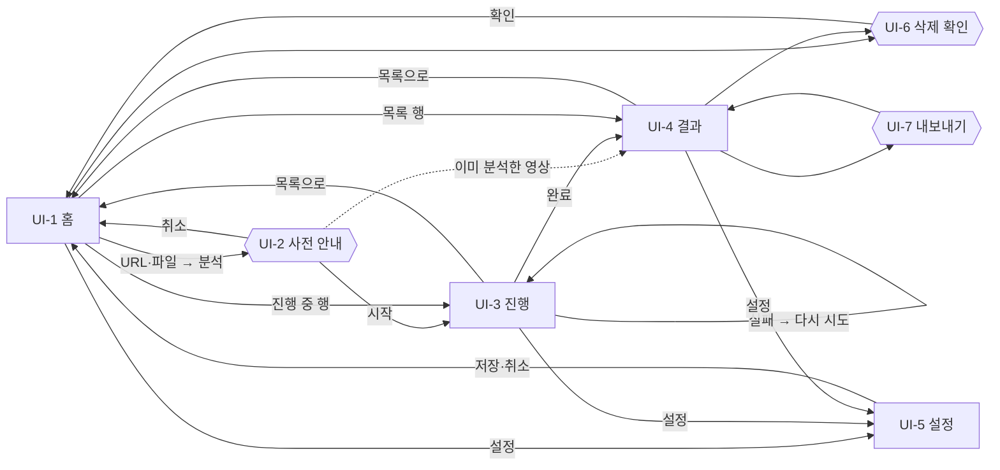

# 화면 설계

## 0. 이 문서가 다루는 것

웹에 **어떤 화면이 있고, 어디서 어디로 가는지**를 정한다. 각 화면 안에 뭐가 어디 있는지는 와이어프레임 문서에서 정한다.

대상은 사용자 한 명이 쓰는 로컬 웹(Next.js, [[VA-INFRA-001#C10]]). 모바일은 다루지 않는다 — 개인 PC 브라우저.

**디자인은 별도 산출물로 온다.** 사용자가 디자인 도구로 화면을 만들어 그대로 올리기로 했다([[VA-INFRA-001#C10]]). 그래서 이 문서는 화면의 **역할·요소·흐름**까지만 정하고, 색·타이포·간격(디자인 토큰)과 배치는 디자인 산출물이 나온 뒤 와이어프레임 문서(v2)에 담는다. 디자인이 이 문서와 어긋나면 이 문서를 고친다 — 화면 수와 흐름은 유스케이스에서 온 것이라 디자인이 바꿀 수 없고, 배치는 디자인이 정한다.

**도출 방법** — 사용자가 주 액터인 유스케이스([[VA-UC-001#UC-H1]]~[[VA-UC-001#UC-H8]])를 화면으로 옮긴다. 유스케이스 하나가 화면 하나는 아니다. 같은 맥락에서 이어지는 일은 한 화면에 모으고(결과 읽기 + 질문), 흐름이 끊기는 일은 나눈다(입력 → 진행 → 결과).

---

## 1. 유스케이스 대응

| 유스케이스 | 화면 | 화면 안 위치 |
|---|---|---|
| [[VA-UC-001#UC-H1]] YouTube URL로 분석 | UI-1 → UI-2 → UI-3 | 입력란 → 사전 안내 → 진행 |
| [[VA-UC-001#UC-H2]] 로컬 파일로 분석 | UI-1 → UI-2 → UI-3 | inbox 파일 목록 → 사전 안내 → 진행 |
| [[VA-UC-001#UC-H3]] 결과를 읽는다 | UI-4 | 본문 (요약·챕터·스크립트) |
| [[VA-UC-001#UC-H4]] 영상에 질문한다 | UI-4 | 질문창 + 대화 기록. 추천 질문은 요약 아래 |
| [[VA-UC-001#UC-H5]] 다시 연다 | UI-1 → UI-4 | 분석한 영상 목록 |
| [[VA-UC-001#UC-H6]] 삭제 | UI-6 | UI-1 목록 행·UI-4 상단에서 여는 다이얼로그 |
| [[VA-UC-001#UC-H7]] 마크다운 내보내기 | UI-7 | UI-4 상단에서 여는 다이얼로그 |
| [[VA-UC-001#UC-H8]] API 키 설정 | UI-5 | 전체. 키 없이 분석을 누르면 여기로 |
| [[VA-UC-001#UC-S1]] 사전 안내 | UI-2 | 전체 (다이얼로그) |
| [[VA-UC-001#UC-S6]] 진행 상태 | UI-3 | 전체. 실패 시 재시도 버튼 |

**한 화면에 여러 유스케이스가 모인 곳**: UI-4 결과(H3·H4·H6·H7). 요약을 읽다가 궁금한 걸 묻고, 다 읽으면 내보내는 것은 한 맥락이다. 릴리스 AI·NoteGPT도 결과와 채팅을 한 화면에 둔다([[VA-PRD-001]] 3.1절).

**한 화면에 입력과 목록을 함께 둔 곳**: UI-1 홈(H1·H2·H5). 사용자가 한 명이고 하는 일이 "넣기" 아니면 "다시 열기" 둘뿐이라 첫 화면에서 둘 다 보여야 한다. 목록이 비어 있으면 입력만 크게.

---

## 2. 화면 목록

페이지 4개, 다이얼로그 3개. 항목 블록은 종류 · 목적 · 주 유스케이스 · 진입 · 이탈.

#### UI-1 홈 — 영상 넣기와 목록

페이지. 앱을 열면 처음 보는 화면. 위에 **입력**(YouTube URL 붙여 넣기 / inbox 파일 고르기), 아래에 **분석한 영상 목록**(제목·출처·길이·분석 날짜, 진행 중이면 상태). 주 유스케이스: [[VA-UC-001#UC-H1]] · [[VA-UC-001#UC-H2]] · [[VA-UC-001#UC-H5]]

- 진입: 앱 시작, 상단 로고, UI-4의 "목록으로"
- 이탈: 분석 시작 → UI-2 / 목록 행 → UI-4 (진행 중 행 → UI-3) / 삭제 → UI-6 / 설정 → UI-5
- inbox 파일 고르기는 브라우저 파일 선택이 아니라 **서버가 읽은 inbox 목록**에서 고른다([[VA-INFRA-001#C4]]). 업로드가 없다
- URL 형식 오류·지원 안 하는 확장자는 입력란 아래 인라인 오류. 화면을 안 바꾼다

#### UI-2 사전 안내

다이얼로그. 영상 정보(제목·채널·길이·자막 유무)와 **예상 소요 시간·예상 비용**을 보여 주고 시작할지 묻는다. 주 유스케이스: [[VA-UC-001#UC-S1]] · [[VA-UC-001#UC-H0]] 2~3번

- 진입: UI-1에서 분석 시작
- 이탈: 시작 → UI-3 / 취소 → UI-1 (아무것도 전송되지 않음)
- 이미 분석한 영상이면 이 다이얼로그 대신 "이미 분석한 영상입니다"를 보이고 바로 UI-4로
- 3시간 초과·비공개·정보 조회 실패는 이 다이얼로그 자리에 오류만 보이고 시작 버튼이 없다
- 비용이 0(자막 있음)이면 "비용 없음"으로 표시

#### UI-3 분석 진행

페이지. 단계 목록(다운로드 → 음성 추출 → 받아쓰기 → 핵심 요약 → 챕터 → 추천 질문)에 현재 위치, 진행률, 받아쓰기 중이면 조각 n/m과 남은 예상 시간. 1초 폴링([[VA-INFRA-001]] 3장). 주 유스케이스: [[VA-UC-001#UC-S6]] · [[VA-UC-001#UC-H0]] 4~7번

- 진입: UI-2에서 시작, UI-1 목록의 진행 중 행
- 이탈: 완료 → UI-4로 자동 이동 / 실패 → 같은 화면에 "단계·이유" + **이 단계부터 다시 시도** 버튼 / 목록으로 → UI-1 (분석은 계속 돈다)
- 화면을 떠나도 파이프라인은 서버에서 계속 돈다. 돌아오면 폴링을 다시 시작한다

#### UI-4 결과

페이지. 이 앱의 중심. 위에서 아래로 **영상 정보 → 한 줄 요약 → 핵심 인사이트(출처 시각) → 추천 질문 3개 → 챕터 요약(1시간 넘으면 파트로 접힘) → 전체 스크립트**, 그리고 **질문창과 대화 기록**. 시각을 누르면 스크립트가 그 위치로 이동·강조된다. 주 유스케이스: [[VA-UC-001#UC-H3]] · [[VA-UC-001#UC-H4]]

- 진입: UI-3 완료, UI-1 목록 행, "이미 분석한 영상" 판정
- 이탈: 목록으로 → UI-1 / 내보내기 → UI-7 / 삭제 → UI-6
- 스크립트는 길다(3시간 = 수천 구간). 화면 안에서 스크롤되는 영역이고, 요약·챕터가 밀려 내려가지 않게 스크립트와 **나란히** 두거나 접을 수 있어야 한다 — 어느 쪽인지는 디자인이 정한다
- YouTube 영상이면 시각에 `?t=` 링크가 함께 걸린다([[VA-PRD-001#R10]])
- 질문 중에는 질문창을 잠그고 답변 자리에 대기 표시. 답변이 오면 근거 시각과 함께 기록에 붙는다
- 추천 질문을 누르면 질문창에 그 문장이 들어간 채로 전송된다([[VA-PRD-001#R9]])

#### UI-5 설정

페이지. OpenAI API 키 입력·검증, 받아쓰기·텍스트 모델명(기본값 표시, 바꿀 수 있음), inbox 경로(읽기 전용 표시), **어떤 데이터가 OpenAI로 나가는지** 안내문. 주 유스케이스: [[VA-UC-001#UC-H8]]

- 진입: 상단 설정 아이콘, 키 없이 분석을 눌렀을 때 자동 이동, 첫 실행
- 이탈: 저장 → 직전 화면 / 취소 → 직전 화면
- 키는 저장 전에 가벼운 호출로 검증하고 결과(유효·형식 오류·인증 실패·잔액 없음)를 인라인으로 보인다
- 키는 마스킹해 보이고, 화면에 전체를 다시 보여 주지 않는다

#### UI-6 삭제 확인

다이얼로그. 영상 제목을 보여 주며 "결과·스크립트·대화 기록이 모두 지워진다, 원본 파일은 지우지 않는다"를 알리고 확인을 받는다. 주 유스케이스: [[VA-UC-001#UC-H6]]

- 진입: UI-1 목록 행의 삭제, UI-4 상단의 삭제
- 이탈: 확인 → UI-1 (목록에서 사라짐) / 취소 → 직전 화면

#### UI-7 내보내기

다이얼로그. **파일로 저장** 또는 **클립보드에 복사**, 옵션 "대화 기록 포함". 완료되면 짧은 알림. 주 유스케이스: [[VA-UC-001#UC-H7]]

- 진입: UI-4 상단의 내보내기
- 이탈: 저장·복사 완료 → UI-4 / 취소 → UI-4

---

## 3. 디자인 토큰

**이 버전에는 없다.** 색·타이포·간격·모서리·움직임은 사용자의 디자인 산출물이 원본이다. 산출물이 나오면 여기 3장에 토큰을 옮겨 적고, 와이어프레임 문서가 그것을 참조한다. 그때까지 프론트는 만들지 않는다 — [[VA-INFRA-001#C10]].

디자인에 넘길 제약만 적어 둔다:
- 시각 표시는 클릭 대상이다 — 본문 글자와 구별되는 스타일이 있어야 한다 (UI-4 전체에서 수십~수백 개)
- 3시간 스크립트가 들어와도 요약 영역이 밀리지 않는 배치
- 진행 화면은 몇 분~십여 분 켜 둔다 — 움직임이 "살아 있음"을 보여 줘야 한다
- 다크/라이트는 미결(8장)

---

## 4. 공통 틀

**앱 셸** — 상단 바 하나: 왼쪽 로고(→ UI-1), 오른쪽 설정(→ UI-5). 사이드바 없음 — 화면이 4개라 필요 없다. 페이지 폭은 읽기 폭(본문 720px 안팎) 기준이되 UI-4는 스크립트를 나란히 두려면 넓어질 수 있다 — 디자인이 정한다.

**API 키 없음 배너** — 키가 없거나 무효면 모든 페이지 상단에 배너. 분석 시작 버튼은 비활성이고 누르면 UI-5로. 결과 읽기·목록은 키 없이도 된다([[VA-UC-001#UC-H5]] 성공 보장 — API 호출 없이 열린다).

**오류 표시** — 화면을 바꾸지 않는 오류는 인라인(입력란 아래), 흐름을 멈추는 오류는 그 자리에 문장 하나 + 할 수 있는 동작 버튼(다시 시도 / 설정으로). 별도 오류 페이지 없음. 문구는 "무엇이, 어느 단계에서, 왜"([[VA-SCN-001#S6]] 성공 조건).

**시각 표기** — 1시간 미만 `mm:ss`, 이상 `h:mm:ss`. 어디서든 같은 컴포넌트. 누르면 스크립트 이동(UI-4 안) 또는 UI-4로 이동 후 스크립트 이동(다른 화면에서는 안 쓴다).

**다이얼로그** — UI-2·6·7 셋. 바깥 클릭·Esc는 취소. 확인 동작은 오른쪽.

---

## 5. 화면 흐름

핵심 경로는 **U1 → U2 → U3 → U4** 한 줄이다. 나머지는 곁가지. 첫 실행은 **U5**가 먼저 뜬다(키 없음).

---

## 6. 화면별 진입과 이탈

| 화면 | 들어오는 곳 | 나가는 곳 | URL |
|---|---|---|---|
| UI-1 홈 | 시작 · 로고 · UI-3/4 "목록으로" · UI-5 저장 · UI-6 확인 | UI-2 · UI-3 · UI-4 · UI-5 · UI-6 | `/` |
| UI-2 사전 안내 | UI-1 분석 시작 | UI-3 · UI-1 · UI-4 | (다이얼로그) |
| UI-3 진행 | UI-2 시작 · UI-1 진행 중 행 | UI-4(자동) · UI-1 · UI-5 | `/videos/{id}/progress` |
| UI-4 결과 | UI-3 완료 · UI-1 행 · UI-2 중복 판정 | UI-1 · UI-5 · UI-6 · UI-7 | `/videos/{id}` |
| UI-5 설정 | 상단 설정 · 키 없음 · 첫 실행 | 직전 화면 | `/settings` |
| UI-6 삭제 확인 | UI-1 행 · UI-4 상단 | UI-1 · 직전 화면 | (다이얼로그) |
| UI-7 내보내기 | UI-4 상단 | UI-4 | (다이얼로그) |

URL이 있는 페이지는 새로 고쳐도 같은 곳이 열린다. UI-3은 진행 중인 작업이 없으면(완료됨) UI-4로 넘긴다.

---

## 7. 판단이 필요한 지점

**1. 진행 화면을 결과 화면 안의 상태로 둘지, 별도 페이지로 둘지** — **결정: 별도 페이지(UI-3).** 진행 중엔 보여 줄 결과가 없고, 결과 화면은 스크립트·요약이 다 있어야 의미가 있다. 한 페이지에 두면 "로딩 중인 결과 화면"이 되어 빈 칸이 많다. 완료 시 자동 이동으로 이어 주면 끊김이 없다.

**2. 사전 안내를 다이얼로그로 둘지 페이지로 둘지** — **결정: 다이얼로그(UI-2).** 보여 줄 것이 정보 다섯 줄과 버튼 둘이다. 취소하면 입력 상태 그대로 홈에 있어야 하므로 홈 위에 얹는 게 맞다.

**3. 목록을 홈에 둘지 별도 페이지로 둘지** — **결정: 홈에.** 1장에 적은 대로 사용자가 하는 일이 둘뿐이다.

---

## 8. 미결사항

- [ ] 다크/라이트 모드 — 디자인 산출물에 따름
- [ ] UI-4에서 스크립트를 요약과 나란히(2열) 둘지 아래로 접을지 — 디자인 산출물에 따름. 와이어프레임에서 확정
- [ ] 인사이트 이모지 카테고리(Eightify식) — [[VA-PRD-001]] 6절 미결. 디자인에서 결정
- [ ] 결과 화면에서 YouTube 임베드 플레이어를 넣을지 — 넣으면 시각 클릭이 플레이어 이동까지 되지만 첫 버전 범위 밖. 링크(`?t=`)로 시작
