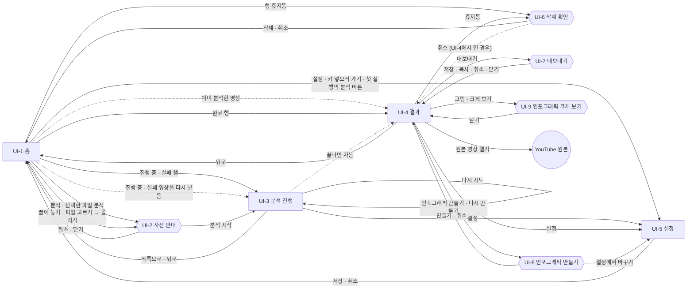

# 화면 설계

## 0. 이 문서가 다루는 것

웹에 **어떤 화면이 있고, 어디서 어디로 가는지**, 그리고 **어느 화면에서든 같아야 하는 값**(디자인 토큰·공통 틀)을 정한다. 화면마다 요소가 어디에 어떻게 놓이는지는 다음에 쓰는 와이어프레임 문서가 정한다.

| 이 문서가 정하는 것 | 와이어프레임 문서가 정하는 것 |
|---|---|
| 화면 9개와 각 화면의 종류·목적·주 유스케이스 | 화면마다 요소 배치와 요소 번호 |
| 화면 사이의 이동(진입·이탈·주소) | 요소 하나하나의 규칙과 문구 |
| 색·글꼴·간격·모서리·움직임 토큰 | 화면별 시나리오 |
| 헤더·버튼·칩·다이얼로그 같은 공통 틀 | |

**모양의 원본은 승인된 디자인 캔버스다.** 2026-09-17에 사용자가 승인했다 — https://claude.ai/artifact/5vRnv2qFrhTBDjYaNZC1XR (보드 13개). **토큰 값의 원본은 이 문서다.** 프런트엔드 `styles.css`는 3장을 그대로 옮겨 적은 것이고, 컴포넌트에 값을 직접 쓰지 않는다(명세 작성 규약 1.9). 디자인을 바꾸면 이 문서를 먼저 고치고, 코드는 그 뒤에 따라간다.

**두 번째 캔버스 — 결과 그림과 파일 올리기.** 사용자가 첫 배포를 써 본 뒤 더한 것(한눈에 보기 · 대표 장면 · 인포그래픽 · 로컬 파일 끌어 놓기, [[VA-PRD-001#R11]] ~ [[VA-PRD-001#R13]] · [[VA-PRD-001#R1]])은 https://claude.ai/artifact/Y7ax1e9CfUWZyqVVrCa7tc (「Video Agent 결과 그림」, 보드 15개)가 모양의 원본이다. 사용자가 2026-09-29에 ①②줄을 「좋다」로, 2026-09-30에 ③줄을 「다음」으로 승인했다. 두 캔버스가 겹치는 곳(UI-1 · UI-3 · UI-4 · UI-5 · UI-7)은 두 번째가 이긴다 — 첫 캔버스에서 바뀌지 않은 부분은 그대로다. 이 문서에서 보드 이름 앞의 「그림 ·」은 두 번째 캔버스의 보드다.

**세 번째 캔버스 — 접근성 보강.** 키보드 초점 고리 · hover · 대비 미달 짝 · 한눈에 보기 키보드는 https://claude.ai/artifact/HQyWTuusSvs3yktqEHaQ4p (「VA 접근성 보강」, 보드 4개)가 모양의 원본이다. 사용자가 2026-10-01에 「다음」으로 승인했다. 화면을 새로 그린 캔버스가 아니라 **상태 보드**다 — 앞 두 캔버스의 화면에 초점 · hover 모습과 바뀐 색을 얹는다. 겹치는 곳(입력칸 · 헤더 지금 위치 · 조각 칸 · 끌어 놓기 칸 · 한눈에 보기 칸)은 세 번째가 이긴다. 이 문서에서 보드 이름 앞의 「접근 ·」은 세 번째 캔버스의 보드다.

**네 번째 캔버스 — 영상 같이 보기 · 보낸 추천 질문 · 상태 보드.** https://claude.ai/artifact/9QxpsbqKPbWNTw9ypVaNsL (「VA 영상 같이 보기 · 상태 보드」, 쪽 셋 · 보드 42개)가 모양의 원본이다. 사용자가 2026-10-02에 승인했다 — 플레이어는 후보 A(오른쪽 패널 맨 위), 보낸 추천 질문은 안 ②(체크 + '답 보기 →'), 상태 보드는 그대로다. ① 영상 같이 보기는 두 번째 캔버스의 결과 화면 위에 플레이어를 얹었다 — 후보 A는 Play로 재생 판 → 재생 중 → 시각을 누르면 그 시각부터 → 접기를 눌러 볼 수 있고, 도구의 variant로 YouTube(영상 4) · 로컬(영상 3)을 바꾼다. ③ 상태 보드는 이 문서와 와이어프레임이 글로만 정했거나 「캔버스에 없음」으로 그렸던 상태를 지금 코드의 모양 그대로 보드로 옮긴 것이다 — 사용자가 고칠 것 없이 확정했다. 이 문서에서 보드 이름 앞의 「같이 ·」은 네 번째 캔버스의 보드다.

대상은 한 사람이 자기 PC에서 쓰는 로컬 웹이다([[VA-INFRA-001#C5]]). 디자인은 폭 1440px 데스크톱 한 가지만 그렸다.

**보드와 화면 대응** — .dc.html 보드는 원형이다. Next.js로 옮길 때 이 표로 찾는다([[VA-INFRA-001#C10]]).

| 보드 파일 | 캔버스 제목 | 화면 · 상태 |
|---|---|---|
| Main.dc.html | UI-1 홈 | UI-1 기본 상태 |
| FirstRun.dc.html | UI-1 홈 · 첫 실행 | UI-1 첫 실행 상태 (Main을 firstRun으로 불러옴) |
| Estimate.dc.html | UI-2 사전 안내 · 자막 있음 | UI-2 자막 있음 판 (뒤에 Main) |
| EstimateLocal.dc.html | UI-2 사전 안내 · 받아쓰기 필요 | UI-2 받아쓰기 필요 판 |
| Progress.dc.html | UI-3 분석 진행 · 요약 중 | UI-3 요약 중 |
| ProgressLocal.dc.html | UI-3 분석 진행 · 받아쓰기 12/30 | UI-3 받아쓰기 중 |
| ProgressFailed.dc.html | UI-3 분석 진행 · 실패 | UI-3 실패 |
| Result.dc.html | UI-4 결과 · 스크립트 | UI-4 스크립트 탭, 파트 없음 |
| ResultLong.dc.html | UI-4 결과 · 긴 영상 파트 | UI-4 파트로 묶은 챕터 |
| ResultChat.dc.html | UI-4 결과 · 질문하기 | UI-4 질문하기 탭 |
| Settings.dc.html | UI-5 설정 | UI-5 |
| Delete.dc.html | UI-6 삭제 확인 | UI-6 (뒤에 Main) |
| Export.dc.html | UI-7 내보내기 | UI-7 (뒤에 Result) |

| 보드 파일 (두 번째 캔버스) | 캔버스 제목 | 화면 · 상태 |
|---|---|---|
| Main.dc.html | UI-4 결과 · 한눈에 보기 · 대표 장면 | UI-4 한눈에 보기 · 챕터 장면 · 인포그래픽 카드. 42분 YouTube(영상 4). 도구의 variant · info · dialog로 긴 영상 · 카드 다섯 상태 · 다이얼로그 둘을 바꿔 본다 |
| Progress.dc.html | UI-3 진행 · 장면 단계 (YouTube) | UI-3 장면 단계. 도구의 variant로 로컬 · 받아쓰기 중 · 실패(장면 단계 대기) |
| Infographic.dc.html | UI-4 인포그래픽 · 만들기 확인 | UI-8 (뒤에 Main) |
| InfographicView.dc.html | UI-4 인포그래픽 · 크게 보기 | UI-9 (뒤에 Main) |
| Export.dc.html | UI-7 내보내기 · 그림이 든 노트 | UI-7 그림 파일 목록 · 한눈에 보기 절 미리 보기 |
| ResultLong.dc.html | UI-4 결과 · 긴 영상 (파트 5 · 챕터 27) | UI-4 파트 띠 · 파트 마인드맵 · 로컬 장면(영상 3) |
| ProgressLocal.dc.html | UI-3 진행 · 장면 단계 (로컬 파일) | UI-3 로컬 장면 단계 |
| States.dc.html | 상태 모음 · 장면 · 인포그래픽 카드 | UI-4 대표 장면 여섯 경우 · 인포그래픽 카드 다섯 상태 |
| Settings.dc.html | UI-5 설정 · 인포그래픽 품질 · 올린 사본 | UI-5 |
| Home.dc.html | UI-1 홈 · 끌어 놓기 · 파일 고르기 | UI-1 (도구의 phase · message · noKey로 상태를 바꿔 본다) |
| HomeDrag.dc.html | UI-1 홈 · 파일을 끌어 오는 중 | UI-1 끌어 오는 중 |
| HomeUpload.dc.html | UI-1 홈 · 올리는 중 | UI-1 올리는 중 |
| EstimateUpload.dc.html | UI-2 사전 안내 · 올린 파일 | UI-2 올린 파일 판 (뒤에 Home) |
| DeleteUpload.dc.html | UI-6 삭제 · 올린 파일 | UI-6 올린 파일 (뒤에 Home) |
| UploadStates.dc.html | 올리기 상태 모음 | UI-1 끌어 놓기 칸 열 가지 상태 |

| 보드 파일 (세 번째 캔버스) | 캔버스 제목 | 화면 · 상태 |
|---|---|---|
| Main.dc.html | ① 초점 고리 | 모든 화면 — 고리 규칙 넷(모양 · 언제 · 안쪽 고리 · 가리지 않게)과 부품마다 초점을 받은 모습. 보드의 버튼은 진짜라 Tab으로 옮겨 볼 수 있다 |
| Hover.dc.html | ② hover | 모든 화면 — hover 규칙 표와 부품 13개의 기본 → hover. '기본' 견본은 마우스를 올리면 실제로 바뀐다 |
| Contrast.dc.html | ③ 대비 보강 | 3.5에서 미달이던 짝 일곱의 지금 · 바꾼 뒤(그대로 두는 둘 포함) |
| Glance.dc.html | ④ 한눈에 보기 키보드 | UI-4 한눈에 보기 — 줄마다 Tab 한 번 · ← → · 가리킨 칸 이름 줄. 2시간 30분 로컬(영상 3)로 직접 눌러 본다(Play) |

| 보드 파일 (네 번째 캔버스) | 캔버스 제목 | 화면 · 상태 |
|---|---|---|
| Main.dc.html | A · 오른쪽 패널 맨 위 (추천) | UI-4 플레이어(고른 후보) — 재생 판 · 재생 중 · 접기를 Play로. variant로 YouTube(영상 4) · 로컬(영상 3) |
| PlayerB1.dc.html · PlayerB2.dc.html | B · 제목 옆 작은 재생 판 · 내려 읽을 때 | 고르지 않은 후보 |
| Player*.dc.html (12) | 플레이어 상태 | 재생 판(YouTube · 로컬) · 불러오는 중 · 재생 중(YouTube · 로컬) · 음성 파일 · 접힘 · 올린 파일 · 원본을 찾지 못함 · 형식 · 퍼가기 막힘 · 연결 안 됨 |
| AskedGo.dc.html | 안 ② 체크 + '답 보기 →' | UI-4 5.1 · 10.1 보낸 추천 질문(고른 안). AskedWord.dc.html은 고르지 않은 안 ① '물어봄' |
| ui1-* ~ ui8-*.dc.html (18) | UI-n · {상태} | 와이어프레임의 「캔버스에 없음」 상태 보드 열여덟(대기 중 행 포함) |
| gap-*.dc.html (7) | 두 번째 캔버스가 그리지 않은 것 | 실제 인포그래픽 그림(카드 · UI-9) · 그리는 중에 떠났다 돌아옴 · 다시 만들기 실패 · 장면이 붙는 중 · 음성 파일 챕터 · 올리기 오류 뒤 다시 놓기 |

보드 안의 예시 내용(RAG 발표, 데이터 카탈로그 워크숍, [채널명], 파일 이름)은 제품 문구가 아니다. 두 번째 캔버스는 실제로 분석한 영상 다섯의 결과와 그 영상에서 뽑은 장면으로 그렸고, 인포그래픽 그림만 자리 표시다. 네 번째 캔버스의 플레이어 보드는 두 번째 캔버스의 결과와 장면을, 인포그래픽 보드는 실제로 만든 그림 한 장을 썼다. 이 문서에서 `{ }`로 쓴 자리가 실제 값이 들어갈 곳이다.

**도출 방법** — 사용자가 주 액터인 유스케이스([[VA-UC-001#UC-H1]]~[[VA-UC-001#UC-H8]])와 화면에 드러나는 시스템 유스케이스를 화면으로 옮겼다. 유스케이스 하나가 화면 하나는 아니다. 같은 맥락에서 이어지는 일은 한 화면에 모으고(결과 읽기 + 질문), 흐름이 끊기는 일은 나눴다(넣기 → 사전 안내 → 진행 → 결과).

---

## 1. 유스케이스 대응

| 유스케이스 | 화면 | 화면 안 위치 |
|---|---|---|
| [[VA-UC-001#UC-H0]] 영상을 분석한다 (추상) | UI-1 → UI-2 → UI-3 → UI-4 | 흐름 전체. 구체적인 모습은 H1·H2 |
| [[VA-UC-001#UC-H1]] YouTube URL로 분석 | UI-1 → UI-2 → UI-3 → UI-4 | UI-1 「YouTube 링크」 카드 → UI-2 자막 있음 판 → UI-3 요약 중 |
| [[VA-UC-001#UC-H2]] 로컬 파일로 분석 | UI-1 → UI-2 → UI-3 → UI-4 | UI-1 「내 파일」 카드의 끌어 놓기 칸 · [파일 고르기](올리는 중 → 파일 확인 중) 또는 inbox 목록 → UI-2 받아쓰기 필요 판(올린 파일이면 올린 파일 판) → UI-3 받아쓰기 중 |
| [[VA-UC-001#UC-H3]] 결과를 읽는다 | UI-4 | 왼쪽 본문(한 줄 요약·한눈에 보기·핵심 인사이트·챕터와 대표 장면) + 오른쪽 패널 맨 위 플레이어(영상 같이 보기) + [스크립트] 탭 |
| [[VA-UC-001#UC-H4]] 영상에 질문한다 | UI-4 | 오른쪽 패널 [질문하기] 탭. 추천 질문은 본문 「이런 걸 물어볼 수 있어요」와 입력칸 위 — 이미 물어본 것은 체크 · '답 보기' |
| [[VA-UC-001#UC-H5]] 분석한 영상을 다시 연다 | UI-1 → UI-4 (진행 중·실패는 UI-3) | UI-1 「분석한 영상」 목록 |
| [[VA-UC-001#UC-H6]] 분석 결과를 삭제한다 | UI-6 | UI-1 목록 행 휴지통, UI-4 머리 휴지통에서 여는 다이얼로그 |
| [[VA-UC-001#UC-H7]] 마크다운으로 내보낸다 | UI-7 | UI-4 머리 [내보내기]에서 여는 다이얼로그. 노트에 한눈에 보기(Mermaid) · 장면 · 인포그래픽 그림이 들어간다 |
| [[VA-UC-001#UC-H8]] API 키를 설정한다 | UI-1 → UI-5 | UI-1 첫 실행 배너, UI-5 「OpenAI API 키」 카드와 「밖으로 나가는 데이터」 표 |
| [[VA-UC-001#UC-H9]] 인포그래픽을 만든다 | UI-4 → UI-8 → UI-4 (→ UI-9) | UI-4 「한눈에 보기」 맨 아래 인포그래픽 카드 → UI-8 확인 → 카드가 그리는 중 → 다 됨. 그림을 누르면 UI-9 |
| [[VA-UC-001#UC-S1]] 사전 안내를 만든다 | UI-2 | 전체 |
| [[VA-UC-001#UC-S2]] 자막 또는 음성을 확보한다 | UI-3, UI-4 | UI-3 단계 목록 첫 줄(자막 가져오기·음성 추출), UI-4 스크립트 머리줄의 출처 |
| [[VA-UC-001#UC-S3]] 받아쓰기한다 | UI-3 | 받아쓰기 단계와 조각 격자, 실패 알림 |
| [[VA-UC-001#UC-S4]] 요약·챕터·추천 질문을 만든다 | UI-3 → UI-4 | UI-3 단계 핵심 요약·챕터·추천 질문 → UI-4 본문 |
| [[VA-UC-001#UC-S5]] 결과를 저장하고 중복을 판정한다 | UI-1 | 목록 행. 중복이면 UI-2 대신 완료는 UI-4, 진행 중·실패는 UI-3 |
| [[VA-UC-001#UC-S6]] 진행 상태를 알린다 | UI-3, UI-1 | UI-3 진행 카드 전체, UI-1 목록 행의 상태 글자와 막대 |
| [[VA-UC-001#UC-S7]] 챕터 대표 장면을 만든다 | UI-3, UI-4 | UI-3 마지막 「장면」 단계와 장면 칸 줄, UI-4 챕터 카드 오른쪽 장면(옛 결과는 열 때 「장면 가져오는 중」) |

**한 화면에 여러 유스케이스가 모인 곳**
- **UI-4 결과** — H3·H4가 주이고, H6·H7·H9를 여기서 연다. 요약을 읽다가 시각을 눌러 스크립트를 보고, 궁금한 것을 묻고, 다 읽으면 내보내는 것은 한 맥락이다.
- **UI-1 홈** — H1·H2·H5가 주이고, H6(행 휴지통)과 H8(첫 실행 배너)의 입구가 있다. 사용자가 하는 일이 「넣기」 아니면 「다시 열기」라 첫 화면에 둘 다 보여야 한다. 로컬 파일은 넣는 길이 둘(끌어 놓기 · inbox)이라 한 카드에 함께 둔다.
- **UI-3 분석 진행** — S2·S3·S4·S6이 한 화면의 단계 목록으로 이어진다. 사용자에게는 「분석 중」 하나다.

**유스케이스 하나가 여러 화면에 걸친 곳**
- **H1·H2** — 넣기(UI-1) → 시작 확인(UI-2) → 진행(UI-3) → 결과(UI-4). 확인과 대기에서 흐름이 끊기므로 화면을 나눴다.
- **H8** — 키가 없다는 사실은 UI-1 배너가 알리고, 키 입력은 UI-5에서 한다.
- **S6** — 진행 상태는 UI-3에 자세히, UI-1 목록 행에 짧게 보인다. 화면을 닫아도 분석이 계속되므로 돌아갈 입구가 목록에 있어야 한다.

**스펙 용어와 화면 이름표** — 뜻은 같고 화면에서 부르는 이름만 다르다.

| 스펙 용어 | 화면 이름표 |
|---|---|
| 핵심 요약 ([[VA-PRD-001#R4]]) | 「한 줄 요약」 + 「핵심 인사이트」. 진행 단계 이름은 '핵심 요약' |
| 챕터 요약 ([[VA-PRD-001#R5]]) | 「챕터」 |
| Q&A · 채팅 · 질문창 ([[VA-PRD-001#R6]]) | [질문하기] 탭 |
| 추천 질문 ([[VA-PRD-001#R9]]) | 「이런 걸 물어볼 수 있어요」. 진행 단계·비용 줄에서는 '추천 질문' |
| 분석 결과 목록 ([[VA-PRD-001#R7]]) | 「분석한 영상」 |
| 사전 안내 ([[VA-PRD-001#R8]]) | '분석을 시작할까요?' 다이얼로그 |
| 한눈에 보기 — 타임라인 · 마인드맵 ([[VA-PRD-001#R11]]) | 「한눈에 보기」. 막대 = 타임라인, 가지 그림 = 마인드맵 |
| 챕터 대표 장면 ([[VA-PRD-001#R12]]) | 챕터 카드 오른쪽 그림. 진행 단계 이름은 '장면' |
| 올린 사본 ([[VA-DOM-001#Video]] 원본 자리) | '올린 사본'. 목록 부제 '올린 파일' |

---

## 2. 화면 목록

페이지 4개(UI-1·UI-3·UI-4·UI-5), 다이얼로그 5개(UI-2·UI-6·UI-7·UI-8·UI-9). 첫 실행은 화면이 아니라 UI-1의 상태다. 파일을 끌어 오는 중 · 올리는 중도 UI-1의 상태다.

#### UI-1 홈

- **종류** 페이지. 주소 `/`
- **목적** YouTube 링크를 넣거나, 로컬 파일을 끌어 놓거나 inbox 폴더에서 골라 분석을 시작하고, 지금까지 분석한 영상을 보고 여는 첫 화면.
- **주 유스케이스** [[VA-UC-001#UC-H1]] · [[VA-UC-001#UC-H2]] · [[VA-UC-001#UC-H5]]. 여는 곳: [[VA-UC-001#UC-H6]](행 휴지통) · [[VA-UC-001#UC-H8]](첫 실행 배너). 보여 주는 곳: [[VA-UC-001#UC-S5]] · [[VA-UC-001#UC-S6]](목록 행 상태)
- **진입** 앱 시작 · 모든 페이지의 로고와 주 메뉴 '분석한 영상' · UI-3·UI-4의 '← 분석한 영상' · UI-3 실패 알림 [목록으로] · UI-2 [취소]·닫기(올린 파일 판이면 사본을 지웠다는 한 줄과 함께) · UI-5 [취소]·[저장] · UI-6 [삭제]
- **이탈** [분석] → UI-2 자막 있음 판 · [선택한 파일 분석] → UI-2 받아쓰기 필요 판 · 파일을 끌어 놓거나 [파일 고르기] → 같은 화면에서 올리는 중 → 파일 확인 중 → UI-2 올린 파일 판 · 목록 행: 완료 → UI-4, 진행 중·실패 → UI-3 · 행 휴지통 → UI-6 · 설정 아이콘·[키 넣으러 가기] → UI-5. 첫 실행 상태에서는 두 분석 버튼과 [파일 고르기]도 UI-5로 간다.
- **영역** 위에서 아래로: (첫 실행 배너) · 헤더 · 제목 '어떤 영상을 읽어 볼까요?'와 안내 · 입력 카드 둘(왼쪽 「YouTube 링크」, 오른쪽 「내 파일」) · 「분석한 영상」 목록 또는 빈 상태 상자. 「내 파일」 카드는 위에서 아래로 머리('내 파일' + '끌어 놓거나 inbox 폴더에서 골라요') · 끌어 놓기 칸(올리는 동안은 올리는 중 칸 · 파일 확인 중 칸) · (안내 한 줄) · 구분선 '또는 inbox 폴더에서 고르기 {inbox 경로}' · inbox 목록 · 아래 줄('inbox 파일은 복사하지 않고 읽기만 해요' + [선택한 파일 분석]). 파일을 창에 끌어 오는 동안은 화면 전체에 덮개가 뜬다.

| 상태 | 보드 | 모습 |
|---|---|---|
| 기본 (분석한 영상 있음) | Main | 배너 없음. 두 분석 버튼이 켜져 있다. 목록에 행이 있고 머리에 '{n}개' |
| 첫 실행 (API 키 없음, 분석한 영상 0개) | FirstRun | 맨 위 빨간 톤 배너와 [키 넣으러 가기]. 두 분석 버튼이 회색·aria-disabled이고 누르면 UI-5. 목록 대신 점선 빈 상태 상자, 개수 '0개'. inbox 목록은 그대로 보이고 고를 수 있다 |
| 키 없음 + 분석한 영상 있음 | 없음 | 배너와 막힌 분석 버튼은 첫 실행과 같다. 목록은 기본 상태처럼 행과 '{n}개'를 보이고, 행을 눌러 결과를 읽을 수 있다 |
| 목록 행 · 완료 | Main | 상태 글자 회색 보통 굵기 '{날짜 또는 오늘 HH:MM} 분석' |
| 목록 행 · 진행 중 | Main | 상태 글자 청록 굵게 '받아쓰기 중 · {n} / {m}' + 아래 작은 진행 막대 |
| 목록 행 · 대기 중 | 없음 | 상태 글자 캡션색 굵게 '대기 중 · {n}번째'. 작은 막대 없음. 앞 영상이 끝나면 진행 중 행으로 바뀐다 |
| 목록 행 · 실패 | Main | 상태 글자 빨강 굵게 '받아쓰기 {k} / {m}에서 멈춤' |
| inbox 파일 선택 | Main | 고른 행은 청록 테두리·연한 청록 바탕·채운 점. 한 번에 하나 |
| 끌어 놓기 칸 · 기본 | 그림 · Home · 접근 · Contrast 5 | 점선 2px `#948D80` · 옅은 면. 왼쪽 44px 원 안 올리기 아이콘(연한 청록 바탕 · 청록), '파일을 여기로 끌어 놓으세요'와 캡션 '영상 mp4 · mkv · mov · webm, 음성 mp3 · m4a · wav · 한 번에 한 파일 · 3시간까지', 오른쪽 보조 버튼 [파일 고르기](문서 아이콘) |
| 끌어 오는 중 | 그림 · HomeDrag | 화면 전체에 연한 바탕 덮개(88%). 위에서 200px에 760×320 큰 상자 — 점선 3px 청록 · 연한 청록 바탕 · 모서리 24px. 64px 청록 원 안 흰 올리기 아이콘, '놓으면 이 파일을 올려 분석해요'(Hahmlet 30px), '한 번에 한 파일 · 영상 mp4 · mkv · mov · webm, 음성 mp3 · m4a · wav', '파일은 이 PC 안의 앱 폴더로 복사될 뿐 밖으로 나가지 않아요'. 칸도 청록 점선 · 연한 청록으로 바뀐다 |
| 올리는 중 | 그림 · HomeUpload | 칸 자리에 테두리 1px 칸: 40px 연한 청록 타일(올리기 아이콘) · 파일 이름(한 줄 말줄임) · '올리는 중 · {보낸} / {전체}' · 오른쪽 퍼센트(Plex Mono 20px 청록) · 큰 진행 막대 · '이 화면을 떠나면 올리기가 멈춰요' + 작은 보조 버튼 [멈추기] |
| 파일 확인 중 | 그림 · UploadStates 4 | 같은 칸에 필름 아이콘 타일, '다 올렸어요. 길이와 음성 트랙을 확인하는 중이에요', 깜빡이는 막대(`#8FC7BE`, 3.4). 퍼센트는 없다 |
| 올리기 오류 | 그림 · UploadStates 5~8 | 기본 칸 아래 한 줄(빨강, 18px 느낌표 원, role=alert): 받지 않는 형식 · 여러 파일 · 올리다 끊김(오른쪽 작은 보조 버튼 [다시 올리기]) · 디스크 부족 |
| 올리기 알림 | 그림 · UploadStates 9~10 | 기본 칸 아래 한 줄(잉크 보조 1, 18px 정보 원, role=status): 멈춤 · 사전 안내에서 취소 |
| 키 없음 · 끌어 놓기 칸 | 그림 · UploadStates 2 | 칸 점선 `#E2DDD3` · 바탕 `#F6F4EF` · 회색 아이콘, 제목 'OpenAI API 키를 넣은 뒤 올릴 수 있어요'. [파일 고르기]는 막힌 보조 버튼(바탕 `#F6F4EF` · 글자 `#5E5A52` · aria-disabled)이고 누르면 UI-5 |
| 목록 행 · 올린 파일 | 그림 · Home | 부제 '올린 파일'. 보드는 실패한 올린 영상('받아쓰기 {k} / {m}에서 멈춤') — 사본이 남아 있는 경우다 |

- **규칙**
  - 키가 없으면 배너를 띄우고 두 분석 버튼을 막는다. 목록은 키와 따로 정한다: 분석한 영상이 있으면 그대로 보이고, 없을 때만 빈 상태 상자를 보인다(키 없음 + 목록 0개가 첫 실행 상태). 이미 분석한 영상은 키 없이 읽을 수 있다(배너 문구). 두 분석 버튼은 막히지만 초점을 받고, 누르면 UI-5로 간다.
  - 키가 있어도 확인에 실패하면(형식 오류·인증 실패·잔액 없음) 키 없음과 같이 다룬다. 같은 배너에 '키를 확인하지 못했어요 — {이유}'를 띄우고, 분석 버튼과 UI-4 질문 입력을 막고, [키 넣으러 가기]로 UI-5에 보낸다. **인터넷이 없어 확인하지 못한 것은 문구를 가른다** — '연결을 확인하지 못했어요 — 인터넷이 되면 분석 버튼을 누를 때 다시 확인합니다'이고 [키 넣으러 가기]는 보이지 않는다. 키가 틀린 것이 아니기 때문이다(사용자 결정 2026-09-21). **이때는 분석 버튼과 질문 입력을 막지 않는다** — 누르면 서버가 그때 키를 다시 확인하고, 통과하면 배너가 사라지며 하려던 일이 이어진다. 막힌 버튼은 눌러도 요청을 보내지 않아 문구의 「누를 때 다시 확인」이 될 수 없다(API 명세 5장 11). 키는 앱이 시작할 때와 분석 버튼을 누를 때 확인한다([[VA-PRD-001#N3]], [[VA-INFRA-001#C6]]). 이 배너 문구들은 보드에 없다(8장).
  - YouTube 주소는 watch · youtu.be · shorts 세 형태를 받는다([[VA-PRD-001#R2]]). 형식이 틀리면 입력칸 아래에 바로 알리고 화면을 바꾸지 않는다([[VA-UC-001#UC-H1]] 1a, 4.5).
  - 로컬 파일을 넣는 길은 둘이다 — 끌어 놓기 칸(또는 [파일 고르기])으로 올리기와 inbox 목록에서 고르기([[VA-PRD-001#R1]], [[VA-INFRA-001#C4]]). 경로를 입력하는 길은 없다. 받는 형식은 끌어 놓기 칸 캡션에 적고, inbox 목록 아래 줄 왼쪽에는 'inbox 파일은 복사하지 않고 읽기만 해요'를 둔다. 카드 머리의 inbox 경로는 구분선 '또는 inbox 폴더에서 고르기' 옆으로 옮긴다.
  - inbox 행은 파일 이름(한 줄, 넘치면 말줄임)·길이·크기를 보인다. 목록을 주는 서버가 파일마다 길이도 알려 줘야 한다. 파일은 한 번에 하나만 고른다(aria-pressed). inbox가 비어도 끌어 놓기 칸은 그대로다.
  - **끌어 놓기는 창 어디에 놓아도 받는다.** 파일을 끌고 창에 들어오면 끌어 오는 중 덮개를 띄우고, 놓거나 창 밖으로 나가면 걷는다. 글자 · 링크처럼 파일이 아닌 것을 끌 때는 띄우지 않는다. [파일 고르기]는 브라우저의 파일 고르기 창을 여는 같은 길이고, 받는 확장자만 보이게 거른다. 키보드로는 [파일 고르기]를 쓴다 — 끌어 놓기로만 되는 일은 없다.
  - **보내기 전에 거른다.** 여러 개를 놓으면 '한 번에 한 파일씩 올려 주세요 — 파일 {n}개를 놓았어요', 받지 않는 확장자면 '{받는 형식} 파일만 받아요 — {파일 이름}는 올리지 않았어요'. 둘 다 아무것도 보내지 않는다([[VA-UC-001#UC-H2]] 1a · 1b). 앱 폴더의 디스크가 모자라면 서버가 본문을 받기 전에 거절하고 '올릴 자리가 모자라요 — {필요한 크기}가 필요한데 앱 폴더에 {남은 크기} 남았어요'(1d).
  - **올리는 동안** 칸이 올리는 중 칸으로 바뀐다. 퍼센트는 보낸 바이트 기준이고 크기는 '{보낸} / {전체}'(1 GB 이상은 GB 소수 한 자리, 아래는 MB). 올리기는 한 번에 하나다 — 그동안 [분석] · [선택한 파일 분석] · 끌어 놓기는 새 요청을 보내지 않는다(분석 버튼 대기 표시 규칙과 같다). [멈추기]를 누르면 요청을 끊고 칸 아래에 '올리기를 멈췄어요 — 올라간 부분은 지웠어요'. 새로 고침 · 창 닫기 · 앱 안의 다른 화면으로 가려 하면 먼저 묻는다 — 새로 고침 · 창 닫기는 브라우저의 확인 창(문구는 브라우저가 정한다), 앱 안의 링크는 '올리기를 멈추고 이동할까요? 올라간 부분은 지워져요.' 확인 창이다. 둘 다 브라우저 기본 창이라 그리지 않는다. 머무르면 이어 올리고, 떠나면 멈춘다. 앱 안에서 브라우저 뒤로 가기는 묻지 못해 그대로 멈춘다 — 캡션 '이 화면을 떠나면 올리기가 멈춰요'가 그것을 미리 알린다([[VA-UC-001#UC-H2]] 1e, 사용자 결정 2026-10-01). 처음에는 묻지 않고 멈췄다.
  - **다 올리면** 칸이 파일 확인 중으로 바뀌고, 서버가 길이 · 음성 트랙을 확인하고 파일 지문을 만든 뒤 등록 응답과 똑같이 갈 곳을 정한다 — 새 영상이면 UI-2 올린 파일 판, 이미 분석한 영상이면 UI-4와 '이미 분석한 영상입니다', 진행 중 · 실패면 UI-3. 같은 내용의 영상이 이미 있으면 사본은 서버가 지운다([[VA-UC-001#UC-H2]] 2c).
  - **올린 뒤에야 아는 것**(3시간 초과 · 음성 트랙 없음 · 열 수 없는 파일)은 지금처럼 UI-2 자리의 시작 불가 판으로 보인다. 사본은 서버가 이미 지웠다(2a · 2c).
  - **올리다 끊기면**(연결 · 서버 오류) '올리지 못했어요 — {이유}. 올라간 부분은 지웠어요'와 [다시 올리기]. [다시 올리기]는 같은 파일을 처음부터 올린다 — 이어 올리기는 없다([[VA-INFRA-001#C4]]).
  - 오류 · 알림 한 줄은 다음에 파일을 놓거나 고를 때, 또는 다른 분석을 누를 때 사라진다.
  - **키가 없으면 올리기 전에 막는다.** 끌어 놓기 칸이 회색이 되고 [파일 고르기]는 막힌 보조 버튼이다 — 누르면 UI-5로 간다. 놓아도 올리지 않는다. 큰 파일을 다 올린 뒤에 키 때문에 멈추지 않게 하려는 것이다. 인터넷이 없어 키를 확인하지 못한 상태는 막지 않는다(분석 버튼과 같다).
  - 분석 버튼을 누르면 서버가 영상 정보를 확인하는 동안 그 버튼에 대기 표시를 하고, 끝나면 UI-2를 연다. 시작할 수 없는 영상이면 UI-2 자리에 이유를 보인다(4.5).
  - 이미 분석한 영상을 다시 넣으면 UI-2를 열지 않는다. 완료된 영상이면 UI-4를 열고 '이미 분석한 영상입니다'를 짧게 알린다. 진행 중이거나 실패한 영상이면 UI-3을 연다([[VA-PRD-001#R7]], [[VA-UC-001#UC-S5]]). 사전 안내(UI-2)에서 취소해 작업이 없는 영상은 목록에 보이지 않고, 다시 넣으면 처음 넣은 영상처럼 UI-2를 연다(8장).
  - 목록은 최근 순이다. 머리에 '{n}개'와 고정 글자 '최근 순'. 정렬 바꾸기와 검색은 없다.
  - 행 구성: 출처 아이콘(링크 = YouTube, 필름 = 로컬 파일) · 제목(한 줄 말줄임) · 부제('YouTube · {채널}' · inbox 파일 '로컬 파일' · 올린 파일 '올린 파일') · 길이 · 상태 글자 · 휴지통. 올린 파일의 제목은 올린 원래 파일 이름이다.
  - 행 상태는 넷이고 누르면 가는 곳이 다르다([[VA-DOM-001#Video]]). 완료 → UI-4, 진행 중 → UI-3, 대기 중 → UI-3 대기 상태, 실패 → UI-3 실패 상태. 진행 중·실패 글자의 숫자는 UI-3 숫자 규칙을 따른다. 받아쓰기가 아닌 단계에서는 그 단계 이름을 쓴다.
  - 분석을 시작하면 영상이 바로 목록에 올라간다. 진행 중·실패 행에도 휴지통이 있다.
  - 진행 중 행의 작은 막대와 UI-3의 퍼센트는 같은 값을 쓴다. 보드의 40%와 38% 차이는 예시 값이다.
  - 키는 있는데 분석한 영상이 없으면 같은 빈 상태 상자를 쓰고, 설명에서 키 문장을 빼고 '위에 링크를 붙여 넣거나 파일을 끌어 놓아 보세요.'만 둔다([[VA-UC-001#UC-H5]] 1b). 첫 실행 문구도 같은 뒷부분을 쓴다.
  - 제목 아래 안내는 'YouTube 링크를 붙여 넣거나, 영상 파일을 끌어 놓거나 inbox 폴더에서 고르세요. 분석 결과는 이 PC에만 저장됩니다.'([[VA-INFRA-001#C9]]), YouTube 카드 아래 '자막이 있는 영상은 받아쓰기 없이 1분 안에 끝나요.'([[VA-PRD-001#N1]])를 둔다.
  - 입력 카드 둘은 높이를 맞추지 않고 위에 붙인다 — 「내 파일」 카드가 더 길다.
  - 헤더의 '분석한 영상' 메뉴가 현재 위치로 표시된다.

#### UI-2 사전 안내

- **종류** 다이얼로그. UI-1 위에 뜬다. 주소가 없다.
- **목적** 분석을 시작하기 전에 고른 영상의 정보, 예상 시간, 예상 비용, OpenAI로 보내는 내용을 보여 주고 시작할지 묻는다.
- **주 유스케이스** [[VA-UC-001#UC-S1]] · [[VA-UC-001#UC-H0]] 2~3번. 근거 [[VA-PRD-001#R8]]
- **진입** UI-1 [분석] → 자막 있음 판 · UI-1 [선택한 파일 분석] → 받아쓰기 필요 판 · UI-1 올리기가 끝남 → 올린 파일 판. 첫 실행 상태와 이미 분석한 영상일 때는 열리지 않는다.
- **이탈** [분석 시작] → UI-3 · [취소]·닫기(X)·Esc → UI-1. 취소하면 아무것도 전송하지 않는다. 올린 파일 판에서 취소하면 서버가 사본을 지우고, UI-1 끌어 놓기 칸 아래에 '분석을 취소했어요 — 올린 사본을 지웠어요'가 뜬다([[VA-UC-001#UC-H2]] 3a).
- **영역** 머리(제목 '분석을 시작할까요?', 부제 '걸릴 시간과 비용을 먼저 확인하세요.', 닫기) · 영상 카드(썸네일 자리 아이콘, 제목, 출처 줄, 칩) · 두 칸 카드(「예상 시간」 「예상 비용」) · 전송 안내 상자 · 버튼 줄([취소] [분석 시작]).

| 상태 | 보드 | 모습 |
|---|---|---|
| 자막 있음 | Estimate | YouTube 영상. 재생 삼각형 아이콘, 출처 줄 'YouTube · {채널}'. 칩 '길이 {길이}'(회색) + '자막 있음 · {언어}'(청록). 예상 시간 '약 1분'. 비용 '받아쓰기 (자막 사용) $0.00' + '요약 · 챕터 · 추천 질문 ${금액}'. [분석 시작] → UI-3 요약 단계부터 |
| 받아쓰기 필요 | EstimateLocal | inbox 파일. 필름 아이콘, 제목은 파일 이름, 출처 줄 '로컬 파일 · inbox'. 칩 '길이 {길이}' + '자막 없음 · 받아쓰기 필요'(둘 다 회색). 비용 '받아쓰기 {분}분 × ${단가}' + '요약 · 챕터 · 추천 질문'. [분석 시작] → UI-3 받아쓰기 중 |
| 올린 파일 | 그림 · EstimateUpload | 받아쓰기 필요 판과 같고 출처 줄만 '로컬 파일 · 올린 사본'. 버튼 줄 왼쪽에 '취소하면 올린 사본을 지워요. 원본 파일은 그대로예요.'(13px 잉크 보조 2) |

- **규칙**
  - 자막이 있으면 받아쓰기를 건너뛴다. 시간 설명은 '받아쓰기 없이 자막을 가져와 바로 요약합니다.'
  - 자막이 없으면 시간 설명은 '음성을 뽑아 {k}개 조각으로 나누고, {c}개씩 동시에 받아씁니다.' 조각 수 k와 동시 수 c는 서버가 준 값이다. 고정 문구가 아니다.
  - 자막 없는 YouTube도 받아쓰기 필요 판을 쓰고, 출처 줄만 'YouTube · {채널}'이다.
  - 예상 비용 = 받아쓰기 비용 + 요약·챕터·추천 질문 비용(추정). 큰 값은 합계에 '약'을 붙이고, 아래에 두 줄로 나눠 금액을 보인다. 받아쓰기 줄의 단가는 UI-5에서 고른 모델의 단가와 같다. 요약 비용을 어떻게 추정할지는 MINISPEC에서 정한다. [[VA-PRD-001#R8]]의 「비용 없음」 표시와 다르다(8장).
  - 예상 시간은 '약 {n}분'으로 보인다.
  - 전송 안내 상자는 무엇이 OpenAI로 가고 무엇이 안 가는지 알린다([[VA-PRD-001#N3]]). 자막 있음: 스크립트 텍스트만 OpenAI(요약 모델)로 가고 영상은 가지 않는다. 받아쓰기 필요: 받아쓰기에는 음성 조각이, 요약에는 스크립트 텍스트가 가고 영상 파일 자체는 PC 밖으로 나가지 않는다. 모델 이름은 설정 값을 쓴다.
  - 썸네일 자리는 아이콘만 둔다. 실제 썸네일 이미지는 그리지 않았다.
  - 시작할 수 없는 영상(정보 조회 실패, 3시간 초과, 음성 트랙 없음, 영상·음성 파일이 아님)은 이 다이얼로그 자리에 이유와 길이, [닫기]만 보이고 [분석 시작]은 없다([[VA-PRD-001#R2]], [[VA-PRD-001#N2]], 4.5).
  - 다른 영상이 분석 중이어도 [분석 시작]은 켜져 있다. 버튼 줄 왼쪽에 안내 한 줄 '지금 다른 영상을 분석 중이에요. 시작하면 차례를 기다렸다가 저절로 시작돼요.'를 보이고, 누르면 대기열에 들어가 UI-3 대기 상태가 열린다. 동시에 도는 분석은 하나다([[VA-PRD-001#R8]], 사용자 결정 2026-09-21).
  - 올린 파일 판의 사본 안내와 대기 안내가 함께 필요하면 두 줄로 쌓는다 — 대기 안내가 위다.
  - 올린 파일 판의 취소는 닫기(X) · Esc · 덮개 누름도 같다 — 어느 길로 닫든 사본을 지운다. 창을 닫아 남은 사본은 서버가 다음에 켜질 때 지운다([[VA-INFRA-001#C4]]).

#### UI-3 분석 진행

- **종류** 페이지. 주소 `/videos/{id}/progress`
- **목적** 분석이 지금 어느 단계에 있는지, 얼마나 남았는지, 무엇을 OpenAI로 보내는 중인지 보여 주고, 실패하면 이유와 이어서 다시 시도할 방법을 준다.
- **주 유스케이스** [[VA-UC-001#UC-S6]] · [[VA-UC-001#UC-S2]] · [[VA-UC-001#UC-S3]] · [[VA-UC-001#UC-S4]] · [[VA-UC-001#UC-S7]] · [[VA-UC-001#UC-H0]] 4~8번. 근거 [[VA-PRD-001#R8]] · [[VA-PRD-001#R12]]
- **진입** UI-2 [분석 시작] · UI-1 진행 중·실패 행 · UI-1에서 진행 중·실패한 영상을 다시 넣음 · 주소로 바로(새로 고침)
- **이탈** 끝나면 UI-4가 저절로 열린다 · '← 분석한 영상'·로고·주 메뉴·실패 알림 [목록으로] → UI-1 · 설정 아이콘 → UI-5 · 실패 알림의 다시 시도 → 같은 화면의 진행 상태
- **영역** '← 분석한 영상' · 영상 머리(44px 아이콘, 제목, '{출처} · {길이} · {자막 있음 또는 자막 없음}') · 진행 카드(헤드라인, 부제, 오른쪽 큰 퍼센트, 진행 막대, 단계 목록, 받아쓰기 단계 아래 조각 격자와 범례, 장면 단계 아래 장면 칸 줄과 캡션, 실패 때 실패 알림) · 카드 아래 줄(왼쪽 전송 표시, 오른쪽 떠나기 안내).

| 상태 | 보드 | 모습 |
|---|---|---|
| 요약 중 | Progress | 자막 있는 YouTube. 헤드라인 '핵심 요약을 만드는 중', 부제 '{m}단계 중 {i}단계 · 남은 시간 약 {n}초', 청록 퍼센트·막대, 4단계. 전송 표시 '스크립트 텍스트 → OpenAI {요약 모델}', 안내 '끝나면 결과 화면이 바로 열려요. 닫아도 분석은 계속됩니다.' |
| 받아쓰기 중 | ProgressLocal | 로컬 영상. 헤드라인 '받아쓰기 중', 부제 '조각 {n} / {m} · 남은 시간 약 {t}분', 5단계, 조각 격자(완료·받아쓰는 중·대기)와 범례. 전송 표시 '음성 조각 → OpenAI {받아쓰기 모델} · 동시 {c}개', 안내 '이 화면을 닫아도 분석은 계속돼요.' |
| 대기 중 | 없음 | 헤드라인 '차례를 기다리는 중', 부제 '앞 영상 {n}개가 끝나면 시작해요', 퍼센트 0%와 빈 막대, 단계 목록은 전부 대기 표시. 전송 표시 '아직 OpenAI로 보내는 것이 없어요', 안내 '이 화면을 닫아도 차례가 되면 시작돼요.' 차례가 오면 같은 화면이 진행 상태로 바뀐다 |
| 실패 | ProgressFailed | 헤드라인 '받아쓰기가 멈췄어요'(진한 빨강), 부제 '조각 {k} / {m}에서 실패 · 완료한 {j}개는 저장됨', 빨간 퍼센트·막대, 받아쓰기 단계에 빨간 X, 격자에 실패 칸. 실패 알림과 [목록으로] [{r}번째 조각부터 다시 시도]. 안내 '다시 시도하면 {r}번째 조각부터 이어서 받아씁니다.' |
| 장면 (YouTube) | 그림 · Progress | 마지막 단계 '장면'이 진행 중, 메모 '{n} / {챕터 수}'. 헤드라인 '챕터 장면을 가져오는 중', 부제 '{m}단계 중 {m}단계 · 남은 시간 약 {t}초'. 단계 아래 장면 칸 줄(80×45, 받은 칸은 그림 · 받는 중 한 칸은 연한 청록 깜빡임 · 나머지 빈 칸)과 캡션 'YouTube 재생 막대의 미리 보기 썸네일에서 챕터 시작에 가장 가까운 칸을 잘라요 — 영상은 내려받지 않아요.' 전송 표시 'YouTube에서 미리 보기 썸네일 받기 · OpenAI로 보내는 것 없음', 안내 '장면을 못 받아도 분석은 끝나요 — 결과가 장면 없이 열려요.' |
| 장면 (로컬 파일) | 그림 · ProgressLocal | 헤드라인 '챕터 장면을 뽑는 중'. 칸 줄은 한 줄 9칸으로 접힌다(27챕터 = 3줄). 캡션 '원본 파일에서 챕터 시작 시각의 프레임을 한 장씩 뽑아요.' 전송 표시 '원본 파일에서 프레임 뽑기 · 밖으로 보내는 것 없음', 안내 '장면을 못 뽑아도 분석은 끝나요 — 결과가 장면 없이 열려요.' |

출처마다 필요한 단계만 보인다. 자막 없는 YouTube와 로컬 음성 파일은 보드가 없다. 장면 단계는 영상이 있는 출처의 맨 끝에 붙는다([[VA-PRD-001#R8]]) — 첫 캔버스 보드에는 없고 두 번째 캔버스 보드에 있다.

| 출처 | 단계 | 보드 |
|---|---|---|
| 자막 있는 YouTube | 자막 가져오기 → 핵심 요약 → 챕터 → 추천 질문 → 장면 (5) | Progress · 그림 · Progress |
| 자막 없는 YouTube | 음성 내려받기 → 받아쓰기 → 핵심 요약 → 챕터 → 추천 질문 → 장면 (6) | 없음 |
| 로컬 영상 파일(inbox · 올린 사본) | 음성 추출 → 받아쓰기 → 핵심 요약 → 챕터 → 추천 질문 → 장면 (6) | ProgressLocal · ProgressFailed · 그림 · ProgressLocal |
| 로컬 음성 파일 | 받아쓰기 → 핵심 요약 → 챕터 → 추천 질문 (4) — 장면 없음 ([[VA-UC-001#UC-H2]] 2b · [[VA-UC-001#UC-S7]] 1a) | 없음 |

작업 단계([[VA-DOM-001#AnalysisJob]])와 화면 이름은 이렇게 맞춘다. 코드 값은 클래스 명세 초안 기준이고, 클래스 명세를 다시 쓸 때 맞춘다: `download` = 자막이면 '자막 가져오기', 아니면 '음성 내려받기' · `extract` = '음성 추출' · `transcribe` = '받아쓰기' · `summarize` = '핵심 요약' · `chapter` = '챕터' · `suggest` = '추천 질문' · `frames` = '장면' · `pending` = 첫 단계가 진행 중인 모습 · `done` = UI-4로 넘김 · `failed` = 실패 상태.

- **규칙**
  - 단계 표시는 넷이다. 완료 = 청록 원 + 흰 체크, 메모에 걸린 시간 · 진행 중 = 청록 테두리 원 + 가운데 점, 깜빡임, 이름 굵게, 메모 '진행 중' 또는 '{n} / {m}' · 실패 = 빨간 원 + 흰 X, 이름 굵게, 메모 '{k} / {m}에서 멈춤' · 대기 = 회색 빈 원, 메모 '—'. 단계 사이 연결선은 완료면 청록, 아니면 회색이고 마지막 단계에는 없다.
  - **숫자 규칙.** 진행 중 '조각 {n} / {m}'의 n은 **완료한 조각 수**다. 실패 때 '조각 {k} / {m}에서 실패'의 k는 **실패한 조각 번호**이고, 완료 수는 '완료한 {j}개는 저장됨'으로 따로 적는다. UI-1 목록 행도 같다.
  - 정상일 때 부제에 남은 시간을 보인다. 남은 시간은 작업 전체가 끝날 때까지이고, 끝난 단계가 예상보다 빨랐거나 늦었던 차이는 뒤 단계로 넘기지 않는다 — 값이 줄어들기만 한다. 받아쓰기 단계는 미완료 조각 수 × 지금까지 조각당 평균([[VA-UC-001#UC-S6]] 2번)에 요약 세 단계(핵심 요약·챕터·추천 질문)의 예상 몫을 더한다. 요약 세 단계는 그 몫에서 세 단계에 쓴 시간을 뺀다. 그 앞 단계(자막 가져오기·음성 내려받기·음성 추출·음성을 나누는 중)는 사전 안내 예상 시간에서 지난 시간을 뺀다. 0이 되면 남은 시간을 비운다. 계산은 서버가 한다.
  - 조각 격자와 범례는 받아쓰기 단계 아래에만 붙는다. 조각 하나가 칸 하나이고 한 줄에 15칸이다. 완료 청록 · 받아쓰는 중 청록 테두리에 연한 청록 안(안만 깜빡임) · 실패 빨강에 흰 × · 대기 회색(접근 · Contrast 3). 범례에 칸 수를 적고, 격자의 aria-label에 같은 내용을 글로 적는다(예: '조각 {m}개 중 {n}개 완료, {c}개 받아쓰는 중').
  - 조각 수와 동시 수는 서버 값을 그대로 보인다.
  - **장면 칸 줄**은 장면 단계 아래에만 붙는다. 챕터 하나가 칸 하나(80×45, 모서리 6px, 간격 6px, 한 줄 최대 9칸)다. 받은 칸은 그 장면 그림(바탕 잉크, 잘리지 않게 줄임), 받는 중인 칸 하나는 연한 청록 + 깜빡임, 나머지는 칩 면. 칸 줄의 aria-label은 '챕터 {m}개 중 {n}개 장면을 받음'(로컬은 '뽑음'). 메모 '{n} / {m}'의 n은 받은(뽑은) 수다.
  - **장면 단계는 실패로 바뀌지 않는다.** 장면을 못 얻으면 단계를 끝난 것으로 넘기고 UI-4가 열린다 — 결과는 장면 없이 열린다([[VA-UC-001#UC-S6]] 1b). 장면 단계에서는 빨간 표시 · 다시 시도가 없다.
  - 장면 단계의 남은 시간은 남은 챕터 수 × 지금까지 칸당 평균이다(받아쓰기 조각과 같은 방식). 계산은 서버가 한다.
  - 전송 표시는 장면 단계에서 OpenAI로 보내는 것이 없다고 알린다. YouTube는 'YouTube에서 미리 보기 썸네일 받기 · OpenAI로 보내는 것 없음', 로컬은 '원본 파일에서 프레임 뽑기 · 밖으로 보내는 것 없음'.
  - 카드 아래 전송 표시는 지금 단계에서 무엇을 어느 모델로 보내는지 알린다. 받아쓰기 단계는 음성 조각 → 받아쓰기 모델, 요약·챕터·추천 질문 단계는 스크립트 텍스트 → 요약 모델, 장면 단계는 위 규칙. 전송 사실은 시작 전(UI-2)과 진행 중(여기)에 알린다.
  - 실패하면 헤드라인·퍼센트·막대가 빨강으로 바뀌고, 부제는 남은 시간 대신 보존된 것을 알린다. 단계 목록 아래 실패 알림(role=alert)이 뜬다. 제목은 무엇이 안 됐는지, 본문은 어느 조각을 몇 번 다시 보냈고 왜 실패했는지와 무엇이 보존됐는지다(4.5).
  - 한 조각은 자동으로 3번 다시 보낸 뒤 실패로 멈춘다. 이 횟수는 MINISPEC 값과 맞춘다.
  - 다시 시도는 같은 작업을 이어간다([[VA-UC-001#UC-S3]] 3a3). 완료하지 않은 조각만 보내고, 버튼 문구와 안내의 {r}은 완료하지 않은 첫 조각 번호다. 동시에 보내므로 실패한 조각 번호 {k}와 다를 수 있다. 요약·챕터·추천 질문 단계가 실패하면 같은 알림에 '{단계}부터 다시 시도'를 둔다.
  - 화면을 닫거나 떠나도 분석은 서버에서 계속된다. 진행 내용은 1초마다 새로 받는다([[VA-INFRA-001]] 3절).
  - 분석이 끝나면 UI-4를 저절로 연다. 결과로 가는 버튼은 없다.
  - 분석 취소·중지 버튼은 없다. 멈추려면 UI-6에서 그 영상을 지운다.
  - 헤더의 두 메뉴는 현재 위치로 표시하지 않는다.

#### UI-4 결과

- **종류** 페이지. 주소 `/videos/{id}` — 시각을 고르면 `?t={초}`가 붙는다(7장 29)
- **목적** 분석이 끝난 영상 하나의 한 줄 요약, 한눈에 보기(타임라인 · 마인드맵), 핵심 인사이트, 추천 질문, 대표 장면이 붙은 챕터를 읽고, 오른쪽 패널에서 시각이 붙은 스크립트를 따라가거나 영상에 질문한다. 패널 맨 위의 플레이어로 그 장면을 함께 본다. 원하면 인포그래픽 한 장을 그린다.
- **주 유스케이스** [[VA-UC-001#UC-H3]] · [[VA-UC-001#UC-H4]]. 여는 곳: [[VA-UC-001#UC-H6]] · [[VA-UC-001#UC-H7]] · [[VA-UC-001#UC-H9]]. 보여 주는 곳: [[VA-UC-001#UC-S2]](스크립트 출처) · [[VA-UC-001#UC-S4]](요약·챕터·추천 질문) · [[VA-UC-001#UC-S7]](대표 장면)
- **진입** UI-3 끝남(자동) · UI-1 완료 행 · UI-1에서 이미 분석한 영상을 넣음 · UI-7 닫힘 · UI-6 취소 · 주소로 바로
- **이탈** '← 분석한 영상'·로고·주 메뉴 → UI-1 · 설정 아이콘 → UI-5 · [내보내기] → UI-7 · 휴지통 → UI-6 · [인포그래픽 만들기] · [다시 만들기] → UI-8 · 인포그래픽 그림 · [크게 보기] → UI-9 · 인포그래픽 카드 키 없음의 [키 넣으러 가기] → UI-5 · '원본 영상 열기' → YouTube 원본(앱 밖)
- **영역** 두 열이다.
  - 왼쪽 본문(페이지와 함께 스크롤): 머리 줄('← 분석한 영상', 오른쪽 [내보내기]·휴지통) → 제목 블록(칩 셋, 제목, 메타 줄, '원본 영상 열기') → 「한 줄 요약」 → 「한눈에 보기」(타임라인 카드 · 마인드맵 카드 · 인포그래픽 카드) → 「핵심 인사이트 {n}개」 → 「이런 걸 물어볼 수 있어요」 → 「챕터」(카드 오른쪽 대표 장면).
  - 오른쪽 패널(폭 520px, 창에 고정, aria-label '스크립트와 질문'): 플레이어(16:9 520×292 + 막대 44px, 접으면 막대만) → 탭 바([스크립트] [질문하기 {n}]) → [스크립트]: 머리줄 + 구간 목록 / [질문하기]: 대화 목록(또는 빈 상태) + 아래에 고정된 입력 영역.

| 상태 | 보드 | 모습 |
|---|---|---|
| 스크립트 탭, 파트 없음 | Result | YouTube(자막). 칩 셋 'YouTube' · '{길이}' · '자막 · {언어}', '원본 영상 열기' 있음, 챕터 카드 한 줄 목록. 시각 12:40이 선택된 채로 그려짐 |
| 긴 영상, 파트로 묶음 | ResultLong | 로컬 파일(받아쓰기). '원본 영상 열기' 없음. 챕터 '{n}개 · 파트 {m}개', 첫 파트만 펼침. 시각은 H:MM:SS, 0:06:20 선택 |
| 질문하기 탭, 기록 있음 | ResultChat | 대화 3턴. 근거 칩이 붙은 답, 근거 없는 답(흐린 글자 + '영상에 없는 내용') |
| 질문하기 탭, 기록 없음 | ResultLong에서 탭을 누름 | 점선 상자 '아직 질문이 없어요'. 입력 영역은 그대로 |
| 시각 선택 | Result · ResultLong | 같은 시각의 스크립트 구간이 노란 바탕, 같은 시작 시각의 챕터 카드가 흰 바탕 + 청록 테두리, 스크립트 머리줄 오른쪽 시각이 바뀜 |
| 파트 펼침·접힘 | ResultLong | 파트 머리를 누르면 그 파트만 펴고 접는다. 화살표 90도 회전, aria-expanded |
| UI-7 뒤 배경 | Export | 스크립트 탭 상태가 덮개 아래 깔림 |
| 한눈에 보기 · 파트 없음 | 그림 · Main | 42분 YouTube. 챕터 막대 8칸 · 인사이트 점 8개(한 줄) · 눈금 10분 간격. 마인드맵은 한 줄 요약 → 챕터 8개 → 요점. 09:51 챕터가 선택된 채로 막대 칸 · 마인드맵 노드 · 챕터 카드 · 스크립트 구간이 함께 강조됨 |
| 한눈에 보기 · 파트 있음 | 그림 · ResultLong | 2시간 30분 로컬. 막대 위 파트 띠 5칸, 가까운 인사이트 점은 둘째 줄로, 눈금 30분 간격. 마인드맵은 한 줄 요약 → 파트 5개 → 펼친 파트(처음은 첫 파트)의 챕터. 요점은 없다 |
| 한눈에 보기 · 키보드 | 접근 · Glance | 파트 띠 · 인사이트 점 · 챕터 막대가 줄마다 Tab 한 번. ← →로 고리가 칸을 옮기고 범례 자리에 가리킨 칸의 이름 줄(번호 · 시각 · 제목), Enter로 그 시각. 마우스로 가리켜도 같은 줄이 뜬다 |
| 대표 장면 | 그림 · Main · ResultLong · States 1~6 | 챕터 카드 오른쪽 160×90 칸. 1080p YouTube 320×180을 줄임 · 낮은 화질 160×90 그대로 · 4:3 120×90은 가운데(양옆 어둡게) · 로컬 원본 프레임(폭 640을 줄임) · 장면 없음(오른쪽 칸 없이 글이 넓어짐) · 가져오는 중(깜빡이는 빈 칸 '장면 가져오는 중') |
| 인포그래픽 카드 | 그림 · Main(info) · States 7~11 | 「한눈에 보기」 맨 아래. 만들기 전 · 그리는 중 · 다 됨 · 실패 · 키 없음 다섯 상태(규칙) |
| 플레이어 · 재생 판 | 같이 · Main · PlayerFacade · PlayerFacadeLocal | 패널 맨 위 520×292. 첫 챕터 장면 위에 재생 버튼(지름 64px) · '{시각}부터 재생' · 'YouTube 플레이어를 불러와요'(로컬은 '원본 파일을 재생해요'). 아래 막대 44px — 영상 아이콘 · '{출처} · {상태}' · 접기 |
| 플레이어 · 재생 중 | 같이 · Main(Play) · PlayerPlaying · PlayerPlayingLocal | YouTube가 그린 플레이어 · 브라우저의 재생 막대. 막대 글은 '{출처} · {시각}부터 재생 중' |
| 플레이어 · 접힘 · 음성 · 올린 파일 | 같이 · PlayerFolded · PlayerAudio · PlayerUploaded | 막대만 / 그림 없는 72px 한 줄 / 까닭 한 줄(펼칠 것이 없다) |
| 플레이어 · 재생할 수 없음 | 같이 · PlayerMissing · PlayerUnsupported · PlayerBlocked · PlayerOffline | 플레이어 자리에 위험 톤 느낌표 · 제목 · 까닭. 막힘은 [원본 영상 열기], 연결 안 됨은 [다시 시도] |
| 보낸 추천 질문 | 같이 · AskedGo | 알약 앞 아이콘이 청록 체크, 끝에 청록 '답 보기 →'. 작은 칩은 앞에 체크만 |

- **규칙**
  - 오른쪽 패널은 두 탭 중 하나만 보인다. 기본은 [스크립트]다. 패널 높이는 창 높이에서 헤더를 뺀 값이고, 패널 안에서 스크롤된다. 탭을 오가도 두 탭은 읽던 위치를 지킨다 — [질문하기]는 떠난 사이 새 질문 · 답이 생겼을 때만 맨 아래로 간다(7장 30).
  - 시각을 누르는 곳(인사이트 시각 칩, 챕터 카드, 답변 근거 칩, 스크립트 구간, 한눈에 보기의 막대 칸 · 인사이트 점 · 파트 띠 · 마인드맵 챕터 노드)은 모두 같은 동작이다(4.4).
  - **플레이어**(7장 32 ~ 34, [[VA-PRD-001#R14]]) — 패널 맨 위. 처음에는 재생 판이고, 누르면 그 자리에서 고른 시각(없으면 처음)부터 재생한다. YouTube는 이때 처음 플레이어를 불러온다 — 누르기 전에는 YouTube로 아무것도 가지 않는다. 연 뒤에는 시각을 누르면 그 시각부터 재생한다. 재생 위치를 따라 스크립트가 움직이지는 않는다. 접으면 멈추고 스크립트가 넓어진다. 올린 파일은 재생하지 않고 까닭 한 줄을 둔다. YouTube 시점으로 가는 링크는 여전히 내보내기(UI-7)에만 있다.
  - '원본 영상 열기'는 YouTube 결과에만 있고 새 탭으로 연다(새 탭은 보드에 없는 규칙). 로컬 파일 결과에는 없다.
  - 칩 셋: 출처('YouTube' 또는 '로컬 파일') · 길이 · 스크립트 출처와 언어('자막 · {언어}' 또는 '받아쓰기 · {언어}'). 메타 줄: '{채널 또는 로컬 파일} · {분석 시각} 분석 · {모델}'. 자막 결과는 '요약 {요약 모델}', 받아쓰기 결과는 '받아쓰기 {받아쓰기 모델}'.
  - 「한 줄 요약」은 한 문장을 큰 세리프 글자로 보인다.
  - **「한눈에 보기」**는 「한 줄 요약」과 「핵심 인사이트」 사이에 둔다 — 1440×900 창에서 결과를 열면 막대가 첫 화면 안에 든다([[VA-PRD-001]] 4장 한눈에 보기). 머리는 섹션 제목 '한눈에 보기' + 개수 '챕터 {n} · 인사이트 {k}'(파트가 있으면 '파트 {p} · 챕터 {n} · 인사이트 {k}') + 오른쪽 캡션 '누르면 오른쪽 스크립트가 그 위치로 이동해요'. 이미 만든 결과(한 줄 요약 · 인사이트 · 파트 · 챕터 · 요점)로만 그리고, 이미 분석한 영상도 다시 분석하지 않고 보인다([[VA-PRD-001#R11]]). 그림은 라이브러리 없이 HTML · CSS로 그린다([[VA-INFRA-001]] 3절).
  - **타임라인 카드**(흰 카드)는 위에서 아래로 (파트 띠) · 인사이트 점 줄 · 챕터 막대 · 시각 눈금 · 범례다. 가로 위치는 모두 영상 길이에 비례하고, 폭은 카드 안 폭 전부다.
    - 챕터 막대 — 높이 44px, 챕터마다 한 칸, 칸 폭은 챕터 길이에 비례. 칸 글자(12px 600)는 칸이 넓으면 '{번호} {제목}'(말줄임), 좁으면 번호만, 아주 좁으면 없다. 칸 바탕은 연한 청록(`#E1EFEC`) 한 톤이고 칸 사이 2px는 청록 칸막이, 막대 양 끝만 모서리 6px다 — 두 톤이 번갈던 것을 세 번째 캔버스에서 바꿨다(3.5). 마우스를 올린 칸은 `#CFE6E1`. 글자는 진한 청록. 지금 시각의 챕터 칸은 청록 바탕 · 흰 글자. 칸을 누르면 그 챕터의 시작 시각을 누른 것과 같다(4.4). aria-label '챕터 {번호} · {시작 시각} {제목}'.
    - 인사이트 점 — 26px 원(테두리 2px 청록, 흰 바탕, 두 자리 번호 Plex Mono 11px 청록)을 첫 근거 시각 자리에 둔다. 이미 놓인 점과 30px 안이면 아랫줄로 내린다(최대 세 줄). 지금 시각이 그 인사이트의 근거 시각 중 하나면 청록으로 채우고 글자는 흰색. 누르면 첫 근거 시각을 누른 것과 같다. 마우스를 올리면 바탕 `#E1EFEC`. aria-label '인사이트 {nn} · {시각}'.
    - 파트 띠 — 1시간 넘는 영상만. 막대 위 높이 30px, 파트마다 한 칸(길이 비례), 글자 '{번호} {제목}'(말줄임). 칩 면 한 톤에 칸 사이 2px는 캡션 회색(`#6B665C`) 칸막이, 양 끝만 모서리 6px이고(마우스를 올린 칸은 `#E6E1D6`), 지금 시각이 든 파트는 잉크 보조 1 바탕 · 흰 글자. 누르면 파트 시작 시각으로 간다. aria-label '파트 {번호} · {시작 시각} {제목}'.
    - 시각 눈금 — 0에서 시작해 1시간 미만 영상은 10분, 이상은 30분 간격, 끝에 영상 길이. 끝 눈금과 간격의 35% 안으로 붙는 눈금은 뺀다. 형식은 4.4.
    - 범례 — '막대 = 챕터 {n}개(길이만큼)' · '점 = 인사이트 {k}개(첫 근거 시각)'. 견본은 청록 칸막이로 나뉜 연청록 막대 조각 · 청록 테두리 원. 키보드 초점이 이 카드의 줄에 있거나 마우스가 칸을 가리키면 범례 자리에 그 칸의 이름 줄이 뜬다(4.6).
  - **마인드맵 카드**(옅은 면)는 왼쪽 뿌리에서 오른쪽으로 뻗는다. 연결선은 2px `#CFC8BB`.
    - 뿌리 — 잉크 카드(폭 150px, 모서리 14px): 라벨 '한 줄 요약'(12px 600 `#CFC8BB`)과 한 줄 요약 문장(13px, 8줄에서 말줄임).
    - 파트 없는 영상 — 뿌리 → 챕터 노드(208×52, 모서리 10px: 시작 시각 Plex Mono 12px 청록 + 제목 14px 600 한 줄 말줄임) → 요점(13px, 한 줄씩 말줄임, 최대 셋, 마우스를 올리면 전체 문장). 줄 높이 64px.
    - 파트 있는 영상 — 뿌리 → 파트 노드(폭 180px: 화살표 · '{번호}. {제목}' · '챕터 {n}개 · {시작 시각}') → 펼친 파트의 챕터 노드(높이 40px: 시각 칩 + 제목). 요점은 폭이 모자라 뺀다(7장 20). 파트 노드를 누르면 펴고 접는다 — 펼침 상태는 챕터 목록의 파트 카드와 함께 쓴다(처음에는 첫 파트만). aria-expanded.
    - 챕터 노드를 누르면 그 챕터의 시작 시각을 누른 것과 같다. 지금 시각의 챕터 노드는 청록 테두리 2px · 연한 청록 바탕.
  - **인포그래픽 카드**는 「한눈에 보기」 맨 아래에 둔다([[VA-PRD-001#R13]]). 상태는 다섯이다.
    - 만들기 전 — 점선 카드. 44px 아이콘 타일(그림) · '인포그래픽 한 장으로 보기' · '한 줄 요약 · 인사이트 · 챕터 제목으로 그림을 그려요. 한 장 약 ${값} · 누를 때만 만들어요' · 보조 버튼 [인포그래픽 만들기] → UI-8. 값은 설정 품질의 한 장 값이다.
    - 그리는 중 — 흰 카드, role=status. 연한 청록 아이콘 타일이 깜빡이고 '인포그래픽을 그리는 중이에요' · '다 되면 여기에 보여요. 그동안 결과를 계속 읽어도 돼요.' · 막힌 버튼 '그리는 중…'. 다른 화면으로 가도 서버는 계속 그린다 — 돌아오면 그리는 중이거나 다 된 모습이 보인다.
    - 다 됨 — 흰 카드. 왼쪽 그림(132×198, 세로 그림을 줄임, 누르면 UI-9) · '인포그래픽' · '{모델} · {품질} · {만든 시각} 만듦' · 안내 상자(바탕 `#F6F4EF`, 정보 아이콘) 'AI가 그린 그림이에요 — 그림 속 글자 · 숫자가 틀릴 수 있어요. 근거 시각은 인사이트와 챕터에서 확인하세요.' · '파일로 내보내면 노트에 함께 들어가요.' · 보조 버튼 [크게 보기](→ UI-9) [다시 만들기](→ UI-8).
    - 실패 — 흰 카드, 테두리 `#E8C7C0`. 위험 바탕 아이콘 타일 · '인포그래픽을 만들지 못했어요 — {이유}'(role=alert, 위험 진함) · 보조 버튼 [다시 만들기]. 이전 그림이 있었으면 이전 그림은 그대로다 — 실패 줄은 다 됨 카드 위에 한 줄로 붙는다(보드에 없음, [[VA-UC-001#UC-H9]] 4a).
    - 키 없음 — 점선 카드. 회색 열쇠 아이콘 타일 · '인포그래픽 한 장으로 보기' · 'OpenAI API 키가 없어서 지금은 만들 수 없어요.' · 주 버튼 모양 링크 [키 넣으러 가기] → UI-5. 인터넷이 없어 키를 확인하지 못한 상태는 막지 않는다(UI-1 규칙과 같다).
  - **대표 장면**은 챕터 카드 오른쪽 160×90 칸(모서리 8px, 테두리 1px `#E2DDD3`, 바탕 잉크)이다([[VA-PRD-001#R12]]). 그림은 자르지 않고 칸 안에 줄여 넣는다 — 4:3 칸(120×90)은 양옆이 어둡다. 대체 글은 '{시각} 장면'. 장면이 있으면 챕터 카드 격자가 '84px 1fr 160px'(간격 16px)가 되고, 없는 챕터는 '84px 1fr' 그대로 글이 넓어진다. 장면을 눌러도 카드를 누른 것과 같다(크게 보기 없음).
  - 장면 단계 전에 분석한 결과는 처음 열 때 서버가 뒤에서 장면을 만든다([[VA-UC-001#UC-H3]] 1a). 그동안 장면 칸 자리에 깜빡이는 칩 면 칸 '장면 가져오는 중'을 두고, 결과를 몇 초마다 다시 받아 다 된 장면부터 붙인다. 못 만들면 그 챕터는 장면 없이 넓어진다. 음성 파일 결과에는 장면 칸이 처음부터 없다.
  - 「핵심 인사이트」는 두 자리 번호(01, 02 …), 문장, 문장 끝 시각 칩 1개 이상이다. 이모지 카테고리는 붙이지 않는다. 개수는 1시간 이하 영상 5~8개, 넘으면 10개까지다([[VA-PRD-001#R4]]).
  - 추천 질문 3개가 두 곳에 같이 나온다: 본문의 큰 알약 버튼, 질문 입력칸 위의 작은 칩 줄. 어느 쪽이든 누르면 [질문하기] 탭으로 바뀌고 그 문장이 바로 전송된다([[VA-PRD-001#R9]]). 이미 물어본 것(같은 글의 질문이 기록에 있다)은 체크로 표시하고, 누르면 다시 보내지 않고 그 답으로 간다(7장 35, [[VA-UC-001#UC-H4]] 1a2). 보드는 큰 알약을 누르면 [질문하기] 탭으로 바뀌는 것까지만 그렸다. 작은 칩의 동작과 바로 전송은 보드에 없는 규칙이다.
  - 챕터 카드는 시작 시각 칩 · 제목 · 가운뎃점 요점 2~3줄 · (대표 장면)이다([[VA-PRD-001#R5]] · [[VA-PRD-001#R12]]). 보드의 1~2줄은 예시 데이터다. 머리에 '챕터 {n}개'와 안내 '누르면 오른쪽 스크립트가 그 위치로 이동해요'.
  - 영상이 1시간을 넘으면 챕터를 파트로 묶는다([[VA-PRD-001#R5]]). 머리는 '{n}개 · 파트 {m}개'. 파트 머리에 화살표 · 제목 · '챕터 {n}개' · '{시작} – {끝}'. 파트마다 따로 펴고 접고, 여러 개를 함께 펼 수 있다. 처음에는 첫 파트만 펼친다.
  - 스크립트 머리줄 왼쪽에 출처와 언어('자막(수동) · {언어}' 또는 '받아쓰기 {받아쓰기 모델} · {언어}'), 오른쪽에 선택한 시각을 보인다. 구간 줄은 시각 + 글이다 — 자막은 자막 한 줄, 받아쓰기는 15초 이하 한 토막(두세 문장)이다([[VA-INFRA-001#C3]]). 긴 영상도 조각 경계 없이 목록 하나로 보인다([[VA-PRD-001#R3]]). 수천 구간도 가상 스크롤 없이 모두 그린다 — 3시간 영상까지 충분히 빠르다([[VA-PRD-001#N2]], 카드 C 실측 · 8장).
  - [질문하기] 탭 배지는 질문 수다. 질문은 오른쪽 검은 말풍선, 답은 그 아래 문장이다. 근거가 있는 답에는 '근거'와 시각 칩이 붙는다. 근거가 없는 답은 흐린 글자에 '영상에 없는 내용' 배지가 붙는다([[VA-PRD-001#R6]]). 앞 대화에 이어 묻는 질문도 맥락 안에서 답하고, 기록은 다시 열어도 남는다.
  - 질문 기록이 0개면 점선 상자 '아직 질문이 없어요'와 '아래 추천 질문을 누르거나 직접 물어보세요. 답에는 근거가 된 시각이 함께 붙습니다.'를 보인다.
  - 입력 영역은 패널 아래에 고정이다: 추천 칩 한 줄(줄바꿈 없이, 넘치면 잘림) · 2줄 입력칸(placeholder '이 영상에 대해 물어보세요', 화면에 안 보이는 라벨 '이 영상에 질문하기') · [보내기] · '질문, 앞선 대화, 관련 스크립트가 OpenAI로 전송됩니다.'([[VA-PRD-001#N3]]). 보드 문구 '질문과 관련 스크립트가 OpenAI로 전송됩니다.'에 앞선 대화를 더했다(8장).
  - 첫 캔버스에 없던 상태는 이렇게 한다(모양은 네 번째 캔버스 ③). 답을 기다리는 동안 입력칸과 [보내기]를 잠그고 답 자리에 대기 표시를 둔다. 실패하면 답 자리에 이유와 [다시 시도]를 둔다([[VA-UC-001#UC-H4]] 2a). API 키가 없으면 입력칸을 막고 UI-5로 가는 안내를 둔다.
  - 머리의 휴지통은 흰 바탕·테두리 버튼에 빨간 휴지통 아이콘이다(4.2 테두리 아이콘 버튼, aria-label '분석 결과 삭제').
  - 헤더의 두 메뉴는 현재 위치로 표시하지 않는다.

#### UI-5 설정

- **종류** 페이지. 주소 `/settings`. 보드 높이 1820px(그림 · Settings)로 한 화면보다 길다.
- **목적** OpenAI API 키 확인·교체, 받아쓰기와 요약용 모델 선택, 인포그래픽 품질 선택, 로컬 파일이 사는 곳(inbox · 올린 사본) 확인, 밖으로 나가는 데이터 안내를 한 곳에서 보여 준다.
- **주 유스케이스** [[VA-UC-001#UC-H8]]. 근거 [[VA-PRD-001#N3]] · [[VA-PRD-001#N4]] · [[VA-INFRA-001#C6]]
- **진입** 모든 페이지의 헤더 설정 아이콘 · UI-1 첫 실행 배너 [키 넣으러 가기] · UI-3·UI-4 키 없음 배너 [키 넣으러 가기] · 첫 실행 상태의 두 분석 버튼과 [파일 고르기] · UI-4 질문하기의 키 없음 안내 · UI-4 인포그래픽 카드 키 없음 [키 넣으러 가기] · UI-8 '설정에서 바꾸기'
- **이탈** [취소]·[저장]·로고·주 메뉴 → UI-1
- **영역** 제목 '설정'과 안내 '키와 모델 설정은 이 PC에만 저장됩니다.' · 카드 다섯(「OpenAI API 키」 「모델」 「인포그래픽」 「로컬 파일」 「밖으로 나가는 데이터」) · 페이지 아래 [취소] [저장].

| 상태 | 보드 | 모습 |
|---|---|---|
| 키 확인됨 | Settings | 키 카드 머리 줄 오른쪽 끝에 청록 톤 배지 '확인됨 · {확인 시각}'. 지금 쓰는 키는 가린 값과 '.env에 저장됨'. 받아쓰기 gpt-transcribe, 요약 gpt-5.6-luna 선택 |
| 인포그래픽 · 올린 사본 | 그림 · Settings | 「모델」 아래 「인포그래픽」 카드(이미지 모델 · 품질 라디오 둘), 「로컬 파일」 카드에 `data/uploads` 줄, 표 다섯 줄. 품질 라디오는 눌러서 바뀐다 |

- **규칙**
  - 지금 쓰는 키는 앞부분과 끝 4자만 보이게 가린다. 전체를 다시 보여 주지 않는다. 입력칸이 아니라 읽기 전용 상자다.
  - 「새 키로 바꾸기」 입력칸은 password 형식이고 placeholder는 'sk-로 시작하는 키를 붙여 넣으세요'다.
  - [확인하고 저장]은 **키만** 다룬다. 가벼운 요청으로 먼저 확인하고, 통과하면 곧바로 저장하고 배지를 '확인됨 · {시각}'으로 바꾼다. 실패하면 배지를 확인 실패로 바꾸고 이유(형식 오류·인증 실패·잔액 없음)를 입력칸 아래에 보인다([[VA-UC-001#UC-H8]] 3a). 키는 저장소에 커밋되지 않는다.
  - 페이지 아래 [저장]은 **모델 선택**을 저장하고 UI-1로 간다. [취소]는 모델 변경을 버리고 UI-1로 간다. 키는 이미 [확인하고 저장]에서 저장됐으므로 [취소]가 되돌리지 않는다.
  - 웹에서 받은 키는 `.env` 파일의 그 줄에 쓴다. 지금 쓰는 키 상자의 캡션은 늘 '.env에 저장됨'이다([[VA-INFRA-001#C6]], 사용자 결정 2026-09-21). 모델 선택도 같은 파일에 쓴다.
  - 받아쓰기 모델은 gpt-transcribe 하나다. 구간 시각은 앱이 잘게 나눈 경계로 만든다([[VA-INFRA-001#C3]]) — 처음에는 시각을 주는 whisper-1 하나였다. 요약 · 챕터 · 질문 모델은 값 오름차순 여섯 — gpt-5.6-luna(첫 값) · gpt-5-mini · gpt-5.4-mini · gpt-5.6-terra · gpt-5.4 · gpt-5.6-sol 중에서 고른다(사용자 결정 2026-10-01).
  - 모델 도움말의 단가는 고른 모델의 값을 보인다(보드는 gpt-5-mini 값 하나만 있다). UI-2 예상 비용도 같은 단가를 쓴다. 모델 바꾸기는 [[VA-UC-001#UC-H8]] 5번이다.
  - **「인포그래픽」** 카드는 「모델」 아래다. 머리 오른쪽 캡션 '결과 화면에서 누를 때만 만들어요'. 왼쪽 「이미지 모델」 select(gpt-image-2 하나)와 캡션 '세로 한 장. 한 줄 요약 · 인사이트 · 챕터 제목만 보내요'. 오른쪽 「품질」 라디오 둘(radiogroup, 한 줄 48px 칸: 고름 청록 테두리 · 연한 청록 바탕) — '낮음 (기본)' + '한 장 약 ${낮음 값}', '중간' + '한 장 약 ${중간 값}'. 아래 캡션은 고른 품질을 따른다 — 낮음 '값이 가장 싸요. 그림 속 작은 글자는 흐릴 수 있어요.', 중간 '글자가 더 또렷해요. 값은 낮음의 약 {배}배예요.' 값은 서버가 주는 품질별 한 장 값이다(지금 $0.01 · $0.05, [[VA-PRD-001#R13]]). 품질은 페이지 [저장]으로 모델 선택과 함께 `.env`에 저장한다([[VA-INFRA-001#C6]]).
  - **「로컬 파일」** 카드(첫 캔버스의 「로컬 파일 폴더」)는 읽기 전용 값 상자 둘이다 — inbox 경로 + '읽기 전용', `data/uploads` + '끌어 놓은 파일의 사본 · 분석이 끝나면 지워요'. 바꾸는 입력칸은 없다. 안내 'inbox 폴더의 파일은 읽기만 하고 고치거나 지우지 않아요. 화면에 끌어 놓은 파일은 원본을 그대로 두고 앱 폴더의 사본으로 분석해요. inbox 위치는 docker-compose.yml에서 바꿀 수 있습니다.'([[VA-INFRA-001#C4]]).
  - 「밖으로 나가는 데이터」 표는 아래 여섯 줄이고, 끝에 '원본 영상 파일, 분석 결과, API 키는 이 PC 밖으로 나가지 않습니다.'를 둔다. 이 목록은 [[VA-PRD-001#N3]]·[[VA-INFRA-001#C9]]보다 넓다(8장).

| 어디로 | 무엇이 | 언제 |
|---|---|---|
| OpenAI | 음성 조각 | 자막 없는 영상을 받아쓸 때 |
| OpenAI | 스크립트 텍스트 | 요약 · 챕터 · 추천 질문을 만들 때 |
| OpenAI | 질문, 앞선 대화, 관련 스크립트 | 질문할 때 |
| OpenAI | 한 줄 요약 · 인사이트 · 챕터 제목 | 인포그래픽을 만들 때 |
| YouTube | 영상 주소 | 정보 · 자막 · 음성 · 미리 보기 썸네일을 받을 때 |
| YouTube | 영상 주소 | 결과 화면에서 영상을 재생할 때(재생 판을 누를 때만) |

- 헤더의 설정 아이콘이 현재 위치로 표시된다(aria-current="page").
- 키가 없을 때와 확인 실패 때 키 카드 모양은 네 번째 캔버스 ③의 보드다(7장 36).

#### UI-6 삭제 확인

- **종류** 다이얼로그(경고 다이얼로그). 주소가 없다.
- **목적** 분석 결과를 지우기 전에 무엇이 지워지고 무엇이 남는지 보여 주고 한 번 더 확인받는다.
- **주 유스케이스** [[VA-UC-001#UC-H6]]. 근거 [[VA-PRD-001#R7]]
- **진입** UI-1 목록 행 휴지통(aria-label '{제목} 분석 결과 삭제') · UI-4 머리 휴지통(aria-label '분석 결과 삭제')
- **이탈** [삭제] → UI-1(그 행이 사라진 목록) · [취소]·Esc → 연 화면 그대로(UI-1 또는 UI-4). 보드는 UI-1 위에 한 판만 그려 두 버튼 모두 UI-1로 이어져 있다.
- **영역** 빨간 톤 휴지통 아이콘 타일 · 제목 '분석 결과를 지울까요?' · 지울 영상 제목 · 두 칸(왼쪽 빨간 톤 「지워지는 것」, 오른쪽 회색 톤 「남는 것」) · 버튼 줄([취소] [삭제]).

| 상태 | 보드 | 모습 |
|---|---|---|
| 완료된 YouTube 영상 | Delete | 지워지는 것 '스크립트, 핵심 요약, 챕터, 추천 질문, 질문 기록 {n}개', 남는 것 'YouTube 원본 영상. 다시 넣으면 처음부터 분석합니다.' |
| 올린 파일, 실패해 사본이 남음 | 그림 · DeleteUpload | 지워지는 것 '스크립트, 핵심 요약, 챕터, 추천 질문, 질문 기록 {n}개, 임시 음성 파일, 올린 사본({크기})', 남는 것 'PC에 있는 원본 파일. 다시 넣으면 처음부터 분석합니다.' |

- **규칙**
  - 제목 바로 아래 지울 영상의 제목을 보이고, 다이얼로그 설명(aria-describedby)으로 잇는다.
  - 「지워지는 것」은 스크립트, 핵심 요약, 챕터, 추천 질문, 질문 기록 {n}개다. 대표 장면이 있으면 '대표 장면', 인포그래픽을 만들었으면 '인포그래픽'을 챕터 뒤에 더한다. 분석이 끝나지 않은 영상(진행 중·실패)이면 '임시 음성 파일'을 더하고, 올린 사본이 아직 남아 있으면 '올린 사본({크기})'을 맨 끝에 더한다([[VA-UC-001#UC-H6]]).
  - 「남는 것」은 YouTube면 'YouTube 원본 영상', inbox 파일이면 'inbox 원본 파일', 올린 파일이면 'PC에 있는 원본 파일'이다. 뒤에 '다시 넣으면 처음부터 분석합니다.'를 붙인다([[VA-INFRA-001#C4]]). 내보낸 노트 · 그림 파일도 남지만 문구에는 적지 않는다.
  - 진행 중인 영상을 지우면 작업을 먼저 멈추고 지운다. 실패한 영상은 보존된 조각까지 지운다.
  - 되돌릴 수 없는 동작이다. [삭제]는 빨간 위험 버튼, [취소]는 보조 버튼이다.
  - 닫기(X)는 없다. 바깥을 눌러도 닫히지 않는다. 처음 초점은 [취소]에 둔다(4.3).

#### UI-7 내보내기

- **종류** 다이얼로그. UI-4 위에 뜬다. 주소가 없다.
- **목적** 보고 있는 분석 결과를 마크다운으로 만들어 파일로 저장하거나 클립보드에 복사한다.
- **주 유스케이스** [[VA-UC-001#UC-H7]]. 근거 [[VA-PRD-001#R10]]
- **진입** UI-4 머리 [내보내기]
- **이탈** 주 버튼([파일로 저장] 또는 [복사하기])·[취소]·닫기(X)·Esc → UI-4
- **영역** 머리(제목 '마크다운으로 내보내기', 부제 '시각은 [12:40] 형태로 남고, YouTube 영상이면 그 시점 링크가 걸려요.', 닫기) · 방법 두 칸(묶음 aria-label '내보내는 방법') · 체크박스 · 「미리 보기」 · 버튼 줄.

| 상태 | 보드 | 모습 |
|---|---|---|
| 파일로 저장 선택 (기본) | Export | '파일로 저장' 칸이 청록 테두리·연한 청록 바탕. 아래에 저장 경로. 주 버튼 [파일로 저장] |
| 클립보드에 복사 선택 | Export 안에서 칸을 누름 | '클립보드에 복사' 칸이 선택 표시, 캡션 '노트 앱에 바로 붙여 넣기'. 주 버튼 [복사하기] |
| 그림이 든 노트 | 그림 · Export | 파일로 저장: 방법 칸 아래 「함께 저장되는 파일」 칩(노트 .md · 스크립트 .md · 장면 {n}장 .jpg · 인포그래픽 1장 .png)과 캡션 '그림은 노트 곁에 저장되고 노트가 가리켜요 — 옵시디언에서 열면 바로 보여요.' 클립보드: 그 자리에 정보 줄 '복사에는 그림 파일이 빠져요 — 장면 · 인포그래픽 줄도 넣지 않아요. 한눈에 보기는 Mermaid 코드라 노트 앱이 그대로 그려요.' 미리 보기 높이 280px, 안에서 스크롤 |

- **규칙**
  - 형식은 마크다운이다. 파일로 저장하면 노트와 스크립트 파일 둘을 쓰고, 복사하면 노트만 넣는다([[VA-PRD-001#R10]]).
  - 방법은 둘 중 하나만 고른다(aria-pressed). 기본은 파일로 저장이다. 주 버튼 글자가 고른 방법을 따라간다.
  - 파일로 저장하면 서버가 노트를 `data/export/{파일 이름}.md`에, 스크립트를 `data/export/{파일 이름} 스크립트.md`에 쓴다. 칸 아래에는 노트 경로 하나를 보인다(보드 그대로). 브라우저 다운로드는 두지 않는다. 파일 이름은 영상 제목에서 만들고, 만드는 규칙은 MINISPEC에서 정한다.
  - 체크박스 '질문 기록 {n}개도 넣기'는 기본으로 꺼져 있다. n은 UI-4 [질문하기] 배지 수와 같다.
  - 내용 순서: `# {제목}` → `원본: {링크} · {길이}` → `> {한 줄 요약}` → `## 한눈에 보기`(파일로 저장이고 인포그래픽이 있으면 `![[{파일 이름} 인포그래픽.png]]`, 이어서 Mermaid `gantt` — 챕터 구간 · 파트 구역 · 인사이트 이정표 — 와 Mermaid `mindmap` — 한 줄 요약 → (파트 →) 챕터 → 요점. 파트가 있으면 화면 마인드맵처럼 요점을 뺀다(7장 20)) → `## 핵심 인사이트` 번호 목록(문장 끝에 시각) → `## 챕터`(챕터마다 `### [{시각}]({링크}) {제목}`, 파일로 저장이고 장면이 있으면 `![[{파일 이름} {시각}.jpg]]`, 그리고 `- {요점}`) → 파일로 저장할 때만 `## 스크립트`와 스크립트 파일을 가리키는 `[[{파일 이름} 스크립트]]` 한 줄 → 체크하면 질문 기록. 스크립트 줄은 노트에 없고 스크립트 파일에 있다([[VA-PRD-001#R10]]). 질문 기록은 미리 보기가 잘려 보드에 보이지 않는다. Mermaid로 그리는 법(글자 이스케이프 · 눈금 형식)은 MINISPEC이 정한다([[VA-PRD-001#R11]]).
  - **그림 파일**은 파일로 저장할 때만 노트와 같은 `data/export/`에 쓴다 — 장면 `{파일 이름} {시각}.jpg`(시각의 쌍점은 하이픈, 예 `09-51`), 인포그래픽 `{파일 이름} 인포그래픽.png`. 같은 이름이 있으면 덮어쓴다(노트 · 스크립트와 같다). 클립보드 복사에는 그림 파일도 그림 줄도 넣지 않는다 — 가리킬 파일이 없다. 한눈에 보기 Mermaid 절은 복사에도 들어간다.
  - 미리 보기는 고른 방법의 내용이다 — 파일로 저장과 복사의 미리 보기가 그림 줄만큼 다르다. 보드의 '새로 들어가는 것' 줄은 검토용이라 옮기지 않는다.
  - 시각은 `[MM:SS]`(1시간 이상 영상은 `[H:MM:SS]`, 4.4를 따른다) 텍스트로 남는다. YouTube 영상이면 `https://youtu.be/{영상ID}?t={초}` 링크가 걸리고, 로컬 파일이면 링크 없이 시각만 남는다.
  - 미리 보기는 실제로 내보낼 내용의 앞부분이다. 높이 280px이고 안에서 스크롤된다(첫 캔버스의 220px에서 늘림). 체크박스를 바꾸면 따라 바뀐다(보드에 없는 규칙).
  - 주 버튼을 누르면 다이얼로그를 닫고 UI-4에서 완료를 짧게 알린다([[VA-UC-001#UC-H7]] 3번). 알림 모양은 네 번째 캔버스 ③의 보드다 — 창 아래 가운데.
  - 두 번째 캔버스의 다이얼로그는 위 여백 48px · 안쪽 28px 32px · 세로 간격 18px이다 — 파일 목록 줄이 늘어 1440×960 창에 들게 줄였다.

#### UI-8 인포그래픽 만들기

- **종류** 다이얼로그. UI-4 위에 뜬다. 주소가 없다.
- **목적** 인포그래픽을 그리기 전에 예상 비용과 OpenAI로 보낼 내용을 보여 주고 확인받는다. 돈이 드는 동작이라 UI-2처럼 한 번 묻는다(7장 22).
- **주 유스케이스** [[VA-UC-001#UC-H9]] 1~3번. 근거 [[VA-PRD-001#R13]] · [[VA-PRD-001#N3]]
- **진입** UI-4 인포그래픽 카드 [인포그래픽 만들기] · [다시 만들기]. 키가 없으면 카드가 키 없음 상태라 열리지 않는다.
- **이탈** [만들기 · 약 ${값}] → UI-4(카드가 그리는 중) · [취소]·닫기(X)·Esc·덮개 → UI-4 그대로 · '설정에서 바꾸기' → UI-5
- **영역** 머리(제목 '인포그래픽 만들기', 부제 '이 영상의 내용을 그림 한 장으로 그려요.', 닫기) · 두 칸(「예상 비용」 '약 ${값}' Plex Mono 22px · 「품질」 '{낮음 또는 중간} · {이미지 모델}' 17px 600 + 링크 '설정에서 바꾸기') · 보내는 것 상자(테두리 1px, '↗ OpenAI로 보내는 것' 14px 600 · '한 줄 요약 1문장 · 인사이트 {k}개 · 챕터 제목 {n}개' · '스크립트 전체는 보내지 않아요. 그림 속 글자 · 숫자는 틀릴 수 있어요.') · 버튼 줄([취소] [만들기 · 약 ${값}]).

| 상태 | 보드 | 모습 |
|---|---|---|
| 처음 만들기 | 그림 · Infographic | 42분 YouTube 결과 위. 인사이트 8개 · 챕터 제목 8개 |

- **규칙**
  - 값은 설정에서 고른 품질의 한 장 값이다(서버 값, UI-5와 같다).
  - 보내는 것은 한 줄 요약 · 인사이트 · 챕터 제목뿐이다. 스크립트 전체는 보내지 않는다([[VA-UC-001#UC-H9]] 4번).
  - 이미 그림이 있으면(다시 만들기) 보내는 것 상자 아래에 '새 그림이 지금 그림을 바꿔요.'를 더한다(보드에 없음, [[VA-UC-001#UC-H9]] 5a).
  - [만들기]를 누르면 다이얼로그를 닫고 카드가 곧바로 그리는 중이 된다. 실패는 카드의 실패 상태로 알린다(UI-4 규칙).
  - 폭 580px, 위 여백 120px. 처음 초점은 [만들기](4.3).

#### UI-9 인포그래픽 크게 보기

- **종류** 다이얼로그. UI-4 위에 뜬다. 주소가 없다.
- **목적** 만든 인포그래픽을 크게 본다.
- **주 유스케이스** [[VA-UC-001#UC-H9]] 5번
- **진입** UI-4 인포그래픽 카드의 그림 · [크게 보기]
- **이탈** 닫기(X)·Esc·덮개 → UI-4
- **영역** 머리(제목 '인포그래픽' 18px 600, 부제 '{모델} · {품질} · {만든 시각} 만듦', 닫기) · 그림(가운데, 폭 432px로 줄임) · 안내 'AI가 그린 그림이에요 — 그림 속 글자 · 숫자가 틀릴 수 있어요.'

| 상태 | 보드 | 모습 |
|---|---|---|
| 다 된 그림 | 그림 · InfographicView | 42분 YouTube 결과 위. 그림은 자리 표시 |

- **규칙**
  - 덮개는 다른 다이얼로그보다 짙다(`rgba(27, 26, 23, 0.72)`) — 그림을 보는 화면이라 뒤가 덜 보이게.
  - 그림은 세로 한 장(1024×1536)을 폭 432px로 줄여 보인다. 창이 낮으면 창 높이에 맞춰 더 줄인다(보드에 없음). 대체 글은 '인포그래픽 — {영상 제목}'.
  - 내려받기 버튼은 없다 — 파일로 내보내면 노트 곁에 저장된다(UI-7).
  - 폭 640px, 위 여백 48px, 안쪽 24px. 처음 초점은 닫기(X).

---

## 3. 디자인 토큰

어느 화면에서든 같아야 하는 값이다. 코드의 CSS 변수는 이 장을 그대로 옮겨 적은 것이다 — 값을 바꾸려면 여기를 먼저 고친다. 값은 승인된 보드의 인라인 스타일에서 뽑았다.

### 3.1 색

| 용도 | 값 | 쓰는 곳 |
|---|---|---|
| 바탕 | `#F6F4EF` | 페이지·헤더 바탕, 사전 안내 영상 카드, 삭제 「남는 것」, 설정 읽기 전용 값 상자. 잉크 위 글자(주 버튼, 내 질문 말풍선, 보내기 아이콘, 로고 삼각형) |
| 카드 | `#FFFFFF` | 카드, 대화상자, 보조 버튼, 추천 질문 알약, 채팅 입력 상자, 선택된 챕터 카드. 청록·빨강 위 흰 글자와 아이콘 |
| 옅은 면 | `#FBFAF7` | 입력칸·select, 고르지 않은 파일 행, UI-4 오른쪽 패널, 파트 카드 |
| 칩 면 | `#EFECE5` | 메타 칩, 아이콘 타일, 큰 진행 막대 트랙, 탭 개수 배지, '영상에 없는 내용', 설정 표 행 구분선 |
| hover 바탕 | `#EAE6DD` | 흰 · 옅은 · 바탕 없는 누를 것의 hover 바탕(4.2 hover 표). 세 번째 캔버스 전에는 헤더 메뉴의 현재 위치 바탕이었다 — 지금 위치는 밑줄이다(4.1) |
| 선 | `#E2DDD3` | 헤더 아래선, 카드 테두리, 목록·인사이트 구분선, 탭 바 아래선. 면으로: 썸네일 자리, 작은 진행 막대 트랙, 대기 조각, 미완료 단계 연결선, 첫 실행의 막힌 버튼 바탕 |
| 진한 선 | `#CFC8BB` | 보조 버튼 · 테두리 아이콘 버튼 · 알약 · 작은 칩 테두리, 빈 상태 점선 |
| 흐린 표시선 | `#948D80` | 입력칸 · select · 채팅 입력 상자 테두리, 끌어 놓기 칸 점선(세 번째 캔버스), 고르지 않은 라디오 링, 대기 단계 링, 챕터 요점의 점 |
| 잉크 본문 | `#1B1A17` | 글자. 주 버튼·로고 타일·내 질문 말풍선·보내기·미리 보기 바탕. 선택된 탭 글자와 밑줄, 헤더 지금 위치 밑줄 |
| 잉크 hover | `#3A3731` | 주 버튼 · 보내기의 hover 바탕(세 번째 캔버스) |
| 잉크 보조 1 | `#4A463F` | 비선택 메뉴, 뒤로 링크, 폼 라벨, 메타 칩 글자, 챕터 요점, 영상에 없는 답, 아이콘(설정·닫기·파트 화살표), 진행 부제, 삭제 대상 제목, 「남는 것」 라벨·본문, 목록 길이, 파트 시간 범위, 설정 표 '언제' 열, 작은 추천 칩·개수 배지 글자 |
| 잉크 보조 2 | `#5E5A52` | UI-1·UI-5 페이지 부제, UI-2·UI-7 대화상자 부제, 통계 라벨, 결과 메타 줄, 범례, 스크립트 메타, 표 머리, 막힌 버튼 글자 |
| 캡션 | `#6B665C` | 13px 캡션·도움말, 개수, 완료 상태 글자, 비선택 탭, 대기 단계, 인사이트 번호, 선택 안 된 스크립트 시각, '근거'. 목록 행 휴지통 아이콘, 한눈에 보기 파트 띠 칸막이 |
| 강조 청록 | `#0F6E68` | 링크, 시각 칩 글자, 진행 중 상태 글자·막대·퍼센트, 완료·진행 중 단계, 완료 조각, 선택한 파일 행·내보내기 선택지 테두리, 체크박스, 스크립트 현재 시각. 키보드 초점 고리, 받아쓰는 중 조각 테두리, 한눈에 보기 막대 칸막이(세 번째 캔버스) |
| 청록 hover | `#0B5752` | 링크 · 시각 칩 hover 글자 |
| 진한 청록 | `#134E49` | 연한 청록 위 글자: 전송 안내 상자, '자막 있음' 칩, '확인됨' 배지 |
| 연한 청록 | `#E1EFEC` | 시각 칩 바탕, 선택한 파일 행·내보내기 선택지 바탕, 전송 안내 상자, '자막 있음' 칩, '확인됨' 배지, YouTube 카드 아이콘 타일, 받아쓰는 중 조각의 안 |
| 선택 챕터 테두리 | `#9CCBC3` | 지금 시각의 챕터 카드 테두리 |
| 중간 청록 | `#8FC7BE` | UI-1 파일 확인 중 막대, 짧은 알림 아이콘(잉크 위). 세 번째 캔버스 전에는 받아쓰는 중 조각 칸이었다 — 지금은 청록 테두리다(4.2) |
| 위험 | `#A33A2B` | 삭제 버튼, 실패 상태 글자·막대·퍼센트·단계·조각, UI-4 휴지통 아이콘, 경고 아이콘 |
| 위험 진함 | `#7A2A1E` | 키 없음 배너 글자와 배너 버튼 바탕, 실패 헤드라인, 실패 알림 제목, '지워지는 것' 라벨, 위험 버튼 hover 바탕 |
| 위험 가장 진함 | `#5C2418` | 실패 알림 본문, '지워지는 것' 본문, 배너 버튼 hover 바탕 |
| 위험 바탕 | `#F7E6E2` | 키 없음 배너, 실패 알림, 삭제 아이콘 타일, '지워지는 것' 상자, 목록 행 휴지통 hover 바탕 |
| 형광 바탕 | `#F8EDC4` | 선택한 스크립트 구간 |
| 형광 글자 | `#7A5A00` | 선택한 구간의 시각 |
| 미리 보기 글자 | `#EDEAE3` | 내보내기 미리 보기 글자 |
| 덮개 | `rgba(27, 26, 23, 0.52)` | 다이얼로그 뒤 |
| 그림자색 | `rgba(27, 26, 23, 0.32)` | 다이얼로그 그림자(3.3) |
| 연한 청록 hover | `#CFE6E1` | 시각 칩 · 한눈에 보기 막대 칸의 hover 바탕. 세 번째 캔버스 전에는 막대에서 `#E1EFEC`과 번갈아 쓰던 칸이었다 |
| 파트 띠 hover | `#E6E1D6` | 한눈에 보기 파트 띠 칸의 hover 바탕. 세 번째 캔버스 전에는 칩 면과 번갈아 쓰던 칸이었다 |
| 그림 실패 테두리 | `#E8C7C0` | 인포그래픽 카드 실패 상태의 테두리 |
| 그림 자리 | `#F2EFE8` | 인포그래픽 그림이 오기 전(불러오는 동안)의 자리 바탕 |
| 끌어 오는 중 덮개 | `rgba(246, 244, 239, 0.88)` | UI-1 파일을 끌어 오는 동안 페이지 전체 |
| 크게 보기 덮개 | `rgba(27, 26, 23, 0.72)` | UI-9 뒤 |

**두 번째 캔버스가 기존 색을 새로 쓰는 곳** — 연한 청록: 챕터 막대 첫 톤 · 마인드맵 지금 챕터 노드 · 끌어 오는 중 큰 상자 · 끌어 놓기 칸과 올리는 중 칸의 아이콘 · 그리는 중 아이콘. 강조 청록: 지금 챕터 칸 · 인사이트 점 테두리와 채움 · 끌어 오는 중 점선 · 끌어 놓기 칸을 끌 때 점선. 진한 청록: 막대 칸 글자 · 큰 상자 글자. 칩 면: 파트 띠 첫 톤 · 빈 장면 칸 · '장면 가져오는 중' 칸. 잉크 보조 1: 지금 파트 띠 바탕. 잉크 본문: 마인드맵 뿌리 · 장면 칸 바탕(그림을 줄여 넣은 나머지). 진한 선: 인포그래픽 카드 점선, 마인드맵 연결선. 옅은 면: 마인드맵 카드 · 끌어 놓기 칸 · 올리는 중 칸. 중간 청록: 파일 확인 중 막대. 위험: 올리기 오류 한 줄.

**세 번째 캔버스가 바꾼 곳** — 새 색은 잉크 hover `#3A3731` 하나다. 이름과 쓰는 곳이 바뀐 값: 메뉴 현재 위치 → hover 바탕(`#EAE6DD`) · 막대 둘째 톤 → 연한 청록 hover(`#CFE6E1`) · 파트 띠 둘째 톤 → 파트 띠 hover(`#E6E1D6`) · 받아쓰는 중 조각 → 중간 청록(`#8FC7BE`). 쓰는 곳이 는 값: 흐린 표시선(입력칸 · select · 채팅 입력 상자 테두리, 끌어 놓기 칸 점선) · 강조 청록(초점 고리, 받아쓰는 중 조각 테두리, 막대 칸막이) · 캡션(파트 띠 칸막이) · 연한 청록(받아쓰는 중 조각의 안) · 위험 진함 · 위험 가장 진함 · 위험 바탕(hover). 헤더 지금 위치는 바탕 대신 잉크 밑줄이다(4.1).

**색 언어.** 바탕은 따뜻한 회색 단계이고 강조색은 **청록 하나**다. 청록은 누를 수 있는 시각, 지금 선택·위치, 진행과 완료, 키보드 초점 고리에만 쓴다. **빨강은 위험과 실패에만** 쓴다(삭제, 멈춘 분석, 키 없음). **노랑은 선택한 스크립트 구간 하나에만** 쓴다. 장식으로 색을 쓰지 않고, 카드는 그림자 대신 1px 선으로 나눈다.

### 3.2 타이포그래피

| 글꼴 | 대체 글꼴 | 굵기 | 쓰는 곳과 이유 |
|---|---|---|---|
| **Hahmlet** (세리프) | `'Noto Serif KR', serif` | 500 · 600 | 로고, 페이지·결과·진행 제목, 다이얼로그 제목, 섹션 제목, 한 줄 요약, 사전 안내 큰 숫자, UI-1 빈 상태 제목. 읽는 도구라 제목과 요약 문장을 UI 글자와 구별한다 |
| **IBM Plex Sans KR** | `'Apple SD Gothic Neo', 'Malgun Gothic', sans-serif` | 400 · 500 · 600 | 나머지 모든 UI 글자와 읽기 본문(인사이트, 챕터, 스크립트, 채팅). 한글 UI에서 잘 읽히고 Plex Mono와 한 가족이라 숫자 옆에서 어울린다 |
| **IBM Plex Mono** (고정폭) | `monospace` | 500 · 600 | 시각, 목록·inbox 행의 영상 길이, 비용 값, 퍼센트, 단계 메모, 파일 경로, 가린 키, 마크다운 미리 보기. 숫자가 세로로 정렬돼 훑기 좋다 |

- 보드는 Google Fonts에서 `display=swap`으로 불러온다. 코드에서는 글꼴 파일을 빌드 때 받아 앱 안에서 제공한다(Next.js `next/font`). 앱을 쓰는 동안 Google Fonts로 요청이 나가지 않는다([[VA-PRD-001#N3]]). 버튼·입력칸은 글꼴을 물려받는다(`font-family: inherit`).
- `body`에 `word-break: keep-all`, `-webkit-font-smoothing: antialiased`.
- 보드는 700을 불러오지만 쓰지 않는다. 코드에서는 불러오지 않는다.
- 보드에서 고정폭 글꼴에 굵기를 적지 않은 곳은 400을 불러오지 않아 브라우저가 500으로 그렸다. 승인된 모습에 맞춰 코드에서는 **500**으로 적는다(표의 500\*).

| 역할 | 글꼴 | 크기 / 굵기 / 줄높이 | 자간 |
|---|---|---|---|
| 페이지 제목 (UI-1·UI-5) | Hahmlet | 40px / 600 / 1.25 | -0.02em |
| 결과 영상 제목 (UI-4) | Hahmlet | 36px / 600 / 1.3 | -0.02em |
| 진행 헤드라인 (UI-3) | Hahmlet | 34px / 600 / 1.25 | -0.02em |
| 사전 안내 큰 숫자 | Hahmlet | 32px / 600 / 1.2 | -0.01em |
| 다이얼로그 제목 (UI-2·UI-7) | Hahmlet | 28px / 600 / 1.3 | -0.01em |
| 삭제 확인 제목 (UI-6) | Hahmlet | 26px / 600 / 1.3 | -0.01em |
| 섹션 제목 (분석한 영상·핵심 인사이트·이런 걸 물어볼 수 있어요·챕터) | Hahmlet | 24px / 600 | — |
| 한 줄 요약 문장 | Hahmlet | 24px / 500 / 1.6 | -0.01em |
| 로고 'Video Agent' | Hahmlet | 20px / 600 | -0.01em |
| 빈 상태 제목 (UI-1) | Hahmlet | 20px / 600 | — |
| 설정 카드 제목 | Plex Sans KR | 19px / 600 | — |
| 진행 화면 영상 제목 | Plex Sans KR | 18px / 600 | — |
| 카드 제목, 파트 제목 | Plex Sans KR | 17px / 600 | — |
| 사전 안내 영상 제목 | Plex Sans KR | 17px / 600 / 1.45 | — |
| 챕터 제목 (파트 없음) | Plex Sans KR | 17px / 600 / 1.5 | — |
| 진행 단계 이름 | Plex Sans KR | 17px / 600(진행 중·실패), 500(완료·대기) | — |
| 챕터 제목 (파트 안) | Plex Sans KR | 16px / 600 / 1.5 | — |
| 인사이트 문장 | Plex Sans KR | 16px / 400 / 1.8 | — |
| 페이지 부제, 삭제 대상 제목 | Plex Sans KR | 16px / 400 / 1.6 | — |
| 진행 부제 | Plex Sans KR | 16px / 400 | — |
| 목록 영상 제목, 작은 제목(실패 알림·채팅 빈 상태·내보내기 선택지) | Plex Sans KR | 16px / 600 | — |
| 스크립트 문장, 채팅 답 | Plex Sans KR | 15px / 400 / 1.75 | — |
| 챕터 요점 | Plex Sans KR | 15px / 400 / 1.65 | — |
| 내 질문 말풍선, 채팅 입력, 빈 상태 본문(UI-1) | Plex Sans KR | 15px / 400 / 1.6 | — |
| 버튼, 헤더 메뉴, 탭 | Plex Sans KR | 15px / 600 | — |
| UI 글자(입력·뒤로 링크·메타 줄·추천 질문·다이얼로그 부제·배너·체크박스·표 셀(둘째·셋째 열)) | Plex Sans KR | 15px / 400 | — |
| 설정 표 첫 열(어디로) | Plex Sans KR | 15px / 600 | — |
| 파일 행 파일 이름 | Plex Sans KR | 15px / 500 | — |
| 폼 라벨, '한 줄 요약' 라벨, 배너 버튼 | Plex Sans KR | 14px / 600 | — |
| 보조 본문(실패 알림·삭제 상자·채팅 빈 상태) | Plex Sans KR | 14px / 400 / 1.6 | — |
| 전송 안내 상자 | Plex Sans KR | 14px / 400 / 1.55 | — |
| 보조 글자(개수·영상 부제·진행 아래 안내·목록 상태) | Plex Sans KR | 14px / 400(완료), 600(진행 중·실패) | — |
| 캡션 문단(도움말·설명) | Plex Sans KR | 13px / 400 / 1.55 | — |
| 캡션 한 줄(목록 부제·'최근 순'·파일 크기·스크립트 메타·'근거'·범례·작은 추천 칩) | Plex Sans KR | 13px / 400 | — |
| 작은 라벨(통계 라벨·'지워지는 것'·'남는 것'·'미리 보기'·표 머리·'확인됨') | Plex Sans KR | 13px / 600 | — |
| 메타 칩 | Plex Sans KR | 13px / 500 | — |
| 개수 배지, '영상에 없는 내용' | Plex Sans KR | 12px / 600 | — |
| 채팅 전송 안내 | Plex Sans KR | 12px / 400 | — |
| 큰 퍼센트 | Plex Mono | 40px / 600 / 1 | — |
| 가린 키, 설정 폴더 경로 | Plex Mono | 15px / 500\* | — |
| 인사이트 번호 | Plex Mono | 14px / 600 / 1.8 | — |
| 목록 길이, 단계 메모 | Plex Mono | 14px / 500\* | — |
| 시각 칩, 스크립트 현재 시각 | Plex Mono | 13px / 600 | — |
| 스크립트 구간 시각 | Plex Mono | 13px / 600 / 1.75 | — |
| 파일 행 길이, 비용 값, 홈 inbox 경로, 파트 시간 범위 | Plex Mono | 13px / 500\* | — |
| 마크다운 미리 보기 | Plex Mono | 13px / 500\* / 1.7 | — |
| 내보내기 파일 경로 | Plex Mono | 12px / 500\* | — |

두 번째 캔버스에서 더한 글자 역할:

| 역할 | 글꼴 | 크기 / 굵기 / 줄높이 | 자간 |
|---|---|---|---|
| 끌어 오는 중 큰 상자 제목 (UI-1) | Hahmlet | 30px / 600 / 1.3 | — |
| 인포그래픽 예상 비용 (UI-8) | Plex Mono | 22px / 600 | — |
| 올리는 중 퍼센트 (UI-1) | Plex Mono | 20px / 600 | — |
| 크게 보기 제목 (UI-9) | Plex Sans KR | 18px / 600 | — |
| 인포그래픽 품질 값 (UI-8) | Plex Sans KR | 17px / 600 | — |
| 끌어 놓기 칸 제목, 인포그래픽 카드 제목 | Plex Sans KR | 16px / 600 | — |
| 올리는 중 파일 이름, 마인드맵 챕터 · 파트 제목 | Plex Sans KR | 15px / 600(파일 이름) · 14px / 600(노드) | — |
| 마인드맵 뿌리 문장 | Plex Sans KR | 13px / 400 / 1.55 | — |
| 마인드맵 요점 | Plex Sans KR | 13px / 400 / 1.45 | — |
| 막대 칸 · 파트 띠 글자, 뿌리 라벨 '한 줄 요약' | Plex Sans KR | 12px / 600 | — |
| 파트 노드 메타, '장면 가져오는 중' | Plex Sans KR | 12px / 400 | — |
| 마인드맵 노드 시각 | Plex Mono | 12px / 600 | — |
| 시각 눈금, 파일 칩 확장자 | Plex Mono | 12px / 500 | — |
| 인사이트 점 번호 | Plex Mono | 11px / 600 | — |

### 3.3 간격·모서리·그림자·레이아웃

**간격** — 요소 사이 간격과 안쪽 여백에 쓰는 값은 2 · 4 · 6 · 8 · 10 · 12 · 14 · 16 · 18 · 20 · 22 · 24 · 26 · 28 · 32 · 40 · 44 · 48px이다. 이 밖의 값을 새로 만들지 않는다. 예외는 페이지·다이얼로그 바깥 여백(64 · 80 · 96 · 104 · 120 · 160 · 180 · 200 · 260 · 280px, 아래 레이아웃 크기 표)과 탭 개수 배지 안쪽 7px(4.2)뿐이다. 한눈에 보기의 줄 높이(48 · 56 · 64px) · 연결선 길이 · 인사이트 점 줄 간격(30px = 점 26px + 4px)은 그림 좌표라 간격 목록 밖이다.

| 간격 | 주로 쓰는 곳 |
|---|---|
| 2px | 두 줄 묶음(제목 + 캡션), 비용 줄, 스크립트 구간 사이 |
| 4px | 헤더 메뉴·탭 사이, 알림 제목 + 본문, 파트 안 챕터 사이, 조각 칸 사이 |
| 6px | 칩 묶음, 파일 행 사이, 챕터 목록, 다이얼로그 제목 + 부제, 범례 견본 + 글자, 근거 칩 줄 |
| 8px | 제목 + 부제 블록, 라벨 + 입력, 아이콘 + 글자(버튼·탭·추천 질문), 인사이트 번호 + 문장 |
| 10px | 입력칸 + 버튼, 버튼 줄, 섹션 제목 + 개수, 추천 질문 묶음, 격자 + 범례, 스크립트 시각 + 문장, 내보내기 선택지 2열 |
| 12px | 배너 안, 카드 머리 아이콘 + 제목, 파일 행 안, 결과 제목 블록, 파트 카드 사이, 챕터 시각 + 내용, 통계 카드·삭제 상자 2열, UI-1 목록 섹션 제목 + 목록 |
| 14px | 「내 파일」 카드, 결과 메타 줄, UI-4 섹션 제목 + 내용, 실패 알림 안, 설정 폴더·데이터 카드 세로, UI-3 영상 머리(아이콘 + 제목), 파트 머리 |
| 16px | 목록 행 안, 다이얼로그 머리, 단계 표시 + 글자, 사전 안내 썸네일 + 글자 |
| 18px | 「YouTube 링크」 카드, 결과 머리 블록, 설정 키·모델 카드, 범례 항목 사이 |
| 20px | 홈 입력 카드 2열, 설정 모델 2열, UI-6·UI-7 다이얼로그 세로 |
| 22px | UI-2 다이얼로그 세로 |
| 24px | 홈 첫 섹션, UI-3 본문 세로, 헤드라인 + 퍼센트 |
| 26px | 진행 카드 안 세로, 질문 턴 사이 |
| 28px | UI-5 본문 세로 |
| 32px | 다이얼로그 셋·진행 카드 안쪽 |
| 40px | 헤더·키 없음 배너 좌우 안쪽, UI-1 빈 상태 안쪽, UI-5 본문 위 |
| 44px | 홈 입력 영역 ↔ 「분석한 영상」 |
| 48px | UI-4 왼쪽 섹션 사이 |

**모서리**

| 값 | 쓰는 곳 |
|---|---|
| 50% | 라디오 링과 점, 단계 표시 원과 점 |
| 2px | 작은 진행 막대 |
| 3px | 조각 범례 견본 |
| 4px | 큰 진행 막대, 조각 칸 |
| 6px | 메타 칩, 시각 칩, '영상에 없는 내용' |
| 8px | 로고 타일, 배너 버튼, 사전 안내 썸네일 자리 |
| 10px | 버튼, 아이콘 버튼, 헤더 메뉴, 입력칸·select, 아이콘 타일, 파일 행, 파트 안 챕터, 스크립트 구간, 보내기, 설정 값 상자 |
| 11px | 탭 개수 배지 |
| 12px | 챕터 카드(파트 없음), 사전 안내 영상 카드·통계 카드·전송 안내, 삭제 상자·아이콘 타일, 내보내기 선택지·미리 보기 |
| 14px | 파트 카드, 실패 알림, 채팅 빈 상태, 채팅 입력 상자, '확인됨' 배지 |
| 14px 14px 4px 14px | 내 질문 말풍선(오른쪽 아래만 4px) |
| 16px | 홈 입력 카드, 홈 빈 상태, 설정 카드, 작은 추천 칩 |
| 18px | 다이얼로그 셋, 진행 카드 |
| 22px | 큰 추천 질문 알약 |
| 24px | 끌어 오는 중 큰 상자 |

**그림자와 덮개**
- 그림자는 다이얼로그 셋에만 있다: `0 28px 80px rgba(27, 26, 23, 0.32)`. 카드·버튼·패널에는 그림자가 없다.
- 덮개는 `rgba(27, 26, 23, 0.52)`로 뒤 페이지 전체를 덮는다.

**레이아웃 크기**

| 이름 | 값 |
|---|---|
| 기준 창 | 폭 1440px 데스크톱. 보드 높이 960px(UI-1·UI-2·UI-6·UI-7) · 1040px(UI-3) · 1400px(UI-5) · 2900px(UI-4). 두 번째 캔버스: 1240px(UI-1) · 1040px(UI-3) · 4200 · 4400px(UI-4 파트 없음 · 있음) · 1820px(UI-5) · 960px(다이얼로그 보드) |
| 헤더 | 높이 64px · 안쪽 0 40px · 아래선 1px `#E2DDD3` · 바탕 `#F6F4EF` |
| 키 없음 배너 | 헤더 위 전체 폭 · 최소 높이 56px · 안쪽 8px 40px |
| UI-1 본문 | 안쪽 44px 160px 0 → 내용 폭 1120px. 입력 카드 2열(`repeat(2, minmax(0, 1fr))`, 간격 20px, 각 550px, 위에 붙임). 「내 파일」 카드 세로 간격 16px. 끌어 놓기 칸 안쪽 18px · 아이콘 원 44px · 간격 14px. 올리는 중 칸 안쪽 16px 18px · 세로 간격 12px |
| UI-3 본문 | 안쪽 28px 260px 0 → 내용 폭 920px |
| UI-5 본문 | 안쪽 40px 280px 64px → 내용 폭 880px. 모델 2열 간격 20px, 표 첫 열 120px |
| UI-4 격자 | 열 `minmax(0, 1fr) 520px` → 왼쪽 920px + 오른쪽 520px. 왼쪽 안쪽 24px 64px 96px 96px → 읽기 폭 760px |
| UI-4 오른쪽 패널 | 왼쪽선 1px `#E2DDD3` · 바탕 `#FBFAF7` · `position: sticky; top: 0` · 높이 = 창 높이 − 64px(보드 896px) · 탭 바 60px · 탭 52px · 스크립트 머리줄 48px(안쪽 0 24px) · 입력 영역은 아래 고정 |
| UI-4 안 격자 | 인사이트 `36px + 1fr`(간격 8px) · 챕터 `84px + 1fr`(12px), 장면이 있으면 `84px 1fr 160px`(16px) · 스크립트 구간 `64px + 1fr`(10px) · 내 질문 말풍선 최대 폭 84% |
| UI-4 한눈에 보기 | 섹션 세로 간격 14px. 타임라인 카드 안쪽 20px 20px 16px · 세로 간격 10px · 파트 띠 30px · 점 26px · 막대 44px · 눈금 줄 18px. 마인드맵 카드 안쪽 24px 20px · 뿌리 150px · 연결선 20px · 챕터 노드 208×52(줄 64px) · 요점 칸 나머지 폭 · 파트 노드 180px(줄 56px, 펼치면 챕터 수 × 48px) · 파트 안 챕터 노드 높이 40px. 인포그래픽 카드 안쪽 16px 20px(다 됨 16px) · 그림 132×198 |
| UI-1 목록 행 | 최소 높이 64px · 길이 열 88px · 상태 열 230px(오른쪽 정렬) · 작은 진행 막대 160×4px |
| UI-3 안 격자 | 단계 `28px + 1fr`(간격 16px), 연결선 폭 2px 최소 18px · 조각 격자 `repeat(15, minmax(0, 1fr))` 간격 4px, 칸 높이 18px |
| 다이얼로그 | 폭 620px(UI-2) · 540px(UI-6) · 660px(UI-7) · 580px(UI-8) · 640px(UI-9). 위 여백 104px · 180px · 48px(첫 캔버스 80px) · 120px · 48px. 안쪽 32px(UI-7 28px 32px · UI-9 24px), 가로 가운데, 세로 위 정렬 |
| 다이얼로그 안 | UI-2 썸네일 자리 144×81px, 통계 2열 간격 12px · UI-6 아이콘 타일 48×48px, 상자 2열 12px · UI-7 선택지 최소 높이 84px, 미리 보기 최대 높이 220px |
| 누르는 영역 | 기본 44px(버튼·메뉴·아이콘 버튼·뒤로 링크·파일 행·체크박스 라벨). 48px(입력칸·select·홈 [분석]·[확인하고 저장]). 예외: 시각 칩 26px · 작은 추천 칩 32px · 보내기 40×40px · 배너 버튼 40px · '원본 영상 열기' 링크 24px(보드는 높이를 정하지 않아 글자 줄 높이다. 코드에서 최소 높이 24px를 준다) |

### 3.4 움직임

움직이는 것은 **「지금 하는 중」 깜빡임 하나**다. 분석 화면은 몇 분에서 십여 분 켜 두므로 멈추지 않았다는 것만 알린다.

```css
@keyframes va-pulse { 0%, 100% { opacity: 1; } 50% { opacity: 0.4; } }
.va-pulse { animation: va-pulse 1.4s ease-in-out infinite; }
@media (prefers-reduced-motion: reduce) { .va-pulse { animation: none; } }
```

- 붙이는 곳: UI-3 진행 중 단계 표시 · 받아쓰는 중인 조각 칸의 안(청록 테두리는 깜빡이지 않는다) · 받는 중인 장면 칸, UI-1 파일 확인 중 막대, UI-4 '장면 가져오는 중' 칸 · 인포그래픽 그리는 중 아이콘. 모두 「지금 하는 중」이다. 완료·실패·대기에는 없다.
- 운영체제에서 움직임 줄이기를 켜면 깜빡임을 끈다. 색과 모양만 남는다.
- 그 밖에는 애니메이션과 transition이 없다. 파트 화살표 회전(0도 ↔ 90도), 링크 hover 색 바뀜, 버튼 · 행 hover(4.2), 초점 고리(4.6), 탭 전환, 시각 선택 강조는 모두 바로 바뀐다.

### 3.5 대비

기준은 WCAG 2.2 AA다. 글자 4.5:1(큰 글자 3:1), 글자가 아닌 표시 3:1.

| 짝 | 대비 | 판정 |
|---|---|---|
| `#1B1A17` 위 `#F6F4EF` — 본문 글자, 주 버튼 | 15.83:1 | 통과 |
| `#6B665C` / `#F6F4EF` — 캡션 | 5.19:1 | 통과 |
| `#6B665C` / `#E1EFEC` — 고른 파일 행의 크기 (가장 낮은 글자) | 4.83:1 | 통과 |
| `#5E5A52` / `#E2DDD3` — 첫 실행의 막힌 버튼 글자 | 5.07:1 | 통과 |
| `#0F6E68` / `#E1EFEC` — 시각 칩 | 5.15:1 | 통과 |
| `#0F6E68` / `#F6F4EF` — 링크, 진행 중 상태 글자 | 5.54:1 | 통과 |
| `#7A5A00` / `#F8EDC4` — 선택한 구간의 시각 | 5.44:1 | 통과 |
| `#FFFFFF` / `#A33A2B` — [삭제] | 6.57:1 | 통과 |
| `#7A2A1E` / `#F7E6E2` — 배너 문장, 실패 알림 제목 | 7.98:1 | 통과 |
| [표시] `#0F6E68` / `#E2DDD3` — 작은 막대 채움, 완료 조각 vs 대기 조각 | 4.50:1 | 통과 |
| [표시] `#948D80` / `#FBFAF7` — 고르지 않은 라디오 링 | 3.15:1 | 통과 |
| [표시] `#0F6E68` / `#FFFFFF` · `#E2DDD3` — 받아쓰는 중 조각의 테두리 vs 카드 · 대기 조각 | 6.09 · 4.50:1 | 통과 |
| [표시] `#E1EFEC` / `#0F6E68` — 받아쓰는 중 조각의 안 vs 완료 조각 | 5.15:1 | 통과 |
| [표시] `#A33A2B` / `#0F6E68` — 실패 조각 vs 완료 조각 | 1.08:1 | 색만으로는 같은 밝기 — 흰 × `#FFFFFF` / `#A33A2B` 6.57:1로 모양을 더함 |
| [표시] `#948D80` / `#FBFAF7` · `#FFFFFF` — 입력칸 · select · 채팅 입력 상자 테두리 | 3.15 · 3.29:1 | 통과 |
| [장식] `#CFC8BB` / `#FFFFFF` · `#F6F4EF` — 보조 버튼 · 알약 · 작은 칩 테두리 | 1.66 · 1.51:1 | 기준 밖 — 글자가 버튼을 알린다 |
| [표시] `#9CCBC3` / `#F6F4EF` — 선택 챕터 테두리 | 1.63:1 | **미달** |
| [표시] `#1B1A17` / `#F6F4EF` — 헤더 메뉴 지금 위치 밑줄 | 15.83:1 | 통과 |
| [장식] `#E2DDD3` 카드 테두리·구분선, `#948D80` 챕터 요점 점 | 1.23:1 · 2.99:1 | 기준 밖 |
| `#134E49` / `#E1EFEC` · `#CFE6E1` — 막대 칸 글자 | 8.02 · 7.25:1 | 통과 |
| `#FFFFFF` / `#0F6E68` — 지금 챕터 칸, 채운 인사이트 점 | 6.09:1 | 통과 |
| `#4A463F` / `#EFECE5` · `#E6E1D6` — 파트 띠 글자 · `#FFFFFF` / `#4A463F` 지금 파트 | 7.95 · 7.19 · 9.38:1 | 통과 |
| `#CFC8BB` / `#1B1A17` — 마인드맵 뿌리 라벨 | 10.47:1 | 통과 |
| `#6B665C` / `#EFECE5` — '장면 가져오는 중' (두 번째 캔버스에서 가장 낮은 글자) | 4.84:1 | 통과 |
| [표시] `#0F6E68` / `#E1EFEC` · `#CFE6E1` — 지금 챕터 칸 vs 이웃 칸 · hover 칸 | 5.15 · 4.65:1 | 통과 |
| [표시] `#0F6E68` · `#6B665C` 칸막이 / `#E1EFEC` · `#EFECE5` — 막대 · 파트 띠 칸 경계 | 5.15 · 4.84:1 | 통과 |
| [표시] `#948D80` / `#FBFAF7` — 끌어 놓기 칸 점선 | 3.15:1 | 통과 |
| [장식] `#E8C7C0` / `#FFFFFF` — 그림 실패 테두리 | 1.57:1 | 기준 밖 — 아이콘 `#A33A2B` / `#F7E6E2` 5.43:1 · 문장 `#7A2A1E` / `#FFFFFF` 9.64:1이 알린다 |
| [표시] `#0F6E68` 초점 고리 / `#F6F4EF` · `#FFFFFF` · `#FBFAF7` · `#F7E6E2` · `#F8EDC4` | 5.54 · 6.09 · 5.83 · 5.03 · 5.19:1 | 통과 |
| `#6B665C` / `#EAE6DD` — hover 바탕 위 캡션(hover에서 가장 낮은 글자) | 4.58:1 | 통과 |
| `#0B5752` / `#CFE6E1` — 시각 칩 hover · `#F6F4EF` / `#3A3731` 주 버튼 hover | 6.43 · 10.79:1 | 통과 |

미달이던 짝은 세 번째 캔버스(사용자 승인 2026-10-01, 접근 · Contrast)에서 이렇게 다룬다.
- **받아쓰는 중 조각** — 바탕색 대신 청록 2px 테두리 + 연한 청록 안이고, 안만 깜빡인다. 움직임 줄이기에서도 테두리로 구별된다. 범례 숫자와 격자 aria-label 글도 그대로 준다.
- **실패 조각** — 완료 조각과 밝기가 같아(1.08:1) 색으로만 갈렸다. 가운데에 흰 ×를 넣는다.
- **입력칸 · select · 채팅 입력 상자 테두리** — 흐린 표시선 `#948D80`으로 올린다. 입력칸이 놓이는 카드 · 옅은 면에서 3:1을 넘는다.
- **보조 버튼 · 알약 테두리** — 그대로 둔다. 글자가 무엇인지 알려 주어 테두리는 꾸밈이다. 마우스를 올리면 바탕이 진해진다(4.2). 버튼까지 3:1로 올리려면 바탕 `#F6F4EF` 위 버튼(UI-4 머리) 때문에 `#948D80`(2.99:1)보다 진한 값이 필요하다.
- **선택 챕터 테두리** — 스크립트 구간의 노란 강조가 두 번째 신호라 그대로 둔다.
- **헤더 지금 위치** — 바탕 대신 헤더 아래선 자리의 잉크 밑줄 2px(4.1). `aria-current="page"`도 그대로다.
- **카드 테두리·구분선·요점 점** — 장식이라 기준 밖이다. 요점 점은 aria-hidden이다.
- **막대 칸 · 파트 띠 칸** — 한 톤으로 칠하고 칸 사이 2px를 칸막이 색(막대 청록 · 띠 캡션)으로 채운다. 번호 글자 · aria-label · 아래 챕터 목록도 그대로 준다. 둘째 톤은 hover에 쓴다.
- **끌어 놓기 칸 점선** — 파일을 받는 자리라 입력칸과 같은 `#948D80`. 키 없음(막힌 칸)은 쓸 수 없는 것이라 기준 밖이고, 빈 상태 상자 · 인포그래픽 카드 점선은 받는 자리가 아니라 그대로다.
- **그림 실패 테두리** — 장식이다. 실패는 빨간 아이콘과 이유 문장이 알린다.

---

## 4. 공통 틀

페이지 넷(UI-1·UI-3·UI-4·UI-5)은 같은 헤더를 쓴다. 다이얼로그 셋은 페이지 위에 뜬다.

```
┌───────────────────────────────────────────────────────────┐
│ (키 없음 배너 — 키가 없을 때만)                [키 넣으러 가기] │
├───────────────────────────────────────────────────────────┤
│ ▶ Video Agent                          분석한 영상   [설정] │
├───────────────────────────────────────────────────────────┤
│                                                           │
│                        페이지 내용                         │
│                                                           │
└───────────────────────────────────────────────────────────┘
```

### 4.1 앱 셸

- **헤더** — 높이 64px. 왼쪽 로고(검은 30×30 타일 안 재생 삼각형 + 'Video Agent', → UI-1). 오른쪽 주 메뉴(nav, aria-label '주 메뉴'): 글자 메뉴 '분석한 영상'(→ UI-1)과 설정 아이콘 버튼(aria-label '설정', → UI-5). 로그인·계정 메뉴는 없다([[VA-INFRA-001#C5]]).
- **현재 위치 표시** — 글자 `#1B1A17` + 헤더 아래선 자리의 잉크 밑줄 2px(그 메뉴 폭) + `aria-current="page"`. 아닌 메뉴는 글자 `#4A463F`이고 밑줄이 없다. 바탕은 hover에만 쓴다(4.2). 세 번째 캔버스 전에는 바탕 `#EAE6DD`였다 — 헤더 바탕과 1.13:1이라 바꿨다(3.5). `aria-current="page"`는 Settings 보드에만 그렸고, UI-1 메뉴에도 코드에서 붙인다.

| 화면 | 현재 위치로 표시하는 메뉴 |
|---|---|
| UI-1 홈 | '분석한 영상' |
| UI-3 분석 진행 · UI-4 결과 | 없음 |
| UI-5 설정 | 설정 아이콘 |

- **사이드바는 없다.** 페이지가 넷이고 오가는 길이 헤더와 뒤로 링크로 충분하다.
- **뒤로 링크** — UI-3·UI-4 본문 맨 위에 '← 분석한 영상'(→ UI-1).
- **스크롤** — 헤더는 창 위에 남고, 그 아래 내용 영역이 스크롤된다. UI-4 오른쪽 패널은 내용 영역 안에서 고정되고 높이는 창 높이 − 64px이다. 보드는 패널만 sticky로 그렸고, 헤더 고정은 패널 높이 896px(= 960 − 64)에서 이끈 규칙이다.
- **키 없음 배너** — 헤더 위에 전체 폭으로 붙는다(4.5).
- **폭** — 1440px 창을 기준으로 그렸다. 좁은 창은 그리지 않았다(8장).

### 4.2 버튼과 칩

| 부품 | 모양 | 쓰는 곳 |
|---|---|---|
| 주 버튼 | 높이 44px · 안쪽 0 22px · 모서리 10px · 바탕 `#1B1A17` · 글자 `#F6F4EF` 15px 600 | [분석 시작] [저장] [파일로 저장]·[복사하기]. 홈 [분석]은 높이 48px(입력칸과 맞춤), [선택한 파일 분석]은 안쪽 0 18px, 다시 시도는 안쪽 0 20px + 16px 새로고침 아이콘(간격 8px) |
| 막힌 주 버튼 | 바탕 `#E2DDD3` · 글자 `#5E5A52` · `aria-disabled="true"`. 초점을 받고, 누르면 UI-5 | 첫 실행의 [분석] [선택한 파일 분석] |
| 보조 버튼 | 높이 44px · 안쪽 0 18px · 모서리 10px · 테두리 1px `#CFC8BB` · 바탕 `#FFFFFF` · 글자 `#1B1A17` 15px 600 | [취소] [목록으로]. [내보내기]는 안쪽 0 16px + 18px 내려받기 아이콘. [확인하고 저장]은 높이 48px |
| 위험 버튼 | 높이 44px · 안쪽 0 22px · 모서리 10px · 바탕 `#A33A2B` · 글자 `#FFFFFF` 15px 600 | UI-6 [삭제] |
| 배너 버튼 | 높이 40px · 안쪽 0 16px · 모서리 8px · 바탕 `#7A2A1E` · 글자 `#FFFFFF` 14px 600 | [키 넣으러 가기] |
| 아이콘 버튼 | 44×44px · 모서리 10px · 바탕 없음 · 아이콘 `#4A463F` | 헤더 설정(20px 슬라이더), 다이얼로그 닫기(20px X), 목록 행 휴지통(18px, `#6B665C`) |
| 테두리 아이콘 버튼 | 44×44px · 모서리 10px · 테두리 1px `#CFC8BB` · 바탕 `#FFFFFF` · 18px 아이콘 `#A33A2B` | UI-4 머리 휴지통 |
| 보내기 버튼 | 40×40px · 테두리 없음 · 모서리 10px · 바탕 `#1B1A17` · 18px 위 화살표 `#F6F4EF` | UI-4 질문 입력 |
| 뒤로 링크 | 높이 44px · 18px 왼쪽 화살표 + 글자 · 간격 6px · `#4A463F` 15px | UI-3·UI-4 머리 |
| 시각 칩 | `button` · 높이 26px · 안쪽 0 8px · 모서리 6px · 바탕 `#E1EFEC` · 글자 `#0F6E68` Plex Mono 13px 600 · aria-label '{시각} 위치의 스크립트로 이동' | 인사이트 문장 뒤(왼쪽 6px), 답변 근거. 챕터 카드에서는 같은 모양의 표시(span)이고 카드 전체가 버튼이다 |
| 추천 질문 알약 (큰) | `button` · 최소 높이 44px · 안쪽 10px 16px · 모서리 22px · 테두리 1px `#CFC8BB` · 바탕 `#FFFFFF` · 글자 15px · 16px 말풍선 아이콘 `#0F6E68` · 묶음은 줄바꿈, 간격 10px | UI-4 본문 |
| 추천 질문 칩 (작은) | 높이 32px · 안쪽 0 12px · 모서리 16px · 테두리 1px `#CFC8BB` · 바탕 `#FFFFFF` · 글자 `#4A463F` 13px · 줄바꿈 없음 · 한 줄 간격 6px, 넘치면 잘림 | UI-4 질문 입력 위 |
| 보낸 추천 질문 | 알약 · 칩 모양 그대로. 앞 아이콘이 청록 체크(알약 16px · 칩 14px, 칩은 왼쪽 안쪽 8px · 간격 4px). 알약은 끝에 '답 보기' 13px 600 `#0F6E68` + 14px 오른쪽 화살표 | UI-4 5.1 · 10.1 — 이미 물어본 것(7장 35) |
| 메타 칩 | 높이 26px · 안쪽 0 10px · 모서리 6px · 바탕 `#EFECE5` · 글자 `#4A463F` 13px 500 · 묶음 간격 6px | UI-2 영상 카드, UI-4 제목 위 |
| 청록 메타 칩 | 메타 칩과 같고 바탕 `#E1EFEC` · 글자 `#134E49` | '자막 있음 · {언어}' |
| 배지 | 탭 개수: 최소 22×22px · 안쪽 0 7px · 모서리 11px · `#EFECE5`/`#4A463F` 12px 600. '영상에 없는 내용': 높이 24px · 안쪽 0 8px · 모서리 6px · 같은 색 12px 600. '확인됨': 높이 28px · 안쪽 0 10px · 모서리 14px · `#E1EFEC`/`#134E49` 13px 600 + 14px 체크 | UI-4, UI-5 |
| 탭 | 탭 바 높이 60px · 안쪽 0 20px · 아래선 1px `#E2DDD3`. 탭 높이 52px · 안쪽 0 14px · 15px 600 · 18px 아이콘. 선택: 글자 `#1B1A17` + 밑줄 2px `#1B1A17`. 비선택: 글자 `#6B665C`, 밑줄 투명 | UI-4 오른쪽 패널 |

아이콘은 viewBox 24, 선 아이콘, 둥근 끝·둥근 이음이다. 두 번째 캔버스가 더한 아이콘: 올리기(위 화살표 + 받침) · 문서(파일 고르기) · 그림(산과 해, 인포그래픽) · 열쇠(키 없음) · 정보 원. 선 두께는 2(기본), 1.8(설정·휴지통·사전 안내 필름 28px), 3(14px 체크·X). 예외: 재생 삼각형(로고 14px, 사전 안내 썸네일 28px)은 채움이다. 색은 `currentColor`가 원칙이고, 보드에 고정값으로 쓴 곳(단계 흰 체크·X, 실패 알림 `#A33A2B`, 추천 알약 `#0F6E68`, 설정 카드 `#4A463F`)도 코드에서는 부모 color로 옮긴다. 크기는 14 · 16 · 18 · 20 · 22 · 28px만 쓴다.

버튼·칩과 함께 여러 화면이 쓰는 입력칸·카드·진행 표시:

| 부품 | 모양 | 쓰는 곳 |
|---|---|---|
| 입력칸·select | 높이 48px · 안쪽 0 14px(select 0 12px) · 모서리 10px · 테두리 1px `#948D80` · 바탕 `#FBFAF7` · 글자 15px. 라벨 14px 600 `#4A463F`(간격 8px). 도움말 13px / 1.55 `#6B665C` | UI-1, UI-5 |
| 읽기 전용 값 상자 | 높이 48px · 안쪽 0 14px · 모서리 10px · 바탕 `#F6F4EF` · Plex Mono 15px + 오른쪽 캡션 13px `#6B665C` | UI-5 키·폴더 |
| 채팅 입력 상자 | 안쪽 8px 8px 8px 14px · 모서리 14px · 테두리 1px `#948D80` · 바탕 `#FFFFFF`. textarea 2줄, 15px / 1.6, 테두리·크기 조절 없음. 라벨은 화면에서 숨김. 초점 고리는 상자 전체에(4.6) | UI-4 |
| 체크박스 | 18×18px · `accent-color: #0F6E68` · 라벨 최소 높이 44px, 간격 10px, 15px | UI-7 |
| 고르는 행·선택지 | 파일 행: 최소 높이 44px · 안쪽 0 12px · 모서리 10px · 테두리 1px(고름 `#0F6E68` / 아님 `#E2DDD3`) · 바탕(고름 `#E1EFEC` / 아님 `#FBFAF7`) · 18px 라디오 링 2px + 8px 점. 내보내기 선택지: 최소 높이 84px · 안쪽 14px 16px · 모서리 12px · 테두리 2px(고름 `#0F6E68`·`#E1EFEC` / 아님 `#E2DDD3`·`#FFFFFF`) | UI-1, UI-7 |
| 카드 | 테두리 1px `#E2DDD3` · 바탕 `#FFFFFF` · 그림자 없음. 홈 입력 카드 안쪽 24px 모서리 16px · 설정 카드 28px 16px · 진행 카드 32px 18px. 사전 안내 통계 카드는 18px 12px 테두리만. 파트 카드는 모서리 14px 바탕 `#FBFAF7` | UI-1, UI-2, UI-3, UI-4, UI-5 |
| 사전 안내 영상 카드 | 안쪽 16px · 모서리 12px · 바탕 `#F6F4EF` · 테두리 없음 · 썸네일 자리 + 글자 간격 16px | UI-2 |
| 챕터 카드 | 안쪽 14px 16px · 모서리 12px · 테두리 1px(선택 `#9CCBC3` / 아님 투명) · 바탕(선택 `#FFFFFF` / 아님 투명) | UI-4 파트 없음 |
| 파트 머리 | 최소 높이 64px · 안쪽 12px 18px · 화살표 칸 28×28px · 간격 14px | UI-4 파트 카드 |
| 파트 안 챕터 | 안쪽 12px 14px · 모서리 10px · 테두리·바탕은 챕터 카드와 같다 | UI-4 파트 카드 안 |
| 스크립트 구간 | 안쪽 10px 12px · 모서리 10px · 테두리 없음 · 바탕(선택 `#F8EDC4` / 아님 투명) | UI-4 [스크립트] |
| 질문 입력 영역 | 안쪽 14px 20px 20px · 위선 1px `#E2DDD3` · 바탕 `#FBFAF7` · 세로 간격 10px | UI-4 [질문하기] |
| 빈 상태 상자 | 점선 1px `#CFC8BB`. UI-1: 안쪽 40px · 모서리 16px · 가운데 정렬 · 제목 + 본문 간격 8px. UI-4 질문하기: 안쪽 24px · 모서리 14px · 왼쪽 정렬 · 간격 6px | UI-1, UI-4 |
| 아이콘 타일 | 40×40px(목록·카드) 또는 44×44px(진행) · 모서리 10px · 바탕 `#EFECE5` · 아이콘 `#4A463F`. 「YouTube 링크」 카드만 `#E1EFEC`/`#0F6E68` | UI-1, UI-3 |
| 진행 막대 | 큰 막대: 높이 8px · 모서리 4px · 트랙 `#EFECE5` · 채움 `#0F6E68`(실패 `#A33A2B`), 오른쪽 위 퍼센트 Plex Mono 40px 같은 색. 작은 막대: 160×4px · 모서리 2px · 트랙 `#E2DDD3` · 채움 `#0F6E68` | UI-3, UI-1 목록 행 |
| 단계 표시 | 28×28px 원, 테두리 2px. 완료: `#0F6E68` 채움 + 흰 체크 14px(선 3). 진행 중: 테두리 `#0F6E68`, 흰 바탕 + 가운데 10px 점, 깜빡임. 실패: `#A33A2B` 채움 + 흰 X. 대기: 테두리 `#948D80`, 흰 바탕. 연결선 폭 2px, 완료면 `#0F6E68` 아니면 `#E2DDD3` | UI-3 |
| 조각 칸 | 높이 18px · 모서리 4px · 한 줄 15칸 · 간격 4px. 완료 `#0F6E68` · 받아쓰는 중 테두리 2px `#0F6E68` + 안 `#E1EFEC`(안만 깜빡임) · 실패 `#A33A2B` + 가운데 흰 × 14px(선 3) · 대기 `#E2DDD3`. 범례 견본 10×10px 모서리 3px(받아쓰는 중은 테두리 2px 견본), 글자 13px `#5E5A52` | UI-3 |
| 작은 보조 버튼 | 높이 40px · 안쪽 0 14px · 글자 14px 600, 나머지는 보조 버튼 | UI-1 [멈추기] [다시 올리기] |
| 끌어 놓기 칸 | 점선 2px `#948D80`(끌 때 `#0F6E68`) · 모서리 12px · 바탕 `#FBFAF7`(끌 때 `#E1EFEC`) · 안쪽 18px · 가로 배치: 44px 원 아이콘 · 제목 + 캡션 · [파일 고르기](보조 버튼 + 16px 문서 아이콘). 키 없음이면 점선 `#E2DDD3` · 바탕 `#F6F4EF` · 막힌 [파일 고르기] | UI-1 |
| 올리는 중 칸 | 테두리 1px `#E2DDD3` · 모서리 12px · 바탕 `#FBFAF7` · 안쪽 16px 18px · 40px 아이콘 타일(연한 청록) + 파일 이름 · 상태 줄 + 퍼센트 · 큰 진행 막대 · 캡션 + [멈추기]. 파일 확인 중은 퍼센트 · [멈추기] 없이 깜빡이는 막대 | UI-1 |
| 올리기 한 줄 | 18px 원 아이콘 + 14px / 1.55 문장 + (작은 보조 버튼). 오류는 `#A33A2B` · role=alert, 알림은 `#4A463F` · role=status | UI-1 |
| 챕터 막대 칸 | `button` · 높이 44px · 바탕 `#E1EFEC`(hover `#CFE6E1`, 지금 `#0F6E68` + 흰 글자) · 칸 사이 2px는 청록 칸막이(막대 바탕 `#0F6E68`이 틈으로 보인다) · 막대 양 끝 칸만 모서리 6px · 왼쪽 끝은 시작 시각 자리, 폭은 길이 비례에서 틈 2px를 뺀다(마지막 칸은 빼지 않는다) — 점 · 눈금과 같은 비례(카드 D1 코드 리뷰) · 넓은 칸 안쪽 0 8px 왼쪽 정렬, 좁은 칸 안쪽 0 가운데 · 12px 600 | UI-4 한눈에 보기 |
| 인사이트 점 | `button` · 26px 원 · 테두리 2px `#0F6E68` · 바탕 흰색(hover `#E1EFEC`, 지금 청록) · Plex Mono 11px 600 · 가로 가운데를 시각 자리에 | UI-4 한눈에 보기 |
| 파트 띠 칸 | `button` · 높이 30px · 바탕 칩 면(hover `#E6E1D6`, 지금 `#4A463F` + 흰 글자) · 칸 사이 2px는 캡션 회색 칸막이 · 양 끝 칸만 모서리 6px · 12px 600 · 안쪽 0 8px · 자리와 폭은 막대 칸과 같은 규칙 | UI-4 한눈에 보기 |
| 마인드맵 노드 | 뿌리: 잉크 카드 150px · 모서리 14px · 안쪽 14px. 챕터 노드: `button` 208×52 · 모서리 10px · 테두리 1px `#E2DDD3`(지금 2px `#0F6E68`) · 바탕 흰색(지금 `#E1EFEC`). 파트 노드: `button` 180px · 최소 48px · 모서리 10px · 테두리 `#CFC8BB` · 바탕 칩 면 · 18px 칸 안 14px 화살표(펼침 90도) | UI-4 한눈에 보기 |
| 장면 칸 | 챕터 카드: 160×90 · 모서리 8px · 테두리 1px `#E2DDD3` · 바탕 `#1B1A17` · 그림은 칸 안에 줄여 넣음(`object-fit: contain`). 진행 화면: 80×45 · 모서리 6px · 간격 6px · 한 줄 최대 9칸 | UI-4, UI-3 |
| 인포그래픽 카드 | 모서리 14px. 만들기 전 · 키 없음 점선 1px `#CFC8BB`, 그리는 중 · 다 됨 흰 카드 테두리 `#E2DDD3`, 실패 흰 카드 테두리 `#E8C7C0`. 44px 아이콘 타일(칩 면 · 연한 청록 · 위험 바탕) | UI-4 한눈에 보기 |

**hover — 마우스를 올렸을 때(세 번째 캔버스 ②).** 한 단계 진해진다. 움직임 없이 바로 바뀐다(3.4).

| 무엇 | 기본 → hover | 쓰는 곳 |
|---|---|---|
| 흰 · 옅은 · 바탕 없는 것 | 바탕 → `#EAE6DD`. 테두리와 글자는 그대로 | 보조 버튼 · 테두리 아이콘 버튼 · 아이콘 버튼 · 추천 알약 · 작은 칩 · 채팅 다시 시도 · 목록 행 · 파일 행 · 내보내기 선택지 · 품질 줄 · 챕터 카드 · 스크립트 구간 · 파트 머리 · 마인드맵 노드 |
| 헤더 메뉴 | 바탕 → `#EAE6DD`, 글자 `#4A463F` → `#1B1A17` | 글자 메뉴 · 설정 아이콘 |
| 잉크 바탕 | `#1B1A17` → `#3A3731` | 주 버튼 · 보내기 |
| 빨강 바탕 | `#A33A2B` → `#7A2A1E`. 배너 버튼은 `#7A2A1E` → `#5C2418` | [삭제] · [키 넣으러 가기] |
| 연한 청록 | `#E1EFEC` → `#CFE6E1`. 시각 칩 글자는 `#0B5752`로 | 시각 칩 · 챕터 막대 칸 |
| 인사이트 점 · 파트 띠 칸 | 흰색 → `#E1EFEC` · 칩 면 → `#E6E1D6` | 한눈에 보기 |
| 휴지통 | 아이콘 `#6B665C` → `#A33A2B`, 바탕 → `#F7E6E2` | 목록 행 휴지통 |
| 글자만 | 링크 `#0F6E68` → `#0B5752`. 뒤로 링크 `#4A463F` · 비선택 탭 `#6B665C` → `#1B1A17` | 링크 · 뒤로 링크 · 탭 |

- **바뀌지 않는 것** — 고른 것(고른 파일 행 · 내보내기 선택지 · 품질 줄, 고른 챕터 카드, 고른 스크립트 구간, 지금 챕터 칸 · 지금 파트 · 채운 인사이트 점, 지금 위치 메뉴의 밑줄), 막힌 버튼(`aria-disabled`), 그리는 중 버튼. 고른 것과 hover가 헷갈리지 않는다.
- **목록 행** — 행 전체(행 링크 + 휴지통)에 띠를 깐다. 글자 자리는 그대로 두고 띠만 양옆으로 12px 넓히고 모서리 10px. 휴지통에 올리면 휴지통만 빨갛게 바뀐다.
- 챕터 카드 · 파트 안 챕터 노드의 시각 표시는 칩 모양일 뿐이라 따로 바뀌지 않고 카드 hover를 따른다.
- 누를 수 있는 것은 모두 `cursor: pointer`다. 막힌 버튼은 지금처럼 둔다.

### 4.3 다이얼로그

- **덮개** — 뒤 페이지 전체를 `rgba(27, 26, 23, 0.52)`로 덮는다. 다이얼로그는 가로 가운데, 세로는 위에 붙인다(위 여백은 3.3).
- **틀** — 바탕 `#FFFFFF` · 안쪽 32px · 모서리 18px · 그림자 `0 28px 80px rgba(27, 26, 23, 0.32)` · `aria-modal="true"` · 제목에 `aria-labelledby`. UI-2·UI-7·UI-8·UI-9는 `role="dialog"`, UI-6은 `role="alertdialog"`. UI-9 덮개는 더 짙다(3.1).
- **머리** — 제목 묶음(Hahmlet 제목 + 15px `#5E5A52` 부제, 간격 6px)과 오른쪽 닫기 아이콘 버튼(aria-label '닫기'). UI-6은 닫기 대신 왼쪽 위에 48×48px 빨간 톤 휴지통 타일을 두고, 제목 아래 설명을 `aria-describedby`로 잇는다.
- **닫기 동작**

| 동작 | UI-2 사전 안내 | UI-6 삭제 확인 | UI-7 내보내기 | UI-8 인포그래픽 만들기 | UI-9 크게 보기 |
|---|---|---|---|---|---|
| 닫기(X) | 있음 = 취소 | 없음 | 있음 = 취소 | 있음 = 취소 | 있음 |
| Esc | 취소 | 취소 | 취소 | 취소 | 닫기 |
| 덮개(바깥) 누름 | 취소 | 닫히지 않음 | 취소 | 취소 | 닫기 |
| 처음 초점 | [분석 시작] | [취소] | 고른 방법 칸 | [만들기] | 닫기(X) |

닫기(X)가 있는지 없는지만 보드에 있다. Esc·덮개 누름·처음 초점은 보드에 없고 이 문서가 정한 규칙이다.

- **버튼 순서** — 바닥 줄 오른쪽 정렬, 간격 10px. 왼쪽이 [취소](보조), 오른쪽 끝이 확인 동작(주 버튼 또는 위험 버튼). 버튼 줄 왼쪽에는 안내 한 줄이 올 수 있다(UI-2 대기 · 올린 사본).
- **초점** — 열리면 초점이 다이얼로그 안으로 들어가고 밖으로 나가지 않는다. 닫히면 연 버튼으로 돌아간다.
- **주소** — 다이얼로그는 주소를 바꾸지 않는다. 뒤 페이지는 그대로 남는다.

### 4.4 시각 표기

- **형식은 영상 길이로 정한다.** 1시간 미만 영상은 `mm:ss`(12:40), 1시간 이상 영상은 `h:mm:ss`(0:06:20). 한 영상 안에서는 모든 시각이 같은 형식이다. 영상 길이 자체도 같은 규칙이다(50:12, 2:30:00).
- **어디서든 같은 컴포넌트**(시각 칩, 4.2)를 쓴다. 스크립트 구간 줄의 시각은 칩이 아니라 줄 전체가 버튼이다. 챕터 카드도 같다 — 시각은 칩 모양만 같고 카드 전체가 버튼이다.
- **시각을 누르면**(인사이트 시각 칩, 챕터 카드, 답변 근거 칩, 스크립트 구간, 한눈에 보기의 막대 칸 · 인사이트 점 · 파트 띠 · 마인드맵 챕터 노드):
  1. 오른쪽 패널이 [스크립트] 탭으로 바뀐다.
  2. 그 시각이 든 스크립트 구간이 노란 바탕(`#F8EDC4`)과 진한 노랑 시각(`#7A5A00`)으로 강조된다. 그 구간이 패널에 다 보이지 않을 때만 패널 가운데로 스크롤된다 — 이미 보이면 움직이지 않는다(스크롤은 보드에 없는 규칙, 7장 29).
  3. 시작 시각이 같은 챕터 카드가 흰 바탕 + 청록 테두리(`#9CCBC3`)로 바뀐다. 한눈에 보기에서는 그 시각이 든 챕터의 막대 칸과 마인드맵 노드, 그 시각이 든 파트 띠가 함께 바뀌고, 그 시각이 근거인 인사이트 점이 채워진다 — 같은 챕터가 세 곳에서 함께 강조된다.
  4. 스크립트 머리줄 오른쪽 시각이 그 시각으로 바뀐다.
  5. 플레이어가 열려 있으면 그 시각부터 재생한다(7장 32). 열기 전이나 접혀 있으면 재생하지 않는다.
- 선택은 한 번에 하나다. 선택이 없는 카드와 줄은 바탕·테두리가 투명하다.
- 고른 시각은 결과 화면 주소에 `?t={초}`로 남는다 — 새로 고치거나 다른 화면에 다녀와도 같은 시각을 고른 채로 열린다. 주소만 바꿔 써서 방문 기록은 늘지 않는다(7장 29).
- 파트 띠와 인사이트 점은 그 시작 시각 · 첫 근거 시각을 누른 것과 같다. 마인드맵의 파트 노드는 시각이 아니라 펴고 접기다.
- 시각 칩은 UI-4에서만 쓴다. UI-1 목록·inbox 행의 길이와 UI-3 단계 메모(걸린 시간·조각 수)는 누를 수 없는 고정폭 글자다. UI-2·UI-4 메타 칩과 UI-3 부제·영상 머리 안의 길이·조각 수는 일반 UI 글자(Plex Sans KR)다.
- 결과 화면에서 시각은 YouTube 사이트로 가지 않는다 — 플레이어가 열려 있으면 화면 안에서 그 시각부터 재생한다. 내보낸 마크다운에서만 `[시각](https://youtu.be/{영상ID}?t={초})` 링크가 된다(UI-7). 결과 화면 주소의 `?t=`는 이 앱 안의 위치다.

### 4.5 안내·오류 표시

별도 오류 페이지는 없다. 오류는 생긴 자리에 보인다.

| 종류 | 모양 | 쓰는 곳 |
|---|---|---|
| 키 없음 배너 | 헤더 위 전체 폭 · `role="status"` · 바탕 `#F7E6E2` · 글자 `#7A2A1E` 15px · 20px 느낌표 원 아이콘 · 오른쪽 [키 넣으러 가기] | API 키가 없거나 확인에 실패했을 때(실패면 문구 '키를 확인하지 못했어요 — {이유}', 인터넷이 없어 확인하지 못했으면 '연결을 확인하지 못했어요 — …'이고 [키 넣으러 가기] 없음, UI-1 규칙). 보드는 UI-1 키 없음만 그렸고, 키가 없는 동안 UI-3·UI-4에도 같은 배너를 둔다. 분석 버튼은 막히고 누르면 UI-5 |
| 정보 상자 | 바탕 `#E1EFEC` · 글자 `#134E49` 14px / 1.55 · 안쪽 14px 16px · 모서리 12px · 18px 정보 아이콘 | UI-2 전송 안내 |
| 입력 오류 | 입력칸 바로 아래 한 줄. 화면을 바꾸지 않는다 | UI-1 URL 형식 오류, UI-5 키 확인 실패 |
| 시작 불가 | UI-2 다이얼로그 자리에 이유와 영상 길이, [닫기]만. [분석 시작] 없음 | 정보 조회 실패, 3시간 초과, 음성 트랙 없음, 영상·음성 파일이 아님 |
| 실패 알림 | `role="alert"` · 바탕 `#F7E6E2` · 안쪽 20px · 모서리 14px · 20px 느낌표 원(`#A33A2B`) · 제목 16px 600 `#7A2A1E` · 본문 14px / 1.6 `#5C2418` · 아래 오른쪽 [목록으로] + 다시 시도 주 버튼 | UI-3 단계 실패 |
| 답변 실패 | 답 자리에 이유 한 줄 + [다시 시도] | UI-4 질문하기 |
| 짧은 알림 | 잠깐 보이고 사라지는 한 줄 — 창 아래 가운데(아래에서 40px), 4초, 마우스를 올린 동안은 남고, 새 알림이 앞의 것을 바꾼다(7장 31 · 36) | '이미 분석한 영상입니다', 내보내기 완료 |
| 올리기 한 줄 | 카드 안 끌어 놓기 칸 아래. 오류는 빨강 role=alert, 알림은 잉크 보조 1 role=status(4.2) | UI-1 형식 · 여러 파일 · 끊김 · 디스크 · 멈춤 · 취소 |
| 그림 실패 | 인포그래픽 카드가 실패 상태로 바뀐다 — 이유 한 줄 + [다시 만들기] | UI-4 인포그래픽 |
| 재생할 수 없음 | 플레이어 자리(520×292)에 칩 면 바탕 · 44px 위험 바탕 원과 느낌표(`#A33A2B`) · 제목 16px 600 · 까닭 14px `#5E5A52` · 할 수 있으면 보조 버튼([원본 영상 열기] · [다시 시도]) · `role=alert` | UI-4 플레이어 — 원본을 찾지 못함 · 형식 · 퍼가기 막힘 · 연결 안 됨 |
| 재생하지 않음 안내 | 플레이어 막대 자리에 정보 아이콘 + 한 줄 13px `#5E5A52` · `role=note` | UI-4 올린 파일 |

**문구 규칙** — 어떤 실패든 **무엇이, 어느 단계에서, 왜** 안 됐는지 한 줄로 알 수 있어야 한다([[VA-SCN-001#S6]]). 할 수 있는 동작이 있으면 버튼으로 붙인다.

| 부분 | 보드 예 |
|---|---|
| 무엇이 | '받아쓰기가 멈췄어요' · 'OpenAI API에 연결하지 못했어요' |
| 어느 단계에서 | '조각 {k} / {m}에서 실패' |
| 왜 | '{k}번째 조각을 3번 다시 보냈지만 네트워크 시간 초과로 실패했습니다.' |
| 무엇이 남았나 | '완료한 {j}개 조각은 저장돼 있어 처음부터 다시 받아쓰지 않아요.' |
| 할 수 있는 것 | [목록으로] · [{r}번째 조각부터 다시 시도] |

첫 캔버스에 없던 오류·대기 모양(입력 오류, 시작 불가, 답변 대기·실패, 짧은 알림)은 위 규칙대로 만들었고, 네 번째 캔버스 ③에서 그 모양 그대로 확정했다(7장 36).

### 4.6 접근성

- **누르는 영역** — 기본 44px 이상. 예외(시각 칩 26px, 작은 추천 칩 32px, 보내기 40px, 배너 버튼 40px, '원본 영상 열기' 링크 24px)도 WCAG 2.2 최소 24px 이상이다. '원본 영상 열기'는 보드에서 높이를 정하지 않았으므로 코드에서 최소 높이 24px를 준다(3.3).
- **진짜 요소** — 이동은 링크(`a`), 동작은 `button`. 보드가 `a`로 그린 버튼([분석 시작] [저장] 등)도 이 규칙으로 옮긴다. 목록 행은 행 전체가 링크이고 휴지통은 따로 된 버튼이다.
- **이름** — 아이콘만 있는 버튼에 aria-label: '설정' · '닫기' · '보내기' · '분석 결과 삭제' · '{제목} 분석 결과 삭제'. 시각 칩은 '{시각} 위치의 스크립트로 이동'. 채팅 입력칸은 숨은 라벨 '이 영상에 질문하기'.
- **상태 알리기** — 파일 행·내보내기 선택지 `aria-pressed` · 파트 머리 `aria-expanded` · 헤더 현재 위치 `aria-current="page"` · 첫 실행 분석 버튼 `aria-disabled="true"` · 진행 카드 `aria-live="polite"` · 실패 알림 `role="alert"` · 키 없음 배너 `role="status"` · 조각 격자 `role="img"`와 글 설명.
- **탭** — 보드는 `aria-pressed`로 그렸다. 코드에서는 `tablist` · `tab` · `aria-selected`로 옮긴다.
- **초점 고리** — 누를 수 있는 모든 것에 같은 고리를 쓴다(세 번째 캔버스 ①): 청록 `#0F6E68` 2px를 2px 띄워서(`outline` · `outline-offset`), 모서리는 그 요소를 따른다. 앱이 쓰는 바탕 위에서 모두 3:1을 넘는다(3.5).
  - Tab으로 올 때만(`:focus-visible`) 보인다. 입력칸 · select · 채팅 입력은 글을 쓸 자리라 마우스로 눌러도 보인다(브라우저 규칙 그대로).
  - 카드 가장자리까지 꽉 찬 줄은 바깥 고리가 잘리거나 겹쳐 안쪽에 그린다 — 파트 머리는 4px 안쪽(파트 카드가 모서리를 자른다), 결과 탭은 2px 안쪽(탭 바 아래선에 닿는다).
  - 채팅 입력은 textarea가 아니라 상자 전체(보내기 포함)에 고리를 두른다. 작은 추천 칩 줄은 위아래 4px 여유를 두어 칩의 고리가 잘리지 않게 한다.
  - 고른 것(청록 채움 · 노란 구간 · 흰 카드 · 지금 위치 밑줄)과 초점은 따로 보인다 — 둘이 겹쳐도 고리는 그대로 바깥에 그린다.
  - 한눈에 보기 칸처럼 붙어 놓인 칸은 초점을 받은 칸을 이웃 칸 위로 올려 그린다 — 바깥 고리가 다음 칸에 덮이지 않게(카드 E5 코드 리뷰).
- **가리지 않게** — 헤더(와 키 없음 배너)는 창 위에 붙어 있다. Tab으로 옮긴 곳이 그 밑에 숨지 않게 스크롤 여백을 헤더(+배너) 높이 + 16px로 둔다(WCAG 2.2 2.4.11).
- **움직임** — `prefers-reduced-motion: reduce`면 깜빡임을 끈다(3.4).
- **대비** — 3.5 표를 따른다. 색만으로 정보를 주지 않는다(상태 글자, 범례 숫자, 아이콘 모양이 함께 간다).
- **끌어 놓기** — 끌어 놓기로만 되는 일은 없다. 키보드와 화면 읽기 프로그램은 [파일 고르기]로 같은 일을 한다. 끌어 오는 중 덮개는 보이기만 하고 초점을 받지 않는다. 올리는 중 칸은 `aria-live="polite"`.
- **한눈에 보기** — 막대 칸 · 인사이트 점 · 파트 띠 · 마인드맵 노드는 진짜 `button`이고 aria-label에 번호 · 시각 · 제목을 적는다. 파트 노드는 `aria-expanded`. 요점의 전체 문장은 `title`로도 준다. 장면 그림 alt '{시각} 장면', 인포그래픽 alt '인포그래픽 — {영상 제목}'.
- **한눈에 보기 키보드**(세 번째 캔버스 ④) — 파트 띠 · 인사이트 점 · 챕터 막대는 줄마다 Tab이 한 번 멈춘다(`role="toolbar"`, 이름 '파트 띠' · '인사이트 점' · '챕터 막대'). 줄 안에서는 ← →로 앞뒤 칸, Home · End로 처음 · 끝 칸으로 초점을 옮기고 끝에서 멈춘다. 점은 시각 차례(왼쪽에서 오른쪽, 같은 시각이면 번호 차례)로 옮긴다 — 인사이트 번호는 모델이 정한 차례라 시각과 다를 수 있다(카드 E5 코드 리뷰). 옮기기만 하고 시각은 바뀌지 않는다 — Enter · Space가 그 칸을 누른 것과 같다. 줄에 들어오면 지금 고른 칸(없으면 첫 칸)에서 시작한다.
  - **가리킨 칸 이름** — 키보드 초점이 이 줄들에 있거나 마우스가 칸을 가리키면, 범례 자리에 그 칸의 이름 줄을 보인다: '챕터 {번호}' · 시각(Plex Mono 청록) · 제목(말줄임). 파트는 '파트 {번호}', 인사이트는 '인사이트 {nn}'과 문장 앞부분. 키보드일 때는 끝에 '← → 옮기기 · Enter 이동'(캡션). 좁은 칸은 칸 안에 이름이 들어가지 않아서다. 키보드와 마우스가 함께 가리키면 마지막으로 가리킨 쪽을 보이고, 그 쪽이 거두어지면(마우스가 카드를 나가거나 초점이 줄을 떠나면) 남은 쪽을 보인다. 마우스가 카드 안에 있는 동안은 마지막으로 가리킨 칸이 남고(WCAG 1.4.13), Esc로 닫는다. 화면 읽기 프로그램은 칸의 aria-label을 읽으므로 이 줄은 `aria-hidden`이다.
- **결과 탭** — 두 탭(`tablist`)은 탭 하나가 Tab 한 번이고 ← →로 옮긴다. 옮기면 그 탭이 바로 열린다.
- **언어** — 문서 언어는 `ko`.

---

## 5. 화면 흐름


```mermaid
flowchart LR
    U1["UI-1 홈"]
    U2{{"UI-2 사전 안내"}}
    U3["UI-3 분석 진행"]
    U4["UI-4 결과"]
    U5["UI-5 설정"]
    U6{{"UI-6 삭제 확인"}}
    U7{{"UI-7 내보내기"}}
    U8{{"UI-8 인포그래픽 만들기"}}
    U9{{"UI-9 인포그래픽 크게 보기"}}
    YT(("YouTube 원본"))

    U1 -->|"분석 · 선택한 파일 분석"| U2
    U1 -->|"끌어 놓기 · 파일 고르기 → 올리기"| U2
    U1 -.->|"이미 분석한 영상"| U4
    U1 -->|"완료 행"| U4
    U1 -->|"진행 중 · 실패 행"| U3
    U1 -.->|"진행 중 · 실패 영상을 다시 넣음"| U3
    U1 -->|"행 휴지통"| U6
    U1 -->|"설정 · 키 넣으러 가기 · 첫 실행의 분석 버튼"| U5
    U2 -->|"분석 시작"| U3
    U2 -->|"취소 · 닫기"| U1
    U3 -.->|"끝나면 자동"| U4
    U3 -->|"다시 시도"| U3
    U3 -->|"목록으로 · 뒤로"| U1
    U3 -->|"설정"| U5
    U4 -->|"뒤로"| U1
    U4 -->|"내보내기"| U7
    U4 -->|"휴지통"| U6
    U4 -->|"설정"| U5
    U4 -->|"원본 영상 열기"| YT
    U4 -->|"인포그래픽 만들기 · 다시 만들기"| U8
    U8 -->|"만들기 · 취소"| U4
    U8 -->|"설정에서 바꾸기"| U5
    U4 -->|"그림 · 크게 보기"| U9
    U9 -->|"닫기"| U4
    U7 -->|"저장 · 복사 · 취소 · 닫기"| U4
    U6 -->|"삭제 · 취소"| U1
    U6 -.->|"취소 (UI-4에서 연 경우)"| U4
    U5 -->|"저장 · 취소"| U1
```

실선은 보드에 있는 이동, 점선은 보드에 없고 이 문서가 규칙으로 정한 이동이다. 모든 페이지의 로고와 주 메뉴 '분석한 영상'은 UI-1로, 설정 아이콘은 UI-5로 간다(그림에서는 일부만 그렸다).

**핵심 경로는 UI-1 → UI-2 → UI-3 → UI-4 한 줄이다.** 나머지는 곁가지다. **첫 실행**은 UI-1이 배너와 함께 먼저 열리고, 사용자가 [키 넣으러 가기]나 막힌 분석 버튼으로 UI-5에 가서 키를 넣은 뒤 UI-1로 돌아와 핵심 경로를 탄다.

---

## 6. 화면별 진입과 이탈

| 화면 | 들어오는 곳 | 나가는 곳 | 주소 |
|---|---|---|---|
| UI-1 홈 | 앱 시작 · 로고·주 메뉴(모든 페이지) · UI-2 취소·닫기 · UI-3·UI-4 뒤로 링크 · UI-3 [목록으로] · UI-5 [저장]·[취소] · UI-6 [삭제]·[취소] | UI-2 · UI-3 · UI-4 · UI-5 · UI-6 | `/` |
| UI-2 사전 안내 | UI-1 [분석] · UI-1 [선택한 파일 분석] · UI-1 올리기가 끝남 | UI-3 · UI-1 | (다이얼로그) |
| UI-3 분석 진행 | UI-2 [분석 시작] · UI-1 진행 중·실패 행 · UI-1에서 진행 중·실패 영상을 다시 넣음 · 다시 시도(자기 자신) | UI-4(자동) · UI-1 · UI-5 | `/videos/{id}/progress` |
| UI-4 결과 | UI-3 끝남 · UI-1 완료 행 · UI-1 중복 판정 · UI-7 · UI-8 · UI-9 닫힘 · UI-6 [취소](UI-4에서 연 경우, 규칙) | UI-1 · UI-5 · UI-6 · UI-7 · UI-8 · UI-9 · YouTube(앱 밖) | `/videos/{id}` |
| UI-5 설정 | 헤더 설정 아이콘(모든 페이지) · UI-1 첫 실행 배너·막힌 분석 버튼·막힌 [파일 고르기] · UI-3·UI-4 키 없음 배너 · UI-4 키 없음 안내·인포그래픽 카드 키 없음 · UI-8 '설정에서 바꾸기' | UI-1 | `/settings` |
| UI-6 삭제 확인 | UI-1 행 휴지통 · UI-4 머리 휴지통 | UI-1([삭제]) · 연 화면([취소]) | (다이얼로그) |
| UI-7 내보내기 | UI-4 [내보내기] | UI-4 | (다이얼로그) |
| UI-8 인포그래픽 만들기 | UI-4 [인포그래픽 만들기] · [다시 만들기] | UI-4 · UI-5 | (다이얼로그) |
| UI-9 인포그래픽 크게 보기 | UI-4 인포그래픽 그림 · [크게 보기] | UI-4 | (다이얼로그) |

- **주소가 있는 페이지는 새로 고쳐도 같은 곳이 열린다.** 첫 실행 상태도 `/` 그대로다.
- 다이얼로그는 주소가 없으므로 새로 고치면 닫히고 뒤 페이지가 열린다.
- **UI-3 주소로 들어왔는데 작업이 이미 끝났으면 UI-4로 넘긴다.** 끝나서 저절로 넘어갈 때도 방문 기록을 바꿔치기해서, 뒤로 가기가 UI-3으로 돌아오지 않게 한다.
- UI-4 주소로 들어왔는데 결과가 아직 없으면(진행 중·실패) UI-3으로 넘긴다.

---

## 7. 판단이 필요한 지점

**1. 결과 화면 배치 — 결정: 두 열, 오른쪽에 고정 패널과 탭([스크립트] | [질문하기]).**
이유: 시각을 누를 때마다 스크립트가 바로 보여야 한다. 3시간 스크립트(수천 구간)를 요약 아래에 두면 요약과 챕터가 밀려나고, 누를 때마다 페이지가 멀리 뛴다([[VA-PRD-001#N2]]). 질문과 스크립트는 둘 다 「본문을 읽다가 옆에서 확인하는 것」이라 한 패널의 탭으로 묶었다. 답의 근거 칩을 누르면 같은 패널 안에서 스크립트로 넘어간다. [[VA-UC-001#UC-H3]] 1번의 「위에서 아래 순서」와 다르다(8장).

**2. 홈 구성 — 결정: 사이드바 없이, 입력 카드 둘을 나란히 두고 아래에 목록.**
이유: 사용자가 하는 일이 「넣기」와 「다시 열기」 둘뿐이다. 넣는 방법 둘(YouTube 링크, inbox 파일)은 비중이 같아 나란히 둔다. 페이지가 넷이라 사이드바로 나눌 만큼 갈 곳이 없다.

**3. 첫 실행 — 결정: 설정으로 바로 보내지 않고, 홈에 배너를 띄우고 분석 버튼만 막는다.**
이유: 키가 없어도 이미 분석한 영상은 읽을 수 있다. 앱이 무엇을 하는지 먼저 보이고, 분석을 하려는 순간 설정으로 이어진다. 막힌 버튼도 누르면 UI-5로 가서 막다른 길이 없다.

**4. 사전 안내의 비용 — 결정: 합계와 줄별 금액(받아쓰기 / 요약·챕터·추천 질문)을 나눠 보인다.**
이유: 자막이 있어도 요약 비용은 든다. 비용 대부분은 받아쓰기라서, 어디서 돈이 드는지 보여야 취소할지 판단할 수 있다. [[VA-PRD-001#R8]]의 「비용 없음」과 다르다(8장).

**5. 받아쓰기 진행 — 결정: 조각 격자로 보인다.**
이유: 몇 분에서 십여 분 켜 두는 화면이라 멈추지 않았다는 것이 보여야 한다. 동시에 여러 조각을 보내므로 숫자 하나보다 칸이 실제 모습에 맞다. 실패했을 때 어디서 멈췄고 무엇이 보존됐는지가 한눈에 보인다.

**6. 진행 화면 — 결정: 결과 화면 안의 상태가 아니라 별도 페이지(UI-3).**
이유: 진행 중에는 보여 줄 결과가 없다. 한 페이지에 두면 「빈 칸투성이 결과 화면」이 된다. 주소가 따로 있어 목록에서 다시 열 수 있고, 끝나면 UI-4로 저절로 넘어가 흐름이 끊기지 않는다.

**7. 다이얼로그와 페이지 — 결정: UI-2·UI-6·UI-7은 다이얼로그, UI-5는 페이지.**
이유: 세 다이얼로그는 지금 화면 위에서 짧게 확인하고 닫는 일이고, 취소하면 원래 화면이 그대로 있어야 한다. 설정은 카드 넷으로 한 화면보다 길고, 첫 실행 배너에서 찾아가는 목적지라 주소가 있는 페이지로 둔다.

**8. 목록의 진행 중·실패 영상 — 결정: 분석을 시작하면 바로 목록에 올리고 상태를 보인다.**
이유: 진행 화면을 닫아도 분석은 계속된다. 돌아갈 입구가 목록 말고는 없다. 실패한 영상도 목록에서 열어 이어서 다시 시도할 수 있어야 한다.

**9. 결과 화면의 시각 — 결정: 스크립트 이동에만 쓰고, YouTube 시점 링크는 내보내기에만 둔다.**
이유: 보드가 그렇게 그렸다. 시각마다 링크를 걸면 누를 때 스크립트로 갈지 YouTube로 갈지 둘로 갈린다. **바뀜(2026-10-02)**: 플레이어를 열면 시각이 화면 안에서 그 장면부터 재생한다(32). YouTube 사이트로 가는 시점 링크는 그대로 내보내기에만 둔다.

**10. 핵심 인사이트 표시 — 결정: 이모지 카테고리 없이 두 자리 번호와 시각 칩.**
이유: 보드가 그렇게 그렸다. 인사이트는 출처 시각으로 찾아가는 것이 핵심이라, 번호와 시각이면 충분하다. [[VA-PRD-001]] 6절 미결을 닫는다(8장).

**11. 조각 숫자 — 결정: 진행 중 n은 완료한 조각 수, 실패 때 k는 실패한 조각 번호.**
이유: 보드 안에서도 두 뜻이 섞여 있었다('12 / 30'은 완료 수, '16 / 24에서 실패'는 조각 번호). 동시에 보내므로 실패한 조각 뒤의 조각이 이미 끝났을 수 있어, 완료 수는 따로 적어야 오해가 없다.

**12. 키 저장 버튼 둘 — 결정: [확인하고 저장]은 키만 곧바로 저장, 페이지 [저장]은 모델 선택만 저장.**
이유: 키는 확인이 통과해야 저장할 수 있고 결과를 그 자리에서 알려야 한다. 모델 선택은 확인할 것이 없으니 페이지 끝에서 한 번에 저장한다. 두 버튼이 같은 것을 저장하면 어느 쪽을 눌러야 하는지 헷갈린다.

**13. 진행 중인 영상 삭제 — 결정: 막지 않고, 작업을 멈춘 뒤 지운다.**
이유: 보드가 진행 중·실패 행에도 휴지통을 그렸고, 분석을 취소하는 버튼은 따로 없다. 잘못 넣은 영상을 멈출 방법이 삭제뿐이다.

**14. 내보내기 파일 위치 — 결정: 서버가 `data/export/`에 쓴다. 브라우저 다운로드는 두지 않는다.**
이유: 보드가 경로 `data/export/…md`를 보여 준다. 두 방식을 함께 두면 저장된 곳이 둘로 갈린다.

**16. 분석 중에 새 분석 — 결정: 대기열. 막지 않는다.**
이유: 사용자 결정(2026-09-21). 긴 받아쓰기가 도는 동안 다음 영상을 걸어 두고 자리를 뜰 수 있다. 동시에 돌리면 OpenAI 요청 제한과 비용 예측이 흐려져 하나씩 차례로 돈다. 대기 상태는 UI-1 행 · UI-2 안내 줄 · UI-3 대기 상태 세 곳에 보인다.

**17. 인터넷이 없어 키를 확인하지 못했을 때 — 결정: 배너 문구를 가르고 [키 넣으러 가기]를 뺀다. 버튼은 막지 않는다.**
이유: 사용자 결정(2026-09-21). 키가 틀린 것과 인터넷이 없는 것은 할 일이 다르다. 설정으로 보내도 고칠 것이 없다. 문구가 「분석 버튼을 누를 때 다시 확인합니다」이므로 버튼을 막으면 그 약속을 지킬 수 없다 — 누를 때 서버가 한 번 다시 확인한다(와이어프레임 1.4에서 드러난 것).

**18. 한눈에 보기 위치 — 결정: 「한 줄 요약」 바로 아래, 「핵심 인사이트」 위.**
이유: 결과를 열면 스크롤 없이 영상 구조가 보여야 한다([[VA-PRD-001]] 4장 한눈에 보기). 1440×900 창에서 막대가 첫 화면에 든다. 한 줄 요약은 한 문장이라 그 위에 두어도 막대를 밀어내지 않는다.

**19. 한눈에 보기 그리기 — 결정: 라이브러리 없이 HTML · CSS로 그린다. 노트에는 Mermaid.**
이유: 칸 · 점 · 노드를 누르면 스크립트로 가야 하고(4.4), 디자인 토큰과 요소 번호(`data-el`)를 그대로 지켜야 한다. 그림 라이브러리는 번들이 크고 누르기 · 토큰을 맞추기 어렵다([[VA-INFRA-001]] 3절).

**20. 마인드맵 — 결정: 뿌리는 한 줄 요약. 파트가 있는 영상은 요점을 뺀다.**
이유: [[VA-PRD-001#R11]]이 한 줄 요약 → 파트 → 챕터 → 요점을 정했다. 읽기 폭 760px에 파트 · 챕터 · 요점 세 단을 넣으면 요점 칸이 60px 안팎이라 읽을 수 없다. 긴 영상은 파트를 펴고 챕터까지 보이고, 요점은 아래 챕터 목록이 보인다. 노트의 Mermaid 마인드맵도 같다 — 처음에는 폭 제약이 없다고 보고 요점까지 넣었으나, 2시간 30분 영상(파트 5 · 챕터 27 · 요점 54)을 Mermaid 11로 노트 폭 700px에 그리면 노드가 겹쳐 읽히지 않았다(카드 D1). 사용자 결정(2026-09-30): 파트가 있으면 노트도 요점을 빼고 뿌리 → 파트 → 챕터로 그린다(UI-7). 파트가 없는 영상은 화면 · 노트 모두 요점까지다.

**21. 장면 칸 — 결정: 자르지 않고 줄여 넣는다(바탕 잉크).**
이유: 오래된 영상의 스토리보드 칸은 4:3(120×90)이다. 16:9 칸에 맞춰 자르면 발표자 머리 · 슬라이드 끝이 잘린다. 16:9 그림은 칸을 꽉 채우므로 차이가 없다.

**22. 인포그래픽 확인 — 결정: 누르면 UI-8로 한 번 묻는다.**
이유: 돈이 드는 동작은 UI-2처럼 시작 전에 값과 보낼 내용을 보여 준다([[VA-UC-001#UC-H9]] 2번 · 최소 보장). 한 장 약 $0.01이라도 무엇이 OpenAI로 가는지 알려야 한다([[VA-PRD-001#N3]]).

**23. 끌어 놓기 자리 — 결정: 「내 파일」 카드 안 맨 위, 놓기는 창 어디서나.**
이유: 끌어 놓기와 inbox는 같은 「로컬 파일 넣기」라 한 카드에 둔다. 칸이 작아도 창 전체가 받으므로 겨냥할 필요가 없다. 새 카드로 나누면 홈 입력 카드가 셋이 되어 「넣는 방법 둘」이 흐려진다(7장 2).

**24. 키가 없을 때의 올리기 — 결정: 올리기 전에 막는다.**
이유: 분석을 시작하려면 키가 있어야 한다. 수 GB를 다 올린 뒤에야 키 때문에 멈추면 기다린 시간이 헛된다. 분석 버튼과 같은 막힘 규칙(누르면 UI-5)을 따른다.

**25. 올린 사본 알리기 — 결정: 끌어 오는 중 덮개 · 사전 안내 · 설정 세 곳에 적는다.**
이유: 사용자의 관심은 「원본이 그대로인가, 사본이 남는가」다([[VA-UC-001#UC-H2]] 이해관계자). 놓기 직전(덮개), 비용을 결정할 때(UI-2 취소 안내), 나중에 찾아볼 때(UI-5 로컬 파일) 알린다. 사본이 지워지는 순간(분석이 끝남)은 따로 알리지 않는다 — 결과 화면이 열리는 것이 끝이다.

**26. 초점 고리 — 결정: 청록 2px를 2px 띄워서, 모든 요소에 같은 고리.**
이유: 청록은 이미 「지금 선택 · 위치」를 뜻해 「지금 여기」를 알리기에 맞고, 앱이 쓰는 모든 바탕(바탕 · 카드 · 옅은 면 · 위험 바탕 · 형광 바탕) 위에서 5:1을 넘는다(3.5). 띄워 그리면 청록으로 채운 칸 · 잉크 버튼 위에서도 고리가 따로 보인다. 사용자 승인 2026-10-01(세 번째 캔버스).

**27. hover — 결정: 한 단계 진하게, 새 색은 하나.**
이유: 보드에는 링크 글자색 hover만 있었다. 누를 것이 마우스 아래에서 반응해야 하지만 읽는 도구라 튀면 안 된다. 바탕을 한 단계 진하게만 하고, 값은 있던 톤을 돌려써 토큰을 늘리지 않는다(잉크 hover만 새로). 고른 것은 바꾸지 않아 hover와 헷갈리지 않는다.

**28. 한눈에 보기 키보드 — 결정: 줄마다 Tab 한 번, 줄 안은 화살표, 옮기기와 고르기를 나눈다.**
이유: 칸마다 Tab이 멈추면 2시간 30분 영상에서 42번(파트 5 · 점 10 · 챕터 27)을 지나야 마인드맵에 닿았다(와이어프레임 2장 미결). 화살표로 옮기기만 하고 Enter로 고르면 여러 칸을 지나도 스크립트가 뛰지 않는다. 좁은 칸은 이름이 보이지 않아 범례 자리에 이름 줄을 띄운다 — 마우스로 가리킬 때도 같다.

**29. 시각을 고른 뒤의 자리 — 결정: 이미 보이면 그대로, 아니면 가운데. 주소에 `?t=`.**
이유: 이미 패널에 보이는 구간까지 가운데로 다시 옮기면 읽던 줄이 눈앞에서 뛴다. 같은 시각을 다시 누르면 아예 움직이지 않아, 스크롤해 떠난 뒤에는 돌아갈 길이 없었다(카드 E5 뒤 진짜 스택 확인). 고른 시각을 주소에 남겨 새로 고침이나 설정에 다녀온 뒤에도 같은 곳을 본다 — 주소만 바꿔 써서 뒤로 가기가 시각마다 멈추지 않는다. 사용자 결정 2026-10-01.

**30. 탭을 오갈 때 대화 위치 — 결정: 읽던 자리를 지키고, 떠난 사이 새 답이 왔을 때만 끝으로.**
이유: 근거 칩을 눌러 스크립트로 갔다 돌아오면 읽던 답에서 이어 봐야 한다. 전에는 돌아올 때마다 끝으로 가서 긴 기록에서 자리를 잃었다(카드 E5 뒤 진짜 스택 확인). 떠난 사이 답이 오면 그 답이 끝에 있으니 끝으로 간다. 사용자 결정 2026-10-01.

**31. 짧은 알림 시간 — 결정: 4초, 마우스를 올린 동안 멈춤, 새 알림이 앞의 것을 바꾼다.**
이유: 쓰는 곳이 둘(이미 분석한 영상 · 내보내기 완료)이고 잇달아 뜨는 일이 사실상 없어 쌓을 까닭이 없다. 읽는 중에 사라지지 않게 마우스를 올린 동안은 멈춘다. 위치는 상태 보드 검토(8장 디자인 보강)에서 정한다. 사용자 결정 2026-10-01.

**32. 영상 같이 보기 — 결정: 오른쪽 패널 맨 위(스크립트 위), 처음은 재생 판.**
이유: 영상과 그 말을 한눈에 같이 본다 — 스크립트 바로 위라 시각을 누르면 글과 화면이 함께 움직인다. 왼쪽 첫 화면(한 줄 요약 · 한눈에 보기)은 그대로라 「스크롤 없이 구조가 보인다」([[VA-PRD-001]] 4장)를 지킨다. 스크립트가 짧아지는 대신 접을 수 있다. 제목 옆 작은 재생 판(후보 B)은 패널을 그대로 두지만 영상이 작다. 사용자 결정 2026-10-02(네 번째 캔버스 ①).

**33. 재생 판 — 결정: 이미 가진 첫 챕터 장면 위에 재생 버튼, 누를 때만 YouTube를 부른다.**
이유: 결과를 열 때마다 YouTube에 접속하지 않는다([[VA-PRD-001#N3]]). 그림은 장면 단계가 이미 만든 것이라 밖으로 요청이 없다. 음성 파일은 그림이 없어 72px 한 줄이다. 사용자 결정 2026-10-01.

**34. 올린 파일 · 따라가기 — 결정: 올린 파일은 재생하지 않고, 재생 위치를 따라 스크립트가 움직이지 않는다.**
이유: 올린 사본은 분석이 끝나면 지운다(디스크, 사용자 결정 2026-09-29). 따라가기는 사용자가 스크롤할 때 멈추는 규칙까지 들어 첫 버전에서 뺐다 — 시각을 누르면 그 시각부터 재생하는 것으로 충분하다. 사용자 결정 2026-10-01.

**35. 보낸 추천 질문 — 결정: 그대로 두고 체크 + '답 보기 →', 누르면 그 답으로.**
이유: 같은 질문을 또 보내면 비용이 다시 들고 기록이 겹친다. 빼면 「이런 걸 물어볼 수 있어요」가 비어 간다. '답 보기'는 누르면 무엇이 일어나는지를 글로 알린다(안 ①의 '물어봄'은 상태만 알린다). 작은 칩은 폭이 좁아 체크만. 사용자 결정 2026-10-01 · 2026-10-02(네 번째 캔버스 ②).

**36. 첫 캔버스에 없던 상태 — 결정: 지금 모양 그대로 확정, 짧은 알림은 창 아래 가운데.**
이유: 와이어프레임에 「캔버스에 없음」으로 그린 상태 열여덟과 두 번째 캔버스가 그리지 않은 것 일곱을 지금 코드의 모양으로 보드에 옮겨 보니 고칠 것이 없었다. 대기 상태도 정상 상태의 색을 그대로 쓴다 — 차례를 기다리는 것은 오류가 아니다. 사용자 결정 2026-10-02(네 번째 캔버스 ③).

**15. 대화상자 취소 — 결정: UI-6 [취소]는 연 화면으로 돌아간다.**
이유: 보드는 UI-1 위에 한 판만 그려 링크가 모두 UI-1이지만, UI-4에서 삭제를 취소했는데 홈으로 가면 읽던 곳을 잃는다.

---

## 8. 미결사항

**상위 문서 갱신 요청**

- [x] 자막 있는 YouTube의 비용 표시 — 디자인은 요약 비용(수 센트)을 보인다(7장 4). [[VA-PRD-001#R8]] 인수기준 1의 「비용 없음」과 [[VA-SCN-001#S1]] 2단계 「API 비용 없음」 문구 갱신 요청 — **반영: PRD v5 R8 · 시나리오 v3 S1** (2026-09-21)
- [x] 예상 비용 계산식 — 받아쓰기 비용 + 텍스트 모델 비용, 줄별 금액. [[VA-UC-001#UC-S1]] 5번 갱신 요청. 클래스 명세를 다시 쓸 때 비용 규칙과 예상치 타입에 줄별 금액을 넣는다. 요약 비용 추정 방법은 MINISPEC에서 — **반영: 유스케이스 v2 UC-S1 5번 · 클래스 명세 v10** (2026-09-21)
- [x] 결과 화면 구성 — 두 열 + 오른쪽 탭(7장 1). [[VA-UC-001#UC-H3]] 1번, [[VA-SCN-001#S1]] 4단계, [[VA-SCN-001]] 0장 전제, [[VA-PRD-001]] 3.1절을 「위에서 아래 순서」가 아니라 「화면을 이루는 요소」 목록으로 고쳐 달라는 요청. [[VA-UC-001#UC-H5]] 3번·성공 보장의 「이전 질문 기록이 함께 보인다」도 기본 탭이 [스크립트]라 [질문하기] 탭 배지 수로 알리고 탭을 눌러 본다는 뜻으로 고쳐 달라는 요청 — **반영: 유스케이스 v2 UC-H3 1번 · 시나리오 v3 S1·0장 · PRD v5 3.1절** (2026-09-21)
- [x] 결과 화면에서 YouTube 시점 링크를 둘지 — 사용자 결정(예: 스크립트 머리줄 현재 시각 옆 작은 링크). 두지 않으면 [[VA-UC-001#UC-H3]] 6a 갱신 요청 — **결정: 두지 않는다. 링크는 내보낸 마크다운에만(사용자 결정). 반영: 유스케이스 v2 UC-H3 6a** (2026-09-21)
- [x] 조각 숫자 규칙(7장 11) — [[VA-UC-001#UC-S3]] 3a2·3a3, [[VA-SCN-001#S2]] 변형, [[VA-SCN-001#S6]] 4 문구를 맞춰 달라는 요청. 자동 재시도 3회는 MINISPEC 값과 맞춘다. 다시 시도 버튼 문구를 병렬에 맞게 바꿀지(예: '남은 조각 {n}개 이어서 받아쓰기') 사용자 확인 — **반영: 유스케이스 v2 UC-S3 · 시나리오 v3 S2·S6. 버튼 문구는 그대로 둔다** (2026-09-21)
- [x] 출처별 단계 — [[VA-PRD-001#R8]]·[[VA-UC-001#UC-S6]]·[[VA-DOM-001#AnalysisJob]]에 「그 출처에 필요한 단계만 보인다」를 넣어 달라는 요청. 클래스 명세를 다시 쓸 때 단계 값에서 자막 가져오기가 `download`에 해당하는지 정한다 — **반영: PRD v5 R8 · 유스케이스 v2 UC-S6 · 도메인 모델 v3 AnalysisJob** (2026-09-21)
- [x] 로컬 파일은 inbox 목록에서만 고른다 — [[VA-UC-001#UC-H2]] 트리거와 [[VA-SCN-001#S2]] 1단계에서 「경로를 넣는다」를 빼 달라는 요청 — **반영: 유스케이스 v2 UC-H2 · 시나리오 v3 S2** (2026-09-21)
- [x] 첫 실행은 배너로 먼저 알린다(7장 3) — [[VA-SCN-001#S6]] 1 문구(누르기 전에 배너로 알림)와 [[VA-UC-001#UC-H8]] 트리거(첫 실행이면 배너에서 사용자가 설정으로 이동) 갱신 요청 — **반영: 시나리오 v3 S6 · 유스케이스 v2 UC-H8 트리거** (2026-09-21)
- [x] 웹에서 받은 API 키의 저장 위치 — 컨테이너가 호스트 `.env`에 쓰려면 쓰기 마운트가 필요하다. 아니면 DB나 별도 설정 파일. [[VA-INFRA-001#C6]]과 [[VA-UC-001#UC-H8]] 4번·1a 갱신 요청 — **결정: `.env` 하나, 앱이 그 파일에 쓴다(쓰기 마운트, 사용자 결정). 반영: 인프라 v3 C6·8절 · 유스케이스 v2 UC-H8 4번·1a** (2026-09-21)
- [x] 화면에서 모델 바꾸기 — 이것을 다루는 유스케이스가 없다. [[VA-UC-001#UC-H8]] 확장이나 새 유스케이스 추가, 저장 위치(.env 또는 DB)를 [[VA-INFRA-001]] 3절에서 정해 달라는 요청 — **반영: 유스케이스 v2 UC-H8 5번. 저장 위치는 키와 같은 `.env`(인프라 v3 C6)** (2026-09-21)
- [x] 밖으로 나가는 데이터 목록 — 설정 표가 더 넓다. [[VA-PRD-001#N3]]·[[VA-INFRA-001#C9]]의 「뿐」 목록에 질문과 앞선 대화를 더하고, YouTube로 보내는 것을 '영상 ID'와 '영상 주소' 중 하나로 맞춰 달라는 요청([[VA-INFRA-001]] 6절 포함) — **반영: PRD v5 N3 · 인프라 v3 C9** (2026-09-21)
- [x] 전송 사실을 알리는 때 — 시작 전(UI-2)과 진행 중(UI-3)에 알린다. [[VA-SCN-001#S2]] 6단계를 「사전 안내에서 무엇이 전송되는지 확인한다」로 바꿔 달라는 요청. UI-4 메타 줄에 전송 한 줄을 더할지는 사용자 확인 — **반영: 시나리오 v3 S2 6단계** (2026-09-21)
- [x] 진행 중·실패 영상의 삭제(7장 13) — [[VA-UC-001#UC-H6]] 사전조건과 확장(진행 중·실패 영상 삭제) 갱신 요청. 진행 중 작업을 멈추고 지우는 절차는 클래스 명세를 다시 쓸 때 넣는다 — **반영: 유스케이스 v2 UC-H6(대기 중 영상 포함)** (2026-09-21)
- [x] 목록의 진행 중·실패 행(7장 8) — [[VA-UC-001#UC-H5]] 1번과 [[VA-UC-001#UC-S5]] 3번에 진행 중·실패 행을 넣고, [[VA-DOM-001#Video]]에 실패도 구분한다고 적어 달라는 요청 — **반영: 유스케이스 v2 UC-H5·UC-S5 · 도메인 모델 v3 Video(대기 행 포함)** (2026-09-21)
- [x] 사전 안내에서 취소한 영상 — 지금 클래스 명세 초안은 UI-2를 띄우기 전에 영상을 만든다. 작업이 없는 영상은 목록에 보이지 않고 다시 넣으면 UI-2를 연다(UI-1 규칙). 영상을 [분석 시작] 때 만들지, 작업 없는 영상을 어떻게 다룰지 [[VA-DOM-001#Video]]와 다시 쓸 클래스 명세에 정해 달라는 요청 — **반영: 도메인 모델 v3 Video · 클래스 명세 v10(영상은 등록 때 만들고, 작업이 없으면 「등록만 됨」이라 목록에 안 보인다)** (2026-09-21)
- [x] 내보내기 저장 위치(7장 14) — [[VA-INFRA-001]] 6절의 「data/export/ 또는 브라우저 다운로드」를 `data/export/`로 좁혀 달라는 요청([[VA-PRD-001#R10]]) — **반영: 인프라 v3 6절** (2026-09-21)
- [x] 핵심 인사이트에 이모지 카테고리를 붙일지 — 결정: 붙이지 않는다. 두 자리 번호와 시각 칩만 쓴다(7장 10). [[VA-PRD-001#R4]]가 속한 [[VA-PRD-001]] 6절의 해당 줄을 [x]로 닫아 달라는 요청

**사용자 결정**

- [x] 분석이 도는 동안 새 분석을 누르면 — 결정: 대기열에 넣는다(7장 16). 사용자 결정 2026-09-21
- [x] 조각 길이·동시 수 — 결정: 10분 조각·동시 3개([[VA-INFRA-001]] 9절). 2시간 30분이면 15조각이라 격자가 한 줄이다. 보드 예시(30조각)는 5분 조각 기준이라 실제 화면은 칸 수가 절반이다. 측정 뒤 조정할 수 있다
- [x] 대비 미달 짝(3.5) 보강 — 입력칸·보조 버튼 테두리 `#CFC8BB`를 `#948D80`으로 올릴지, 받아쓰는 중 조각 칸에 테두리나 무늬를 더할지, 헤더 현재 위치 표시를 진하게 할지 — **결정(세 번째 캔버스, 사용자 승인 2026-10-01)**: 입력칸 · select · 채팅 입력 상자 · 끌어 놓기 점선은 `#948D80`, 보조 버튼 · 알약은 그대로(글자가 알린다), 받아쓰는 중 조각은 청록 테두리 + 안만 깜빡임, 실패 조각에 흰 ×, 헤더 지금 위치는 잉크 밑줄, 그림 실패 테두리는 그대로(3.5 · 4.1 · 4.2)

**디자인 보강 — 이 문서는 글로 규칙만 적었다**

- [x] UI-1 — 영상 정보 확인 중 버튼 대기 표시, URL 형식 오류, '이미 분석한 영상입니다' 알림, 키는 있는데 빈 목록, inbox가 빈 상태, 키 없음 + 분석한 영상 있음, 키 확인 실패 배너 문구 — **결정(네 번째 캔버스 ③, 사용자 2026-10-02)**: 지금 모양 그대로 확정(7장 36)
- [x] UI-2 — 시작 불가 상태(정보 조회 실패·3시간 초과·음성 없음·지원 안 하는 파일), 자막 없는 YouTube 판과 그 전송 안내 문구 — **결정(네 번째 캔버스 ③, 사용자 2026-10-02)**: 지금 모양 그대로 확정(7장 36)
- [x] UI-3 — 자막 없는 YouTube(음성 내려받기)와 로컬 음성 파일 진행, 요약·챕터·추천 질문 단계 실패, 받아쓰기가 아닌 단계일 때 UI-1 행 상태 글자 — **결정(네 번째 캔버스 ③, 사용자 2026-10-02)**: 지금 모양 그대로 확정(7장 36)
- [x] UI-4 — 답변 대기와 실패, 키가 없을 때 질문하기, 내보내기 완료 알림, 키 없음 배너, 입력 영역 전송 안내 문구(앞선 대화를 더함) — **결정(네 번째 캔버스 ③, 사용자 2026-10-02)**: 지금 모양 그대로 확정(7장 36)
- [x] UI-5·UI-6·UI-7 — 키 없음·확인 중·확인 실패 키 카드, 로컬 파일 삭제 문구, 질문 기록이 0개일 때 내보내기 체크박스 — **결정(네 번째 캔버스 ③, 사용자 2026-10-02)**: 지금 모양 그대로 확정(7장 36)
- [x] 키보드 초점 표시 모양 — 보드에 `:focus-visible` 규칙이 없다 — **결정(세 번째 캔버스 ①, 2026-10-01)**: 청록 2px · 2px 띄움, 꽉 찬 줄은 안쪽, 헤더 밑에 숨지 않게(4.6 · 7장 26)
- [x] 버튼·행 hover 모양 — 보드에는 링크 글자색 hover만 있다 — **결정(세 번째 캔버스 ②, 2026-10-01)**: 한 단계 진하게, 새 색은 잉크 hover 하나(4.2 hover 표 · 7장 27)

- [x] 두 번째 캔버스(결과 그림 · 파일 올리기)가 그리지 않은 것 — 인포그래픽 실제 그림으로 본 카드 · 크게 보기(카드 D3에서 한 장 만들어 확인), 그리는 중에 떠났다 돌아온 모습, 다시 만들기 실패 때 이전 그림 위의 실패 줄, 옛 결과에서 장면이 붙는 순간, 음성 파일 결과의 한눈에 보기(장면 없음), UI-1 올리기 오류 뒤 다시 놓을 때 줄이 사라지는 모습 — **결정(네 번째 캔버스 ③, 사용자 2026-10-02)**: 지금 모양 그대로 확정(7장 36)
- [x] 한눈에 보기 막대 칸 톤 · 끌어 놓기 칸 점선 대비(3.5) — 입력칸 테두리와 함께 정한다 — **결정(세 번째 캔버스 ③)**: 막대 · 파트 띠는 한 톤 + 칸막이 2px, 끌어 놓기 점선은 `#948D80`. 한눈에 보기 키보드(줄마다 Tab 한 번)도 함께 정했다(4.6 · 7장 28)

**뒤 단계로 넘긴 것**

- [x] 조각이 없는 단계의 남은 시간 — 결정: 예상 전체 시간에서 지난 시간을 뺀다. 0이 되면 값을 비운다. MINISPEC 작업 서비스 `JobService.remaining_sec`. **바꿈(사용자 결정, 2026-09-23)**: 남은 시간은 작업 전체가 끝날 때까지이고, 끝난 단계의 오차는 뒤 단계로 넘기지 않는다. 처음 결정대로면 받아쓰기가 예상보다 빨리 끝났을 때 쓰지 않은 시간이 요약 단계로 넘어와, 받아쓰기 막바지 '약 43초'가 추천 질문 단계에서 '약 6분'으로 거꾸로 늘었다(카드 B2 화면 확인). 식은 2장 Progress 규칙
- [x] 노트의 Mermaid 글자 규칙 — 괄호 · 쌍점 · 따옴표 같은 글자를 어떻게 바꿔 넣을지, gantt 눈금 형식(1시간 미만 `%M:%S`). MINISPEC 내보내기에서 정한다(UI-7). 결정(결과 서비스 MINISPEC v10 `export.gantt` · `export.mindmap`): gantt는 제목의 `:`를 `∶`로, `;` · `#` · 백틱도 바꾸고, 눈금은 1시간 미만 `%M:%S` · 이상 `%-H:%M:%S`(앱의 `h:mm:ss`와 같은 모양). mindmap은 괄호 셋(`( )` · `[ ]` · `{ }`)을 전각으로 바꾼다 — 와이어프레임 UI-7 4.1의 블록 그대로. 긴 영상에서 읽을 만한지는 카드 D1에서 실제 노트로 본다
- [ ] 끌어 놓기의 파일 크기 표시 · 남은 시간 — 같은 PC라 빠르다고 보고 남은 시간은 두지 않았다. 느리게 올라가는 경우를 보면 더한다
- [x] 긴 스크립트 목록 그리기(가상 스크롤 등) — [[VA-PRD-001#N2]]. 와이어프레임 또는 MINISPEC에서. 결정(카드 C 실측, 사용자 2026-09-29): **가상 스크롤 없이 모두 그린다** — 2:30:30 영상의 4,875구간(페이지 요소 약 1만 5천 개)을 1440px 창에서 그려 보니 첫 그리기 0.31초, 끝까지 스크롤하는 동안 프레임 17~19ms(60fps), 인사이트 시각 칩으로 그 구간까지 0.26초였다(WSL2 · RAM 15GB PC, Chrome). 3시간은 약 5,900구간

**범위 밖으로 둔 것**

- [ ] 다크 모드 — 그리지 않았다. 첫 버전은 밝은 화면 하나
- [x] YouTube 임베드 플레이어 — 첫 버전 범위 밖이었다. 네 번째 배포 뒤 사용자 요청으로 더했다 — 오른쪽 패널 맨 위, 누를 때만 불러오기, 로컬 원본도 재생(2026-10-01 · 2026-10-02, [[VA-PRD-001#R14]], 7장 32 ~ 34)
- [ ] 좁은 창·모바일 — 1440px 데스크톱만 그렸다. 창이 좁을 때 UI-4 오른쪽 520px 패널을 어떻게 할지 미정
