# SEQUENCE

---

## 0. 이 문서가 다루는 것

유스케이스 흐름을 **객체 수준**으로 내린다. 누가 누굴 어떤 순서로 부르고, 어디서 갈라지는지. 생명선은 클래스 명세([[VA-DOM-002]]) 4장의 서비스 · 파이프라인 · 어댑터와 화면이다.

**1장 대응표의 입구 전부(REST 16 엔드포인트 + 서버 시작 + 백그라운드 파이프라인)를 다룬다.** 단순해 보이는 조회도 그려 본다 — 영상 목록은 세 묶음(video · job · chat)을 넘고, 결과 조회는 영상 DTO를 인자로 넘긴다. 시퀀스는 그런 것을 잡으려고 그린다.

**두 종류로 나눈다.**
- **고유 흐름** [[#SEQ-1]]~[[#SEQ-13]] — 분기가 있거나 묶음을 넘거나 바깥(YouTube · OpenAI · 파일)에 닿는 것. 각자 그림
- **공통 형태** [[#SEQ-C1]] — 정말로 `입구 → 서비스 하나 → 반환`인 것. 그림 하나에 표로 어느 입구가 따르는지. **그려서 확인한 뒤에** 넣었다

**표기** — `alt` 분기, `opt` 조건부, `loop` 반복, `par` 동시. 실선 호출, 점선 반환. `DB`는 어느 묶음이든 자기 테이블이고, 서비스가 `crud`를 거쳐 닿는 것을 한 화살표로 그렸다. `rect`는 한 트랜잭션. 어댑터는 포트 이름이 아니라 구현 파일 이름으로 부르고, 그 뒤의 `infra/` 클라이언트와 외부(YouTube · OpenAI · ffmpeg)까지 한 생명선에 접었다 — 그려야 할 것은 「묶음이 바깥에 닿는 지점」이지 클라이언트 내부가 아니다.

### 0.1 생명선

다이어그램에 나오는 것이 실제로 무엇인지. 약어는 다이어그램 안 표기.

| 생명선 | 약어 | 실체 | 종류 | 정의한 곳 |
|---|---|---|---|---|
| 사람 | U | 브라우저를 쓰는 본인 | 액터 | [[VA-UC-001]] 1장 |
| 화면 | W | Next.js 화면과 `api/client.ts`. 어느 화면인지는 그림의 메시지에 | Boundary | [[VA-DOM-002]] 1장 frontend, [[VA-UI-002]] |
| video/router | RV | `domains/video/router.py` | Boundary | [[VA-DOM-002]] 3.1, [[VA-API-001]] 3.2 · 3.3 |
| job/router | RJ | `domains/job/router.py` | Boundary | [[VA-DOM-002]] 3.1, [[VA-API-001]] 3.4 |
| analysis/router | RA | `domains/analysis/router.py` | Boundary | [[VA-DOM-002]] 3.1, [[VA-API-001]] 3.5 |
| chat/router | RC | `domains/chat/router.py` | Boundary | [[VA-DOM-002]] 3.1, [[VA-API-001]] 3.6 |
| settings_router | RS | `core/settings_router.py` | Boundary | [[VA-DOM-002]] 3.1, [[VA-API-001]] 3.1 |
| main | MN | `main.py` 시작 절차(lifespan) | Boundary | [[VA-DOM-002]] 1장 |
| VideoService | VS | `domains/video/service.py` | Control | [[VA-DOM-002#VideoService]] |
| JobService | JS | `domains/job/service.py` | Control | [[VA-DOM-002#JobService]] |
| pipeline | PL | `domains/job/pipeline.py` — 대기열 워커(`worker`)와, 워커가 띄운 백그라운드 태스크 안에서 도는 `run` · `resume` | Control | [[VA-DOM-002#JobService]] 파이프라인 |
| AnalysisService | AS | `domains/analysis/service.py` | Control | [[VA-DOM-002#AnalysisService]] |
| ChatService | CS | `domains/chat/service.py` | Control | [[VA-DOM-002#ChatService]] |
| SettingsService | SS | `core/settings.py` | Control | [[VA-DOM-002#SettingsService]] |
| youtube_info | YI | `video/adapters/youtube_info.py` → `infra/ytdlp` → YouTube | 어댑터 | [[VA-DOM-002]] 4.6 · 4.7 |
| media_probe | MP | `video/adapters/media_probe.py` → `infra/ffmpeg`(ffprobe) | 어댑터 | [[VA-DOM-002]] 4.6 · 4.7 |
| audio_source | AU | `job/adapters/audio_source.py` → `infra/ytdlp` · `infra/ffmpeg` | 어댑터 | [[VA-DOM-002]] 4.6 · 4.7 |
| audio_split | SP | `job/adapters/audio_split.py` → `infra/ffmpeg` | 어댑터 | [[VA-DOM-002]] 4.6 · 4.7 |
| stt_openai | ST | `job/adapters/stt_openai.py` → `infra/openai` → OpenAI whisper-1 | 어댑터 | [[VA-DOM-002]] 4.6 · 4.7 |
| summarizer_openai | SM | `analysis/adapters/summarizer_openai.py` → `infra/openai` → OpenAI 텍스트 모델 | 어댑터 | [[VA-DOM-002]] 4.6 · 4.7 |
| answerer_openai | AN | `chat/adapters/answerer_openai.py` → `infra/openai` → OpenAI 텍스트 모델 | 어댑터 | [[VA-DOM-002]] 4.6 · 4.7 |
| infra/openai | OA | `infra/openai.py` — 키 확인(모델 목록 조회). SettingsService만 직접 부른다 | 어댑터 | [[VA-DOM-002]] 4.7 |
| DB | DB | PostgreSQL. 어느 묶음이든 자기 테이블 | 저장소 | [[VA-DOM-003]] |
| 파일 | FS | `data/tmp/{video_id}/` · `data/export/` · `inbox/`(읽기만) · `.env`(키 · 모델 줄) | 저장소 | [[VA-INFRA-001]] 6절 |
| 입구 (공통) | B | 라우터 하나 — [[#SEQ-C1]]의 표가 지정 | Boundary | [[VA-DOM-002]] 3.1 |
| 서비스 (공통) | SV | 서비스 하나 — [[#SEQ-C1]]의 표가 지정 | Control | [[VA-DOM-002]] 4장 |
| 닿는 곳 (공통) | X | DB 또는 파일 또는 어댑터 — [[#SEQ-C1]]의 표가 지정 | 저장소 | — |

---

## 1. 대응표 — 입구 → 시퀀스

| 입구 | 시퀀스 | 묶음 넘음 | 바깥에 닿음 |
|---|---|---|---|
| [[VA-API-001#POST/api/videos]] | [[#SEQ-1]] | ○ | YouTube · ffprobe · OpenAI(키 확인) |
| [[VA-API-001#POST/api/videos/{id}/job]] | [[#SEQ-2]] | ○ | |
| 백그라운드 파이프라인 — 자막 있는 YouTube | [[#SEQ-3]] | ○ | YouTube · OpenAI |
| 백그라운드 파이프라인 — 받아쓰기 | [[#SEQ-4]] | ○ | YouTube 또는 ffmpeg · OpenAI |
| [[VA-API-001#GET/api/videos/{id}/job]] (1초 폴링) | [[#SEQ-5]] | | |
| [[VA-API-001#POST/api/videos/{id}/job/retry]] | [[#SEQ-6]] | ○ | |
| [[VA-API-001#GET/api/videos]] | [[#SEQ-7]] | ○ | |
| [[VA-API-001#GET/api/videos/{id}]] | [[#SEQ-7]] | ○ | |
| [[VA-API-001#GET/api/videos/{id}/result]] | [[#SEQ-8]] | ○ | |
| [[VA-API-001#POST/api/videos/{id}/chat]] | [[#SEQ-9]] | ○ | OpenAI |
| [[VA-API-001#GET/api/videos/{id}/export]] · [[VA-API-001#POST/api/videos/{id}/export]] | [[#SEQ-10]] | ○ | 파일 |
| [[VA-API-001#DELETE/api/videos/{id}]] | [[#SEQ-11]] | ○ | 파일 |
| [[VA-API-001#POST/api/settings/key]] | [[#SEQ-12]] | | OpenAI(키 확인) |
| 서버 시작 | [[#SEQ-13]] | ○ | OpenAI(키 확인) |
| 대기열 워커 | [[#SEQ-14]] | | |
| [[VA-API-001#GET/api/settings]] | [[#SEQ-C1]] | | |
| [[VA-API-001#PUT/api/settings/models]] | [[#SEQ-C1]] | | |
| [[VA-API-001#GET/api/inbox]] | [[#SEQ-C1]] | | ffprobe |
| [[VA-API-001#GET/api/videos/{id}/chat]] | [[#SEQ-8]] | ○ | |

19행 중 묶음을 넘는 것이 13행이다. 넘지 않는 것은 설정 셋 · inbox · 폴링 · 대기열 워커뿐이고, 대화 기록 조회도 영상이 있는지 보느라 `VideoService`를 한 번 부른다.

---

## SEQ-1 영상을 등록하고 사전 안내를 만든다

[[VA-UC-001#UC-H1]] 1~2번, 확장 1a · 2a · 2b · [[VA-UC-001#UC-H2]] 1~2번, 확장 1a · 2a · [[VA-UC-001#UC-S1]] 전부 · [[VA-UC-001#UC-S5]] 1번. 입구 [[VA-API-001#POST/api/videos]]. 화면 [[VA-UI-002#UI-1]] [분석] · [선택한 파일 분석] → [[VA-UI-002#UI-2]].

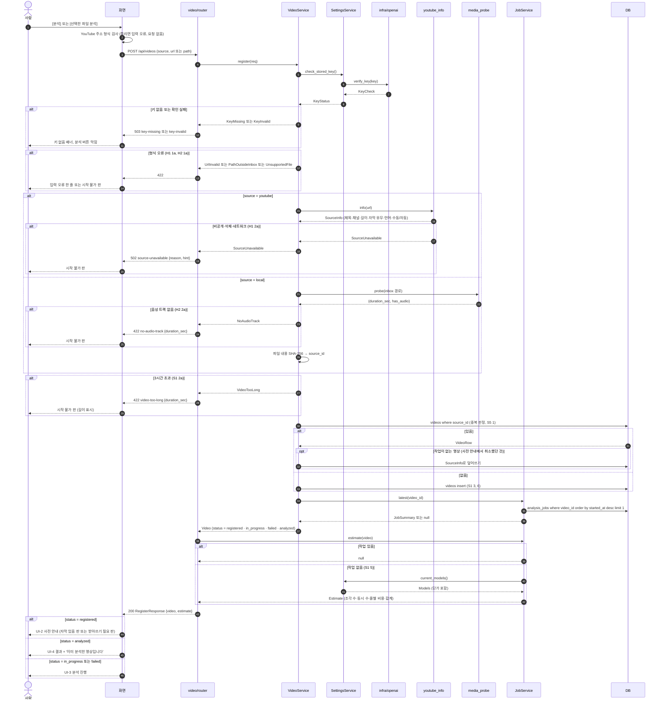
```mermaid
sequenceDiagram
    autonumber
    actor U as 사람
    participant W as 화면
    participant RV as video/router
    participant VS as VideoService
    participant SS as SettingsService
    participant OA as infra/openai
    participant YI as youtube_info
    participant MP as media_probe
    participant JS as JobService
    participant DB

    U->>W: [분석] 또는 [선택한 파일 분석]
    W->>W: YouTube 주소 형식 검사 (틀리면 입력 오류, 요청 없음)
    W->>RV: POST /api/videos {source, url 또는 path}
    RV->>VS: register(req)
    VS->>SS: check_stored_key()
    SS->>OA: verify_key(key)
    OA-->>SS: KeyCheck
    SS-->>VS: KeyStatus
    alt 키 없음 또는 확인 실패
        VS-->>RV: KeyMissing 또는 KeyInvalid
        RV-->>W: 503 key-missing 또는 key-invalid
        W-->>U: 키 없음 배너, 분석 버튼 막힘
    end
    alt 형식 오류 (H1 1a, H2 1a)
        VS-->>RV: UrlInvalid 또는 PathOutsideInbox 또는 UnsupportedFile
        RV-->>W: 422
        W-->>U: 입력 오류 한 줄 또는 시작 불가 판
    end
    alt source = youtube
        VS->>YI: info(url)
        YI-->>VS: SourceInfo (제목·채널·길이·자막 유무·언어·수동/자동)
        alt 비공개·삭제·네트워크 (H1 2a)
            YI-->>VS: SourceUnavailable
            VS-->>RV: SourceUnavailable
            RV-->>W: 502 source-unavailable {reason, hint}
            W-->>U: 시작 불가 판
        end
    else source = local
        VS->>MP: probe(inbox 경로)
        MP-->>VS: (duration_sec, has_audio)
        alt 음성 트랙 없음 (H2 2a)
            VS-->>RV: NoAudioTrack
            RV-->>W: 422 no-audio-track {duration_sec}
            W-->>U: 시작 불가 판
        end
        VS->>VS: 파일 내용 SHA-256 → source_id
    end
    alt 3시간 초과 (S1 2a)
        VS-->>RV: VideoTooLong
        RV-->>W: 422 video-too-long {duration_sec}
        W-->>U: 시작 불가 판 (길이 표시)
    end
    VS->>DB: videos where source_id (중복 판정, S5 1)
    alt 있음
        DB-->>VS: VideoRow
        opt 작업이 없는 영상 (사전 안내에서 취소했던 것)
            VS->>DB: SourceInfo로 덮어쓰기
        end
    else 없음
        VS->>DB: videos insert (S1 3, 6)
    end
    VS->>JS: latest(video_id)
    JS->>DB: analysis_jobs where video_id order by started_at desc limit 1
    JS-->>VS: JobSummary 또는 null
    VS-->>RV: Video (status = registered · in_progress · failed · analyzed)
    RV->>JS: estimate(video)
    alt 작업 있음
        JS-->>RV: null
    else 작업 없음 (S1 5)
        JS->>SS: current_models()
        SS-->>JS: Models (단가 포함)
        JS-->>RV: Estimate (조각 수·동시 수·줄별 비용·합계)
    end
    RV-->>W: 200 RegisterResponse {video, estimate}
    alt status = registered
        W-->>U: UI-2 사전 안내 (자막 있음 판 또는 받아쓰기 필요 판)
    else status = analyzed
        W-->>U: UI-4 결과 + '이미 분석한 영상입니다'
    else status = in_progress 또는 failed
        W-->>U: UI-3 분석 진행
    end
```

**읽을 때 볼 것**
- 키 확인은 요청마다 OpenAI에 한 번 간다(가벼운 모델 목록 조회). 화면 규칙 「분석 버튼을 누를 때 확인」이 이것이다([[VA-UI-002#UI-5]] 규칙). 화면이 GET으로 배너를 그릴 때는 이 확인이 없다(`GET/api/settings`는 마지막 결과만)
- 판정 순서는 [[VA-API-001#POST/api/videos]] 1~7번 그대로다. 키 → 형식 → 정보 조회 → 길이 → 중복 → 생성 → 예상치. 정보 조회 전에 걸리면 YouTube · ffprobe에 닿지 않는다
- `VideoService.register`가 돌려주는 `Video`에 `status`가 이미 계산돼 있다 — 그래서 `JobService.latest`를 부른다. 라우터가 `estimate`를 부르는 것은 3.1 표의 점선이고, `estimate`는 작업이 있으면 null이라 라우터에 분기가 없다
- 이 시퀀스에서 음성 · 텍스트는 OpenAI로 가지 않는다. 나가는 것은 키 확인 요청과 YouTube에 보내는 영상 ID뿐이다([[VA-UC-001#UC-H0]] 3a)
- `SourceInfo`로 덮어쓰기는 [[VA-DOM-002]] 5장 1의 결정이다. 취소한 영상이 남아 있어도 사용자에게는 처음 넣은 것과 같다

---

## SEQ-2 분석을 시작한다

[[VA-UC-001#UC-H0]] 3번, 확장 3a · 3b. 입구 [[VA-API-001#POST/api/videos/{id}/job]]. 화면 [[VA-UI-002#UI-2]] [분석 시작] → [[VA-UI-002#UI-3]].

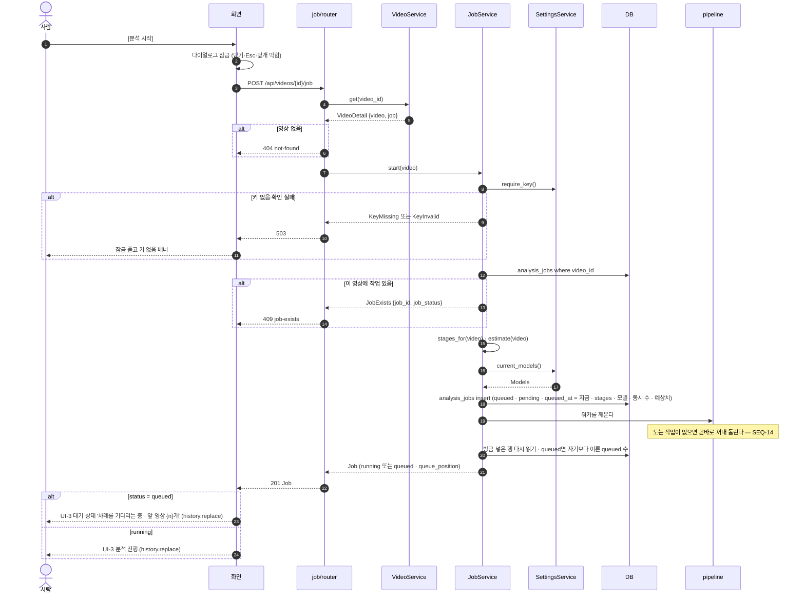
```mermaid
sequenceDiagram
    autonumber
    actor U as 사람
    participant W as 화면
    participant RJ as job/router
    participant VS as VideoService
    participant JS as JobService
    participant SS as SettingsService
    participant DB
    participant PL as pipeline

    U->>W: [분석 시작]
    W->>W: 다이얼로그 잠금 (닫기·Esc·덮개 막힘)
    W->>RJ: POST /api/videos/{id}/job
    RJ->>VS: get(video_id)
    VS-->>RJ: VideoDetail {video, job}
    alt 영상 없음
        RJ-->>W: 404 not-found
    end
    RJ->>JS: start(video)
    JS->>SS: require_key()
    alt 키 없음·확인 실패
        JS-->>RJ: KeyMissing 또는 KeyInvalid
        RJ-->>W: 503
        W-->>U: 잠금 풀고 키 없음 배너
    end
    JS->>DB: analysis_jobs where video_id
    alt 이 영상에 작업 있음
        JS-->>RJ: JobExists {job_id, job_status}
        RJ-->>W: 409 job-exists
    end
    JS->>JS: stages_for(video) · estimate(video)
    JS->>SS: current_models()
    SS-->>JS: Models
    JS->>DB: analysis_jobs insert (queued · pending · queued_at = 지금 · stages · 모델 · 동시 수 · 예상치)
    JS->>PL: 워커를 깨운다
    Note over PL: 도는 작업이 없으면 곧바로 꺼내 돌린다 — SEQ-14
    JS->>DB: 방금 넣은 행 다시 읽기 · queued면 자기보다 이른 queued 수
    JS-->>RJ: Job (running 또는 queued · queue_position)
    RJ-->>W: 201 Job
    alt status = queued
        W-->>U: UI-3 대기 상태 '차례를 기다리는 중 · 앞 영상 {n}개' (history.replace)
    else running
        W-->>U: UI-3 분석 진행 (history.replace)
    end
```

**읽을 때 볼 것**
- 라우터가 `VideoService.get`을 먼저 부르는 것은 `JobService.start`가 `Video` DTO를 받기 때문이다([[VA-DOM-002]] 3.1 표). 작업 묶음은 영상 테이블을 모른다
- **거절하지 않는다.** 다른 영상이 돌고 있어도 `queued`로 들어간다(사용자 결정 2026-09-21, [[VA-API-001]] 5장 8). `start`는 `running`인 작업이 있는지 보지 않는다 — 늘 `queued`로 넣고, `running`으로 바꾸는 것은 워커 하나다([[#SEQ-14]]). 시작하는 길이 하나라 「둘이 동시에 시작」이 생길 자리가 없다
- 응답의 `status`는 그 순간의 값이다. 도는 작업이 없으면 워커가 곧바로 꺼내므로 보통 `running`이고, 워커가 아직 안 꺼냈으면 `queued`(`queue_position = 1`)로 나갔다가 첫 폴링에서 `running`이 된다. 화면은 어느 쪽이든 UI-3을 연다
- 응답은 워커를 **깨우자마자** 나간다. 파이프라인은 기다리지 않는다. 화면은 201을 받으면 UI-3으로 가서 [[#SEQ-5]] 폴링을 시작한다
- `est_seconds` · `est_cost_usd`는 사전 안내와 같은 계산을 다시 해 행에 남긴다 — 설정이 바뀌어도 그때의 예상치가 이력으로 남는다([[VA-DOM-003#analysis_jobs]])

---
## SEQ-3 파이프라인 — 자막 있는 YouTube

[[VA-UC-001#UC-S2]] 1~2번 · [[VA-UC-001#UC-S4]] 전부 · [[VA-UC-001#UC-S6]] 1 · 3번. 입구는 [[#SEQ-2]]가 띄운 백그라운드 태스크. 단계 download(자막) → summarize → chapter → suggest.

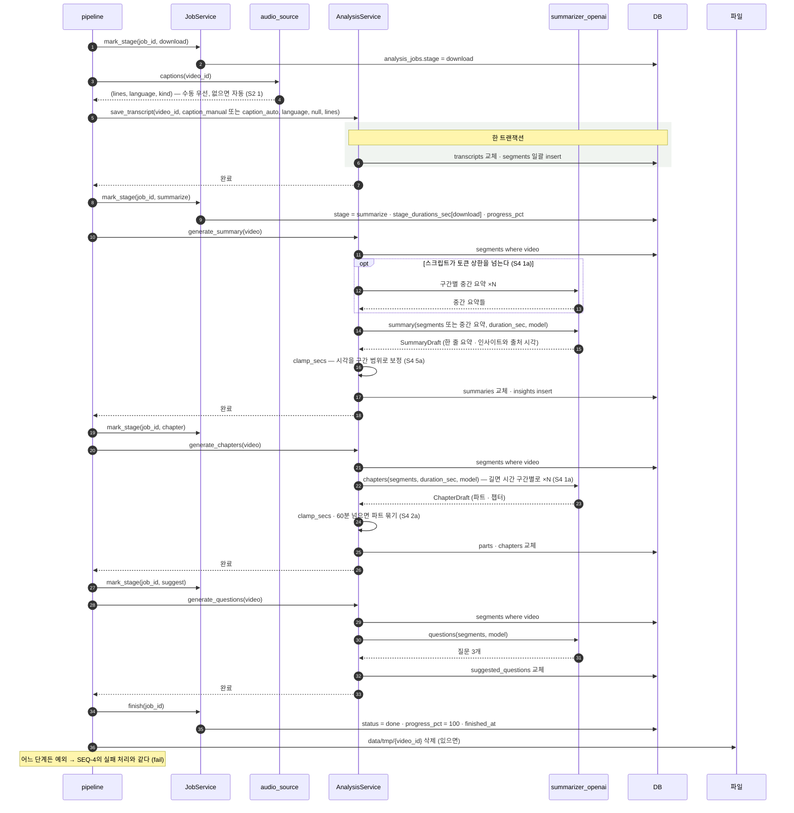
```mermaid
sequenceDiagram
    autonumber
    participant PL as pipeline
    participant JS as JobService
    participant AU as audio_source
    participant AS as AnalysisService
    participant SM as summarizer_openai
    participant DB
    participant FS as 파일

    PL->>JS: mark_stage(job_id, download)
    JS->>DB: analysis_jobs.stage = download
    PL->>AU: captions(video_id)
    AU-->>PL: (lines, language, kind) — 수동 우선, 없으면 자동 (S2 1)
    PL->>AS: save_transcript(video_id, caption_manual 또는 caption_auto, language, null, lines)
    rect rgb(240,244,240)
        Note over AS,DB: 한 트랜잭션
        AS->>DB: transcripts 교체 · segments 일괄 insert
    end
    AS-->>PL: 완료
    PL->>JS: mark_stage(job_id, summarize)
    JS->>DB: stage = summarize · stage_durations_sec[download] · progress_pct
    PL->>AS: generate_summary(video)
    AS->>DB: segments where video
    opt 스크립트가 토큰 상한을 넘는다 (S4 1a)
        AS->>SM: 구간별 중간 요약 ×N
        SM-->>AS: 중간 요약들
    end
    AS->>SM: summary(segments 또는 중간 요약, duration_sec, model)
    SM-->>AS: SummaryDraft (한 줄 요약 · 인사이트와 출처 시각)
    AS->>AS: clamp_secs — 시각을 구간 범위로 보정 (S4 5a)
    AS->>DB: summaries 교체 · insights insert
    AS-->>PL: 완료
    PL->>JS: mark_stage(job_id, chapter)
    PL->>AS: generate_chapters(video)
    AS->>DB: segments where video
    AS->>SM: chapters(segments, duration_sec, model) — 길면 시간 구간별로 ×N (S4 1a)
    SM-->>AS: ChapterDraft (파트 · 챕터)
    AS->>AS: clamp_secs · 60분 넘으면 파트 묶기 (S4 2a)
    AS->>DB: parts · chapters 교체
    AS-->>PL: 완료
    PL->>JS: mark_stage(job_id, suggest)
    PL->>AS: generate_questions(video)
    AS->>DB: segments where video
    AS->>SM: questions(segments, model)
    SM-->>AS: 질문 3개
    AS->>DB: suggested_questions 교체
    AS-->>PL: 완료
    PL->>JS: finish(job_id)
    JS->>DB: status = done · progress_pct = 100 · finished_at
    PL->>FS: data/tmp/{video_id} 삭제 (있으면)
    Note over PL: 어느 단계든 예외 → SEQ-4의 실패 처리와 같다 (fail)
```

**읽을 때 볼 것**
- 자막 결과는 OpenAI로 음성이 가지 않는다. 가는 것은 스크립트 텍스트뿐이다([[VA-UI-002#UI-2]] 자막 있음 판의 전송 안내)
- 요약이 챕터보다 먼저다. 긴 스크립트의 요약 재료는 챕터가 아니라 구간별 중간 요약이다([[VA-DOM-002]] 5장 10). 세 단계가 각각 `segments`를 다시 읽는 것은 서비스가 파이프라인의 메모리를 모르기 때문이다 — 3,000행을 세 번 읽는 비용은 OpenAI 호출에 비해 없는 것과 같다
- `AnalysisService`의 세 `generate_*`는 자기 결과를 **교체**한다. 실패 후 재시도가 같은 단계를 다시 돌려도 중복이 생기지 않는다
- 파이프라인은 `JobService`로만 작업 행을 만진다. 단계 전환 · 걸린 시간 · 진행률이 `mark_stage`에 들어 있다
- `finish` 뒤에 `Video.status`가 `analyzed`가 되는 것은 계산이다. 영상 행은 건드리지 않는다([[VA-DOM-002]] 5장 4)

---

## SEQ-4 파이프라인 — 받아쓰기

[[VA-UC-001#UC-S2]] 확장 1a · 1b · 1c · [[VA-UC-001#UC-S3]] 전부 · [[VA-UC-001#UC-S6]] 2번, 확장 1a · [[VA-UC-001#UC-H0]] 확장 4a~6a. 단계 download(음성) 또는 extract → transcribe → summarize → chapter → suggest. 요약 이후는 [[#SEQ-3]]과 같아 생략한다.

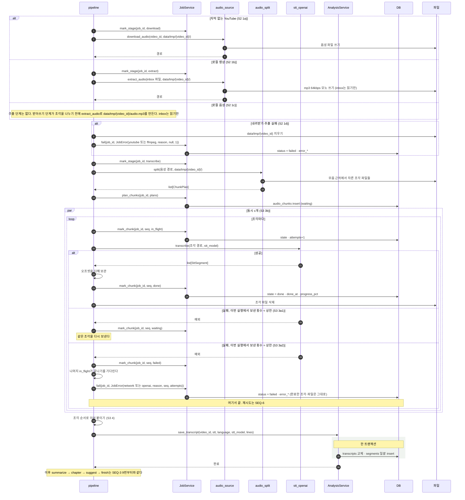
```mermaid
sequenceDiagram
    autonumber
    participant PL as pipeline
    participant JS as JobService
    participant AU as audio_source
    participant SP as audio_split
    participant ST as stt_openai
    participant AS as AnalysisService
    participant DB
    participant FS as 파일

    alt 자막 없는 YouTube (S2 1a)
        PL->>JS: mark_stage(job_id, download)
        PL->>AU: download_audio(video_id, data/tmp/{video_id}/)
        AU->>FS: 음성 파일 쓰기
        AU-->>PL: 경로
    else 로컬 영상 (S2 1b)
        PL->>JS: mark_stage(job_id, extract)
        PL->>AU: extract_audio(inbox 파일, data/tmp/{video_id}/)
        AU->>FS: mp3 64kbps 모노 쓰기 (inbox는 읽기만)
        AU-->>PL: 경로
    else 로컬 음성 (S2 1c)
        Note over PL: 추출 단계는 없다. 받아쓰기 단계가 조각을 나누기 전에 extract_audio로 data/tmp/{video_id}/audio.mp3를 만든다. inbox는 읽기만
    end
    alt 내려받기·추출 실패 (S2 1d)
        PL->>FS: data/tmp/{video_id} 지우기
        PL->>JS: fail(job_id, JobError(youtube 또는 ffmpeg, reason, null, 1))
        JS->>DB: status = failed · error_*
    end

    PL->>JS: mark_stage(job_id, transcribe)
    PL->>SP: split(음성 경로, data/tmp/{video_id}/)
    SP->>FS: 무음 근처에서 자른 조각 파일들
    SP-->>PL: list[ChunkPlan]
    PL->>JS: plan_chunks(job_id, plans)
    JS->>DB: audio_chunks insert (waiting)
    par 동시 c개 (S3 3b)
        loop 조각마다
            PL->>JS: mark_chunk(job_id, seq, in_flight)
            JS->>DB: state · attempts+1
            PL->>ST: transcribe(조각 경로, stt_model)
            alt 성공
                ST-->>PL: list[SttSegment]
                PL->>PL: 오프셋을 더해 보관
                PL->>JS: mark_chunk(job_id, seq, done)
                JS->>DB: state = done · done_at · progress_pct
                PL->>FS: 조각 파일 삭제
            else 실패, 이번 실행에서 보낸 횟수 < 상한 (S3 3a1)
                ST-->>PL: 예외
                PL->>JS: mark_chunk(job_id, seq, waiting)
                Note over PL: 같은 조각을 다시 보낸다
            else 실패, 이번 실행에서 보낸 횟수 = 상한 (S3 3a2)
                ST-->>PL: 예외
                PL->>JS: mark_chunk(job_id, seq, failed)
                PL->>PL: 나머지 in_flight가 끝나기를 기다린다
                PL->>JS: fail(job_id, JobError(network 또는 openai, reason, seq, attempts))
                JS->>DB: status = failed · error_* (완료한 조각·파일은 그대로)
                Note over PL,DB: 여기서 끝. 재시도는 SEQ-6
            end
        end
    end
    PL->>PL: 조각 순서로 이어 붙이기 (S3 4)
    PL->>AS: save_transcript(video_id, stt, language, stt_model, lines)
    rect rgb(240,244,240)
        Note over AS,DB: 한 트랜잭션
        AS->>DB: transcripts 교체 · segments 일괄 insert
    end
    AS-->>PL: 완료
    Note over PL: 이후 summarize → chapter → suggest → finish는 SEQ-3 9번부터와 같다
```

**읽을 때 볼 것**
- 조각 상태 넷과 `attempts`는 전부 DB에 있다. 서버가 죽어도 어디까지 됐는지 남는다([[VA-DOM-002]] 5장 6). 화면의 격자([[VA-UI-002#UI-3]])가 이 행을 그대로 그린다
- 자동 재시도는 조각 단위다. 상한(설정값, 첫 값 3)은 한 번 도는 동안 보낸 횟수다 — 다시 시도하면 새로 센다(`attempts`는 누적). 상한에 닿은 조각 하나가 작업 전체를 `failed`로 만들고, **돌고 있던 다른 조각은 끝까지 기다린다** — 그래야 완료 수(j)가 정확하고, 재시도가 보내는 첫 조각(r)이 실패한 조각(k)과 다를 수 있다는 화면 규칙이 맞는다
- 조각 파일은 조각이 `done`이 될 때마다 지운다. 실패한 작업은 `waiting` · `failed` 조각 파일만 남는다 — 재개용이다([[VA-INFRA-001]] 6절)
- 이어 붙이기는 메모리에서 한다. 조각의 결과 텍스트는 DB에 두지 않는다 — 재시도가 이미 `done`인 조각을 다시 보내지 않으려면 결과가 있어야 하는데, 지금 설계는 **조각 결과를 잃는다** → 되먹일 것 #1
- `mark_chunk(in_flight)`가 `attempts`를 올리고 `mark_chunk(done)`이 `progress_pct`를 갱신한다. 클래스 명세의 시그니처는 그대로이고 규칙만 더한다 → 되먹일 것 #2

---

## SEQ-5 진행 상태를 폴링한다

[[VA-UC-001#UC-S6]] 전부. 입구 [[VA-API-001#GET/api/videos/{id}/job]]. 화면 [[VA-UI-002#UI-3]]이 1초마다, [[VA-UI-002#UI-1]]이 진행 중 행을 갱신할 때.

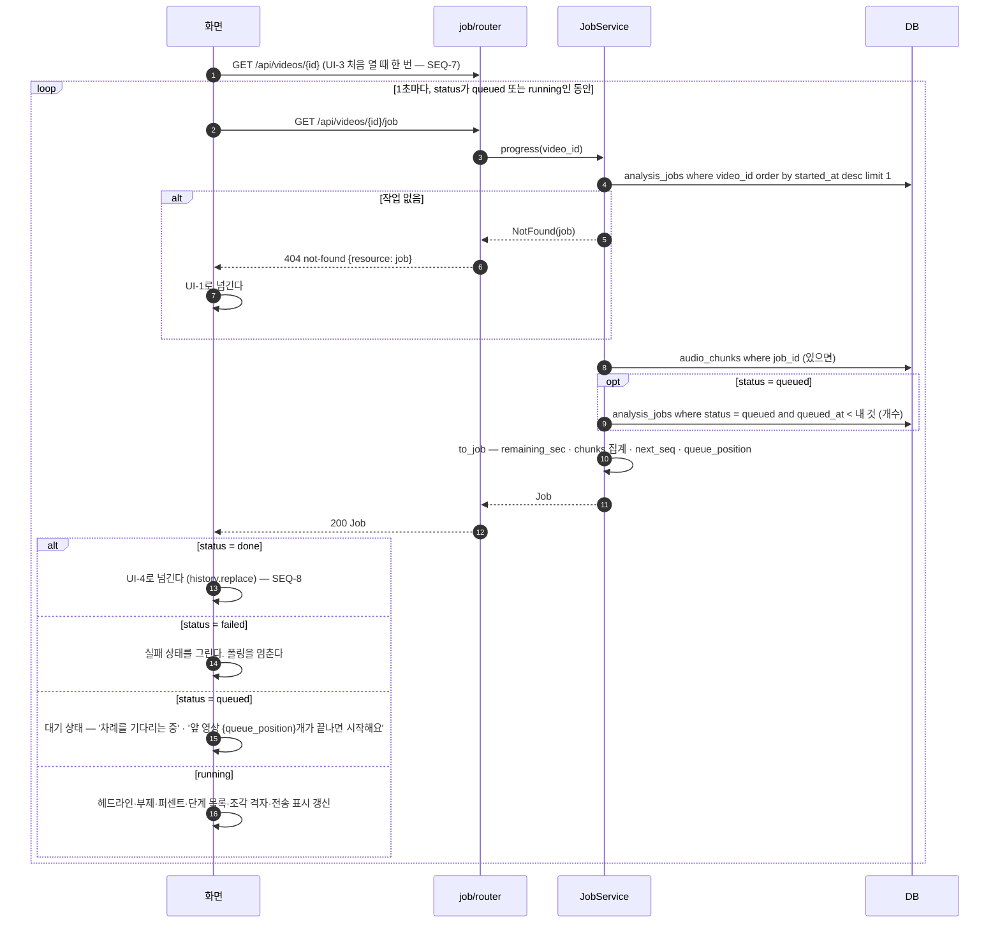
```mermaid
sequenceDiagram
    autonumber
    participant W as 화면
    participant RJ as job/router
    participant JS as JobService
    participant DB

    W->>RJ: GET /api/videos/{id} (UI-3 처음 열 때 한 번 — SEQ-7)
    loop 1초마다, status가 queued 또는 running인 동안
        W->>RJ: GET /api/videos/{id}/job
        RJ->>JS: progress(video_id)
        JS->>DB: analysis_jobs where video_id order by started_at desc limit 1
        alt 작업 없음
            JS-->>RJ: NotFound(job)
            RJ-->>W: 404 not-found {resource: job}
            W->>W: UI-1로 넘긴다
        end
        JS->>DB: audio_chunks where job_id (있으면)
        opt status = queued
            JS->>DB: analysis_jobs where status = queued and queued_at < 내 것 (개수)
        end
        JS->>JS: to_job — remaining_sec · chunks 집계 · next_seq · queue_position
        JS-->>RJ: Job
        RJ-->>W: 200 Job
        alt status = done
            W->>W: UI-4로 넘긴다 (history.replace) — SEQ-8
        else status = failed
            W->>W: 실패 상태를 그린다. 폴링을 멈춘다
        else status = queued
            W->>W: 대기 상태 — '차례를 기다리는 중' · '앞 영상 {queue_position}개가 끝나면 시작해요'
        else running
            W->>W: 헤드라인·부제·퍼센트·단계 목록·조각 격자·전송 표시 갱신
        end
    end
```

**읽을 때 볼 것**
- 읽기만 한다. 파이프라인이 쓴 행을 `JobService`가 응답 형태로 만든다. `remaining_sec`은 받아쓰기 단계면 미완료 조각 수 × `done_at` 간격의 평균, 다른 단계면 예상 전체 시간 − 지난 시간이다. 0이면 화면이 남은 시간을 비우고, `running`이 아니면 null이다([[VA-API-001#GET/api/videos/{id}/job]])
- 대기 중에도 같은 폴링이다. `queue_position`이 줄어들다가 `status`가 `running`으로 바뀌면 같은 화면이 진행 상태가 된다 — 화면을 새로 열지 않는다([[VA-UI-002#UI-3]] 규칙)
- 화면은 계산하지 않는다. 표의 값을 그대로 쓴다([[VA-API-001#GET/api/videos/{id}/job]]의 요소 ↔ 필드 표)
- 폴링이 `done`을 보면 UI-4로 넘긴다. 서버가 화면을 밀어 주는 길(SSE)은 없다([[VA-INFRA-001]] 3절)
- 영상 머리(제목 · 출처 · 길이 · 자막)는 폴링 응답에 없다. UI-3이 열릴 때 [[#SEQ-7]]의 `GET /api/videos/{id}`로 한 번 받는다

---

## SEQ-6 실패한 작업을 이어서 다시 시도한다

[[VA-UC-001#UC-S3]] 확장 3a3 · [[VA-UC-001#UC-S6]] 확장 1a · [[VA-UC-001#UC-H0]] 확장 4a~6a. 입구 [[VA-API-001#POST/api/videos/{id}/job/retry]]. 화면 [[VA-UI-002#UI-3]] 실패 알림의 다시 시도.

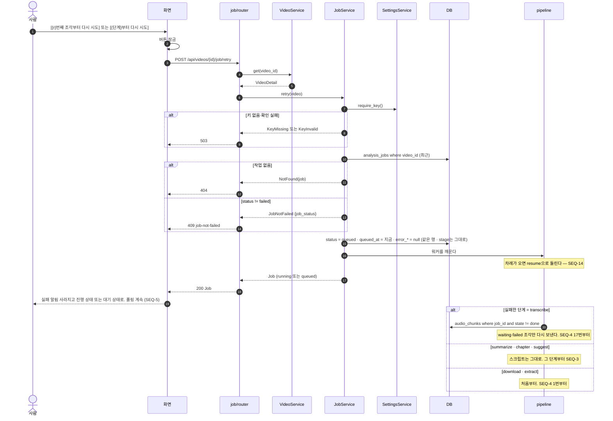
```mermaid
sequenceDiagram
    autonumber
    actor U as 사람
    participant W as 화면
    participant RJ as job/router
    participant VS as VideoService
    participant JS as JobService
    participant SS as SettingsService
    participant DB
    participant PL as pipeline

    U->>W: [{r}번째 조각부터 다시 시도] 또는 [{단계}부터 다시 시도]
    W->>W: 버튼 잠금
    W->>RJ: POST /api/videos/{id}/job/retry
    RJ->>VS: get(video_id)
    VS-->>RJ: VideoDetail
    RJ->>JS: retry(video)
    JS->>SS: require_key()
    alt 키 없음·확인 실패
        JS-->>RJ: KeyMissing 또는 KeyInvalid
        RJ-->>W: 503
    end
    JS->>DB: analysis_jobs where video_id (최근)
    alt 작업 없음
        JS-->>RJ: NotFound(job)
        RJ-->>W: 404
    else status != failed
        JS-->>RJ: JobNotFailed {job_status}
        RJ-->>W: 409 job-not-failed
    end
    JS->>DB: status = queued · queued_at = 지금 · error_* = null (같은 행 · stage는 그대로)
    JS->>PL: 워커를 깨운다
    Note over PL: 차례가 오면 resume으로 돌린다 — SEQ-14
    JS-->>RJ: Job (running 또는 queued)
    RJ-->>W: 200 Job
    W-->>U: 실패 알림 사라지고 진행 상태 또는 대기 상태로. 폴링 계속 (SEQ-5)
    alt 실패한 단계 = transcribe
        PL->>DB: audio_chunks where job_id and state != done
        Note over PL: waiting·failed 조각만 다시 보낸다. SEQ-4 17번부터
    else summarize · chapter · suggest
        Note over PL: 스크립트는 그대로. 그 단계부터 SEQ-3
    else download · extract
        Note over PL: 처음부터. SEQ-4 1번부터
    end
```

**읽을 때 볼 것**
- 새 작업을 만들지 않는다. `id` · `started_at` · `stages` · 모델이 그대로다([[VA-DOM-002#AnalysisJob]]). 목록 순서도 바뀌지 않는다. 바뀌는 것은 `queued_at`뿐이다 — 다른 영상이 돌고 있으면 대기열 **끝**에서 기다린다([[VA-DOM-003#analysis_jobs]])
- `resume`은 행의 `stage`를 보고 그 단계부터 돈다. 받아쓰기면 `done`이 아닌 조각만 — 그런데 `done`인 조각의 결과 텍스트가 어디에도 없다. 이어 붙이려면 다시 보내야 한다 → 되먹일 것 #1 (조각 결과를 `audio_chunks`에 두거나 파일로 남긴다)
- 키가 없는 동안 화면은 버튼을 막은 상태이지만 서버도 다시 검사한다. 화면 규칙과 서버 규칙이 같은 것을 두 번 지킨다. 마지막 확인이 연결 실패(`network`)였으면 화면은 막지 않고, `require_key`가 그 자리에서 한 번 다시 확인한다([[#SEQ-13]] 읽을 때 볼 것)

---

## SEQ-7 분석한 영상 목록과 영상 하나를 본다

[[VA-UC-001#UC-H5]] 1~2번, 확장 1b · [[VA-UC-001#UC-S5]] 3번 · [[VA-UC-001#UC-H6]] 2번(다이얼로그 정보). 입구 [[VA-API-001#GET/api/videos]] · [[VA-API-001#GET/api/videos/{id}]]. 화면 [[VA-UI-002#UI-1]] 목록 · [[VA-UI-002#UI-3]] 영상 머리 · [[VA-UI-002#UI-6]].

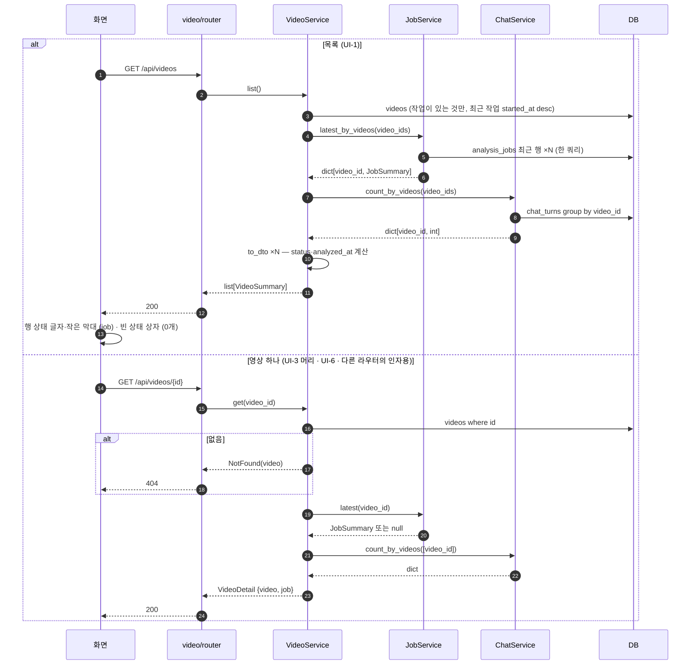
```mermaid
sequenceDiagram
    autonumber
    participant W as 화면
    participant RV as video/router
    participant VS as VideoService
    participant JS as JobService
    participant CS as ChatService
    participant DB

    alt 목록 (UI-1)
        W->>RV: GET /api/videos
        RV->>VS: list()
        VS->>DB: videos (작업이 있는 것만, 최근 작업 started_at desc)
        VS->>JS: latest_by_videos(video_ids)
        JS->>DB: analysis_jobs 최근 행 ×N (한 쿼리)
        JS-->>VS: dict[video_id, JobSummary]
        VS->>CS: count_by_videos(video_ids)
        CS->>DB: chat_turns group by video_id
        CS-->>VS: dict[video_id, int]
        VS->>VS: to_dto ×N — status·analyzed_at 계산
        VS-->>RV: list[VideoSummary]
        RV-->>W: 200
        W->>W: 행 상태 글자·작은 막대 (job) · 빈 상태 상자 (0개)
    else 영상 하나 (UI-3 머리 · UI-6 · 다른 라우터의 인자용)
        W->>RV: GET /api/videos/{id}
        RV->>VS: get(video_id)
        VS->>DB: videos where id
        alt 없음
            VS-->>RV: NotFound(video)
            RV-->>W: 404
        end
        VS->>JS: latest(video_id)
        JS-->>VS: JobSummary 또는 null
        VS->>CS: count_by_videos([video_id])
        CS-->>VS: dict
        VS-->>RV: VideoDetail {video, job}
        RV-->>W: 200
    end
```

**읽을 때 볼 것**
- 영상 응답 하나를 만드는 데 세 묶음이 든다. `VideoService`가 두 서비스를 부르는 것이 [[VA-DOM-002]] 3.2에 그려진 방향이고, 반대 방향은 없다
- 목록은 한 번에 센다(N+1 금지). `latest_by_videos` · `count_by_videos`가 `video_ids`를 받는 이유다
- `to_dto`가 `status`를 계산하는 유일한 자리다. 화면 다섯 곳의 분기가 전부 이 값 하나를 본다([[VA-API-001]] 5장 10)
- UI-1이 열려 있는 동안 진행 중 · 대기 중 행이 있으면 3초마다 목록 전체를 다시 부른다([[VA-UI-002#UI-1]] 규칙). 그런 행이 없으면 부르지 않는다

---

## SEQ-8 결과를 본다

[[VA-UC-001#UC-H3]] 1번 · [[VA-UC-001#UC-H5]] 3번 · [[VA-UC-001#UC-S4]](결과 표시). 입구 [[VA-API-001#GET/api/videos/{id}/result]] (+ [[VA-API-001#GET/api/videos/{id}/chat]]). 화면 [[VA-UI-002#UI-4]]가 열릴 때.

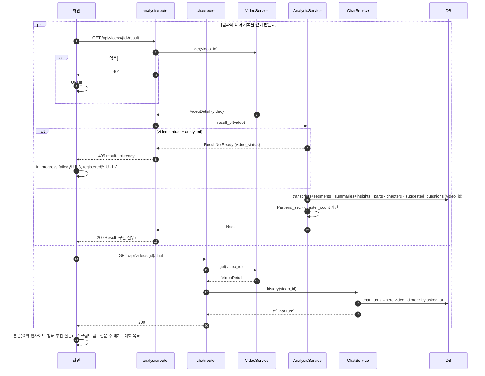
```mermaid
sequenceDiagram
    autonumber
    participant W as 화면
    participant RA as analysis/router
    participant RC as chat/router
    participant VS as VideoService
    participant AS as AnalysisService
    participant CS as ChatService
    participant DB

    par 결과와 대화 기록을 같이 받는다
        W->>RA: GET /api/videos/{id}/result
        RA->>VS: get(video_id)
        alt 없음
            RA-->>W: 404
            W->>W: UI-1로
        end
        VS-->>RA: VideoDetail {video}
        RA->>AS: result_of(video)
        alt video.status != analyzed
            AS-->>RA: ResultNotReady {video_status}
            RA-->>W: 409 result-not-ready
            W->>W: in_progress·failed면 UI-3, registered면 UI-1로
        end
        AS->>DB: transcripts+segments · summaries+insights · parts · chapters · suggested_questions (video_id)
        AS->>AS: Part.end_sec · chapter_count 계산
        AS-->>RA: Result
        RA-->>W: 200 Result (구간 전부)
    and
        W->>RC: GET /api/videos/{id}/chat
        RC->>VS: get(video_id)
        VS-->>RC: VideoDetail
        RC->>CS: history(video_id)
        CS->>DB: chat_turns where video_id order by asked_at
        CS-->>RC: list[ChatTurn]
        RC-->>W: 200
    end
    W->>W: 본문(요약·인사이트·챕터·추천 질문) · 스크립트 탭 · 질문 수 배지 · 대화 목록
```

**읽을 때 볼 것**
- 결과 조회가 `VideoService.get`을 먼저 부르는 것은 `result_of`가 `Video` DTO(상태 · 길이 · 출처 · 대화 수)를 받기 때문이다. 결과 묶음은 영상 · 대화 테이블을 모른다
- 구간 수천 개가 한 응답이다([[VA-API-001]] 5장 3). 화면이 시각 이동에 전부 필요로 한다
- 대화 기록은 별도 요청이다. 결과는 분석이 끝나면 고정되고 대화는 계속 쌓인다 — 묶음이 다른 이유가 응답도 가른다([[VA-DOM-001]] 4장)
- 주소로 바로 들어와 결과가 없으면 409의 `video_status`로 갈 곳을 정한다. 화면은 이 판정을 위해 따로 `GET /api/videos/{id}`를 부르지 않아도 된다

---
## SEQ-9 영상에 질문한다

[[VA-UC-001#UC-H4]] 1~4번, 확장 1a · 1b · 2a · 3a · 3b. 입구 [[VA-API-001#POST/api/videos/{id}/chat]]. 화면 [[VA-UI-002#UI-4]] [보내기] · 추천 질문.

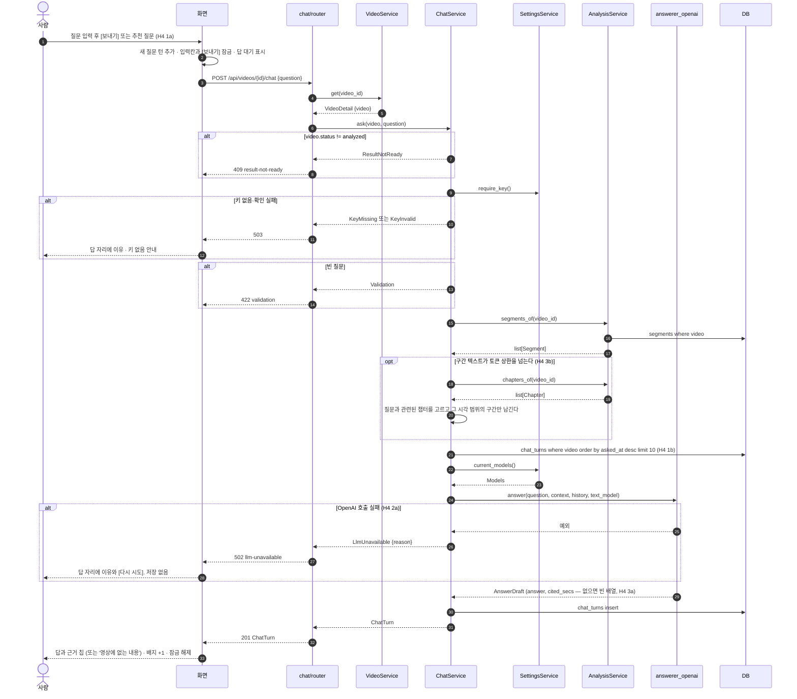
```mermaid
sequenceDiagram
    autonumber
    actor U as 사람
    participant W as 화면
    participant RC as chat/router
    participant VS as VideoService
    participant CS as ChatService
    participant SS as SettingsService
    participant AS as AnalysisService
    participant AN as answerer_openai
    participant DB

    U->>W: 질문 입력 후 [보내기] 또는 추천 질문 (H4 1a)
    W->>W: 새 질문 턴 추가 · 입력칸과 [보내기] 잠금 · 답 대기 표시
    W->>RC: POST /api/videos/{id}/chat {question}
    RC->>VS: get(video_id)
    VS-->>RC: VideoDetail {video}
    RC->>CS: ask(video, question)
    alt video.status != analyzed
        CS-->>RC: ResultNotReady
        RC-->>W: 409 result-not-ready
    end
    CS->>SS: require_key()
    alt 키 없음·확인 실패
        CS-->>RC: KeyMissing 또는 KeyInvalid
        RC-->>W: 503
        W-->>U: 답 자리에 이유 · 키 없음 안내
    end
    alt 빈 질문
        CS-->>RC: Validation
        RC-->>W: 422 validation
    end
    CS->>AS: segments_of(video_id)
    AS->>DB: segments where video
    AS-->>CS: list[Segment]
    opt 구간 텍스트가 토큰 상한을 넘는다 (H4 3b)
        CS->>AS: chapters_of(video_id)
        AS-->>CS: list[Chapter]
        CS->>CS: 질문과 관련된 챕터를 고르고 그 시각 범위의 구간만 남긴다
    end
    CS->>DB: chat_turns where video order by asked_at desc limit 10 (H4 1b)
    CS->>SS: current_models()
    SS-->>CS: Models
    CS->>AN: answer(question, context, history, text_model)
    alt OpenAI 호출 실패 (H4 2a)
        AN-->>CS: 예외
        CS-->>RC: LlmUnavailable {reason}
        RC-->>W: 502 llm-unavailable
        W-->>U: 답 자리에 이유와 [다시 시도]. 저장 없음
    end
    AN-->>CS: AnswerDraft (answer, cited_secs — 없으면 빈 배열, H4 3a)
    CS->>DB: chat_turns insert
    CS-->>RC: ChatTurn
    RC-->>W: 201 ChatTurn
    W-->>U: 답과 근거 칩 (또는 '영상에 없는 내용') · 배지 +1 · 잠금 해제
```

**읽을 때 볼 것**
- 저장은 답을 받은 뒤 한 번이다. 실패한 질문은 행이 없고 배지에 세지 않는다([[VA-UI-002#UI-4]] 규칙). [다시 시도]는 같은 요청을 다시 보낸다
- `ChatService`가 `AnalysisService`를 부르는 것은 [[VA-DOM-002]] 3.2에 그려진 넷 중 하나다. 스크립트 객체가 아니라 `video_id`로 묻고 DTO 목록을 받는다
- 맥락 = 구간(전부 또는 관련 챕터 범위) + 최근 턴 10개. OpenAI로 나가는 것이 「질문, 앞선 대화, 관련 스크립트」라는 화면 문구([[VA-UI-002#UI-4]] 10.5)와 같다
- 응답 시간 목표 10초([[VA-PRD-001#N1]]). 화면은 기다리는 동안 추천 질문도 보내지 않는다

---

## SEQ-10 마크다운으로 내보낸다

[[VA-UC-001#UC-H7]] 1~3번, 확장 2a · 2b. 입구 [[VA-API-001#GET/api/videos/{id}/export]] · [[VA-API-001#POST/api/videos/{id}/export]]. 화면 [[VA-UI-002#UI-7]].

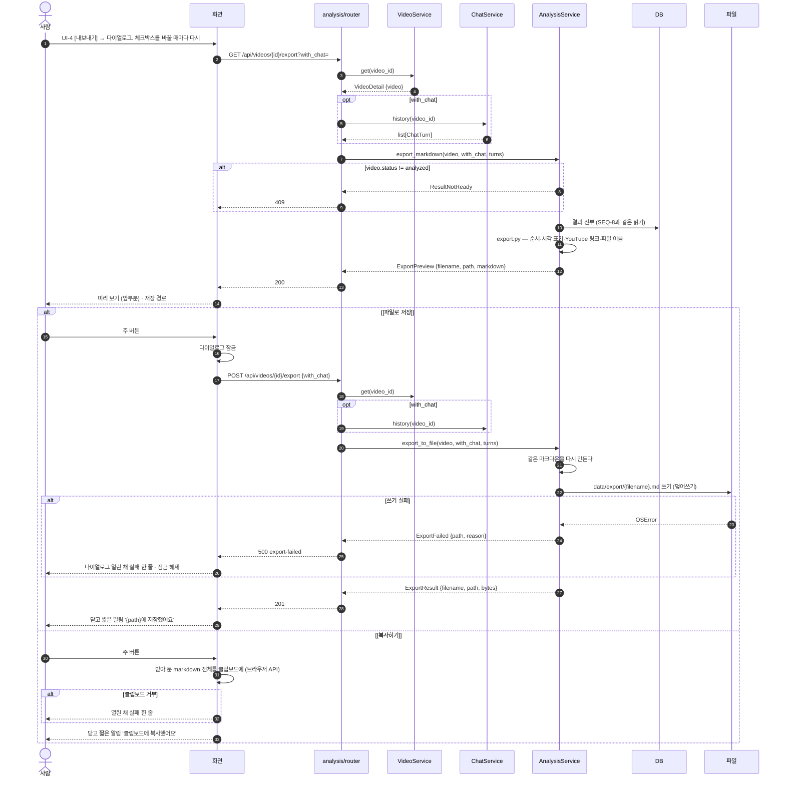
```mermaid
sequenceDiagram
    autonumber
    actor U as 사람
    participant W as 화면
    participant RA as analysis/router
    participant VS as VideoService
    participant CS as ChatService
    participant AS as AnalysisService
    participant DB
    participant FS as 파일

    U->>W: UI-4 [내보내기] → 다이얼로그. 체크박스를 바꿀 때마다 다시
    W->>RA: GET /api/videos/{id}/export?with_chat=
    RA->>VS: get(video_id)
    VS-->>RA: VideoDetail {video}
    opt with_chat
        RA->>CS: history(video_id)
        CS-->>RA: list[ChatTurn]
    end
    RA->>AS: export_markdown(video, with_chat, turns)
    alt video.status != analyzed
        AS-->>RA: ResultNotReady
        RA-->>W: 409
    end
    AS->>DB: 결과 전부 (SEQ-8과 같은 읽기)
    AS->>AS: export.py — 순서·시각 표기·YouTube 링크·파일 이름
    AS-->>RA: ExportPreview {filename, path, markdown}
    RA-->>W: 200
    W-->>U: 미리 보기 (앞부분) · 저장 경로
    alt [파일로 저장]
        U->>W: 주 버튼
        W->>W: 다이얼로그 잠금
        W->>RA: POST /api/videos/{id}/export {with_chat}
        RA->>VS: get(video_id)
        opt with_chat
            RA->>CS: history(video_id)
        end
        RA->>AS: export_to_file(video, with_chat, turns)
        AS->>AS: 같은 마크다운을 다시 만든다
        AS->>FS: data/export/{filename}.md 쓰기 (덮어쓰기)
        alt 쓰기 실패
            FS-->>AS: OSError
            AS-->>RA: ExportFailed {path, reason}
            RA-->>W: 500 export-failed
            W-->>U: 다이얼로그 열린 채 실패 한 줄 · 잠금 해제
        end
        AS-->>RA: ExportResult {filename, path, bytes}
        RA-->>W: 201
        W-->>U: 닫고 짧은 알림 '{path}에 저장했어요'
    else [복사하기]
        U->>W: 주 버튼
        W->>W: 받아 둔 markdown 전체를 클립보드에 (브라우저 API)
        alt 클립보드 거부
            W-->>U: 열린 채 실패 한 줄
        end
        W-->>U: 닫고 짧은 알림 '클립보드에 복사했어요'
    end
```

**읽을 때 볼 것**
- 클립보드는 서버에 닿지 않는다. GET이 준 `markdown` 전체를 브라우저가 넣는다([[VA-DOM-002]] 5장 5, [[VA-API-001]] 5장 5). 미리 보기와 복사가 같은 응답을 쓴다
- 파일로 저장은 서버가 같은 마크다운을 다시 만든다. GET의 결과를 POST로 보내지 않는다 — 본문이 커지고, 화면이 고친 본문이 저장될 길을 열지 않기 위해서다
- `with_chat`이면 라우터가 `ChatService.history`를 불러 넘긴다. 결과 묶음은 대화 테이블을 모른다([[VA-DOM-002]] 3.1 표)
- 저장된 결과는 바뀌지 않는다([[VA-UC-001#UC-H7]] 최소 보장). 쓰는 것은 `data/export/` 파일뿐이다

---

## SEQ-11 영상을 삭제한다

[[VA-UC-001#UC-H6]] 1~4번, 확장 3a. 입구 [[VA-API-001#DELETE/api/videos/{id}]]. 화면 [[VA-UI-002#UI-6]] [삭제].

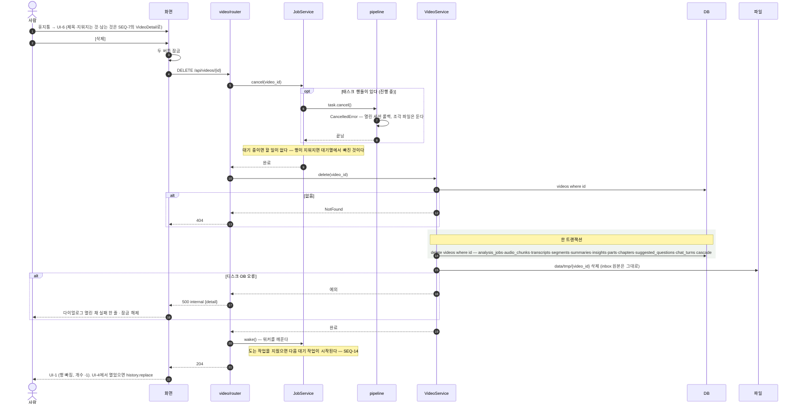
```mermaid
sequenceDiagram
    autonumber
    actor U as 사람
    participant W as 화면
    participant RV as video/router
    participant JS as JobService
    participant PL as pipeline
    participant VS as VideoService
    participant DB
    participant FS as 파일

    U->>W: 휴지통 → UI-6 (제목·지워지는 것·남는 것은 SEQ-7의 VideoDetail로)
    U->>W: [삭제]
    W->>W: 두 버튼 잠금
    W->>RV: DELETE /api/videos/{id}
    RV->>JS: cancel(video_id)
    opt 태스크 핸들이 있다 (진행 중)
        JS->>PL: task.cancel()
        PL->>PL: CancelledError — 열린 세션 롤백, 조각 파일은 둔다
        PL-->>JS: 끝남
    end
    Note over JS: 대기 중이면 할 일이 없다 — 행이 지워지면 대기열에서 빠진 것이다
    JS-->>RV: 완료
    RV->>VS: delete(video_id)
    VS->>DB: videos where id
    alt 없음
        VS-->>RV: NotFound
        RV-->>W: 404
    end
    rect rgb(240,244,240)
        Note over VS,DB: 한 트랜잭션
        VS->>DB: delete videos where id — analysis_jobs·audio_chunks·transcripts·segments·summaries·insights·parts·chapters·suggested_questions·chat_turns cascade
    end
    VS->>FS: data/tmp/{video_id} 삭제 (inbox 원본은 그대로)
    alt 디스크·DB 오류
        VS-->>RV: 예외
        RV-->>W: 500 internal {detail}
        W-->>U: 다이얼로그 열린 채 실패 한 줄 · 잠금 해제
    end
    VS-->>RV: 완료
    RV->>JS: wake() — 워커를 깨운다
    Note over JS: 도는 작업을 지웠으면 다음 대기 작업이 시작된다 — SEQ-14
    RV-->>W: 204
    W-->>U: UI-1 (행 빠짐, 개수 -1). UI-4에서 열었으면 history.replace
```

**읽을 때 볼 것**
- 라우터가 `JobService.cancel`을 먼저, `VideoService.delete`를 다음에 부른다. 순서만 있고 판단이 없어 조율 모듈을 두지 않았다([[VA-DOM-002]] 5장 3). 진행 중이 아니면(대기 중 · 실패 · 완료) `cancel`은 아무것도 안 한다. 워커를 깨우는 것은 행이 지워진 **뒤**다 — 먼저 깨우면 워커가 지워질 행을 꺼낼 수 있다 → 되먹일 것 #8
- 앱이 지우는 행은 `videos` 하나다. 나머지 열 종류는 FK cascade가 지운다([[VA-DOM-003]] 4장 5). 빠뜨릴 것이 없다
- 취소된 파이프라인은 `await` 지점에서 멈춘다. 열린 DB 세션은 롤백되고, 진행 중이던 OpenAI 요청의 응답은 버려진다. 이미 보낸 요청의 비용은 든다
- 남는 것은 inbox 원본(로컬)뿐이다([[VA-INFRA-001#C4]]). 다시 넣으면 처음부터 분석한다

---

## SEQ-12 키를 확인하고 저장한다

[[VA-UC-001#UC-H8]] 2~4번, 확장 3a. 입구 [[VA-API-001#POST/api/settings/key]]. 화면 [[VA-UI-002#UI-5]] [확인하고 저장].

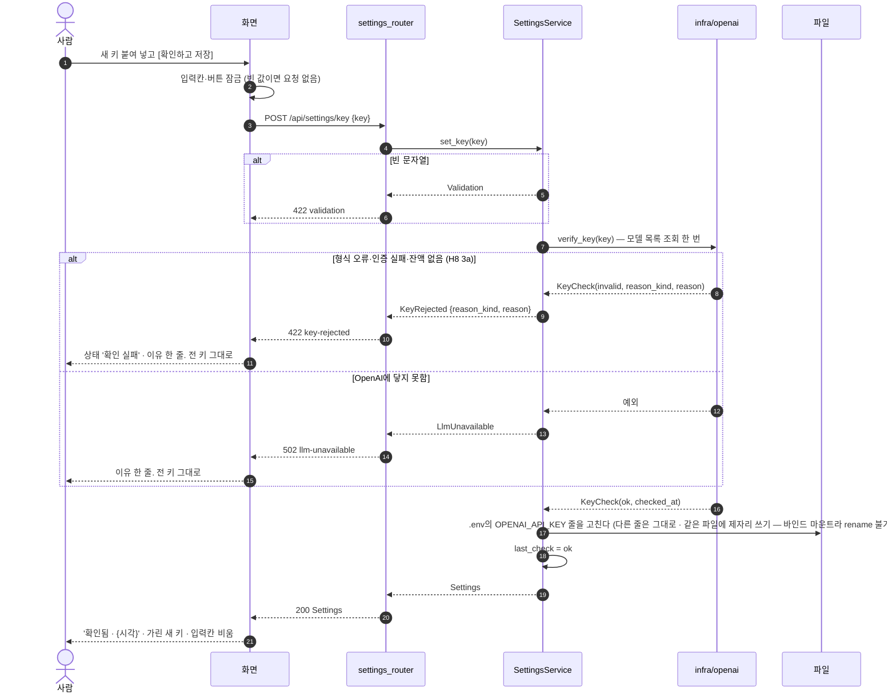
```mermaid
sequenceDiagram
    autonumber
    actor U as 사람
    participant W as 화면
    participant RS as settings_router
    participant SS as SettingsService
    participant OA as infra/openai
    participant FS as 파일

    U->>W: 새 키 붙여 넣고 [확인하고 저장]
    W->>W: 입력칸·버튼 잠금 (빈 값이면 요청 없음)
    W->>RS: POST /api/settings/key {key}
    RS->>SS: set_key(key)
    alt 빈 문자열
        SS-->>RS: Validation
        RS-->>W: 422 validation
    end
    SS->>OA: verify_key(key) — 모델 목록 조회 한 번
    alt 형식 오류·인증 실패·잔액 없음 (H8 3a)
        OA-->>SS: KeyCheck(invalid, reason_kind, reason)
        SS-->>RS: KeyRejected {reason_kind, reason}
        RS-->>W: 422 key-rejected
        W-->>U: 상태 '확인 실패' · 이유 한 줄. 전 키 그대로
    else OpenAI에 닿지 못함
        OA-->>SS: 예외
        SS-->>RS: LlmUnavailable
        RS-->>W: 502 llm-unavailable
        W-->>U: 이유 한 줄. 전 키 그대로
    end
    OA-->>SS: KeyCheck(ok, checked_at)
    SS->>FS: .env의 OPENAI_API_KEY 줄을 고친다 (다른 줄은 그대로 · 같은 파일에 제자리 쓰기 — 바인드 마운트라 rename 불가)
    SS->>SS: last_check = ok
    SS-->>RS: Settings
    RS-->>W: 200 Settings
    W-->>U: '확인됨 · {시각}' · 가린 새 키 · 입력칸 비움
```

**읽을 때 볼 것**
- 확인이 통과해야 저장한다. 실패 두 종류(거부 · 네트워크) 모두 저장하지 않고 `last_check`도 바꾸지 않는다 — 배너와 막힌 버튼은 **저장된 키**의 결과만 따른다([[VA-UI-002#UI-5]] 규칙)
- 키 전체는 응답에 없다. `Settings.key.masked`뿐이다
- 저장하는 곳은 `.env` 파일 하나다([[VA-INFRA-001#C6]], [[VA-DOM-002#SettingsService]]). `SettingsService`만 읽고 쓴다. 어댑터는 키를 `SettingsService`에서 받는다([[VA-DOM-002]] 4.7 규칙)
- 이 요청이 통과하면 UI-1의 배너가 사라지고 분석 버튼이 켜진다 — 화면이 `GET /api/settings`를 다시 불러 안다

---

## SEQ-13 서버가 시작한다

[[VA-UC-001#UC-H8]] 확장 1a(`.env`에 직접 적은 키) · [[VA-DOM-002]] 5장 8(죽은 작업 · 대기열 워커). 입구는 `main.py` lifespan. 화면 없음.

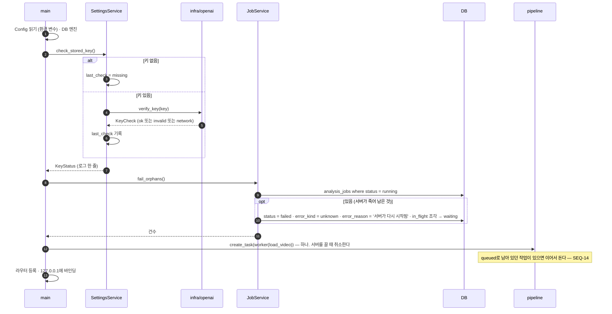
```mermaid
sequenceDiagram
    autonumber
    participant MN as main
    participant SS as SettingsService
    participant OA as infra/openai
    participant JS as JobService
    participant DB
    participant PL as pipeline

    MN->>MN: Config 읽기 (환경 변수) · DB 엔진
    MN->>SS: check_stored_key()
    alt 키 없음
        SS->>SS: last_check = missing
    else 키 있음
        SS->>OA: verify_key(key)
        OA-->>SS: KeyCheck (ok 또는 invalid 또는 network)
        SS->>SS: last_check 기록
    end
    SS-->>MN: KeyStatus (로그 한 줄)
    MN->>JS: fail_orphans()
    JS->>DB: analysis_jobs where status = running
    opt 있음 (서버가 죽어 남은 것)
        JS->>DB: status = failed · error_kind = unknown · error_reason = '서버가 다시 시작됨' · in_flight 조각 → waiting
    end
    JS-->>MN: 건수
    MN->>PL: create_task(worker(load_video)) — 하나. 서버를 끌 때 취소한다
    Note over PL: queued로 남아 있던 작업이 있으면 이어서 돈다 — SEQ-14
    MN->>MN: 라우터 등록 · 127.0.0.1에 바인딩
```

**읽을 때 볼 것**
- 시작 때 키 확인이 세 확인 시점 중 첫째다(시작 · 분석 버튼 · 키 저장). 실패해도 서버는 뜬다 — 읽기는 키 없이도 되고 배너가 알린다([[VA-API-001]] 1장)
- `running`인 채 남은 작업은 핸들이 없어 영원히 돈다고 보인다. `failed`로 돌려야 재시도가 된다. `JobService.fail_orphans`는 클래스 명세에 없다 → 되먹일 것 #3. `queued`는 건드리지 않는다 — 돌던 것이 아니라 기다리던 것이라 워커가 뜨면 이어서 돈다
- 순서가 있다. `fail_orphans`가 **먼저**, 워커가 **다음**이다. 거꾸로면 `running`인 채 남은 행 때문에 워커가 아무것도 꺼내지 못한다
- 네트워크가 없어 확인이 `network`로 실패한 키는 `invalid`로 본다. 분석 버튼을 누르면 다시 확인하고([[#SEQ-1]]), 다시 시도와 질문도 마지막 결과가 `network`면 `require_key`가 그 자리에서 한 번 다시 확인하므로([[VA-DOM-002#SettingsService]]) 네트워크가 돌아오면 저절로 풀린다. 그동안 배너 문구는 '연결을 확인하지 못했어요 — …'이고 버튼은 막지 않는다([[VA-UI-002]] 1.4)

---

## SEQ-14 워커가 대기열에서 다음 작업을 꺼낸다

[[VA-UC-001#UC-H0]] 확장 3b · [[VA-DOM-002]] 5장 8(대기열은 DB, 워커 하나). 입구는 [[#SEQ-13]]이 띄운 `pipeline.worker`. 화면 없음 — 화면은 [[#SEQ-5]] 폴링으로 안다.

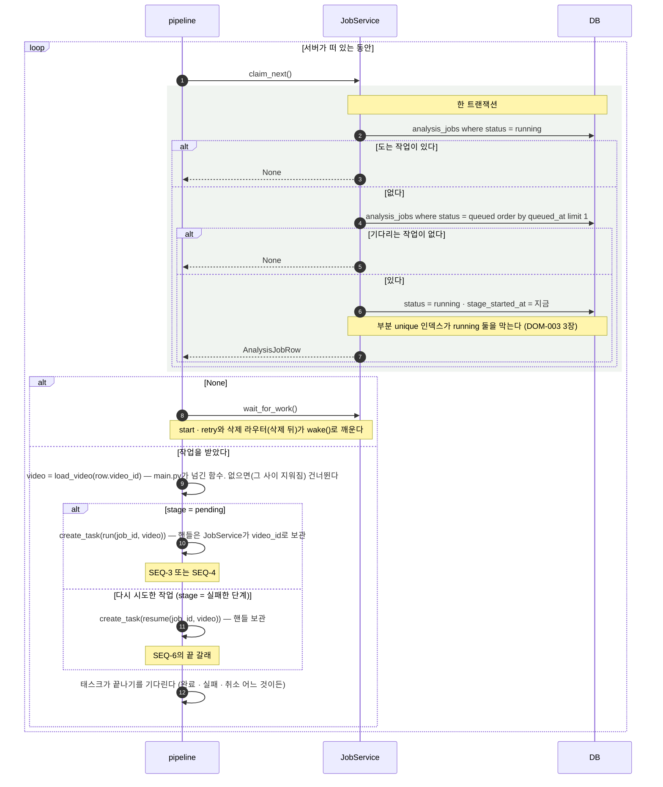
```mermaid
sequenceDiagram
    autonumber
    participant PL as pipeline
    participant JS as JobService
    participant DB

    loop 서버가 떠 있는 동안
        PL->>JS: claim_next()
        rect rgb(240,244,240)
            Note over JS,DB: 한 트랜잭션
            JS->>DB: analysis_jobs where status = running
            alt 도는 작업이 있다
                JS-->>PL: None
            else 없다
                JS->>DB: analysis_jobs where status = queued order by queued_at limit 1
                alt 기다리는 작업이 없다
                    JS-->>PL: None
                else 있다
                    JS->>DB: status = running · stage_started_at = 지금
                    Note over JS,DB: 부분 unique 인덱스가 running 둘을 막는다 (DOM-003 3장)
                    JS-->>PL: AnalysisJobRow
                end
            end
        end
        alt None
            PL->>JS: wait_for_work()
            Note over PL,JS: start · retry와 삭제 라우터(삭제 뒤)가 wake()로 깨운다
        else 작업을 받았다
            PL->>PL: video = load_video(row.video_id) — main.py가 넘긴 함수. 없으면(그 사이 지워짐) 건너뛴다
            alt stage = pending
                PL->>PL: create_task(run(job_id, video)) — 핸들은 JobService가 video_id로 보관
                Note over PL: SEQ-3 또는 SEQ-4
            else 다시 시도한 작업 (stage = 실패한 단계)
                PL->>PL: create_task(resume(job_id, video)) — 핸들 보관
                Note over PL: SEQ-6의 끝 갈래
            end
            PL->>PL: 태스크가 끝나기를 기다린다 (완료 · 실패 · 취소 어느 것이든)
        end
    end
```

**읽을 때 볼 것**
- 시작하는 길이 하나다. `start`([[#SEQ-2]])도 `retry`([[#SEQ-6]])도 `queued`로 넣고 깨울 뿐이고, `running`으로 바꾸는 것은 여기 하나다. 도는 작업이 없으면 깨어나자마자 꺼내므로 기다림이 없다
- 대기열은 메모리에 없다. `queued` 행이 곧 대기열이라 서버가 다시 떠도 기다리던 작업이 남고([[#SEQ-13]]), 워커가 뜨면 이어서 돈다. 메모리에 있는 것은 깨우는 신호 하나뿐이다
- 앞 작업이 **실패해도** 다음 작업은 시작된다. 실패한 작업은 `failed`로 남을 뿐 대기열을 막지 않는다([[VA-UI-002#UI-3]] 규칙)
- 워커는 태스크의 예외로 죽지 않는다. 파이프라인 안의 실패는 `fail`로 접히고([[#SEQ-4]]), 취소는 [[#SEQ-11]]이 한다
- 워커는 `Video`를 `main.py`가 넘긴 `load_video`로 얻는다 — `VideoService.get`을 감싼 함수다. 작업 묶음은 영상 묶음을 import하지 않고, 둘을 아는 곳은 조립 지점뿐이다(되먹일 것 #7의 결론, [[VA-DOM-002]] 3.2 규칙)

---

## SEQ-C1 공통 형태 — 입구 → 서비스 하나

그려서 확인한 결과 정말로 묶음을 안 넘는 것들. 그림 하나로 대신한다. DB 대신 파일이나 어댑터에 닿는 것도 「서비스 하나」이면 여기다.

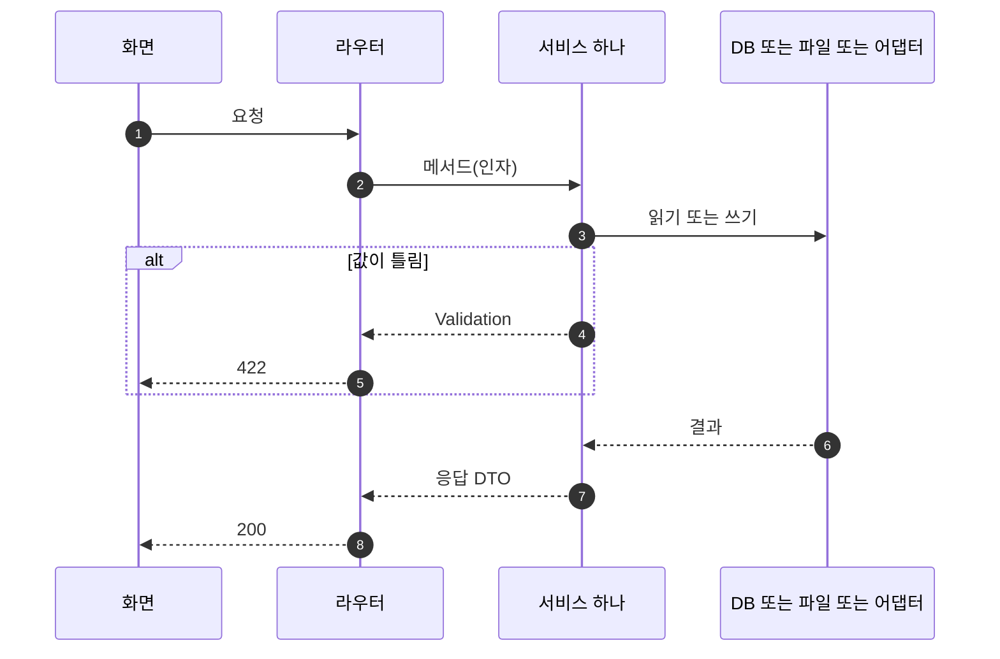
```mermaid
sequenceDiagram
    autonumber
    participant W as 화면
    participant B as 라우터
    participant SV as 서비스 하나
    participant X as DB 또는 파일 또는 어댑터

    W->>B: 요청
    B->>SV: 메서드(인자)
    SV->>X: 읽기 또는 쓰기
    alt 값이 틀림
        SV-->>B: Validation
        B-->>W: 422
    end
    X-->>SV: 결과
    SV-->>B: 응답 DTO
    B-->>W: 200
```

| 입구 | 서비스.메서드 | 닿는 곳 | 비고 |
|---|---|---|---|
| [[VA-API-001#GET/api/settings]] | SettingsService.get | 메모리(`last_check`) · 설정 | 재확인 없음. 페이지마다 배너를 그리려고 부른다 |
| [[VA-API-001#PUT/api/settings/models]] | SettingsService.set_models | 파일(설정) | `model_options`에 없는 id면 422 |
| [[VA-API-001#GET/api/inbox]] | VideoService.list_inbox | inbox 폴더 · media_probe ×N | 파일마다 ffprobe. 캐시는 미결 |

**읽을 때 볼 것**
- 여기 있는 것은 전부 서비스 하나만 부른다. 두 번째 서비스가 필요해지는 순간 고유 시퀀스로 옮긴다
- `GET /api/videos/{id}`는 처음엔 여기 넣으려 했으나 작업 요약과 대화 수 때문에 [[#SEQ-7]]로. `GET /api/videos/{id}/chat`도 영상 존재 확인 때문에 [[#SEQ-8]]로
- `list_inbox`는 DB에 닿지 않는다. 파일 수만큼 ffprobe를 띄우므로 첫 응답이 느릴 수 있다 — [[VA-DOM-002]] 7장 미결

---

## 2. 되먹일 것

시퀀스를 그려서 드러난 구멍. 클래스 명세 · ERD·DD · MINISPEC에 반영할 것이다. 이 절은 기록이라 반영한 뒤에도 고치지 않는다.

| # | 발견 | 고칠 문서 | 내용 |
|---|---|---|---|
| 1 | **완료한 조각의 받아쓰기 결과가 어디에도 없다.** 파이프라인이 메모리에서 이어 붙이므로, 실패 뒤 재시도([[#SEQ-6]])가 `done` 조각을 다시 보내지 않으면 텍스트가 없다. 「이미 받아쓴 조각은 버려지지 않는다」([[VA-UC-001#UC-H0]] 최소 보장)가 깨진다 | [[VA-DOM-002#AudioChunk]] · [[VA-DOM-003#audio_chunks]] | `result: list[SttSegment]` 속성 · `result jsonb` 컬럼(null 허용) 추가. `mark_chunk(done)`이 결과를 함께 저장하고, 이어 붙이기는 조각 행에서 읽는다. 스크립트 저장 뒤에도 행에 남긴다(이력) |
| 2 | `mark_chunk`가 상태만 바꾸면 `attempts` · `done_at` · `progress_pct`를 누가 올리는지 없다 | [[VA-DOM-002#JobService]] 규칙 | `mark_chunk(in_flight)` = attempts+1, `mark_chunk(done)` = done_at · progress_pct 갱신 · 결과 저장(#1). 시그니처는 그대로 |
| 3 | 서버 재시작으로 `running`인 채 남은 작업을 되돌리는 메서드가 없다([[#SEQ-13]]) | [[VA-DOM-002#JobService]] | `fail_orphans() int` 추가 — `running` → `failed`(unknown, '서버가 다시 시작됨'), `in_flight` 조각 → `waiting`. `main.py` lifespan이 부른다 |
| 4 | 실패 조각 하나가 나오면 돌고 있던 다른 조각을 **끝까지 기다린 뒤** `fail`한다([[#SEQ-4]]). 클래스 명세는 「넘으면 fail」만 적었다 | [[VA-DOM-002#JobService]] 파이프라인 | 문장 추가. 그래야 완료 수(j)와 다음 조각(r)이 화면 규칙과 맞는다 |
| 5 | 대화 기록 조회([[VA-API-001#GET/api/videos/{id}/chat]])도 영상 존재 확인 때문에 `VideoService.get`을 먼저 부른다. 3.1 표는 질문만 적었다 | [[VA-DOM-002]] 3.1 표 | chat/router 점선 설명에 「기록 조회의 404 판정」 추가 |
| 6 | 서버 시작 때 네트워크 실패로 키 확인이 안 되면 `invalid`로 남고 배너가 뜬다. 분석 버튼이 다시 확인하므로 풀리지만, 화면 문구 '키를 확인하지 못했어요 — {이유}'가 네트워크 이유를 보이게 된다 | MINISPEC(SettingsService) | `reason_kind = network`면 배너 문구를 '연결을 확인하지 못했어요'로 가를지 — 미결로 넘긴다 |
| 7 | 워커([[#SEQ-14]])가 `run` · `resume`에 넘길 `Video`를 얻는 길이 없다. 작업 묶음은 영상 테이블을 모르고, `job → video` 호출은 허용된 방향이 아니다([[VA-DOM-002]] 3.2) | [[VA-DOM-002#JobService]] 파이프라인 · MINISPEC(작업 서비스) | 파이프라인이 `Video` 전체가 아니라 필요한 값만 쓰게 한다 — `video_id` · 출처 종류 · 출처 ID · 파일 경로 · 길이 · 자막 유무. `start`가 받은 `Video`에서 뽑아 작업 행에 두거나(컬럼 추가), `run(job_id)`가 `AnalysisService` 쪽으로 `video_id`만 넘기게 시그니처를 고친다 |
| 8 | 삭제([[#SEQ-11]])에서 워커를 깨우는 때 — `cancel` 안에서 깨우면 워커가 곧 지워질 `queued` 행을 꺼낼 수 있다 | [[VA-DOM-002#JobService]] 규칙 · MINISPEC(작업 서비스) | `cancel`은 깨우지 않고, 라우터가 `VideoService.delete` 뒤에 `JobService.wake`(공개 메서드 추가)를 부른다 |

**1번이 핵심이다.** 조각 상태 넷은 DB에 뒀지만 결과는 안 뒀다. 그러면 「이어서 다시 시도」가 이어지지 않는다. 클래스 명세와 ERD·DD를 고친 뒤에 MINISPEC으로 간다.

---

## 3. 미결사항

- [x] 되먹일 것 #1~#5를 [[VA-DOM-002]] · [[VA-DOM-003]]에 반영한다 — 반영: 클래스 명세 v8 · ERD v2
- [x] 키 확인이 네트워크로 실패했을 때의 배너 문구(되먹일 것 #6) — 결정: 문구를 가르고 버튼을 막지 않는다(사용자 결정 2026-09-21, [[VA-UI-002]] 1.4)
- [x] (반영: 클래스 명세 v12 · 작업 서비스 MINISPEC v2) 되먹일 것 #7 · #8 — 워커는 `load_video`로 영상을 얻고, 삭제 라우터가 삭제 뒤에 `wake`를 부른다
- [x] UI-1이 열려 있는 동안 진행 중 행을 갱신하는 주기([[#SEQ-7]]) — 결정(카드 B1): 진행 중 · 대기 중 행이 있는 동안 3초마다 목록 전체를 다시 부른다([[VA-UI-002#UI-1]] 규칙 · MINISPEC 영상 서비스 3장)
- [ ] 취소된 파이프라인이 OpenAI에 이미 보낸 조각([[#SEQ-11]]) — 응답을 버리므로 비용만 든다. 삭제 다이얼로그에 알릴지 사용자 확인
